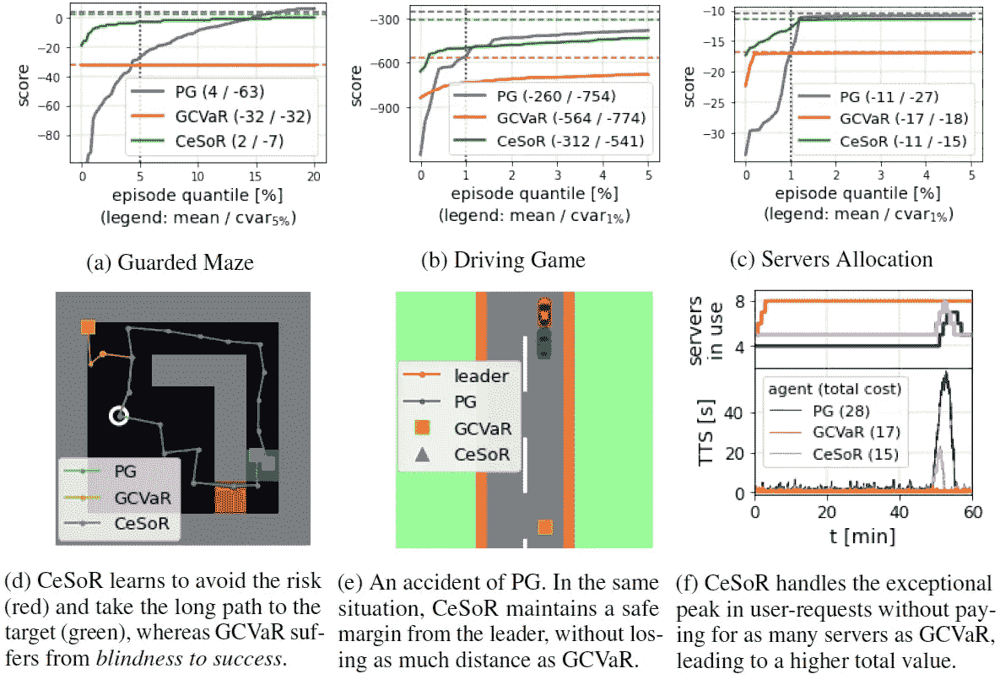
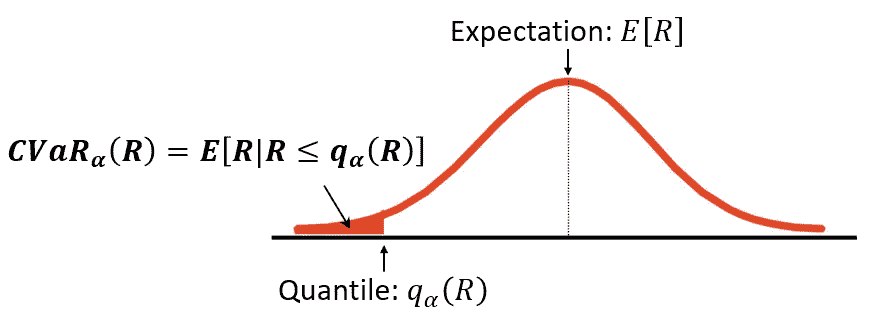
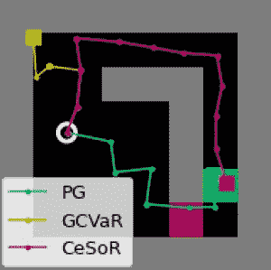
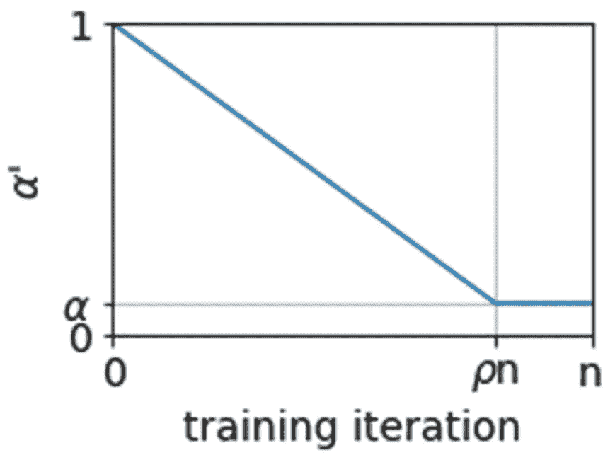
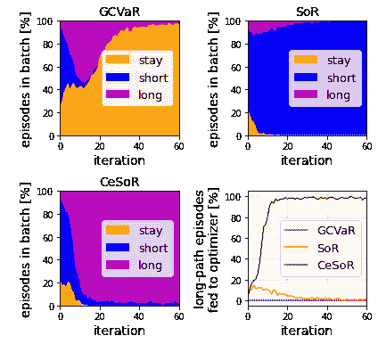

# 有效的风险规避强化学习

> 原文：<https://towardsdatascience.com/efficient-risk-averse-reinforcement-learning-29fbd0c4a906>

## 训练你的强化学习代理来处理不幸的场景和避免事故

在这篇文章中，我展示了我们最近的 [NeurIPS 2022 论文](https://arxiv.org/abs/2205.05138)(与 Yinlam Chow、Mohammad Ghavamzadeh 和阏氏·曼诺尔合著)关于风险厌恶强化学习(RL)。我讨论了风险厌恶为什么和如何应用于 RL，它的局限性是什么，以及我们建议如何克服它们。展示了在自动驾驶事故预防中的应用。我们的代码也可以在 [GitHub](https://github.com/ido90/CeSoR) 上获得。

# TL；速度三角形定位法(dead reckoning)

在将 RL 应用于风险敏感的现实世界问题时，规避风险的 RL 至关重要。为了以规避风险的方式进行优化，当前的方法关注于与低回报相对应的数据部分。我们表明，除了严重的数据低效，这也导致不可避免的局部最优。我们建议关注环境的高风险条件，而不是直接关注低回报。我们设计了一种交叉熵方法(CEM)的变体，它学习并过采样这些高风险条件，并将该模块用作我们的交叉熵软风险算法的一部分( **CeSoR** )。我们在驾驶和其他问题上显示了冷静的结果。

我们用来对高风险条件进行过采样的交叉熵方法是一个 [**PyPI 包**](https://pypi.org/project/cross-entropy-method/) 。当然，它可以应用于 RL 的示例采样范围之外。我们还提供了一个关于 CEM 和包的 [**教程**](https://github.com/ido90/CEM/blob/main/tutorial.ipynb) 。

3 名代理人(风险中性 PG；名为 GCVaR 的标准 CVaR-PG 算法；和我们的 CeSoR)应用于 3 个基准。顶部:代理回报的下分位数。下图:样片。图片作者。

# 背景(一):为什么要规避风险？

强化学习(RL)是机器学习的一个子领域，它支持从有限的监督和规划中学习。这些特性使得 RL 在需要决策的应用中非常有前途，例如驾驶、机器人手术和金融。最近几年，RL 在各种[游戏](https://www.deepmind.com/blog/alphastar-grandmaster-level-in-starcraft-ii-using-multi-agent-reinforcement-learning)中展示了有希望的成功，以至于有一部[电影](https://www.imdb.com/title/tt6700846/)讲述了它在围棋游戏中的表现。然而，RL 很难找到进入现实世界应用的方法。

缩小视频游戏和机器人手术之间的差距的一个挑战是，后者对风险高度敏感:虽然允许游戏机器人偶尔出错，但像医疗设备这样的真实世界系统必须在任何情况下都能合理可靠地运行。换句话说，在现实世界中，我们通常对优化代理回报的风险度量感兴趣，而不是优化平均回报。要优化的一个常见风险度量是条件风险值([CVaR](https://en.wikipedia.org/wiki/Expected_shortfall))；本质上，随机变量(如收益)的 CVaR_ *α* 测量的是最低分位数 *α* 的平均值——而不是整个分布的平均值。 *α* 对应于我们感兴趣的风险级别。

CVaR 风险度量的一个例子:给定代理回报的分布，我们感兴趣的是分布尾部的平均值。图片作者。

# 背景(二):传统的风险厌恶型 RL

直观地说，CVaR 优化的标准策略梯度方法(CVaR-PG)考虑由代理收集的一批 *N* 集(轨迹)，仅取收益最低的 *αN* 集，并对它们应用 PG 步骤。

下面我们讨论这种 CVaR-PG 方法的关键限制。在本文中，我们还为 PG 以外的其他方法中的类似限制提供了证据，例如，分布式 RL。

# CVaR-PG 的局限性

**样本效率低下:**好吧，CVaR-PG 中的数据效率低下是相当直接的:CVaR-PG 实质上丢弃了我们的数据的 *1-α* ，通常是 95%-99%！相反，如果我们可以只对与环境的 *α* 最坏情况相对应的情节进行采样，并对其进行优化，那么很明显，我们可以恢复标准(风险中性)算法的采样效率，即，通过因子 *1/α* 提高数据效率。如下所述，这正是交叉熵方法的目的。

**盲目走向成功:** CVaR-PG 不仅丢掉了大部分数据；它扔掉了数据中所有成功的剧集！如果我们的代理碰巧探索了一个新的令人兴奋的策略来处理一个具有挑战性的场景——优化器将立即丢弃这一集，因为“高回报因此不相关”。我们把这种现象称为*对成功的盲目*。在我们的论文中，我们从理论上证明了在离散奖励的环境中，这不可避免地导致梯度消失——导致局部最优。

**说明性例子——守卫迷宫**:在守卫迷宫中，智能体需要尽快到达绿色目标(位置不变)。然而，最短的路径通过红色区域，这是*有时*被一个官员占据，他收取*随机*贿赂费(基于真实故事，来自一个国家，此处不具名)。平均来说，最短的路径仍然是最优的，尽管很少有负面的回报。然而，更长且更安全的路径是 CVaR 最优的(例如，对于 *α=5%* )。

守卫的迷宫:一个样本集。每个代理从相同的起点遵循不同的路径。图片作者。

我们实现了 GCVaR 算法，这是 CVaR-PG 的标准实现。如上面的示例中所示， **GCVaR 学会了避免有风险的短路径，但未能学会替代的长路径**:每次遇到长路径时，它的回报都很高，因此没有提供给优化器。它对长路径的成功策略视而不见——尽管它经常探索它！

# CeSoR 呼叫救援

我们的方法 **CeSoR** (交叉熵软风险)使用两种机制解决了上述问题。

**软风险**:如上所述，CVaR-PG 使用每批 *N* 集的 *αN* 集。一方面，这导出了*真实政策梯度*的一致估计值。另一方面，对成功的盲目导致这种梯度进入局部最优。我们用一个简单的方案来解决这个权衡:我们用 *α'* 代替 *α* ，从 *1* 开始，逐渐减少到 *α* 。这样，在开始时，我们的梯度看起来超越了局部最优，朝向成功的策略；然而，在最后的训练阶段，它仍然是 CVaR 政策梯度的一致估计。

软风险计划:实际风险水平α' *开始时比目标风险水平* α *更保守，防止对成功的盲目。在最后阶段，α'=α提供了一个稳定的训练目标，保证了 CeSoR 的收敛。*图片作者。

**交叉熵方法(CEM)** :软风险还不够，我们还有两个问题。首先，如上所述，无论何时*α’<1*，我们都会丢弃数据并损失采样效率。第二，软风险本身可能会消除我们的预期风险厌恶:即使训练以 *α'=α* 结束，如果在此之前代理收敛到风险中性策略怎么办？

为了解决这些问题，我们假设对训练环境的某些条件进行控制。比如学车的时候，我们可以选择自己出卷的道路和时间，这些都影响着行车条件。在这种假设下，**我们使用交叉熵方法(CEM)来了解哪些条件导致最低回报，然后对这些条件进行过采样**。CEM 是一种非常酷的采样和优化方法，但并不常见。在[的一个单独教程](https://github.com/ido90/CEM/blob/main/tutorial.ipynb)中，我展示了这种方法，并使用 [cem 包](https://pypi.org/project/cross-entropy-method/)演示了如何在 Python 中使用它。

一旦我们对高风险条件进行过采样，我们就不再需要像以前那样扔掉那么多的情节。特别是，CEM 的目标——从原始收益分布的 *α-* 尾部取样——将样本效率提高到 *1/α* 倍(如上所述)。在实践中，CEM 实现了较为适度的改善。

通过对高风险条件进行过采样，我们还保留了风险厌恶，中和了软风险的负面副作用:软风险允许*优化器*学习高回报的政策，而 CEM *采样器*仍然保留了风险厌恶。

CeSoR 的主要原则可以表述为:**为了规避风险，专注于高风险场景——而不是糟糕的代理策略**。下图对此进行了说明。

训练批次的图解。每个点代表一集，具有回报 *R* 和“条件”C(例如，C 可以是迷宫中的守卫成本)。相同颜色的点对应于“相似”的代理策略(例如，迷宫中的短路径、长路径和无为路径)。Mean-PG 对整批进行平均，从而学习蓝色策略(类似于最短路径)。GCVaR 考虑左边部分(低收益)，学习橙色策略(什么都不做)。我们的 CeSoR 对上部(高风险条件)进行过采样，并学习紫色策略(长路径)。图片作者。

上述现象在守卫迷宫的训练过程中得到了很好的演示，如下图所示:

GCVaR，SoR，CeSoR:%-没有到达目标(“停留”)或通过守卫迷宫中的短路径或长路径到达目标的剧集。右下角:%-馈送给优化器的剧集中的长路径。图片作者。

1.  **标准 CVaR-PG (GCVaR)** 确实探索了长路径(左上图)，但是*从不*将它提供给优化器(右下图)。因此，它最终学会了什么也不做。注意，单独使用 CEM(没有软风险)不能解决这个限制。
2.  **单独的软风险** ( **SoR** ，没有 CEM)消除了对成功的盲目，并为优化器提供了一条漫长的道路(右下角)。然而，它开始时是风险中性的，因此*更喜欢*走捷径(右上角)。当它再次变得厌恶风险时，参与者已经收敛于短路径政策，而不再探索长路径。
3.  只有 **CeSoR** 观察到“好的”策略(由于软风险)并在“坏的”环境变化下判断它(由于 CEM)，收敛到长路径(左下角)。

# 学习成为一名安全的司机

我们在一个驾驶基准上测试了 CeSoR，我们的代理人(蓝色)必须尽可能从后面跟着一个领导者(红色)，但不能撞到它。领路人可以直行、加速、刹车或变道。

CeSoR 关于驾驶游戏基准。作者 GIF。

如本文第一张图所示，CeSoR 将代理的 CVaR-1%测试回报在该基准上提高了 28%，特别是**消除了风险中性驾驶员**造成的所有事故。更有趣的是， **CeSoR 学会了与安全驾驶**相对应的直觉行为:如下图所示，它使用油门和刹车的频率略低(右图)，与领先者保持较大的距离(左图)。

在驾驶游戏的所有测试情节中，每个代理人在所有时间步的统计数据。图片作者。

最后，我们注意到 CEM 采样器本身的表现符合预期。在驾驶游戏中，我们让 CEM 控制领导者的行为(注意领导者是环境的一部分，而不是代理)。如下图所示，CEM 增加了领队在训练中转弯和紧急刹车的相对比例。这些领导者行为的频率以可控的方式增加，以使代理体验与真实回报分布的 *α-* 尾部保持一致。

CEM 学会了在驾驶游戏中过度模仿具有挑战性的领导者行为。图片作者。

# 摘要

在这篇文章中，我们看到 RL 中的风险厌恶目标比期望值的标准目标更难训练——这是由于对成功的盲目和样本的低效率。我们引入了 **CeSoR** ，它结合了软风险以克服对成功的盲目，并结合了 CEM 采样器以提高采样效率和保持风险厌恶。在驾驶基准测试中，CeSoR 学会了直观的安全驾驶政策，并成功防止了所有发生在替代代理身上的事故。

这项工作只是一个更有效率和更有效的风险规避风险的起点。未来的研究可能会直接改善 CeSoR(例如，通过软风险调度)，或者将其扩展到政策梯度方法和 CVaR 风险度量之外。