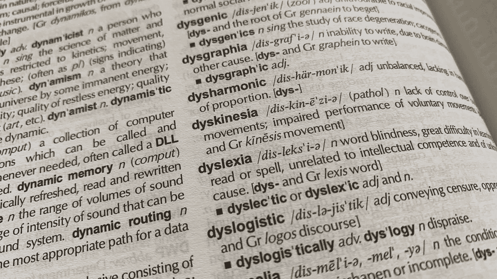

# 每个数据科学家都应该知道的 8 种数据结构

> 原文：<https://towardsdatascience.com/eight-data-structures-every-data-scientist-should-know-d178159df252>

## 从基本数据结构到抽象数据类型

克林特·王茂林在 [Unsplash](https://unsplash.com?utm_source=medium&utm_medium=referral) 上拍摄的照片

作为一名数据科学家，工作的一个关键部分是能够理解组织和结构化数据的最佳方式，以便根据任务有效地存储或访问数据。这可能是为了将数据输入到模型中，存储模型实现的结果，或者能够在以后可视化数据。因此，我们需要知道我们可以使用什么样的数据结构，以及它们的优缺点。下面列出了八种数据结构/类型，对于了解和实施数据科学家工作的任何部分都很有用。

## 内置 Python 数据结构

首先从内置的 Python 数据结构开始，在任何数据科学家的旅程和与 Python 的交互开始时，都可能会遇到这种数据结构。这些是 Python 中内置的数据结构，以后可以在其上实现抽象数据类型或更复杂的数据结构。

## 目录

该列表是您在 python 编程之旅中可能遇到的第一批数据结构之一。本质上，它们就像一个现实生活中的列表，您可以在一个结构(在本例中是一个变量)中存储多个数据点。它们是可变的(一旦被定义就可以被改变)、有序的(除非被明确改变，否则它们保持它们的顺序)、可索引的(我们可以通过它们的索引来访问项目)并且它们还可以包含重复的记录。列表的好处是，如果您知道各个数据点的索引，就可以很容易地访问它们，因为顺序是保持的，但是如果您不知道位置，那么查找项目的成本会很高。

  

## 词典

字典是另一种常见的数据结构，您在 Python 之旅的早期经常会遇到(甚至在其他语言中也是如此)。它们的形式类似于实际的字典，在键:值结构中，键(单词)与值(描述)成对出现。它们的关键特征是可变的、有序的和可索引的(如果您知道 items 键)，但是它们的键中不能包含重复的记录(值可以是重复的)。字典的主要区别在于它们的键:值结构允许用户基于键而不是数字索引来访问值。这意味着，由于这种配对，它们比其他数据结构占用更多的空间，但如果您知道这些键，它可以允许更有效的搜索(如果您不知道，这将成为一个问题)。

罗布·霍布森在 [Unsplash](https://unsplash.com?utm_source=medium&utm_medium=referral) 上拍摄的照片

  

## 一组

集合是 Python 中的另一种数据结构，但很少遇到或使用。同样，单个变量可以用来存储多个信息点，但是它们是唯一的，因为它们是无序的，不能存储重复的。这种结构的关键特征是它们是无序的、不可索引的，不能包含重复的值，但是它们仍然是可变的。当您希望只存储唯一值或者希望检查不同数据源之间的重叠时，这样做的好处就显现出来了。当您关心项目顺序或想要重复值时，您不希望使用这些。

  

## 元组

最后，我们有元组，这也是不太常见或使用。像列表一样，它们是有序的和可索引的，但是主要的区别是它们不能被改变(它们是不可变的)。这意味着，当您希望确保信息不会被意外更改(例如通过用户交互或编程过程)时，它们是有用的，但是您仍然希望以后以某种顺序访问信息。这种用法的一个例子是存储来自模型的输出、起始值或者即使用户可能与它们交互时也要保持的值。

  

## 抽象数据类型

除了上面的四种内置数据结构之外，学习和理解其他几个数据结构也很重要，但它们都是可以用 Python 实现的抽象数据类型。这些是对数据结构的广泛描述，我们可能希望在 Python 中实现这些数据结构来存储具有特定功能的数据。您可能会遇到一些不同的抽象数据类型，但您需要了解的四种主要类型是堆栈、队列、链表和图形。

## 长队

队列抽象数据类型的目的是像现实生活中的队列一样工作，因为添加的内容只在后面添加，而您只能从前面删除项目。这意味着它遵循先进先出(FIFO)结构，并保持数据点的顺序。应用这种数据结构的常见例子包括为 CPU 调度作业、为打印机排队作业或广度优先搜索算法。当您希望确保第一个添加到结构中的是首先移除的结构时，这很有用。

Giphy 的 GIF

  

## 堆

与队列类似，堆栈是一种抽象数据类型，它存储项目添加到结构中的顺序，但与队列不同，它只允许对堆栈顶部进行添加和删除。这意味着这遵循后进先出(LIFO ),就像在餐馆里叠盘子或吃一堆煎饼一样。当我们希望程序或用户只访问添加到结构中的最新内容(与队列相反)但必须保持顺序时，可以使用这种方法。常见的例子包括解释器读取代码的方式或计算机上的撤销按钮(ctrl + z)。

giphy 的 Gif

  

## 链表

链表是一个包含信息的节点集合，以线性方式指向另一个节点(例如 A -> b -> c ->d)。这种情况有两种主要形式，一种是双向链表(链接到上一个和下一个节点)，另一种是单向链表(只指向下一个节点)。这允许容易地从列表中插入或删除项目，因为只需要改变受影响的节点之间的链接。这意味着与传统列表的相同操作相比，它的计算量要小得多。当我们不确定最终项目集合的长度，我们不关心随机访问或者我们想要快速插入时，这可能是有用的。

  

## 图表

我们所关心的最后一个抽象数据结构是一个可以用来存储项目及其关系的图。这通常用大写字母 G 来表示，它包含顶点(包含信息)和边(顶点之间的关系)。后者可以包含关于是否存在关系的信息以及该关系的潜在权重/强度，例如距离或值。这方面的例子包括道路网络表示棋子可以进行的不同移动，并为社交网络中使用的基于图形的数据库奠定基础。

  

## 结论

您在工作中可能会遇到许多不同的数据结构和类型，根据您计划使用数据的目的，了解使用其中一种来存储数据之间的权衡是很重要的。这里介绍的只是您将遇到的不同类型的数据结构的一个子集，但是理解这些数据结构通常可以作为理解许多其他数据结构的基础，例如 Numpy 数组或 Pandas 数据帧。数据结构和算法在软件工程和数据科学面试中出现也是很常见的，因此值得将这些知识留在脑海中以备将来使用。

如果你喜欢你所读的，并且还不是 medium 会员，请使用下面我的推荐链接注册 Medium，以支持我和其他了不起的作家

  

或者随时查看我在 Medium 上的其他文章

 [## scikit-learn 决策树分类器简介

towardsdatascience.com](/introduction-to-decision-tree-classifiers-from-scikit-learn-32cd5d23f4d)    