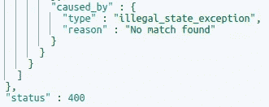

# 弹性研究研讨会#6 —编写脚本第 4 部分

> 原文：<https://towardsdatascience.com/elasticsearch-workshop-6-scripting-part-4-53ba577eaff4>

## 正则表达式和模式匹配


[Zoltan·塔斯](https://unsplash.com/@zoltantasi?utm_source=medium&utm_medium=referral)在 [Unsplash](https://unsplash.com?utm_source=medium&utm_medium=referral) 上的照片

欢迎来到研讨会的第 6 部分。像往常一样，为了使每篇文章尽可能紧凑，我将把查询简化为片段。如果你想看完整的代码，请查阅我的 [GitHub 页面。如果谷歌把你带到这里，你可能还会检查系列](https://github.com/PascalThalmann/ElasticWorkshop/tree/gh-pages/6_scripting_p4)的[开头，或者整个系列](https://pascalth.medium.com/elastic-workshop-1-enrich-documents-6454494fefe2)[的](https://pascalth.medium.com/list/elasticsearch-workshop-924d93a4aff4)。

在这个研讨会中，我将向您展示一些正则表达式的实例以及使用它们的不同方法。官方文档[中有几个例子，但是我认为还有更多的内容，我们应该深入研究。如果你想了解模式标志(比如不区分大小写的匹配)，在](https://www.elastic.co/guide/en/elasticsearch/painless/master/painless-walkthrough.html#modules-scripting-painless-regex)[官方文档](https://www.elastic.co/guide/en/elasticsearch/painless/master/painless-regexes.html)中有介绍。一如既往:让我们直接开始吧！

# 准备

在我们继续之前，您需要确保您的集群可以运行正则表达式。如果以下查询返回 limited 或 false，您将无法正常运行 workshop:

```
GET _cluster/settings?include_defaults&filter_path=defaults.script.painless.regex
```

您可以通过在集群中的每个节点上添加以下参数 elasticsearch.yml 来启用 regex。群集需要重新启动:

```
script.painless.regex.enabled: true
```

# 数据

像往常一样，我们将使用一个文档作为一个虚构的小软件公司的数据:

```
PUT companies/_doc/1
{ "ticker_symbol" : "ESTC",
  "market_cap" : "8B",
  "share_price" : 85.41}
```

“market_cap”字段读起来很舒服，但不适合计算。使用正则表达式，我们将把这个字段转换成 long 数据类型的值。

# 正则表达式

无痛中的正则表达式实现与 Java 中的相同。如果你想知道如何指定字符类或者如何定义"/ /"里面的量词，请ĥave 看一下甲骨文[文档](https://docs.oracle.com/javase/8/docs/api/java/util/regex/Pattern.html)。

以下示例匹配“Market_cap”字段的“8B ”:

```
if ( doc['market_cap.keyword'].value =~ /B$/){...}
```

“=~”匹配子字符串，称为查找操作符。当“==~”需要匹配整个字符串时，它被称为匹配操作符。如果我们想使用匹配操作符，正则表达式应该是:

```
if ( doc['market_cap.keyword'].value ==~ /^8B$/){...}
```

# Java 匹配器类

Java Matcher 类提供了模式匹配所需的一切。虽然寻找模式很有效，但我发现对匹配进行分组却不容易。我在所有 7.x.x 和现在的 8.0.0 Elasticsearch 版本中都看到了这个 bug。我可以演示一下——让我们定义一个模式，将字符串“8B”分成两组:第一组是“8”，第二组是“B”。我们首先定义模式:

```
Pattern p = /([0-9]+)([A-Za-z]+)$/;
```

现在我们从模式对象(p)调用 matcher 类，想知道模式是否匹配:

```
def result = p.matcher(market_cap_string).matches();
```


作者图片

很好，我们已经确认匹配了。我现在尝试 group()方法，因为使用该方法我可以将第一个组存储在一个变量中。让我们看看会发生什么:

```
def result = p.matcher(market_cap_string).group(1);
```



作者图片

你可能认为我做错了什么——我也是。我花了几个小时研究这个问题，我甚至向 Elasticsearch 报告了这个问题。到目前为止没有回应——如果你知道这里出了什么问题，请随时通过 [LinkedIn](https://www.linkedin.com/in/pascal-thalmann/) 或[更新帖子](https://discuss.elastic.co/t/java-regex-matcher-in-painless-seems-not-to-be-working/296904)给我发 pm。提前感谢！

但是还是有解决办法的。让我首先向您展示来自同一个类的 replaceAll()方法。为了实现这一点，我们需要匹配子串并修改我们的模式，然后我们不替换“B ”,或者换句话说，我们删除“B ”:

```
Pattern p = /([A-Za-z]+)$/; 
def result = p.matcher(market_cap_string).replaceAll('');
```


作者图片

现在，我们还可以使用前面的模式，将匹配整个字符串的两个组替换为第一个组，这也从“8B”中删除了“B”:

```
Pattern p = /([0-9]+)([A-Za-z]+)$/; 
def market_cap = p.matcher(market_cap_string).replaceAll('$1');
```

# 匹配器类示例

在我的 GitHub 页面上有很多 matcher 类的例子。有管道、存储脚本、脚本化字段等等的例子。卡住了请看看。

# Java 字符串包含()方法

还有另一种方法，适用于所有的上下文:使用 contains()方法，这是每个 String 对象都有的。让我们来看看:

```
if (market_cap_string.contains("B")){
  mc_long_as_string = market_cap_string.replace('B', '');
```

可以看到， [String 对象有更多的方法](https://docs.oracle.com/javase/7/docs/api/java/lang/String.html)。replace()方法现在将“8B”转换为“8”。它仍然是一个字符串。因此，让我们从 Integer 类调用静态方法 parseInt()，并将“8”转换为 long 数据类型:

```
if (market_cap_string.contains("B")){
  mc_long_as_string = market_cap_string.replace('B', '');
  mc_long = (long) Integer.parseInt(mc_long_as_string);
  market_cap = mc_long * 1000000000
}
```


作者图片

现在，我缺少的是一些位置匹配。使用 Java Pattern 类，我能够定义匹配的“B”应该在哪里:在字符串的末尾。使用 contains()时，字符串可以在任何地方，但是 string 类为我提供了一个在行尾进行匹配的简便方法:endsWith()。当然，还有一个方法 startsWith()。但是回到这个例子:

```
if (market_cap_string.endsWith("B")){...}
```

# 搜寻并剖析模式

还有一件事:[寻找并剖析模式](https://www.elastic.co/guide/en/logstash/current/plugins-filters-grok.html)。如果您熟悉 Logstash，这可能会让您感兴趣。因为只有 grok 使用正则表达式模式(dissection 不使用正则表达式，但是速度更快)，所以我将跳过例子中的 dissection，把重点放在 Grok 上。

然而:不幸的是**只有运行时映射**实现了 grok 和剖析插件。因此，它不像字符串方法或模式/匹配器类那样通用。

让我们看看如何分割字符串“8B”并将“8”和“B”存储在两个变量中:

```
String mc_long_as_string = 
       grok('%{NUMBER:markcap}').extract
       (doc['market_cap.keyword'].value).markcap;
String factor_as_string = 
       grok('(?<fact>[A-Z])').extract
       (doc['market_cap.keyword'].value).fact;
```

Grok 建立在语法(模式的名称)和语义(标识符的名称)的基础上，在本例中是 **NUMBER** ，因为我们想要从字符串中提取数字，在本例中是“ **markcap** ”。它从文档(或字符串)中提取模式，并将其保存在对象 markcap 中。Grok 和 dissect 将是 Logstash workshop 中的一个主题。

我对未来的希望是，Elasticsearch 在其他环境中也能实现 grok 和剖析模式。但是现在，我们仅限于运行时映射。

# 结论

如果你成功了:祝贺你！现在，您应该能够用正则表达式、字符串方法或 grok 模式匹配模式了。

如有疑问，请留言、联系或关注我的 [LinkedIn](https://www.linkedin.com/in/pascal-thalmann/) 。

*原发布于*[*https://cdax . ch*](https://cdax.ch/2022/02/26/elasticsearch-workshop-6-scripting-part-4/)*。*