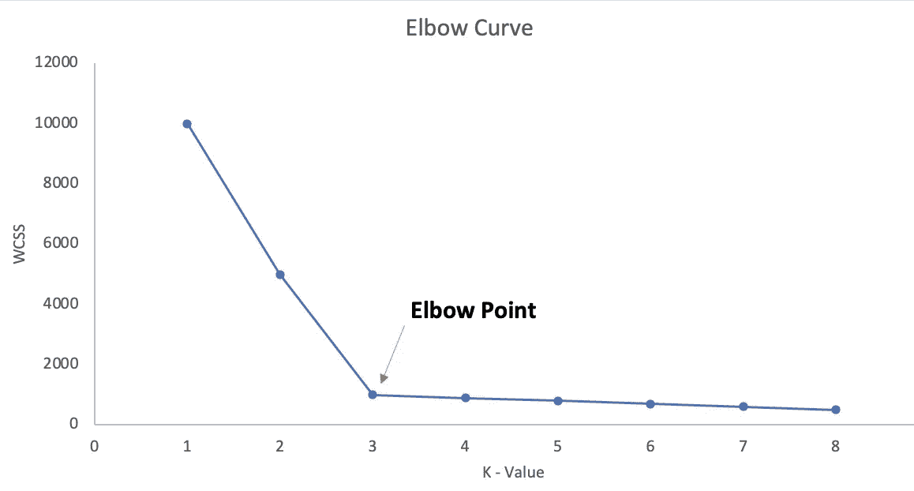
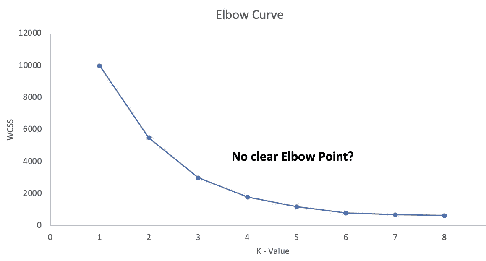
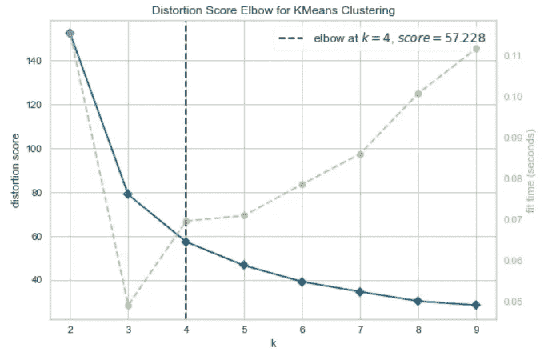
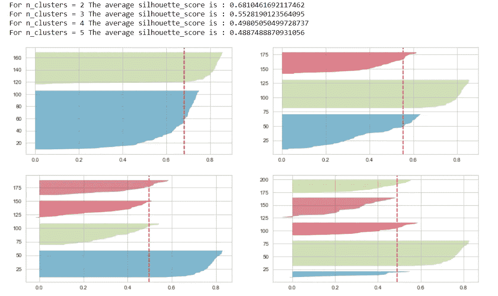
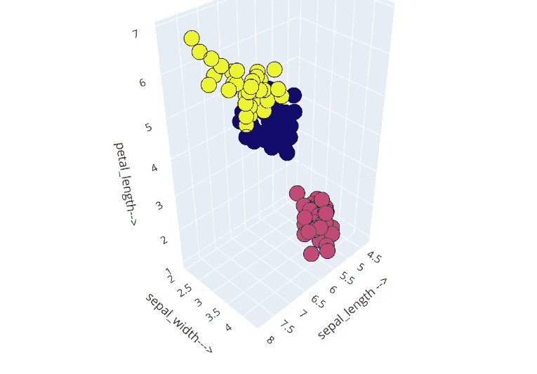

# 在 K-means 聚类中不要再用肘法了，取而代之，用这个！

> 原文：<https://towardsdatascience.com/elbow-method-is-not-sufficient-to-find-best-k-in-k-means-clustering-fc820da0631d>

## 了解如何在 K-均值聚类中查找聚类数


图片来源:Unsplash

**K-means 聚类**是数据科学领域使用最多的聚类算法之一。为了成功实现 K-means 算法，我们需要确定使用 K-means 创建的聚类的数量。

在这篇博客中，我们将探讨——对于你的 K-means 聚类算法来说，找到聚类数(或 K)的最**实用的方法是什么。**

**而肘法不是答案！**

以下是我们将在本博客中涉及的主题:

1.  *什么是 K 均值聚类？*
2.  *什么是肘法及其弊端？*
3.  *如何求 K-means 中‘K’的值？*
4.  *Python 实现*
5.  *结论*

我们开始吧！

## 什么是 K-means 聚类？

**K-means** 聚类是一种**基于距离的无监督聚类算法**，其中彼此接近的数据点被分组到给定数量的聚类/组中。

以下是 K-means 算法遵循的步骤:

1.  **初始化**‘K’，即**要创建的集群数量**。
2.  随机**分配 K 个质心**点。
3.  **将**每个**数据点分配到其最近的质心**以创建 K 个聚类。
4.  **使用新创建的聚类重新计算质心**。
5.  **重复步骤 3 和 4** ，直到质心固定。

## 什么是肘法及其弊端？

**肘方法是在 K 均值聚类中寻找最佳“K”**的图形表示。其工作原理是寻找 WCSS(类内平方和)，即类中各点与类质心之间的平方距离之和。

肘形图显示了对应于不同 K 值(在 x 轴上)的 WCSS 值(在 y 轴上)。当我们在图中看到一个**弯头形状时，我们选择创建弯头的 K 值**。我们可以把这个点叫做**肘点**。超过拐点后，增加“K”值不会导致 WCSS 显著降低。

**肘部曲线预计是这样的😊**



预期肘曲线(图片由作者提供)

**什么样子！😒**



实际肘部曲线(图片由作者提供)

因此，在大多数真实世界的数据集中，使用肘方法识别正确的“K”并不十分清楚。

## 那么，我们如何在 K-means 中找到“K”呢？

在肘法不显示肘点的情况下，侧影评分是一个非常有用的求 K 数的方法。

**剪影得分的值范围从-1 到 1** 。以下是剪影配乐解读。

*   **1:** 点被**完美地分配在一个簇**中，簇很容易区分。
*   **0:** 簇是**重叠**。
*   **-1:** 点被**错误分配到**簇中。


两个聚类的轮廓分数

**剪影得分= (b-a)/max(a，b)**

其中，a=平均类内距离，即类内每个点**之间的平均**距离**。**

b=平均簇间距离，即所有簇之间的平均**距离** **。**

## Python 实现

让我们使用虹膜数据集来比较**肘部曲线**和****轮廓得分**。**

**使用以下代码可以创建**弯头曲线**:**

```
#install yellowbrick to vizualize the Elbow curve
!pip install yellowbrick  

from sklearn import datasets
from sklearn.cluster import KMeans
from yellowbrick.cluster import KElbowVisualizer

# Load the IRIS dataset
iris = datasets.load_iris()
X = iris.data
y = iris.target

# Instantiate the clustering model and visualizer
km = KMeans(random_state=42)
visualizer = KElbowVisualizer(km, k=(2,10))

visualizer.fit(X)        # Fit the data to the visualizer
visualizer.show()        # Finalize and render the figure
```

****

**弯头图在 K=4 处找到弯头点**

**上图在 K=4 处选择了一个弯头点，但是 K=3 看起来也是一个合理的弯头点。所以，**不清楚肘点**应该是什么。让我们使用轮廓图验证 **K 的值(使用以下代码)。****

```
from sklearn import datasets
from sklearn.cluster import KMeans
import matplotlib.pyplot as plt
from yellowbrick.cluster import SilhouetteVisualizer

# Load the IRIS dataset
iris = datasets.load_iris()
X = iris.data
y = iris.target

fig, ax = plt.subplots(3, 2, figsize=(15,8))
for i in [2, 3, 4, 5]:
    '''
    Create KMeans instances for different number of clusters
    '''
    km = KMeans(n_clusters=i, init='k-means++', n_init=10, max_iter=100, random_state=42)
    q, mod = divmod(i, 2)
    '''
    Create SilhouetteVisualizer instance with KMeans instance
    Fit the visualizer
    '''
    visualizer = SilhouetteVisualizer(km, colors='yellowbrick', ax=ax[q-1][mod])
    visualizer.fit(X) 
```

****

**K = 2 到 5 的轮廓图(图片由作者提供)**

**对于 K = 2，轮廓分数是最大的(0.68)，但是这不足以选择最佳的 K。**

**应检查以下**条件****以使用剪影图选择正确的‘K’**:**

1.  **对于特定的 K，**所有的聚类都应该具有大于数据集**的平均分数的轮廓分数(由红色虚线表示)。x 轴代表轮廓分数。K = 4 和 5 的聚类被消除，因为它们不符合这个条件。**
2.  ****星团的大小不应该有大的波动**。聚类的宽度代表数据点的数量。对于 K = 2，蓝色簇的宽度几乎是绿色簇的两倍。对于 K = 3，这个蓝色簇被分解成 2 个子簇，从而形成大小一致的簇。**

**因此，**轮廓图方法给出了 K = 3 作为最佳值**。**

**对于 Iris 数据集上的最终聚类，我们应该选择 K = 3。**

```
import plotly.graph_objects as go  #for 3D plot

## K-means using k = 3
kmeans = KMeans(n_clusters=3)
kmeans.fit(X)
y_kmeans = kmeans.predict(X)

## 3D plot 
Scene = dict(xaxis = dict(title  = 'sepal_length -->'),yaxis = dict(title  = 'sepal_width--->'),zaxis = dict(title  = 'petal_length-->'))

labels = kmeans.labels_
trace = go.Scatter3d(x=X[:, 0], y=X[:, 1], z=X[:, 2], mode='markers',marker=dict(color = labels, size= 10, line=dict(color= 'black',width = 10)))
layout = go.Layout(margin=dict(l=0,r=0),scene = Scene,height = 800,width = 800)
data = [trace]
fig = go.Figure(data = data, layout = layout)
fig.show()
```

****

**聚类的三维图(图片由作者提供)**

**我还**通过索引/检查输入特征**在集群内的分布来验证输出集群**。****

**[](https://pub.towardsai.net/expectation-maximization-em-clustering-every-data-scientist-should-know-2b47fbd0dbc0) [## 期望最大化(EM)聚类:每个数据科学家都应该知道

### EM 聚类技术最直观的解释

pub.towardsai.net](https://pub.towardsai.net/expectation-maximization-em-clustering-every-data-scientist-should-know-2b47fbd0dbc0) 

## 结论

肘曲线和剪影图都是为 K-均值聚类寻找最佳 K 的非常有用的技术。在现实世界的数据集中，你会发现很多肘曲线不足以找到正确的“K”的情况。在这种情况下，您应该使用轮廓图来计算数据集的最佳聚类数。

我建议您结合使用这两种技术来计算 K 均值聚类的最佳 K 值。** 

# **谢谢大家！**

**你可以在收件箱里看到我所有的帖子。 [***做到这里*** *！*](https://anmol3015.medium.com/subscribe) *如果你喜欢体验媒介的自己，可以考虑通过* [***报名会员来支持我和其他成千上万的作家。它每个月只需要 5 美元，它极大地支持了我们，作家，你可以在媒体上看到所有精彩的故事。***](https://anmol3015.medium.com/membership)**

## ****你可能喜欢的故事！****

**[](https://medium.com/codex/feature-engineering-techniques-every-data-scientist-should-know-e40dc656c71f) [## 每个数据科学家都应该知道的特征工程技术

### 最大限度地提高机器学习模型的性能！

medium.com](https://medium.com/codex/feature-engineering-techniques-every-data-scientist-should-know-e40dc656c71f) [](https://medium.com/codex/24-powerful-must-know-pandas-functions-for-every-data-analysis-a1a9990d47c8) [## 24 个强大的必知熊猫功能，用于每次数据分析

### 对每个数据科学专业人员来说，重要的熊猫功能

medium.com](https://medium.com/codex/24-powerful-must-know-pandas-functions-for-every-data-analysis-a1a9990d47c8) [](https://medium.com/codex/know-everything-about-bias-and-variance-7c7b9f9ee0ed) [## 理解机器学习中的偏差和方差权衡

### 机器学习中一个必须知道的概念

medium.com](https://medium.com/codex/know-everything-about-bias-and-variance-7c7b9f9ee0ed)**