# 使用机器学习构建信用记分卡的端到端指南

> 原文：<https://towardsdatascience.com/end-to-end-guide-to-building-a-credit-scorecard-using-machine-learning-6502d8bb765a>

## 现实世界问题的开源工具系列


图片由 [ibrahimboran](https://unsplash.com/@ibrahimboran) 在 [Unsplash](https://unsplash.com/photos/bnW9O5ZOys4) 上拍摄

我正在开辟一个名为**的新系列，为现实世界的问题提供开源工具。**

在这个系列中，我将首先回顾一个开源工具，然后展示如何将它应用于现实世界的问题。在这个过程中，我会展示所有的编码，列出所有你需要知道的术语、定理、算法。

潜在受众:

*   想要在简历中加入一个完整的项目，并试图获得更多面试机会的学生
*   **数据科学家/ML 工程师**希望构建记分卡并投入生产

在这篇博客中，你将了解到:

*   通过 Python 使用**机器学习**构建**记分卡**
*   技能组合:**逻辑回归**，**梯度推进**，**证据权重**，**信息值(IV)** ，**宁滨**，**卡方宁滨**

构建信用记分卡是一个非常典型的行业级问题，比如

1.  评估**交易**或**客户的信誉**以执行进一步的行动，例如**发行信用卡**或**为信用卡公司的**高信用客户**提供余额转账优惠**，
2.  **在电子商务平台给予**高价值客户**促销或额外权利**，
3.  提供**良好的客户细分**以接触到营销公司中的**合适的人**。

你需要建立一个系统**给客户**打分，还得跟**非技术人员**交代清楚，因为出了问题(虚惊一场)你就知道怎么跟经理/客户/业务方交代了。

# 简介:

这个博客的代码和数据可以在这里找到:

[](https://github.com/BruceYanghy/End-to-End-Guide-to-Building-a-Credit-Scorecard-Using-Machine-Learning)  

**开源工具:** [**Toad**](https://github.com/amphibian-dev/toad)

Toad 是一个用于构建记分卡的生产即用库；它提供 EDA、特征工程和记分卡生成。其关键功能简化了最关键、最耗时的流程，如功能选择和精细宁滨。

**数据集:信用卡客户数据集的默认值**

描述可以在 [**卡格尔**](https://www.kaggle.com/datasets/uciml/default-of-credit-card-clients-dataset) 上找到。原始数据集可以在 [UCI](https://archive.ics.uci.edu/ml/datasets/default+of+credit+card+clients) 找到。

有 25 个变量:

*   **ID** :客户 ID
*   **23 个特征包括**:限额余额、性别、学历、婚姻、年龄、还款、账单金额、上一次还款金额
*   **标签**:默认付款(1 =是，0 =否)

**假设**你是**一家信用卡公司的数据科学家**，为了促进信用卡的使用，你的经理告诉你**为现有客户建立一个记分卡系统，向他们发送一些余额转移优惠**。比方说 6 个月，年利率为 0%，费用为 3%。

你有这些客户的历史数据。你不想给那些经常违约的人寄钱，因为他们可能会拿了钱就跑了。6 个月后，贵公司将无法收回这些转账余额，这将成为贵公司的损失。你可能还需要雇佣一个讨债公司来讨回这些债务。这可不好。

所以一切都取决于你的记分卡系统！

我们开始吧。

# 1.数据预处理

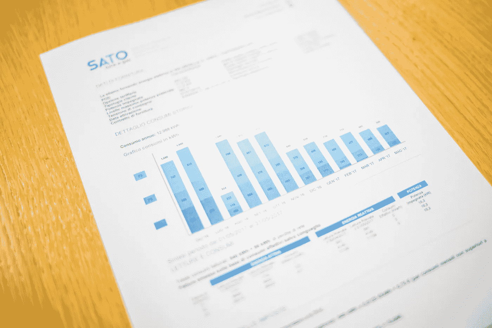

由 [gtomassetti](https://unsplash.com/@gtomassetti) 在 [Unsplash](https://unsplash.com/photos/QCbZ4ASLhM8) 上拍摄的图像

在现实生活中，您可能需要使用类似 SQL 的查询从您公司的数据库中获取原始数据；这可能会花你很多时间。

在这篇博客中，我们将只使用 CSV 文件。

## 安装和导入软件包

```
import pkg_resources
import pip
installedPackages = {pkg.key for pkg in pkg_resources.working_set}
required = { 'pandas','numpy', 'matplotlib', 'seaborn','toad','pickle','sklearn'}
missing = required - installedPackages
if missing:
    !pip install pandas
    !pip install numpy
    !pip install matplotlib
    !pip install seaborn
    !pip install toad
    !pip install pickle
    !pip install sklearn

import pandas as pd
from sklearn.metrics import roc_auc_score,roc_curve,auc,precision_recall_curve
from sklearn.model_selection import train_test_split
from sklearn.linear_model import LogisticRegression 
from sklearn.ensemble import GradientBoostingClassifier

import numpy as np
import glob
import math
import seaborn as sns 
import matplotlib.pyplot as plt
import toad
import pickle
```

## 加载数据并检查默认标签速率

```
# use pandas to load the csv file
data = pd.read_csv('UCI_Credit_Card.csv')
# check the size of the data
data.shape
# check few lines
data.head()
#use the world 'label'
data['label']=data['default.payment.next.month']
data=data.drop(columns=['default.payment.next.month'])
#check the fraud proportion of the data
target_info(data['label'])
# set an exclude list for the scorecard package Toad
exclude_list = ['ID','label']
```

**22%的欺诈率**(违约人群)，这是历史数据中相当高的违约率。

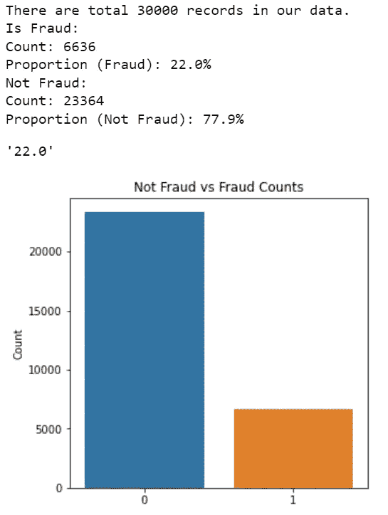

ai4 金融教育版权所有

## 训练和测试分割

在实际项目中，您可能希望按照日期/时间分割训练和测试，随机分割并不好，因为这会破坏时间序列，并可能导致过度拟合。

我们将使用用户 ID 作为进行拆分的时间。

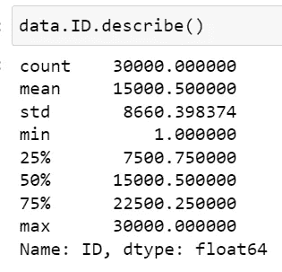

ai4 金融教育版权所有

```
# use the ID column to split the train-test data
data.ID.describe()
train = data_split(data,start = 0, end=22500,date_col='ID')
test = data_split(data,start = 22500, end=172792,date_col='ID')
```

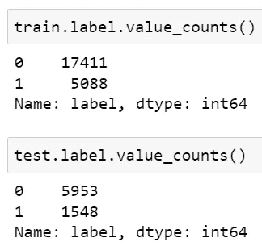

ai4 金融教育版权所有

# 2.特征过滤

首先，我们需要执行特征过滤，以去除具有低信息价值和高相关性的特征。

```
###feature filtering by missing value, IV & corrrelation：
##If the missing value rate is greater than the threshold, delete the feature
##If the correlation coefficient is greater than the threshold, delete the feature
##If the IV is smaller than the threshold, delete the features

train_selected, drop_lst= toad.selection.select(frame = train,
                                                target=train['label'], 
                                                empty = 0.7, 
                                                iv = 0.02, corr = 1, 
                                                return_drop=True, 
                                                exclude=exclude_list)
print("keep:",train_selected.shape[1],
      "drop empty:",len(drop_lst['empty']),
      "drop iv:",len(drop_lst['iv']),
      "drop corr:",len(drop_lst['corr']))
```

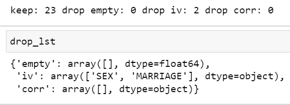

ai4 金融教育版权所有

因此，我们将总共保留 23 个特征，并删除 2 个特征**[‘性’，‘婚姻’]**，因为它们具有**低 IV** 。

*   **证据权重(WOE)** —描述预测变量和二元目标变量之间的**关系**
*   **信息值(IV)** —基于 WOE 衡量关系的强度。行业水平是丢弃 IV 低于 0.02 的**特性**


```
# output the iv table to a dataframe
def output_iv_importance(train_selected,label_col):
    feat_import_iv = toad.quality(train_selected,label_col,iv_only=True)
    feat_import_iv=feat_import_iv['iv']
    feat_import_iv = feat_import_iv.reset_index()
    feat_import_iv.columns = ['name','iv']
    return feat_import_iv

df_iv=output_iv_importance(train_selected,'label')
df_iv.head(30)
```

这是所有特性的 IV 排名。我们可以看到 **PAY_0** 的 IV 最高，这是有意义的，因为这个**特征表示最近的还款状态**。与支付状态和金额相比，教育和年龄的 IV 较低。


ai4 金融教育版权所有

# 3.特色宁滨

特征宁滨是将连续变量或数值变量转化为分类特征。

**特色宁滨的优势**:

1.  它**简化了**逻辑回归模型，而**降低了模型过度拟合的风险**
2.  Logistic 回归是一个**广义线性模型**，表达能力有限；特征宁滨可以将**非线性**引入到模型中，可以提高模型的表达能力，有助于更好的模型拟合
3.  **离散化特征**对**异常数据**非常**鲁棒**:比如年龄> 30 时 **a 特征的值为 1，否则为 0**。如果特征没有被离散化，异常数据点“300 岁”将影响模型拟合
4.  它可以将空数据视为一个单独的类

## ****功能宁滨的步骤:****

****第一步**。初始化:c = toad.transform.Combiner()**

****第二步。**训练宁滨:**

```
c.fit(dataframe, 
      y = 'target', 
      method = 'chi', 
      min_samples = 0.05, 
      n_bins = None, 
      empty_separate = False)
```

*   ****y** :目标列**
*   ****方法**:宁滨方法，支持 **chi** (卡方宁滨) **dt** (决策树宁滨)**k 均值**，**分位数**，**步长**(等步长宁滨)**
*   ****min_samples** :每箱包含**最少数量的样品**，可以是**号**或**比例****
*   ****n _ bin**:bin 的数量；如果不可能划分这么多箱子，则将划分最大数量的箱子。**
*   ****空 _ 分开**:是否分开**空箱****

****第三步**。**检查宁滨节点** : **c.export()****

****第四步**。**手动调节宁滨** : **c.load(dict)****

****第五步**。**应用宁滨结果**:**c . transform(data frame，labels=False)****

*   ****标签**:是否将宁滨结果转换成盒子标签。如果**假**，输出 **0，1，2** …(离散变量按比例排序)，如果**真**输出 **(-inf，0】，(0，10)，【10，INF】**。**

```
import time
start = time.time()
combiner = toad.transform.Combiner()
# use the filtered features for training
# Use the stable chi-square binning, 
# specifying that each bin has at least 5% data to ensure stability
# empty values ​​will be automatically assigned to the best bin
combiner.fit(X=train_selected,
             y=train_selected['label'],
             method='chi',
             min_samples = 0.05,
             exclude=exclude_list)
end = time.time()
print((end-start)/60)

#output binning
bins = combiner.export()
```

**宁滨结果:**

****

**ai4 金融教育版权所有**

```
#apply binning
train_selected_bin = combiner.transform(train_selected)
test_bin = combiner.transform(test[train_selected_bin.columns])

#Fine tune bins
from toad.plot import  bin_plot,badrate_plot
bin_plot(train_selected_bin,x='PAY_AMT1',target='label')
bin_plot(test_bin,x='PAY_AMT1',target='label')
```

**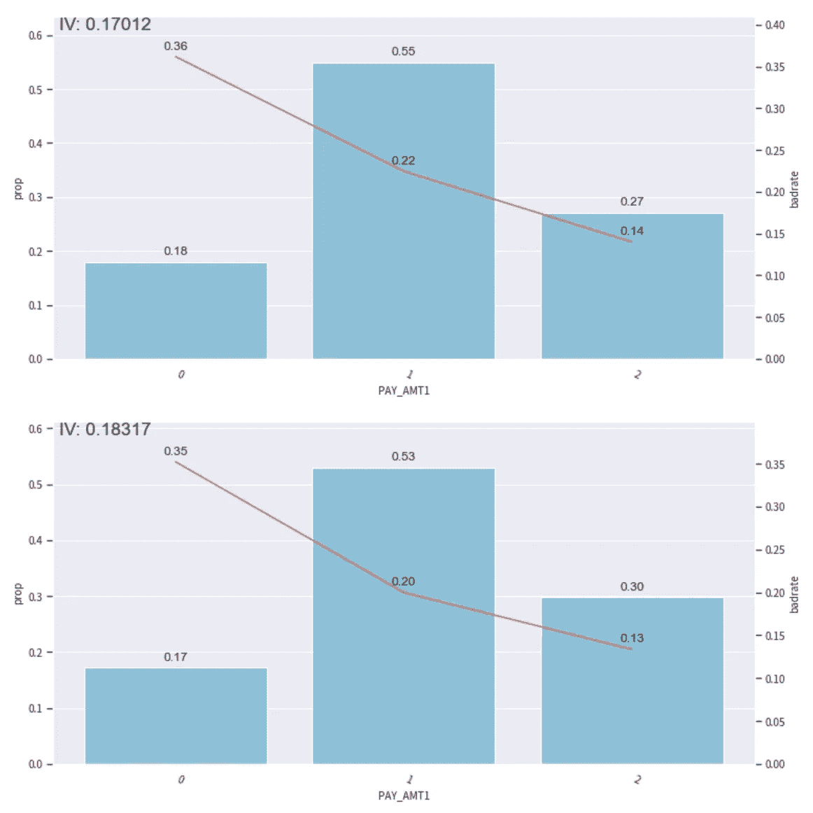**

**ai4 金融教育版权所有**

**在该图中，**柱状图**代表相应 bin 中数据的**比例；**红线**代表**违约客户比例**。****

**我们需要确保宁滨具有**单调性**，这意味着**线与**没有突然跳跃或下降**的**趋势相同。**

**这个剧情看起来还行，如果有突然的跳跃或者下降，我们需要用 **c.set_rules(dict)** 结合宁滨。**

**比如说。**

```
#setting rules
rule = {'PAY_AMT1':[['0', 'nan'],['1'], ['2'], ['3']]}

#Adjust binning
c.set_rules(rule)
```

# **4.转换为 WOE 并计算 PSI**

**WOE 转换在宁滨完成后执行。**

**步骤如下:**

1.  **使用上面调整的**组合器 c** 转换数据**
2.  ****初始化 woe 转换**t:**t = toad . transform . woe transformer()****
3.  ****训练**t:**t . fit _ transform**训练并输出车列的 woe 转换数据**
4.  ****目标**:目标列数据(非列名)**
5.  ****排除**:不需要进行 WOE 变换的列。注意:所有列都将被转换，包括没有被宁滨的列，不需要被 WOE 转换的列将通过 exclude 删除，尤其是目标列。**
6.  ****转换测试/OOT 数据**:transfer . Transform**

```
##transform to WOE
t=toad.transform.WOETransformer()
#transform training set
train_woe = t.fit_transform(X=train_selected_bin,
                            y=train_selected_bin['label'], 
                            exclude=exclude_list)
#transform testing set
test_woe = t.transform(test_bin)

final_data_woe = pd.concat([train_woe,test_woe])
```

****

**ai4 金融教育版权所有**

## **计算 PSI**

**PSI(种群稳定性指数)反映了分布的**稳定性。我们经常用它来筛选特征和**评估模型稳定性**。行业水平是丢弃 PSI 大于 **0.2** 的特性****

****

```
#get the feature name
features_list = [feat for feat in train_woe.columns if feat not in exclude_list]
#calculate PSI using toad
psi_df = toad.metrics.PSI(train_woe[features_list], test_woe[features_list]).sort_values(0)
#put into a dataframe
psi_df = psi_df.reset_index()
psi_df = psi_df.rename(columns = {'index' : 'feature',0:'psi'})

# features less than 0.25
psi005 = list(psi_df[psi_df.psi<0.25].feature)
# features geater than 0.25
psi_remove = list(psi_df[psi_df.psi>=0.25].feature)

# keep exclude list
for i in exclude_list:
    if i in psi005:
        pass
    else:
       psi005.append(i) 
# remove features that are geater than 0.25
train_selected_woe_psi = train_woe[psi005]
off_woe_psi = test_woe[psi005]

# output our final data table
final_data_woe = pd.concat([train_selected_woe_psi,off_woe_psi])
```

****

**ai4 金融教育版权所有**

# **5.最终输出 IV**

**这一步是在 **WOE 变换**之后输出 IV，它与原始特征的 IV 有一点不同。**

```
# output the IV
features_use = [feat for feat in final_data_woe.columns if feat not in exclude_list]
len(features_use)

df_iv=output_iv_importance(final_data_woe[features_use+['label']],'label')
```

**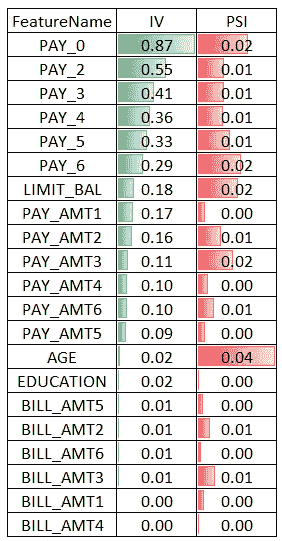**

**ai4 金融教育版权所有**

**想法是获得具有最高 IV**和最低 PSI** 的特征。**

# **6.模型调整**

****

**图像由[四吻](https://unsplash.com/@tetrakiss)在 [Unsplash](https://unsplash.com/photos/MECKPoKJYjM) 上拍摄**

## **逻辑回归**

**信用记分卡建模过程中最常用的算法是逻辑回归。原因如下:**

*   ****简单线性关系**:变量之间的关系是线性关系**
*   ****良好的可解释性**:输入变量对目标变量的影响很容易得到**
*   ****给出概率而不是判别类**:客户的**特征信息**(如婚姻、年龄、历史信用表现等。)可以整合转换成一个**概率值**，为预测客户好坏提供一个**直观的**依据。即价值越大，客户未来违约的概率越小。**
*   ****易于部署**:测试、部署、监控、调优等。，都比较简单**

```
def check_train_test_auc(x_train,y_train,x_test,y_test):
    from sklearn.linear_model import LogisticRegression
    lr = LogisticRegression(random_state=42,C= 0.1, penalty='l2', solver='newton-cg')

    lr = LogisticRegression(class_weight='balanced')
    lr.fit(x_train, y_train)

    pred_train = lr.predict_proba(x_train)[:,1]
    from toad.metrics import KS, AUC

    print('train KS',KS(pred_train, y_train))
    print('train AUC',AUC(pred_train, y_train))

    pred_OOT =lr.predict_proba(x_test)[:,1]
    print('Test KS',KS(pred_OOT, y_test))
    print('Test AUC',AUC(pred_OOT, y_test))

    from sklearn.metrics import confusion_matrix, accuracy_score, roc_auc_score, plot_roc_curve, classification_report

    fig, ax = plt.subplots(figsize=(12, 8))
    plot_roc_curve(lr, x_test, y_test, color='blue', ax=ax)

#train & test
check_train_test_auc(x_train = train_woe[features_use],y_train=train_woe['label'],
                     x_test =test_woe[features_use] ,y_test = test_woe['label'])
```

**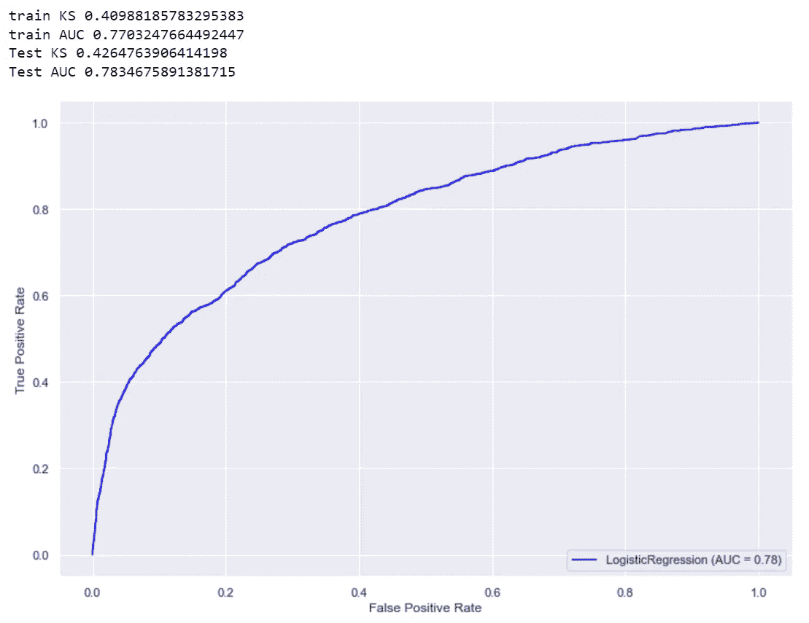**

**ai4 金融教育版权所有**

**我们可以看到，在训练 AUC 和测试 AUC 或训练 KS 和测试 KS 之间没有太大的差异。这意味着我们的模型不会过度拟合。**

## **训练 GradientBoostingClassifier 并检查要素重要性表**

**查看 GBDT 模型的性能是否优于 LR，并将特征重要性表与 IV 进行比较。**

```
def get_evaluation_scores(label, predictions):
    from sklearn.metrics import classification_report, confusion_matrix, accuracy_score
    from sklearn.metrics import balanced_accuracy_score
    tp, fn, fp, tn = confusion_matrix(label,predictions,labels=[1,0]).reshape(-1)
    print('True Positive：',tp)
    print('True Negative：',tn)
    print('False Positive：',fp)
    print('False Negative：',fn)
    accuracy = (tp+tn)/(tp+fn+fp+tn)
    print('accuracy: ',accuracy)
    recall = tp/(tp+fn)
    print('（recall）: ',recall)
    precision = tp/(tp+fp)
    print('（precision）: ',precision)
    #f1 score = 2*(P*R)/(P+R)
    f1 = 2*precision*recall/(precision+recall)
    print('F1 score: ',f1)

    print(classification_report(label, predictions))

    print('balanced_accuracy_score: ',balanced_accuracy_score(label,predictions))
    return precision, recall

def evaluate_result(df_train,df_test,features_name):
    from sklearn.ensemble import AdaBoostClassifier, GradientBoostingClassifier, RandomForestClassifier, ExtraTreesClassifier
    import seaborn as sns
    import matplotlib.pyplot as plt
    start = time.time()
    x_train = df_train[features_name]
    y_train = df_train['label']

    x_test  = df_test[features_name]
    y_test  = df_test['label']

    model = GradientBoostingClassifier(n_estimators=250,random_state=0)
    model.fit(x_train,y_train)
    predictions = model.predict(x_test)
    get_evaluation_scores(label = y_test, predictions=predictions)
    feat_importances = pd.Series(model.feature_importances_, index=features_name)
    feat_importances=pd.DataFrame(feat_importances).reset_index()
    feat_importances.columns=['feature_name','feature_importance']
    feat_importances=feat_importances.sort_values(['feature_importance'],ascending=False)
    import matplotlib.pyplot as plt
    plt.figure(figsize=(15,15))

    sns_plot1=sns.barplot(feat_importances.feature_importance,feat_importances.feature_name,estimator=sum)
    plt.title("Features Importance",size=18)
    plt.ylabel('', size = 15)
    plt.tick_params(labelsize=18)
    return feat_importances,model,x_train,y_train,x_test,y_test

fet_importance_GBDT_reason,model,x_train,y_train,x_test,y_test = evaluate_result(df_train=train_woe,
                df_test=test_woe,
                features_name=features_use)
```

**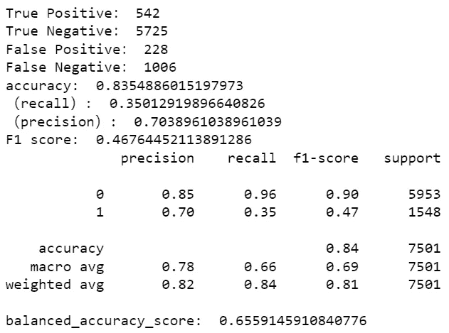**

**AI4Finance-Foundation 版权所有**

**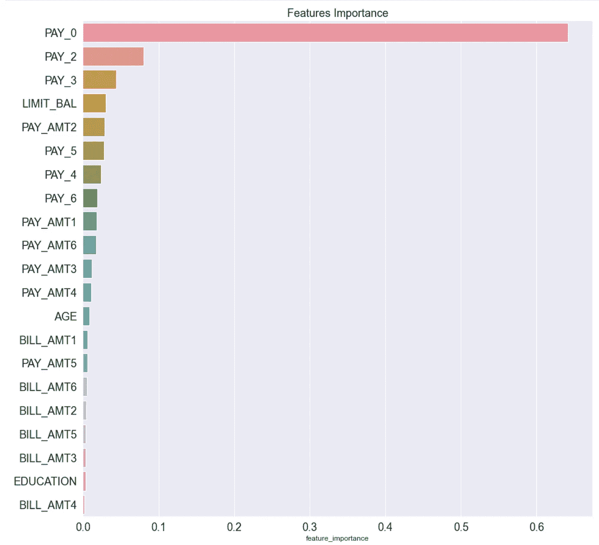**

**ai4 金融教育版权所有**

**从功能重要性表中我们可以看出，GBDT 非常重视 PAY_0 功能(64%)。**

```
def plot_roc_pre_recall_curve(labels, probs):
    from sklearn.metrics import precision_recall_curve
    # Get ROC curve FPR and TPR from true labels vs score values
    fpr, tpr, _ = roc_curve(labels, probs)

    # Calculate ROC Area Under the Curve (AUC) from FPR and TPR data points
    roc_auc = auc(fpr, tpr)

    # Calculate precision and recall from true labels vs score values
    precision, recall, _ = precision_recall_curve(labels, probs)

    plt.figure(figsize=(8, 3))

    plt.subplot(1,2,1)
    lw = 2
    plt.plot(fpr, tpr, color='darkorange', lw=lw, label='ROC curve (area = %0.4f)' % roc_auc)
    plt.plot([0, 1], [0, 1], color='navy', lw=lw, linestyle='--')
    plt.xlim([0.0, 1.0])
    plt.ylim([0.0, 1.05])
    plt.xlabel('False Positive Rate')
    plt.ylabel('True Positive Rate')
    plt.title('ROC Curve')
    plt.legend(loc="lower right")
    plt.grid(True)

    plt.subplot(1,2,2)
    plt.step(recall, precision, color='orange', where='post')
    # plt.fill_between(recall, precision, step='post', alpha=0.5, color='orange')
    plt.xlabel('Recall')
    plt.ylabel('Precision')
    plt.ylim([0.0, 1.05])
    plt.xlim([0.0, 1.0])
    plt.title('Precision Recall Curve')
    plt.grid(True)

    left  = 0.125  # the left side of the subplots of the figure
    right = 0.9    # the right side of the subplots of the figure
    bottom = 0.1   # the bottom of the subplots of the figure 
    top = 0.9      # the top of the subplots of the figure
    wspace = 0.5   # the amount of width reserved for blank space between subplots
    hspace = 0.2   # the amount of height reserved for white space between subplots
    plt.subplots_adjust(left, bottom, right, top, wspace, hspace)
    plt.show()

probs = model.predict_proba(x_test)[:,1]
sns.set(font_scale = 1)
plot_roc_pre_recall_curve(y_test, probs)
```

**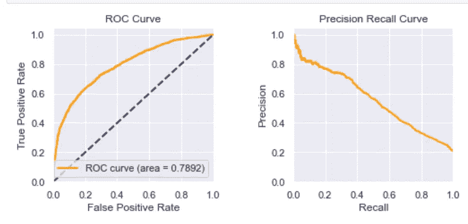**

**ai4 金融教育版权所有**

**ROC 和精确回忆曲线看起来不错。**

# **7.模型生产**

**让我们为逻辑回归训练我们的生产模型**

```
#prepare train & test data
x_train = train_woe[features_use]
y_train=train_woe['label']
x_test =test_woe[features_use] 
y_test = test_woe['label']

#Train LR
#lr = LogisticRegression(random_state=42,C= 0.1, penalty='l2', solver='newton-cg')
lr = LogisticRegression(class_weight = 'balanced')
lr.fit(x_train, y_train)

#check AUC
probs = lr.predict_proba(x_test)[:,1]
sns.set(font_scale = 1)
plot_roc_pre_recall_curve(y_test, probs)
```

****

**ai4 金融教育版权所有**

**LR 的 AUC:0.7835**

**GBDT 的 AUC:0.7892**

**这些模型之间没有太大的区别。所以用 LR 建立记分卡是可以的。**

# **8.记分卡调整**

**以下参数是记分卡优化中最重要的参数。**

*   ****base_score** = 1000， **base_odds** = 35， **pdo** = 80，**比率** = 2**

**实际意思是，当基础赔率为 **35** 时，**基准分为 1000** ，当**比基准**高一倍时，基准分下降 80 分。**

```
# scorecard tuning
card = toad.ScoreCard(
    combiner = combiner,
    transer = t,
    class_weight = 'balanced',
    C=0.1,
    base_score = 1000,
    base_odds = 35 ,
    pdo = 80,
    rate = 2
)

card.fit(train_woe[features_use], train_woe['label'])

#inference on test data
test['CreditScore'] = card.predict(test)
test['CreditScore'].describe()

#output the scorecard
final_card_score=card.export()
len(final_card_score)

#transform the scorecard into dataframe and save to csv
keys = list(card.export().keys())
score_card_df = pd.DataFrame()
for n in keys:
    temp = pd.DataFrame.from_dict(final_card_score[n], orient='index')
    temp = temp.reset_index()
    temp.columns= ['binning','score']
    temp['variable'] = n
    temp = temp[['variable','binning','score']]
    score_card_df=score_card_df.append(temp)
score_card_df.head(30)
```

**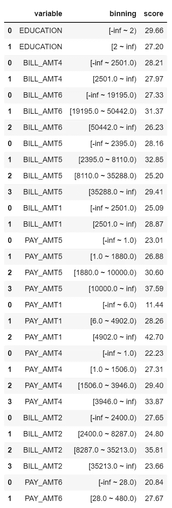**

**ai4 金融教育版权所有**

**这是我们的记分卡。一旦我们得到这个表，我们就可以把这个 CSV 文件扔给**开发者**，让他们开发一个服务来给每个客户打分。**

**但是我们还需要做更多的事情；对于一个典型的记分卡，我们需要有一个分数范围，每个范围代表一个信任级别。**

**这样，业务方人员更容易针对不同级别的客户采取行动**。****

**例如，我们可以这样设置**信用等级**:**

**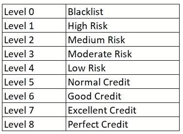**

**ai4 金融教育版权所有**

# **9.分布分析**

****

**图片由[卢克·切斯](https://unsplash.com/@lukechesser)在 [Unsplash](https://unsplash.com/photos/JKUTrJ4vK00) 上拍摄**

**我们需要绘制违约客户与优质客户的**分数分布**，以便划分**信用等级**(0 级到 8 级)。**

```
plt.figure(figsize=(12,10))
import random
import numpy
from matplotlib import pyplot as plt

w = 40
n = math.ceil((data['CreditScore'].max() - data['CreditScore'].min())/w)
#bins = numpy.linspace(-10, 10, 100)

plt.hist(data[data.label==1].CreditScore, alpha=0.5, label='Black',bins = n)
plt.hist(data[data.label==0].CreditScore, alpha=0.5, label='White',bins = n)
plt.legend(loc='upper left')
plt.title('Credit Score Distribution: Test Set',size=15)
plt.show()
```

**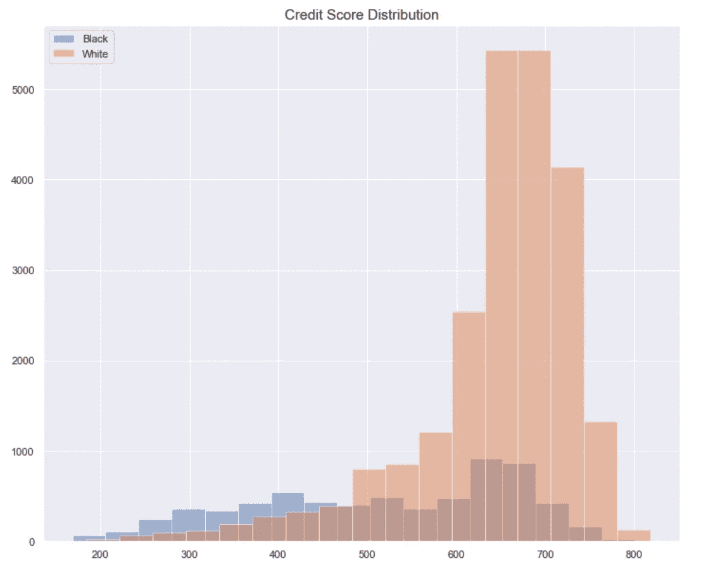**

**ai4 金融教育版权所有**

****黑色**表示**默认客户**，白色**表示**好客户**。****

**一个好的模型会清晰的分出**黑/白分布**。**

**最理想的分布是**一个微笑的形状****

*   **信用分数高的好客户->最右边**
*   **信用评分低的默认客户->最左边。**

****我们当前的模型不能很好地分离这些分布**。对我来说，我会回去探索**更多的特性**来增加**的预测能力**。但是我们总是可以先**建立一个基线模型**并在此基础上进行改进。**

# **10.阈值调谐**

**我们需要针对不同的信用级别执行**阈值调整，这是损失&覆盖范围之间的权衡。****

**比方说，你的老板可以承受一些损失，但你必须为下个月覆盖 70%的好客户。**

**换句话说，你的目标是找到一个 **≤10%亏损和≥70%覆盖率**的阈值。**

```
def get_credit_level(
    test,
    target_score ='order_score',
    out_col = 'order_level',
    left_bound = -100,
    level_0 = 100,
    level_1 = 200,    
    level_2 = 250,    
    level_3 = 300,    
    level_4 = 350,    
    level_5 = 400,    
    level_6 = 450,
    level_7 = 500,
    level_8 = 800):
    level = []
    for i in range(len(test)):
        if (test[target_score][i]>left_bound) & (test[target_score][i]<=level_0):
            level.append(0)
        elif  (test[target_score][i]>level_0) & (test[target_score][i]<=level_1):
            level.append(1)
        elif  (test[target_score][i]>level_1) & (test[target_score][i]<=level_2):
            level.append(2)
        elif  (test[target_score][i]>level_2) & (test[target_score][i]<=level_3):
            level.append(3)
        elif  (test[target_score][i]>level_3) & (test[target_score][i]<=level_4):
            level.append(4)
        elif  (test[target_score][i]>level_4) & (test[target_score][i]<=level_5):
            level.append(5)
        elif  (test[target_score][i]>level_5) & (test[target_score][i]<=level_6):
            level.append(6)
        elif  (test[target_score][i]>level_6) & (test[target_score][i]<=level_7):
            level.append(7)
        elif  (test[target_score][i]>level_7 )& (test[target_score][i]<=level_8):
            level.append(8)

    test[out_col] = level
    return test

def plot_bts_level_loss(test, target_col):
    bts_level_df = test[target_col].value_counts()
    bts_level_df=pd.DataFrame(bts_level_df)
    df_label_level= test[test.label==1].groupby(target_col)['label'].count()/ test.groupby(target_col)['label'].count()
    df_label_level = pd.DataFrame(df_label_level)
    bts_level_df.sort_index().plot.bar(title='')
    df_label_level.plot()

test = get_credit_level(test,
                       target_score ='CreditScore',
                       out_col = 'CreditScore_level',
                      left_bound = -1000,
    level_0 = 250,
    level_1 = 300,    
    level_2 = 400,    
    level_3 = 500,    
    level_4 = 580,    
    level_5 = 630,    
    level_6 = 690,
    level_7 = 730,
    level_8 = 1000
                )
plot_bts_level_loss(test,target_col='CreditScore_level')
def get_loss_coverage(test,target_level):
    #level 5-Leve 8 Loss (percentage of default people)
    L5_loss = test[test[target_level]>=5 ].label.value_counts()/len(test[test[target_level]>=5 ])
    #level 5- level 8 Coverage (percentage of good people)
    L5_coverage=test[test[target_level]>=5 ].label.value_counts()[0]/test[test.label==0].shape[0]
    print("Level 5-Level 8: Loss is ",L5_loss[1], "; Coverage is ",L5_coverage)
    #level 6-level 8 Loss
    L6_loss=test[test[target_level]>=6 ].label.value_counts()/len(test[test[target_level]>=6 ])
    #level 6-level 8 Coverage
    L6_coverage=test[test[target_level]>=6].label.value_counts()[0]/test[test.label==0].shape[0]
    print("Level 6-Level 8: Loss is ",L6_loss[1], "; Coverage is ",L6_coverage) 
```

**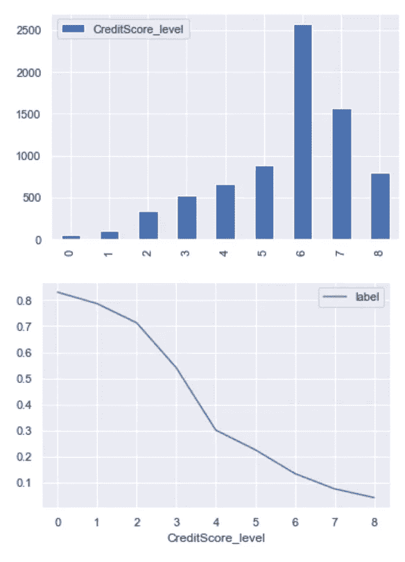**

**ai4 金融教育版权所有**

**该图显示了每个**信用等级**和该等级下**信用违约率**的分布。**

****

**ai4 金融教育版权所有**

****

**ai4 金融教育版权所有**

**通过检查每一层，你会有一个损失和保险表。例如，如果您向所有人 **7501** ( **L0-L8** )发送余额转移报价，您将遭受 **21%的损失率(1548/7501)** 。**

**要达到目标(损耗≤10%，覆盖率≥70%)，需要**挑选损耗 10.1%(347+120+34)/(2573+1570+796)，覆盖率 75%(2226+1450+762)/5953**。**

**基本上，下个月(假设测试集是下个月的数据)业务端的人会给**6 级或以上的客户发送余额转移报价，总共 4939 个客户。****

# **11.手动测试我们的记分卡**

****

**由 [nci](https://unsplash.com/@nci) 在 [Unsplash](https://unsplash.com/photos/GlZv6YgCUyM) 上拍摄的图像**

**下个月，我们能否向客户发送包含以下信息的余额转移报价？**

**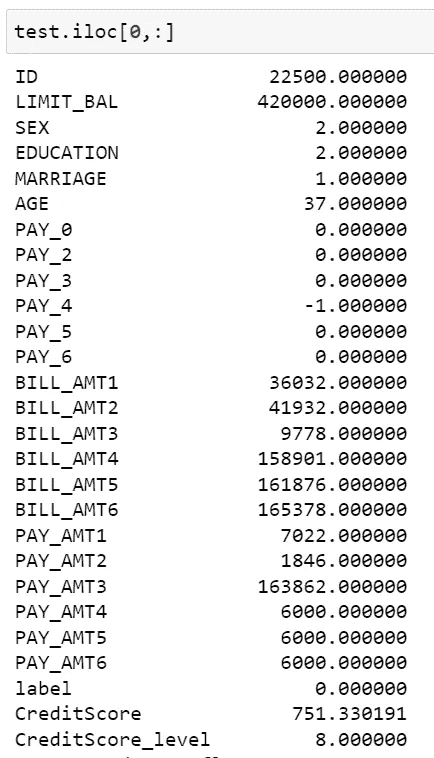**

**ai4 金融教育版权所有**

**让我们手动检查记分卡。**

****

**ai4 金融教育版权所有**

**toad 的推断:**

****

**ai4 金融教育版权所有**

**通过查看我们的信用等级表:**

**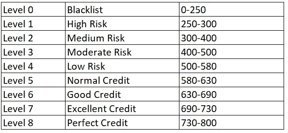**

**ai4 金融教育版权所有**

**我们可以看到这个客户是**8 级客户，信用完美**。所以我们可以给他/她一个余额转移报价。**

# **结论:**

**这篇博客介绍了基于开源 ML 工具 [**Toad**](https://github.com/amphibian-dev/toad) **构建信用记分卡的端到端过程。****

**本博客讨论了以下 ML 流行语:**

****信息值(IV)、证据权重(WOE)、群体稳定性指数(PSI)、AUC(ROC 曲线下面积)、KS (Kolmogorov-Smirnov)、Logistic 回归(LR)、GBDT(梯度推进决策树)****

**对于未来的工作，作为一名数据科学家，您可以尝试使用其他 ML 模型来构建记分卡，如深度神经网络，以进一步提高准确性并降低假阳性率，从而提高客户满意度。**

**谢了。**

*****来自《走向数据科学》编辑的注释:*** *虽然我们允许独立作者根据我们的* [*规则和指导方针*](/questions-96667b06af5) *发表文章，但我们不认可每个作者的贡献。你不应该在没有寻求专业建议的情况下依赖一个作者的作品。详见我们的* [*读者术语*](/readers-terms-b5d780a700a4) *。***