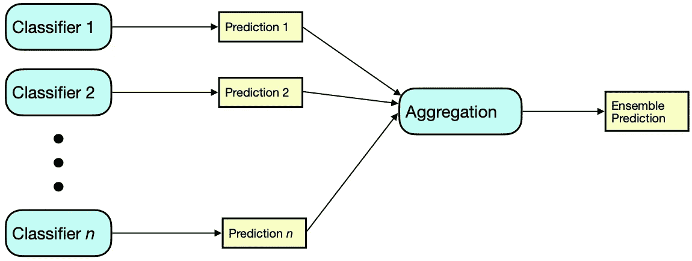
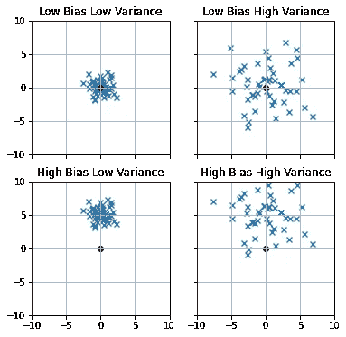
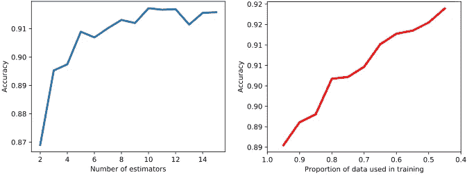
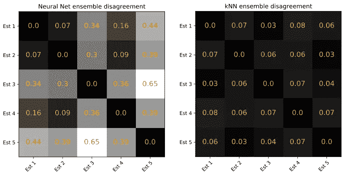
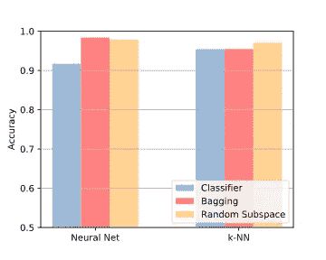
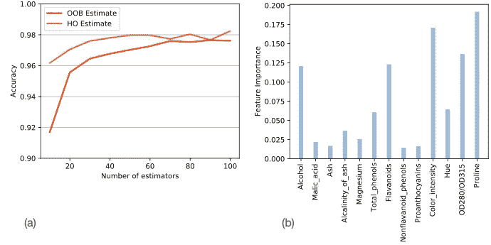
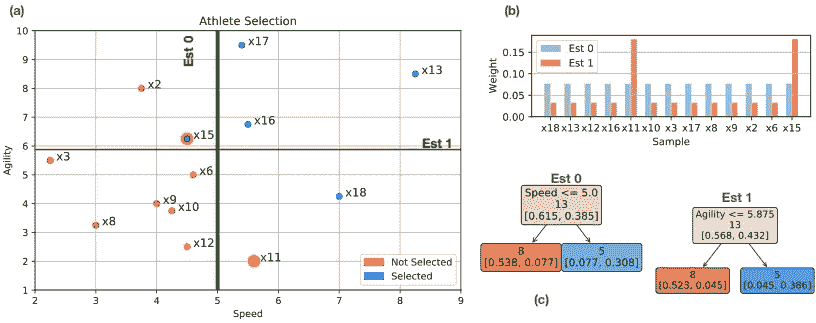
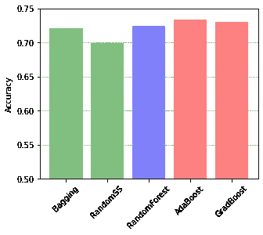
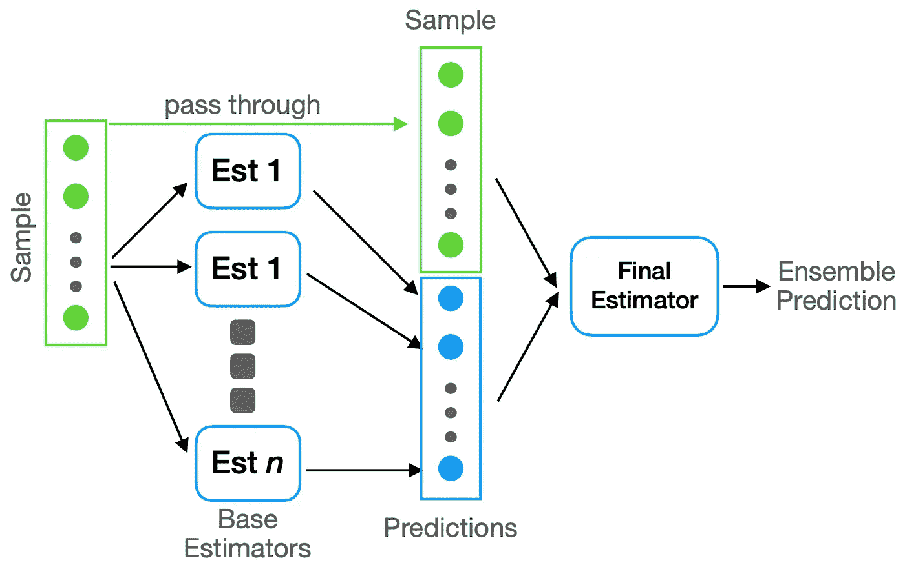

# 机器学习中的集成

> 原文：<https://towardsdatascience.com/ensembles-in-machine-learning-9128215629d1>

## 包含 Python 示例和代码的教程


拉里莎·比尔塔在 [Unsplash](https://unsplash.com/s/photos/orchestra?utm_source=unsplash&utm_medium=referral&utm_content=creditCopyText) 上拍摄的照片

# TL；速度三角形定位法(dead reckoning)

集成方法是机器学习(ML)中公认的算法基础。就像在现实生活中一样，在 ML 中，一个专家委员会通常会比一个人表现得更好，只要在组成委员会时给予适当的关注。自从最早的 ML 研究以来，随着随机森林和梯度推进成为当今分类中的前沿方法，已经开发了各种集成策略。本教程中的主要建议如下:

1.  如果目标是最大化精度，梯度推进可能被认为是 ML [16]中领先的监督学习方法。
2.  随机森林还可以实现非常好的准确性，并具有通过特征重要性机制提供数据洞察力的额外优势。
3.  理解堆叠是如何工作的是值得的，因为它在[汽车](https://www.automl.org/automl/)中有一个新兴的角色。

# 介绍

从最大似然研究的早期开始，人们就认识到分类器的集合比单个模型更准确。在 ML 中，集成实际上是集合单个分类器预测的委员会。它们有效的原因与专家委员会在人类决策中工作的原因非常相似，它们可以利用不同的专业知识，平均效应可以减少误差。这篇文章提供了一个关于在 ML 中使用的主要集成方法的教程，链接到 [Python 笔记本和数据集](https://github.com/PadraigC/EnsemblesTutorial)来展示这些方法。目的是帮助从业者开始学习 ML 课程，并提供一个关于课程在什么时候和为什么有效的见解。

对 ML 系综的研究可以追溯到 20 世纪 90 年代[25，1，6]。从那时起，已经有了很多的发展，集合思想仍然是 ML 应用中的前沿。例如，随机森林[2]和梯度推进[7]被认为是当今 ML 从业者可用的最强大的方法。

图 1 给出了一般的集合概念。所有集成都由一组基本分类器组成，也称为成员或估计器。当提出一个查询时，它们将各自做出一个预测，并且这些预测将被组合以产生一个集合预测。不同的集成策略在如何精确地训练基本分类器以及如何实现预测的组合上有所不同。出于本教程的目的，我们将集合方法分为四类:

*   **Bagging**:Bootstrap aggregation(Bagging)指的是通过对数据的随机 Bootstrap 重采样进行训练来实现估计量多样性的集成。这些估计器的输出的集合是通过平均或多数表决来实现的。在这个范畴下，我们也考虑基于随机子空间而不是随机子集的系综。随机森林也包括在此类别中。



**图 1** :集成是一组产生预测的分类器(估计器)，这些预测被组合起来产生一个集合预测。不同的集成架构通过如何训练分类器和如何执行聚合来区分。图片作者。

*   **Boosting** :当 bagging 集成成员被有效地独立训练时，利用 Boosting，估计器被串行训练，一个新成员的训练被整体性能影响至今。估计器的性能也决定了它们在汇总过程中的作用。梯度推进寻求优化新估计器的训练与聚合过程。
*   **异构集成**:既然有太多的分类器方法可用，为什么不使用各种模型来实现集成的多样性呢？虽然这似乎是一件显而易见的事情，但异构集成在研究文献中并没有得到太多的关注，在实践中也没有得到太多的使用。这个主题将在下面的中介绍。
*   **堆叠**:(又名堆叠一般化)堆叠将聚集过程本身视为一个学习过程。元模型被训练来学习估计器的输出和目标之间的关系。用于此目的的数据不应用于训练估算者，因此叠加会带来一些数据管理挑战。

本文包括这四种总体架构的每一个部分。在下一节中，我们将提供一些可以追溯到 18 世纪的历史背景。然后，我们提出了一个框架来分类预测误差，因为这提供了一些重要的见解，何时和为什么集成可以提高准确性。在开始深入讨论主要的合奏类别之前，我们提供一个关于*合奏如何工作的高级总结。文章最后提出了一些建议和结论。*

# 历史关联

从某种意义上说，合奏体现了“两个脑袋比一个脑袋好”的理念，这一点已经为人所知。事实上，孔多塞侯爵在 1785 年提出的孔多塞陪审团定理[3]声称，委员会的决策将优于个人的决策。孔多塞陪审团定理指出，对于一个由 *n* 个投票人组成的委员会，其中每个投票人都有正确的概率 *p* ，并且大多数投票人正确的概率是 *M* ，那么:

1.  *p>0.5M>p*
2.  *p>0.5M→1.0*as*n→∞*

也就是说，如果一个人有超过 50%的机会是正确的，那么一群这样的人就更有可能是正确的。如果系综中存在多样性，第一种说法通常是正确的。毕竟，如果所有成员都以同样的方式投票，那么这个群体就不会比个人更好。因此，选民群体中必须有多样性——也就是说，他们的决定之间必须有一些分歧。

第二种说法是，规模较大的委员会很可能做出正确的决定，这种说法更有问题。只有当集合中的多样性继续增长时，大多数投票者正确的概率才会随着集合的增长而增加[15]。最终，新成员将拥有与现有成员共线的投票模式，也就是说，他们将以同样的方式投票。一般来说，集合的多样性会趋于平稳，在 10-50 个成员之间的某个规模时，集合的准确性也会趋于平稳。

# 误差成分

集成的好处通常是根据集成如何有助于减少误差来描述的。在这种情况下，误差有三个组成部分:

*   **贝叶斯误差**:(又名不可约误差)如果一个模型无法访问影响结果的所有特征，那么该模型不可能 100%准确。设想一个预测房价的模型，它没有关于房产位置的信息。通常，缺失的信息不会如此明显，但关键是模型无法将误差降至零。这个剩余误差就是贝叶斯误差，有时也称为不可约误差。因此，贝叶斯误差代表了性能的极限，并不是所有的模型都能达到。
*   **偏差**:如果模型没有达到贝叶斯误差，附加误差有两个分量，其中一个是偏差。在回归分析中，如果预测分布的平均值(趋势)高于或低于应有值，则偏差可能很明显(见图 2 左栏)。在分类中，某个特定类别可能在预测中被低估或高估。



**图 2** :误差的偏差和方差分量的图示。这是一个 2D 回归任务，目标在点(0，0)。目标显示为红色，对该目标的预测显示为蓝色。图片作者。

*   **方差:**在回归中，一个模型可以有很低的偏差，但仍然有很高的误差(图 2 右上角的图像)。预测的平均值是正确的，但是预测*变化*很大。在分类中，模型不会偏向单一结果，但错误会表现为多个方向的错误分类。

图 2 右上角的“低偏差高方差”示例显示了集合与 James Surowiecki [21]在书中提出的“群体智慧”理念之间的联系。这本书以高尔顿 1907 年在《自然》杂志上发表的“猜猜这头牛的重量”为例[8]。在这个例子中，787 人参加了一场在县集市上猜一头牛的重量的比赛。高尔顿分析了这些估计值，结果表明，虽然它们差异很大，但估计值的中位数在正确权重的 1%以内。同样，在图 2 中，我们可以看到集合如何通过对许多估计值求平均值来减少误差的方差分量。这是对系综的主要主张，即系综可以减少误差的方差分量。稍后我们将会看到，提升系综在某些情况下也可以减少误差的偏置分量。

# 为什么合奏会起作用？

在检查具体的合奏策略的细节之前，有必要看看合奏所依赖的一般原则。前面我们从孔多塞陪审团定理和随后的政治学著作中看到，有两个重要的考虑因素:

*   合理范围内，合奏成员越多越好。随着更多成员的加入，集合的准确性将增加，直到最终新成员不再带来新信息。
*   **多样性**:为了使集合的精度优于个体，集合成员中必须存在多样性。



**图 3** :系综大小和多样性对精度的影响。在左边，随着更多估计量(集合成员)的增加，精确度增加。在右边，对于 10 个估计量的集合，可以通过使用较小的数据子集来增加多样性，从而减少训练集重叠。随着估计量越来越不相似，精确度也越来越高。作者图表。

这些因素的影响在第一个[系综-预备](https://github.com/PadraigC/EnsemblesTutorial/blob/main/Ensembles-Preliminaries.ipynb)笔记本中有说明。这些结果如图 3 所示。这些结果是使用来自 [scikit-learn](https://scikit-learn.org/) 的 bagging ensemble 实现在来自 [UCI 知识库](https://archive.ics.uci.edu/ml/)的葡萄酒数据集上生成的。使用交叉验证获得准确度估计值。集合大小的影响显示在左边的图 3 中。利用两个估计器(成员),集合具有 0.87 的准确度。这在 7 个估计量的情况下增加到 0.91 以上，但是随着更多估计量的增加没有实质性的增加。这种*先增加后稳定*的模式是典型的，尽管对于其他数据集来说，在添加更多的估计量之前可能不会达到稳定状态。

说明多样性的影响并不简单，因为多样性不太容易量化。在右边的图 3 中，我们用来管理多样性的策略是控制用来训练估计量的数据集中的重叠。集合大小总是 10，并且第一个集合成员使用没有替换的采样数据的 95%来训练。所以这些估值器彼此非常相似。然后使用 90%的数据训练下一个集合，依此类推。因此，通过用越来越少的可用数据训练估值器，允许它们不那么相似，多样性就增加了。推测起来，当使用较少的数据时，这些估计器变得不太准确，但是总体准确性增加，因为个体估计器中的任何准确性损失都被多样性的增加所抵消。最终好处会逐渐消失，因为在不犯错的情况下增加多样性变得越来越困难。

## 量化多样性

如果多样性是决定集合有效性的一个如此重要的因素，能够量化它将是很好的。Krogh 和 Vedelsby [12]已经证明了回归系综中误差和模糊性(多样性)之间的以下非常重要的关系:


其中 *E* 是输入分布上的总体误差，*是总体分量的平均泛化误差，*ā***是输入分布上的平均总体模糊度。*是标准平方误差估计(L2 损失)，而*ā*是单个模糊度 *ā(x)* 的集合(平均值)，单个输入 *x* 上的 *N* 个估计器的集合的模糊度:****

******

***其中求和项是来自每个估计器 *k* 的估计和平均估计之间的差的平方。因此，模糊度实际上是来自集合成员的预测的方差。***

***不幸的是，对于分类器来说，不存在这样简洁的分析。Kuncheva 和 Whitaker [14]分析了分类器集合的 10 种不同的多样性度量。他们发现，他们都在量化多样性方面做了合理的工作，但在进行了相当广泛的评估后，他们得出结论，没有单一的赢家。在 Kuncheva 和 Whitaker 的分析中，他们区分了成对和非成对测量。为了使用成对度量来评估集合多样性，对所有的 *N* 估计量对计算度量，并取平均值。他们的分析考虑了四个成对的和六个非成对的测量。***

***为了深入了解多样性度量的工作原理，我们在这里提供了两个例子，每种类型一个。也许最直接的成对测量是简单的不一致测量[23](有时称为分类器输出差异[24])。该度量简单地计算两个分类器不一致的测试集的比例，该度量在范围[0，1]内。两个分类器 *h* ᵤ和 *h* ᵥ的简单不一致度量是:***

******

***其中 *m* 是数据集中实例的数量，求和过程计算两个分类器之间的差异。即 *Diff(a，b) = 0* ，如果 *a=b* ，否则 *Diff(a，b) = 1* 。总体总体分集将是这些度量的*N×(n1)*的平均值。在本文的一些评估中使用了这种简单的不一致度量，例如参见图 5 和图 11。***

***相比之下，非成对测量一次考虑所有系综成员。在单个测试样本的水平上，我们想要测量该样本的一组 *N* 预测的多样性。这个集合的熵是一个显而易见的选择。那么对于有 *C* 个类别的 *m* 个样本的测试集，熵是[4，14]:***

******

***其中, *P* 项是样本 *i* 预测中类别 *k* 的频率——预测中的离散度或随机性越大，差异越大。***

# ***装袋(和变体)***

***bagging 系综的想法是由 Breiman 在 1996 年提出的[1]。Bagging 通过 bootstrap 聚合工作，因此得名。分类器集合中的多样性(图 1)是通过 bootstrap 采样实现的，然后通过简单多数投票聚合预测。Bootstrap 抽样是指替换抽样。关于 bagging 的 [Python 笔记本开头的一个简单例子说明了 bootstrap 采样的特征。我们创建一个包含 1，000 个唯一样本的列表，然后从中创建一个大小为 1，000 的子样本。如果用替换法进行抽样，我们发现大约 63%的样本被选中，有些被多次选中。这意味着每个“袋子”中有 37%的样本未被选中，这些是袋外(OOB)样本。我们以后会看到，这些证明是非常有用的。](https://github.com/PadraigC/EnsemblesTutorial/blob/main/Ensembles-Bagging.ipynb)***

***为了使用 bagging 实现如图 1 所示的集成，用来自训练数据的引导样本训练集成成员。通常，这些引导样本与完整训练集的大小相同。在正确的情况下，正如我们将看到的，这种采样策略将产生足够的多样性，以产生一个有效的集合。聚集步骤是简单地对全体成员进行多数投票，其中成员具有相等的票数。***

******

*****图 4**:bagging 对稳定和不稳定分类器的效果。(a)装袋对 k-NN(一种稳定的分类器)影响较小。(b)对于五个不同的分类器，bagging 仅提高了两个不稳定模型(树和神经网络)的准确性。作者图表。***

***在图 4 中，我们看到 bagging 是如何在葡萄酒数据集上工作的。这些结果来自[装袋笔记本](https://github.com/PadraigC/EnsemblesTutorial/blob/main/Ensembles-Bagging.ipynb)中的评估。在图 4(a)中，我们看到随着更多估计器(即模型或分类器)的加入，神经网络集成的集成精度提高。然而，用 *k* -NN 系综没有实现类似的改进。***

***原因很好理解，bagging 只对不稳定的分类器有效[1，20]。在这种情况下，不稳定分类器是指模型输入(在这种情况下是训练数据)的微小变化会产生明显不同的模型。利用 bagging，这种不稳定性是一个优势，因为它产生了集合工作所需的多样性。在图 4(b)中，我们展示了用五种不同基础模型构建的 bagging 系综的结果。已知决策树和神经网络是不稳定的，而逻辑回归、 *k* -NN 和朴素贝叶斯是稳定的。果不其然，装袋对不稳定的模型有好处，但对其他模型没有好处。***

***我们可以使用简单的不同意度量来进一步探讨这一点。图 5 显示了神经网络和各有五个成员的 *k* -NN 集成的简单不一致测量的彩色图。神经网络集成的情况相当健康，估计量之间存在显著的成对不一致。与 *k* -NN 集合的情况非常不同，一些估计器仅在百分之几的样本上不同。所以 *k* -NN 面对训练数据的显著变化是稳定的。这意味着用 *k* -NN 装袋不起作用。然而，还有其他可能的策略，其中最流行的是随机子空间。***

******

*****图 5** :这些彩色地图显示了两个五人合奏的简单不一致测量。神经网络集成差异很大，而 k-NN 集成差异很小。在这些彩色地图中，颜色越浅越好，即差异越大。作者图表。***

## ***随机子空间***

***在图 6 所示的例子中，打包需要选择原始数据集中的*行*的不同子集。相反，随机子空间[11，10]将选择如图所示的*列*的不同子集。我们在图 4 中看到，当基本分类器稳定时，装袋没有任何好处。图 5 中的彩图表明，这是因为不同的 bootstrap 训练集导致估计器的输出变化很小。***

***图 6 显示了确保多样性的随机子空间策略。不是对行进行二次抽样，而是对列进行二次抽样。如果所有的特征代表完整的特征空间，不同的估计器在随机子空间上被训练。这可能不会立即显而易见，但这通常将是实现多样性的更具决定性的机制。不同的评估者将反映对数据的不同观点。一些估计者将无法获得最具预测性的特征，并将需要依赖预测性较低的特征。研究表明，随机子空间策略确实能提高稳定估计量[10，11，13]。***

******

*****图 6** :基于随机子空间的集成——使用特征的随机子集来训练不同的集成成员。作者图表。***

***随机子空间结合 *k* -NN 对葡萄酒数据集的影响如图 7 所示。图 7 中再次示出了来自图 4(b)的原始神经网络和 *k* -NN 结果，但是添加了基于随机子空间的集成结果。鉴于套袋对 *k* -NN 无效，随机次间隔确实产生一些改善。图 4 和图 7 中所示的多个模型组合的结果表明，97%至 98%的交叉验证准确度可能是该数据集可实现的最佳准确度，即贝叶斯误差约为 2%。***

******

*****图 7** :组合 k-NN 中随机子空间的影响。虽然装袋对 k-NN 没有改善，但随机子空间却有。这两种策略对神经网络同样有效。作者配图。***

## ***在 scikit 中打包-了解***

***在同一类别中考虑打包和随机子空间的一个理由是，它们是在 [**scikit-learn**](https://scikit-learn.org/stable/) 中的单个集成框架中实现的。**[**bagging classifier**](https://scikit-learn.org/stable/modules/generated/sklearn.ensemble.BaggingClassifier.html)框架有以下参数:*****

*   *******base_estimator** :组件分类器类型。*****
*   *****n 个估计者:估计者的数量。*****
*   *******max_samples** :用于训练每个估计器的样本数量(或比例)。*****
*   *******bootstrap** :表示采样是否为 bootstrap 的二元特征。*****
*   *******max_features** :每个估计器中使用的特征数量(或比例)。*****

*****这些参数的正确组合将指示集合是使用 bagging 还是随机子空间。如果 **max_samples** 和 **max_features** 设置为 1，并且 **bootstrap** 设置为 **True** ，我们就可以装袋了。例如，如果 **max_samples** 设置为 1， **max_features** 设置为 0.5，并且 **bootstrap** 设置为 **False** ，则我们有随机子空间。我们也可以把装袋和随机子空间结合起来；这就是随机森林的情况。*****

## *****随机森林*****

*****随机森林代表基于特征和样本选择的集合中的最先进的状态。顾名思义，基础估计器是一个决策树。随机森林使用自举和随机间距来确保多样性[2]。树的数量倾向于相对较大，因为作为集合构建过程的副作用，通常会生成对概括准确度和特征重要性的估计。*****

*****对于由一组特征 *F* 描述的 *m* 实例的数据集 *D* ，策略是构建大量的树，通常是 100 到 1000 棵树。然后，对于每棵树:*****

1.  *****如同在 bagging 中，对于每个系综成员，训练集 *D* 用替换进行子采样，以产生大小为 *m* 的训练集。*****
2.  *****其中 *F* 是描述数据的特征集合， *q ≪|F|* 被选为特征选择过程中要使用的特征数量。在构建树的每个阶段(即节点),随机选择 q 个特征作为在该节点进行分裂的候选。*****

*****假设我们正在处理一个有很多超参数的模型，那么检查一下 [**scikit-learn** 中的默认参数是很有趣的。](https://scikit-learn.org/)默认的树数是 100。默认引导集大小为 *m* 。树修剪参数被设置为没有修剪，即树是浓密的。*默认情况下 q = √|F|* 。在关于随机森林的原始论文中，Breiman 强调了除预测准确性之外的许多好处[2]。人们普遍认为，OOB 概化精度估计和可变重要性分数是随机森林方法的显著优点。*****

*******OOB 泛化估计:**随机森林的一个突出优点是，无需执行交叉验证或保留测试数据，就有可能获得非常好的泛化精度估计。事实上，这种 OOB 策略可以被视为一种隐含的交叉验证。流程如下:*****

```
*****1\. Identify all samples that are OOB in some trees
2\. For each OOB sample:
   2.1\. Find the trees not trained using that sample   
   2.2\. Generate predictions using those trees for that sample     
   2.3\. Determine the majority prediction and compare with the true     
        value 
3\. Compile the OOB error on all the OOB samples*****
```

*****这种 OOB 策略对于获得泛化精度的精确估计确实有效。图 8(a)简单说明了这一点。在这个评估中，我们保留了三分之一的葡萄酒数据集进行测试，并根据训练数据训练随机森林。对于具有 10 到 100 个估计量的随机森林，重复这个过程。每个步骤重复 50 次，以确保可靠的结果。该代码可在 [Ensembles-RandomF 笔记本](https://github.com/PadraigC/EnsemblesTutorial/blob/main/Ensembles-RandomF.ipynb)中找到。评估表明，一旦集合具有 60 个估计量，概括估计就与来自重复保持测试的估计一致。值得记住的是 [**scikit-learn**](https://scikit-learn.org/) 中默认的随机森林大小是 100。*****

**********

*******图 8** :随机森林的两个好处是:( a)泛化精度的 OOB 估计,( b)特征重要性的估计。作者图表。*****

*******特征重要性**:随机森林特征重要性机制的基本原理是给变量添加噪声，看看会发生什么。实际细节与已经描述过的 OOB 战略密切相关。对于每个特征，我们依次置换 OOB 样本中该特征的值，并通过这些样本为 OOB 的树重新运行这些样本。置换值的策略是混洗特定特征的值，即该特征的列中的值被混洗。比较置换前后的广义误差估计。如果一个变量是重要的，这种洗牌将产生重大影响。*****

*****葡萄酒数据集的可变重要性分数如图 8 (b)所示。例如，我们看到 **Ash** 特征具有低特征重要性分数，因为它对错误的影响最小。相比之下，脯氨酸似乎是一个非常重要的特征。这被证明是评估变量/特征重要性的非常有效的机制，因为特征是在上下文中评估的*。******

# *****助推*****

*****增强指的是集成可以将弱学习者“增强”成任意精确的强学习者的方式。在 PAC 学习理论中,【19】弱学习者是指仅比随机猜测稍好的学习者。给定足够的训练数据，强学习者可以实现任意低的错误率。在 boosting 中，弱学习者通常是一个决策树桩，一个只有一个决策节点的决策树，如图 9(c)所示。*****

*****而对于 bagging，集合成员被独立训练，对于 boosting，估计器被串行训练，估计器的性能 *k* 影响估计器的训练 *(k+ 1)* 。关键的创新是关注错误分类的例子，以便在训练下一个估计器时对它们进行上采样。这种对误差所在位置的关注使得升压有可能降低误差的偏置分量以及方差。虽然这种助推想法是训练合奏的一般原则，但首次流行的具体实现是由 Freund 和 Schapire [6]引入的 **AdaBoost** 。总体的 **AdaBoost** 算法从一个由 *m* 个例子组成的数据集中训练出一组 *N* 个估计器，如下所示:*****

```
*****1\. For estimator 0 assign an equal weight of *1/m* to all training   
   examples: *D0(i) = 1/m*.
2\. FOR each *k* of the *N* estimators to be trained:
   2.1\. Randomly sample *l* examples from the full training set with 
   replacement, based on the current weights.
   2.2\. Train estimator *hₖ* on this sample.
   2.3\. Identify examples misclassified by this estimator, calculate 
        the error ****ε****ₖ*.
   2.4\. Calculate the weight α*ₖ* for this estimator based on ***ε****ₖ*:******
```

************

```
******2.5\. Increase weights for misclassified examples, decrease   
        weights for other examples.******
```

************

```
******3\. Output final model based on all *N* estimators 
   (e.g. a majority voting model)******
```

******这取决于如何实现采样(步骤 2.1。可能有必要在步骤 2.5 中对更新的权重进行归一化，以确保保持适当的分布，即权重总和为 1。******

******为了说明增强操作的细节，我们提供了一个简单运动员选择数据集的例子，该数据集只有两个特征。这个例子的代码可以在[集成提升笔记本](https://github.com/PadraigC/EnsemblesTutorial/blob/main/Ensembles-Boosting.ipynb)中找到。这两个特征是**速度**和**敏捷性**，类别标签为**选择/未选择** —参见图 9(a)。******

************

******图 9 :一个简单的带有两个估值器的 boosting 例子。(a)训练数据，两个决策树桩的决策面以绿色显示。被 Est 0 错误分类的两个样本以橙色突出显示。(b)两个估计量的样本权重。两个决策树桩(估算者)。图片作者。******

******该图显示了两个估计器，它们是决策树桩。 **Est 0** 以阈值 5 对**速度**进行分区。这错误地分类了 13 个训练示例中的两个， *x15* 和*X11*；这些在图 9(a)中用橙色突出显示。在图 9(b)中，我们看到这对 **Est 1** 的权重的影响。错误分类的例子的权重明显高于正确分类的例子。如果集合被设置为只有两个成员，那么图 9(c)中的两个决策树桩将是估计值，并且它们的权重将使用步骤 2.5 中的等式来确定。******

## ******梯度推进******

******近年来，梯度推进已经成为 ML [16]中最强大的预测算法。梯度推进的思想是当在推进中增加估计量时，使用梯度下降来优化新估计量的参数。我们可以使用下面的等式非常概括地描述升压:******

************

******其中 *ŷᵢ* 是对真实结果的估计 *yᵢ* ， *αₖ* 和 *pₖ* 是估计器 *k* 的权重和参数。这对于 *yᵢ* 为数值的回归有效。如果我们将总和的符号作为预测标签，这在分类标签为[-1，+1]的二元分类场景中也是有效的。在这些术语中，boosting 是一个附加模型，其中新的估计器被训练来补偿早期估计器的问题。******

************

******当添加新的估计量时，目标是消除真实值和现有总体估计之间的差异(误差)。******

************

******因此，添加新估计量的目的是使其适合这个“残差”*【yᵢ−fₖ(xᵢ】*。例如，当处理回归中的均方根误差(RMSE)时，该损失函数为:******

************

******在训练数据上，总体损失是:******

************

******如果这个损失函数是可微的，例如 RMSE，那么我们可以使用梯度下降来更新 *αₖ* 和 *pₖ* 参数。这种梯度下降训练的细节取决于损失函数和基本估计量的性质(如逻辑回归、决策树、判定树)[7，18]。******

******作为标准 [**scikit-learn**](https://scikit-learn.org/) 分布的一部分，提供了一种梯度增强实现。在这里，我们针对 **scikit-learn** 中实现的主要集成方法，对该实现的性能进行了非正式评估。我们比较了 bagging、随机子空间、随机森林和标准 adaboost。在这种情况下，我们不使用葡萄酒数据集，因为其准确率约为 98%，没有太多的“上升空间”可供改进。相反，我们使用酒店评论数据集，目的是预测用户是否会认为评论是有用的。用于评估的[数据集](https://github.com/PadraigC/EnsemblesTutorial/blob/main/HotelRevHelpfulness.csv)和[代码](https://github.com/PadraigC/EnsemblesTutorial/blob/main/Ensembles-GBoost.ipynb)可在 [GitHub](https://github.com/PadraigC/EnsemblesTutorial) 上获得。******

************

********图 10** :五种集成方法在酒店评论数据集上的比较。所有方法的基本估计器都是决策树。在这个单一数据集上，adaboost 表现最好，而随机子空间集成表现最差。作者配图。******

******结果如图 10 所示。使用重复的 10 重交叉验证(10 次重复)对所有集合进行评分。所有的系综都有 100 个估计器，并且使用默认参数，即没有试图调整参数。没有太多的型号可供选择。随机子空间在 70%时表现最差。Adaboost 在梯度增强和随机森林方面做得最好，紧随其后，误差在 1%以内。所有这些模型都有相当大的参数调整空间，因此如果模型被调整，整体排名可能会发生变化。******

# ******异类系综******

******当 ML 的学生第一次接触集成思想时，通常假设集成是基本分类器模型的异类集合，例如朴素贝叶斯、 *k* -NN、决策树等。假设集合成员需要多样化，有什么比使用不同的模型类型更好的方法来实现多样化呢？事实上，如果数据存在多样性，一些模型可能在一些数据样本上成功，而其他模型则完全失败。虽然有一些关于异类合奏的研究，但这绝不是一个主流话题。异构集成的最大成功是在专业领域，如恶意软件检测[17]或数据流上的 ML[24]。******

******异类合奏缺乏突出性的一个解释是，有更容易的方法来实现多样性。我们在这里提供了一个简单的演示。在图 11 中，我们在酒店评论数据集上将七个分类器的异构集成与相同大小的决策树的 bagging 集成进行了比较。因为我们的目标是展示多样性/不一致的作用，所以我们呈现来自单个拒绝评估的结果。七种估计器类型的性能如图 11(a)所示。最准确的是逻辑回归和支持向量分类器(SVC ),最不准确的是决策树。然而，图 11(c)中的热图显示决策树具有最佳的成对不一致，因此它可能非常有用。异源集合是中等有效的，因为集合精度(红条)比分量估计的平均值好。然而，集成并不比逻辑回归或 SVC 更好，因此模型选择策略可能比集成更有效。******

************

********图 11** :异质系综和相同大小的 bagging 系综的比较。bagging 集成在测试集上获得了更高的精度，可能是因为估计量中有更多的多样性。在色彩图中，越亮越好。作者图表。******

******相比之下，bagging 集合图 11(b & d)非常有效，集合优于分量估计量。两张彩色地图显示了系综成员之间的成对分歧，这让我们对正在发生的事情有了一些了解。bagging 系综较浅的颜色表明系综成员之间有较好的多样性。在异质集成中，逻辑回归、SVC 和二次判别分析(QDA)都是很好的分类器，但它们被证明是非常相似的。此外，利用 bagging，添加新的系综成员是简单的。对于异构策略，我们已经“穷途末路”，如果我们想添加新的评估者，我们需要想出一些新的东西。******

******允许异类集合中有更多集合成员的一个策略是放宽异类的标准。通过在模型上使用不同的变体可以实现多样性，例如在隐藏层中具有不同数量单元的神经网络[9]。通过使用不同的超参数集来改变模型，异类集合中的估计量的数量可以显著增加。这个想法将在下一节堆栈的上下文中进一步探讨。******

******因此，尽管异构集成可能看起来是实现多样性的显而易见的方法，但是模型的多样性确实引入了额外的软件工程复杂性，并且有更简单的方法来用单一的模型类型实现相同级别的多样性。我们将在后面看到，如果目标是使整个 ML 管道自动化，而不需要在模型选择上投入太多精力，那么异构集成可能在 AutoML 运动中发挥作用。******

# ******堆垛******

******在从 bagging 到 boosting 再到 gradient boosting 的过程中，更加关注集合的聚集阶段(图 1)。通过将该步骤本身视为受监督的学习任务，即训练最终估计器来优化聚合过程，叠加可以得出可能被认为是符合逻辑的结论(见图 12)。虽然这似乎是一个显而易见的策略，但仍有一些重要的实现问题需要考虑。******

************

********图 12** :分类模式下的叠加系综。样本被传递给基本估计量，得到的预测被传递给最终估计量。原始样本可能会或可能不会被传递到最终估计器。图片作者。******

******训练数据的管理需要仔细考虑。重要的是，用于训练最终估计量(执行聚合的估计量)的数据不用于训练基本估计量。******

*   ******最终估计量应该只使用基本估计量的输出，还是也应该访问原始输入特征？这通常称为直通，如图 12 所示。******
*   ******如果基本估计量可以产生一个概率(例如朴素贝叶斯)作为清晰类别标签的替代，是否应该将其用作最终估计量的输入？******
*   ******为什么停在一级堆叠？增加更多的层有什么好处吗？******

******我们在图 13 所示的评估中评估了叠加的优点。该评估的代码可在[系综堆叠笔记本](https://github.com/PadraigC/EnsemblesTutorial/blob/main/Ensembles-Stacking.ipynb)中找到。该评估使用重复 20 次的 10 重交叉验证。两个绿色条显示了基于前面介绍的七个异类集合成员的集合的性能。通过叠加，使用逻辑回归作为最终估计量进行聚合，精确度略有提高。这些结果基于传递给最终估计器的无通过和清晰的类别标签。当我们允许通过并使用“概率”输出时，没有改善。******

************

********图 13** :基本非均匀系综和叠加当量的精度比较。还示出了基于 SVC 变体的堆叠系综的性能。作者配图。******

******因此，堆叠确实提高了异构集成的性能，但是不同模型类型的可用性限制了集成的大小。我们已经提到，在单个模型类型中使用不同的超参数可能会克服这个问题。图 13 中右边的红色条显示了这种策略的潜力。考虑的单个模型是 SVC，并且通过随机采样超参数将变化引入集合成员。考虑的选择如下:******

*   *********内核***:RBF、**线性**或**聚合**之一。******
*   *********C***:0.05，0.1，0.2 中的一个，******
*   *******:0.1，0.5 之一，*******

*******这里 *C* 是 SVC 的正则化参数，**γ是选择 **rbf** 和 **poly** 核时的核参数。图中的蓝条显示了从叠加系综中随机选择的单个 SVC 模型的性能。显然，随机选择超参数有时会导致模型不佳。然而，具有 7 和 20 个估计量的堆叠集成确实产生了良好的性能。因此，这种超参数策略允许我们用许多基本估计量生成叠加系综。有趣的是，尺寸为 20 的堆叠系综并不比尺寸为 7 的更好。这可能是由于在最终估计量中有过度拟合的趋势。*********

****在基于超参数选择设置这些叠加系综时，需要大量的手动调整，因为一些超参数组合产生非常差的估计值。因此，我们的经验是，堆叠比装袋、运输或随机森林更难做对。可能正是由于这个原因，叠加比其他系综选择受到的关注要少。尽管如此，堆栈似乎确实在 AutoML 中发挥了作用，所以本节以对该主题的简短介绍结束。****

## ****AutoML****

****AutoML 指的是自动机器学习——一项旨在帮助有限的 ML 经验的开发者建立有效的 ML 模型的运动。目标是自动化 ML 管路的所有方面，包括数据准备、模型选择和模型调整[22]。在这种背景下，亚马逊的研究人员提出了堆叠和异构集成作为自动化模型选择的解决方案[5]。他们称为 AutoGluon 的框架试图通过使用堆栈来学习最佳整体架构，从而避免模型和超参数选择的任务。因此，虽然可能没有很多 ML 从业者明确地使用堆栈，但它完全有可能在 AutoML 的幕后被广泛使用。****

# ****建议和结论****

****本教程的目标是提供一个实用的 ML 系综教程。我们已经介绍了主要的集成架构，并讨论了集成如何有效地提高单个分类器的精度。在附录中，我们提供了 Python 代码的链接，这些代码将允许在这里涉及的所有系综架构上进行实验。我们的主要建议和意见可总结如下:****

1.  ****如果目标是最大化精度，梯度推进可能被认为是 ML [16]中领先的监督学习方法。****
2.  ****随机森林还可以实现非常好的准确性，并具有通过特征重要性机制提供数据洞察力的额外优势。****
3.  ****理解堆栈是如何工作的是值得的，因为它在 AutoML 中有一个新兴的角色。****

# ****附录:Python 代码****

****与本教程相关的 GitHub 资源库(【https://github.com/PadraigC/EnsemblesTutorial】T2)包含以下 Python 笔记:****

*   ******系综-预备**:展示系综规模和多样性对准确性影响的代码。****
*   ******集成-打包**:打包和随机子空间集成的代码。****
*   ******Ensembles-RandomF** :使用随机森林生成特征重要性分数和泛化精度的 OOB 估计。****
*   ******Ensembles-Boosting** :一个简单的 AdaBoost 例子来说明内部工作原理。****
*   ******集成-GBoost** :与其他集成方法相比的梯度增强。****
*   ****异类集成:一种异类集成，具有 7 个估计量，符合 bagging 集成。****
*   ******系综叠加**:异质体与一些叠加方案的比较。****

# ****参考****

1.  ****长度布雷曼，[装袋预测器](https://link.springer.com/article/10.1007/BF00058655) (1996)，机器学习，24(2):123–140。****
2.  ****长度 Breiman，[随机森林](https://link.springer.com/article/10.1023/A:1010933404324) (2001)，机器学习，45(1):5–32。****
3.  ****孔多塞侯爵，巴黎皇家学院《运用分析多种意见作出决定的可能性研究》(1785 年)。****
4.  ****页（page 的缩写）Cunningham 和 J. Carney，[基于特征选择的分类集成中的多样性与质量](https://www.scss.tcd.ie/publications/tech-reports/reports.00/TCD-CS-2000-02.pdf) (2000)，欧洲机器学习会议，第 109–116 页。斯普林格。****
5.  ****名词（noun 的缩写）Erickson，J. Mueller，A. Shirkov，H. Zhang，P. Larroy，M. Li，A. Smola，[Autogluon-tabular:Robust and accurate automl for structured data](https://arxiv.org/abs/2003.06505)(2020)，arXiv 预印本 arXiv:2003.06505 .****
6.  ****Y.Freund，R. Schapire，[用一种新的推进算法进行的实验](https://cseweb.ucsd.edu/~yfreund/papers/boostingexperiments.pdf) (1996)，ICML'96，第 148-156 页。****
7.  ****J.弗里德曼，[贪婪函数逼近:梯度推进机](https://jerryfriedman.su.domains/ftp/trebst.pdf) (2001)，《统计年鉴》，第 1189-1232 页。****
8.  ****F.高尔顿，《人民之声》(1907 年)，《自然》，第 75 卷(1949 年):第 450-451 页。****
9.  ****长度汉森和 p .萨拉蒙，[神经网络集成](https://ieeexplore.ieee.org/document/58871) (1990)，IEEE 模式分析和机器智能汇刊，12(10):993–1001。****
10.  ****T.Kam Ho，[随机子空间中的最近邻](https://link.springer.com/content/pdf/10.1007/BFb0033288.pdf) (1998)，模式识别(SPR)和结构与句法模式识别(SSPR)统计技术联合 IAPR 国际研讨会，第 640–648 页。斯普林格。****
11.  ****T.Kam Ho，[构造决策森林的随机子空间方法](https://ieeexplore.ieee.org/document/709601) (1998)，IEEE 模式分析与机器智能汇刊，20(8):832–844。****
12.  ****A.Krogh 和 J. Vedelsby，[神经网络集成、交叉验证和主动学习](https://proceedings.neurips.cc/paper/1994/file/b8c37e33defde51cf91e1e03e51657da-Paper.pdf) (1995)，神经信息处理系统进展 7，7:231。****
13.  ****长度 Kuncheva，J. Rodríguez，C. Plumpton，D. Linden 和 S. Johnston，【fRMI 分类的随机子空间集成 (2010)，IEEE 医学成像汇刊，29(2):531–542。****
14.  ****长度 Kuncheva 和 C. Whitaker，[分类器集成中多样性的度量及其与集成准确性的关系](https://www.researchgate.net/publication/220344230_Measures_of_Diversity_in_Classifier_Ensembles_and_Their_Relationship_with_the_Ensemble_Accuracy) (2003)，机器学习，51(2):181–207。****
15.  ****K.拉达，[孔多塞陪审团定理，言论自由，和相关投票](https://www.jstor.org/stable/2111584?seq=1) (1992)，美国政治科学杂志，第 617-634 页。****
16.  ****A.Mangal，N. Kumar，[利用大数据提升博世生产线性能:A Kaggle 挑战](https://arxiv.org/abs/1701.00705) (2016)，2016 年 IEEE 大数据国际会议(大数据)，第 2029–2035 页。IEEE。****
17.  ****E.Menahem，A. Shabtai，L. Rokach，Y. Elovici，[通过应用多诱导剂集成提高恶意软件检测](https://www.sciencedirect.com/user/identity/landing?code=Ek6LrPtMv-jlv7efqF5zoIviaVwu-tPjS6MuBftB&state=retryCounter%3D0%26csrfToken%3D01286804-bf40-4e0c-a300-e0184b396ade%26idpPolicy%3Durn%253Acom%253Aelsevier%253Aidp%253Apolicy%253Aproduct%253Ainst_assoc%26returnUrl%3D%252Fscience%252Farticle%252Fpii%252FS0167947308004763%26prompt%3Dnone%26cid%3Darp-39eaa349-00d6-4593-adae-dad6896f9817) (2009)，计算统计学&数据分析，53(4):1483–1494。****
18.  ****A.纳特金，a .诺尔，[梯度推进机器，教程](https://www.frontiersin.org/articles/10.3389/fnbot.2013.00021/full) (2013)，神经机器人前沿，7:21。****
19.  ****R.Schapire，[弱可学习性的强度](https://link.springer.com/article/10.1007/BF00116037) (1990)，机器学习，5(2):197–227。****
20.  ****米（meter 的缩写））Skurichina，R. Duin， [Bagging，boosting 和线性分类器的随机子空间方法](https://link.springer.com/article/10.1007/s100440200011) (2002)，模式分析&应用，5(2):121–135。****
21.  ****J.索罗维基，[《群体的智慧》](https://www.penguinrandomhouse.com/books/175380/the-wisdom-of-crowds-by-james-surowiecki/#)(2005)，主播。****
22.  ****C.Thornton，F. Hutter，H. Hoos，K. Leyton-Brown， [Auto-WEKA:分类算法的组合选择和超参数优化](https://dl.acm.org/doi/abs/10.1145/2487575.2487629?casa_token=Ms0F1SV6fYgAAAAA:yGT8j9uwtA56zAbD4gMF_dis7EhgsR69BWweYuqtkP7GfyhEwTisx5RIae_-eo8kt5HaBMkoD70)，(2013)，第 19 届 ACM SIGKDD 知识发现和数据挖掘国际会议论文集，第 847-855 页。****
23.  ****A.Tsymbal，M. Pechenizkiy，P. Cunningham。[集成特征选择搜索策略的多样性](https://www.researchgate.net/publication/223720837_Diversity_in_search_strategies_for_ensemble_feature_selection) (2005)，信息融合，6(1):83–98。****
24.  ****J.van Rijn，G. Holmes，B. Pfahringer，J. Vanschoren，[在线性能估计框架:数据流的异构集成学习](https://link.springer.com/article/10.1007/s10994-017-5686-9)，(2018)，机器学习，107(1):149–176。****
25.  ****D.沃伯特。[堆叠推广](https://www.sciencedirect.com/science/article/abs/pii/S0893608005800231) (1992)，神经网络，5(2):241–259。****