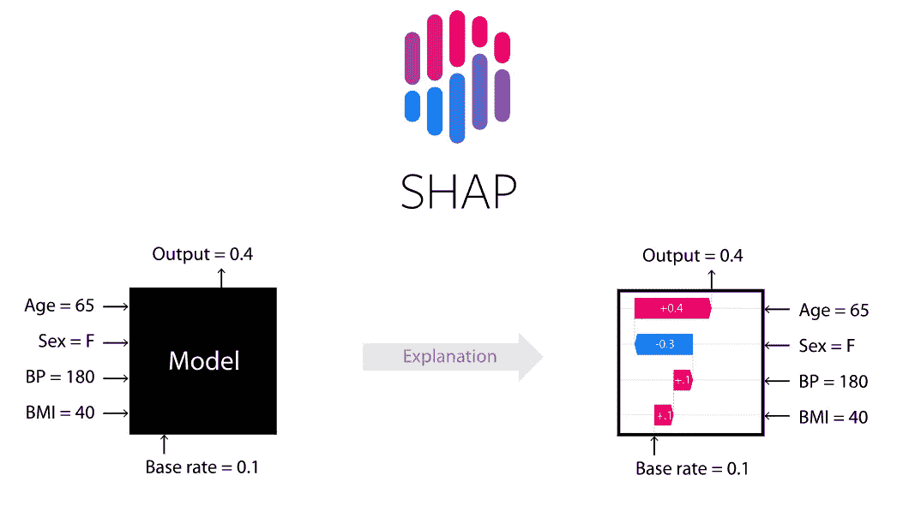
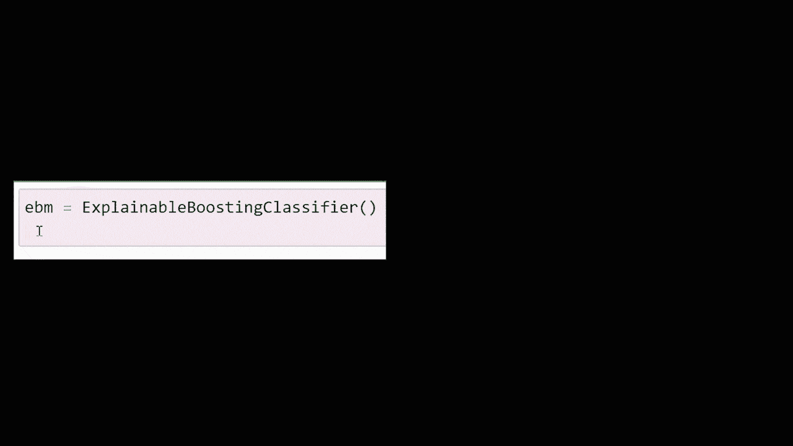

# 你应该知道的基本的可解释的人工智能 Python 框架

> 原文：<https://towardsdatascience.com/essential-explainable-ai-python-frameworks-that-you-should-know-about-84d5063b75e9>

## 实践中应用可解释人工智能的 9 大 Python 框架

图片来源: [Unsplash](https://unsplash.com/photos/zwd435-ewb4)

[**可解释的人工智能**](https://amzn.to/3cY4c2h) 是确保 AI 和 ML 解决方案透明、可信、负责和符合道德的最有效实践，以便有效地解决所有关于算法透明度、风险缓解和后备计划的监管要求。AI 和 ML 可解释性技术为这些算法在其解决方案生命周期的每个阶段如何运行提供了必要的可见性，允许最终用户理解*为什么*和*查询如何与 AI 和 ML 模型的结果相关。在本文中，我们将介绍成为应用 XAI 专家需要学习的九大 XAI python 框架。*

# 什么是可解释的人工智能(XAI)？

> [*【可解释的人工智能(XAI)*](https://amzn.to/3cY4c2h) *是解释复杂“黑箱”人工智能模型的功能的方法，这些模型证明了这些模型产生的预测背后的原因。*

如果你想要一个 45 分钟的简短视频来简要介绍 XAI，那么你可以观看我在 2021 年 APAC 举行的**人工智能加速器节上发表的关于 XAI 的演讲:**

可解释的人工智能:使 ML 和 DL 模型更易解释(作者谈)

你也可以浏览我的书 [**应用机器学习可解释技术**](https://amzn.to/3cY4c2h) 并看看[代码库](https://github.com/PacktPublishing/Applied-Machine-Learning-Explainability-Techniques/)来获得这些 XAI 方法的实践经验。在本文中，我将参考我的书 [**应用机器学习可解释技术**](https://amzn.to/3cY4c2h) **中讨论的一些 XAI 框架。**

<https://www.amazon.com/Applied-Machine-Learning-Explainability-Techniques/dp/1803246154?_encoding=UTF8&pd_rd_w=Wr6SJ&content-id=amzn1.sym.716a1ed9-074f-4780-9325-0019fece3c64&pf_rd_p=716a1ed9-074f-4780-9325-0019fece3c64&pf_rd_r=6P2PM599T97MRG7NZD9J&pd_rd_wg=m4qUW&pd_rd_r=6e349d93-5ba0-4bfe-9055-905c0153fe58&linkCode=li3&tag=adib0073-20&linkId=35506e1847de5c011fc57aa66c2b1d8e&language=en_US&ref_=as_li_ss_il>  

如果你想要这本书的详细反馈，下面的视频可能对你有用:

现在，让我提供我对 9 大 XAI python 框架的建议:

# **1。本地可解释的模型不可知的解释** ( **石灰**)

LIME 是一种新颖的、模型不可知的局部解释技术，用于通过学习预测周围的局部模型来解释黑盒模型。LIME 提供了对模型的直观的全局理解，这对于非专家用户也是有帮助的。这项技术最早是在研究论文*“我为什么要相信你？”解释任何分类器*的预测*里贝罗等人*。(https://arxiv . org/ABS/1602.04938)。该算法通过使用近似的局部可解释模型，以忠实的方式很好地解释了任何分类器或回归器。它为任何黑箱模型提供了建立信任的全局视角；因此，它允许您在人类可解释的表示上识别可解释的模型，这在局部上忠实于算法。因此，它主要通过*学习可解释数据表示*、*在保真度-可解释度权衡中保持平衡*和*搜索局部探索*来发挥作用。

**GitHub**:[https://github.com/marcotcr/lime](https://github.com/marcotcr/lime)

**安装** : `pip 安装石灰'

# 2.**沙普利添加剂解说** ( **SHAP** )

2017 年*，Scott Lundberg* 和 *Su-In Lee* 首先从他们的论文*中介绍了 SHAP 框架，一种解释模型预测的统一方法*([https://arxiv.org/abs/1705.07874](https://arxiv.org/abs/1705.07874))。这个框架背后的基本思想是基于合作博弈理论中的 Shapley 值的概念。SHAP 算法考虑*附加特征重要性*来解释底层模型特征的集体贡献。数学上，Shapley 值被定义为*在特征空间*中所有可能的值范围内单个特征值的平均边际贡献。但是对沙普利值的数学理解是相当复杂的，但是在罗伊德·S·沙普利的研究论文《n 人游戏的数值》中有很好的解释对博弈论的贡献 2.28 (1953) 。

**GitHub**:【https://github.com/slundberg/shap】T42

**安装** : `pip 安装形状'

图片来源: [GitHub](https://github.com/slundberg/shap)

# **3。用概念激活向量(TCAV)进行测试**

**TCAV** 是来自谷歌人工智能的模型可解释性框架，它在实践中实现了基于概念的解释方法的思想。该算法依赖于**概念激活向量(CAV)** ，它使用人类友好的概念提供对 ML 模型内部状态的解释。从更专业的角度来说，TCAV 使用方向导数来量化对人类友好的高级概念对模型预测的重要性。例如，在描述发型时，TCAV 可以使用诸如*卷发*、*直发*或*发色*等概念。这些用户定义的概念不是算法在训练过程中使用的数据集的输入要素。

**GitHub**:[https://github.com/tensorflow/tcav](https://github.com/tensorflow/tcav)

**安装** : `pip 安装 tcav '

TCAV 帮助我们通过神经网络解决了用户定义的图像分类概念重要性的关键问题

# **4。用于探索和解释的模型不可知语言(DALEX)**

DALEX ( **探索和解释的模型不可知语言**)是极少数被广泛使用的 XAI 框架之一，它试图解决可解释性的大部分维度。DALEX 是模型不可知的，可以提供一些关于底层数据集的元数据，为解释提供一些上下文。这个框架为您提供了对模型性能和模型公平性的洞察，并且它还提供了全局和局部模型的可解释性。

DALEX 框架的开发人员希望遵守以下要求列表，他们定义这些要求是为了解释复杂的黑盒算法:

*   **预测的理由**:DALEX 的开发者认为，ML 模型用户应该能够理解最终预测的变量或特征属性。
*   **预测的推测**:假设假设情景或了解数据集的特定特征对模型结果的敏感性是 DALEX 开发人员考虑的其他因素。
*   **预测的验证**:对于一个模型的每一个预测结果，用户应该能够验证证实该模型特定预测的证据的强度。

**GitHub**:[https://github.com/ModelOriented/DALEX](https://github.com/ModelOriented/DALEX)

**安装** : `pip 安装 dalex -U '

DALEX 可解释性金字塔(来源: [GitHub DALEX 项目](https://github.com/ModelOriented/DALEX/blob/master/LICENSE)

# 5.解释器仪表板

该框架允许定制仪表板，但我认为默认版本包括了模型可解释性的所有支持方面。生成的基于 web 应用程序的仪表板可以直接从实时仪表板导出为静态网页。否则，仪表板可以通过自动化的**持续集成** ( **CI** )/ **持续部署** ( **CD** )部署过程以编程方式部署为 web app。我建议你浏览一下这个框架的官方文档([https://explainerdashboard.readthedocs.io/en/latest/](https://explainerdashboard.readthedocs.io/en/latest/))。

**GitHub**:[https://github.com/oegedijk/explainerdashboard](https://github.com/oegedijk/explainerdashboard)

**安装** : `pip 安装说明仪表板'

来源— [讲解 dashboard GitHub 项目](https://github.com/oegedijk/explainerdashboard/blob/master/LICENSE.txt)

# 6.解释性语言

interpret ml(https://interpret.ml/)是微软的 XAI 工具包。它旨在为 ML 模型的调试、结果解释和监管审计提供对 ML 模型的全面理解。有了这个 Python 模块，我们可以训练*可解释的玻璃盒子模型*或者*解释黑盒模型*。

微软研究院开发了另一种叫做**可解释 Boosting Machine**(**EBM**)的算法，将 Boosting、bagging、自动交互检测等现代 ML 技术引入到**广义可加模型** ( **GAMs** )等经典算法中。研究人员还发现，EBM 作为随机森林和梯度增强树是准确的，但与这种黑盒模型不同，EBM 是可解释的和透明的。因此，EBM 是内置于 InterpretML 框架中的玻璃盒子模型。

**GitHub**:[https://github.com/interpretml/interpret](https://github.com/interpretml/interpret)

**安装** : `pip 安装解释'

来源— [InterpretML GitHub 项目](https://github.com/interpretml/interpret/blob/develop/LICENSE)

# **7。不在场证明**

[Alibi](https://docs.seldon.io/projects/alibi) 是另一个开源的 Python 库，旨在机器学习模型检验和解释。该库的重点是为分类和回归模型提供黑盒、白盒、局部和全局解释方法的高质量实现。

**GitHub**:【https://github.com/SeldonIO/alibi】T4

**安装** : `pip 安装 alibi '

来源: [ALIBI GitHub 项目](https://github.com/SeldonIO/alibi/blob/master/LICENSE)

# 8.不同的反事实解释(DiCE)

**多样的反事实解释** ( **骰子**)是另一个流行的 XAI 框架，特别是对于反事实解释。有趣的是，DiCE 也是微软研究院的关键 XAI 框架之一，但是它还没有与 InterpretML 模块集成(我想知道为什么！).我发现反事实解释的整个想法非常接近于给出可操作建议的理想的人性化解释。这篇来自微软的博客讨论了 DiCE 框架背后的动机和想法:[https://www . Microsoft . com/en-us/research/blog/open-source-library-provide-explain-for-machine-learning-through-diversity-counter factuals/](https://www.microsoft.com/en-us/research/blog/open-source-library-provides-explanation-for-machine-learning-through-diverse-counterfactuals/)。与 ALIBI CFE 相比，我发现 DiCE 能够以最小的超参数调整产生更合适的 CFE。这就是为什么我觉得提到骰子很重要，因为它主要是为基于示例的解释而设计的。

**GitHub**:[https://github.com/interpretml/DiCE](https://github.com/interpretml/DiCE)

**安装** : `pip 安装骰子-ml '

来源: [DiCE GitHub 项目](https://github.com/interpretml/DiCE/blob/main/LICENSE)

# 9.像我五岁一样解释(ELI5)

*ELI5* ，或 *Explain Like I'm Five* ，是一个用于调试、检查和解释 ML 分类器的 Python XAI 库。它是最初开发的 XAI 框架之一，以最简化的格式解释黑盒模型。它支持广泛的 ML 建模框架，如 scikit-learn 兼容模型、Keras 等。它还集成了 LIME 解释器，可以处理表格数据集以及文本和图像等非结构化数据。https://eli5.readthedocs.io/en/latest/的[提供了库文档，https://github.com/eli5-org/eli5](https://eli5.readthedocs.io/en/latest/)[的](https://github.com/eli5-org/eli5)提供了 GitHub 项目。

**GitHub**:[https://github.com/TeamHG-Memex/eli5](https://github.com/TeamHG-Memex/eli5)

**安装** : `pip 安装 eli5 '

来源: [ELI5 GitHub 项目](https://github.com/TeamHG-Memex/eli5/blob/master/LICENSE.txt)

# 摘要

本文中介绍的框架是我在模型可解释性方面的首选库。然而，我不建议盲目地应用这些框架，因为你需要对问题和目标受众有一个透彻的理解，以便对人工智能模型进行适当的解释。我推荐阅读这本书:**[**应用机器学习可解释技术**](https://amzn.to/3cY4c2h)**并探索 [GitHub 库](https://github.com/PacktPublishing/Applied-Machine-Learning-Explainability-Techniques)以获得实际操作的代码示例。****

# ****作者关于 TDS 的其他 XAI 相关文章:****

1.  ****[对基于文本数据训练的模型的可解释机器学习:将 SHAP 与变压器模型相结合](/explainable-machine-learning-for-models-trained-on-text-data-combining-shap-with-transformer-5095ea7f3a8)****
2.  ****[EUCA——一个有效的 XAI 框架，让人工智能更贴近终端用户](/euca-an-effective-xai-framework-to-bring-artificial-intelligence-closer-to-end-users-74bb0136ffb1)****
3.  ****[理解可解释人工智能中使用的 SHAP 和沙普利值的工作原理](/understand-the-working-of-shap-based-on-shapley-values-used-in-xai-in-the-most-simple-way-d61e4947aa4e)****
4.  ****[如何用石灰解释图像分类器](/how-to-explain-image-classifiers-using-lime-e364097335b4)****

****<https://www.amazon.com/Applied-Machine-Learning-Explainability-Techniques/dp/1803246154?_encoding=UTF8&pd_rd_w=Wr6SJ&content-id=amzn1.sym.716a1ed9-074f-4780-9325-0019fece3c64&pf_rd_p=716a1ed9-074f-4780-9325-0019fece3c64&pf_rd_r=6P2PM599T97MRG7NZD9J&pd_rd_wg=m4qUW&pd_rd_r=6e349d93-5ba0-4bfe-9055-905c0153fe58&linkCode=li3&tag=adib0073-20&linkId=35506e1847de5c011fc57aa66c2b1d8e&language=en_US&ref_=as_li_ss_il>  

# 参考

1.  [应用机器学习解释技术](https://amzn.to/3cY4c2h)
2.  GitHub repo 自《应用机器学习可解释技术》——[https://GitHub . com/packt publishing/Applied-Machine-Learning-explability-Techniques/](https://github.com/PacktPublishing/Applied-Machine-Learning-Explainability-Techniques/)****