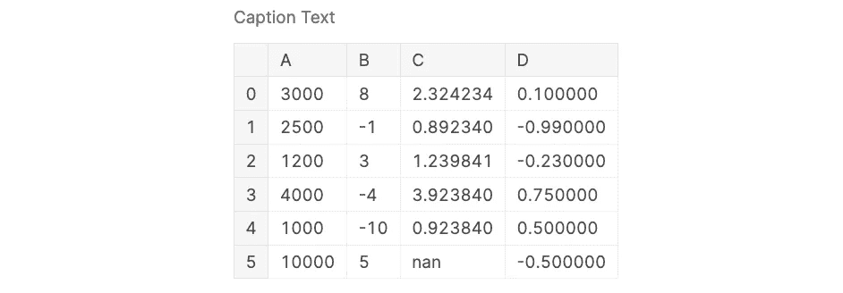
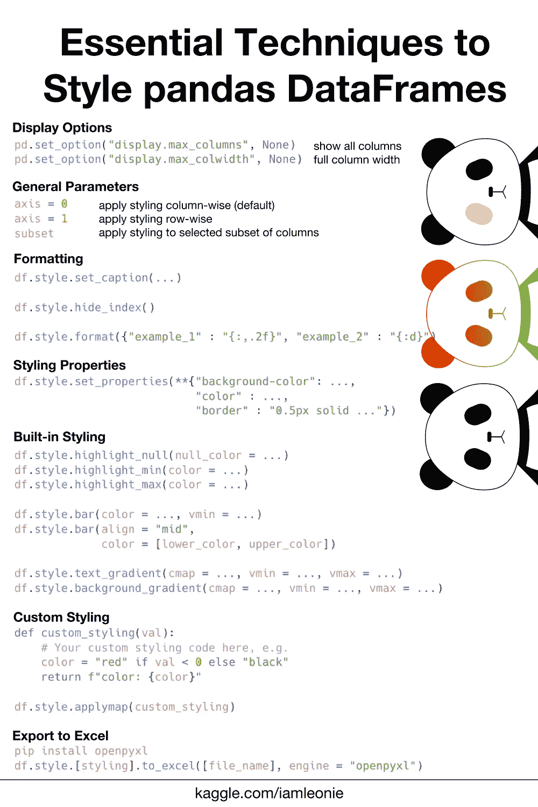

# 设计熊猫数据框的基本技巧

> 原文：<https://towardsdatascience.com/essential-techniques-to-style-pandas-dataframes-8796c74c9ff3>

## 如何有效地用表格(包括备忘单)交流数据


*造型熊猫(作者图片)*

在数据分析的最后，你需要决定如何传达你的发现。**当你需要你的听众查找单个的精确值并将它们与其他值进行比较时，表格比图表**更适合于交流数据。然而，表格包含了大量的信息，你的听众通过阅读来处理这些信息，这使得你的听众很难马上理解你的信息。表格的随意设计，如太多的颜色、粗体边框或太多的信息，会额外分散你的观众的注意力。但是，有目的地使用格式和样式可以将观众的注意力引导到表格中最重要的数字上。

> 有目的地使用格式和样式可以引导你的观众注意到表格中最重要的数字。

pandas 库中的数据帧非常适合在 Python 中将数据可视化为表格。此外，pandas 库提供了通过`style`属性格式化和样式化数据帧的方法。因此，本文讨论了对 pandas 数据帧进行格式化和样式化的基本技术，以便有效地传递数据。

如果您想尝试本文中描述的技术，您可以从我的相关 [Kaggle 笔记本](https://www.kaggle.com/code/iamleonie/essential-techniques-to-style-pandas-dataframes)下载或派生本文的代码，包括示例数据集。

在本教程中，我们将使用以下小型虚构数据集:


虚构样本数据集的无样式熊猫数据框架(图片作者来自 [Kaggle](https://www.kaggle.com/code/iamleonie/essential-techniques-to-style-pandas-dataframes)

# 全局显示选项

在开始为单个数据帧定制可视化之前，您可以使用`.set_option()`方法[1]调整 pandas 的全局显示行为。您可以处理的两个常见任务是:

*   显示数据帧的所有列
*   调整 DataFrame 列的宽度。

当你的数据帧有太多的列时，pandas 不会显示所有的列，而是隐藏中间的列。要强制 pandas**显示所有列**，您可以设置:

```
pd.set_option("display.max_columns", None)
```

当您处理长文本时，pandas 会截断列中的文本。要通过增加列宽来强制 pandas**显示整列内容，您可以设置:**

```
pd.set_option("display.max_colwidth", None)
```

# 一般提示

DataFrame 的`style`属性返回一个类`Styler`的对象。该类包含各种格式和样式方法。以下提示适用于`Styler`对象的所有方法。

# 多种风格

通过将多个方法链接在一起，可以组合多种样式。

例如`df.style.set_caption(...).format(...).bar(...).set_properties(...)`

# 列方式与行方式的样式

默认情况下，样式是按列应用的(`axis = 0`)。

```
df.style.highlight_max() # default is axis = 0
```


用“轴= 0”突出显示列方向的最大值(图片由作者从 [Kaggle](https://www.kaggle.com/code/iamleonie/essential-techniques-to-style-pandas-dataframes) 获得)

如果您想按行应用样式，请在属性中使用`axis = 1`。

```
df.style.highlight_max(axis = 1))
```


用“轴= 1”高亮显示行方向的最大值(图片由作者从 [Kaggle](https://www.kaggle.com/code/iamleonie/essential-techniques-to-style-pandas-dataframes) 获得)

# 仅设计子集的样式

默认情况下，样式方法应用于所有列。

```
df.style.background_gradient()
```


应用于所有列的背景渐变(图片由作者从 [Kaggle](https://www.kaggle.com/code/iamleonie/essential-techniques-to-style-pandas-dataframes) 获得)

如果您想将样式仅应用于一列或一组选定的列，使用`subset`参数。

```
df.style.background_gradient(subset = ["A", "D"]))
```


应用于 A 列和 D 列的背景渐变(图片由作者从 [Kaggle](https://www.kaggle.com/code/iamleonie/essential-techniques-to-style-pandas-dataframes) 获得)

# 格式化

在我们开始任何特定的着色之前，让我们先来看看一些基本的格式化技术，让你的数据帧看起来更加完美。

# 标题

向表格添加标题对于向受众提供一些背景信息至关重要。您可以使用`.set_caption()`方法向数据帧添加标题。

```
df.style.set_caption("Caption Text")
```



数据框上方添加的标题(图片由作者从 [Kaggle](https://www.kaggle.com/code/iamleonie/essential-techniques-to-style-pandas-dataframes) 获得)

# 重命名列

如果列名是变量名或缩写，您的读者可能不清楚他们正在查看什么数据。为列提供直观的列名，可以支持您的受众对数据的理解。

重命名列有两个选项:

*   一次重命名所有列
*   仅重命名列的子集

如果您稍后需要使用数据帧，创建数据帧的副本仅用于可视化目的可能是有意义的。

```
# Create a copy of the DataFrame for visualization purposes
df_viz = df.copy()
```

您可以通过更改`columns`属性来一次重命名所有列:

```
# Rename all columns
df_viz.columns = ["New Column Name A", 
                  "New Column Name B", 
                  "New Column Name C", 
                  "New Column Name D"]
```


重命名 DataFrame 的所有列(图片作者来自 [Kaggle](https://www.kaggle.com/code/iamleonie/essential-techniques-to-style-pandas-dataframes) )

或者您可以使用 `.rename()`方法和一个字典**只重命名列的子集。**

```
# Rename selection of columns
df_viz.rename(columns = {"A" : "New Column Name A", 
                         "B" : "New Column Name B"}, 
              inplace = True)
```


仅重命名列的子集(图片由来自 [Kaggle](https://www.kaggle.com/code/iamleonie/essential-techniques-to-style-pandas-dataframes) 的作者提供)

# 隐藏索引

索引是否添加了任何有价值的信息？如果没有，你可以用`.hide_index()`的方法隐藏索引。

```
df.style.hide_index()
```


隐藏索引(图片作者来自 [Kaggle](https://www.kaggle.com/code/iamleonie/essential-techniques-to-style-pandas-dataframes)

# 格式化列

**添加千位分隔符或截断浮点数**到更少的小数位数可以增加数据帧的可读性。为此，`Styler`对象可以区分显示值和实际值。

通过使用`.format()`方法，您可以根据格式规范字符串[3]操作显示值。您甚至可以在数字之前或之后添加一个单位作为格式的一部分。

```
df.style.format({"A" : "{:,.0f}",
                 "B" : "{:d} $",
                 "C" : "{:.3f}",
                 "D" : "{:.2f}"})
```


使用千位分隔符和自定义浮点数格式化的列(图片来自作者来自 [Kaggle](https://www.kaggle.com/code/iamleonie/essential-techniques-to-style-pandas-dataframes)

然而，为了不引起注意，**我建议在列名**中将单位放在方括号中，例如“薪金[$]”。

# 样式属性

有时，你想做的可能只是通过调整背景和字体颜色来让**突出显示数据框中的一列**。为此，您可以使用`.set_properties()`方法调整 DataFrame 的相关 CSS 属性，如颜色、字体、边框等。

```
df.style.set_properties(subset = ["C"],
                        **{"background-color": "lightblue",  
                           "color" : "white",
                           "border" : "0.5px solid white"})
```


突出显示的栏(图片由作者从 [Kaggle](https://www.kaggle.com/code/iamleonie/essential-techniques-to-style-pandas-dataframes) 获得)

# 内置样式

`Style`类有一些用于常见样式任务的内置方法。

# 突出

突出显示单个单元格是一种简单的方法，可以将观众的注意力引导到您想要展示的内容上。您可能想要突出显示的常见值有最小值、最大值和空值。对于这些情况，您可以使用各自的内置方法。

您可以使用参数`color`调整高亮颜色，以进行最小和最大高亮显示，使用参数`nullcolor`调整零高亮显示。

```
df.style.highlight_null(null_color = "yellow")
```


突出显示的空值(图片来自作者来自 [Kaggle](https://www.kaggle.com/code/iamleonie/essential-techniques-to-style-pandas-dataframes)

如果您想要突出显示最小值和最大值，可以通过将两个函数链接在一起来实现。

```
df.style.highlight_min(color = "red")\
        .highlight_max(color = "green")
```


突出显示的最小值和最大值(图片由作者从 [Kaggle](https://www.kaggle.com/code/iamleonie/essential-techniques-to-style-pandas-dataframes) 获得)

# 梯度

添加渐变样式可以帮助读者理解表格、单列或单行中的数值之间的关系。例如，渐变可以指示一个值是大还是小，是正还是负，甚至是好还是坏。

还有两种技术可以向数据帧添加渐变:

1.  您可以将渐变样式应用于文本或
2.  您可以将渐变样式应用于背景[2]。

使用`cmap`参数、`vmin`和`vmax`可以设置渐变的属性。`cmap`设置使用的颜色图，`vmin`和`vmax`设置相关的开始和结束值。

您可以使用`.text_gradient()`方法对文本应用渐变:

```
df.style.text_gradient(subset = ["D"], 
                       cmap = "RdYlGn", 
                       vmin = -1, 
                       vmax = 1)
```


渐变样式应用于 D 列的文本(图片由作者从 [Kaggle](https://www.kaggle.com/code/iamleonie/essential-techniques-to-style-pandas-dataframes) 获得)

或者您可以使用`.background_gradient()`方法将渐变应用于背景:

```
df.style.background_gradient(subset = ["D"], 
                             cmap = "RdYlGn", 
                             vmin = -1, 
                             vmax = 1)
```


应用于 D 列背景的渐变样式(图片来自 [Kaggle](https://www.kaggle.com/code/iamleonie/essential-techniques-to-style-pandas-dataframes) )

# 酒吧

另一种可视化列或行中的关系和顺序的方法是在单元格的背景中绘制线条[2]。

同样，在数据帧中使用条形有两个基本技巧:

1.  直接的应用是使用标准的单色条。
2.  或者你也可以从中点创建双色条形图。

对于标准条形图，简单使用`.bar()`方法如下:

```
df.style.bar(subset = ["A"], 
             color = "lightblue", 
             vmin = 0)
```


添加到 A 列背景的条(图片由作者从 [Kaggle](https://www.kaggle.com/code/iamleonie/essential-techniques-to-style-pandas-dataframes) 获得)

要创建双色条形图，将校准设置为`mid`并定义上下限值的颜色。在使用这种方法时，我建议结合一些边框来增加可读性。

```
df.style.bar(subset = ["D"], 
             align = "mid", 
             color = ["salmon", "lightgreen"])\
        .set_properties(**{'border': '0.5px solid black'})
```


添加到 D 列背景的正值和负值条(图片由作者从 [Kaggle](https://www.kaggle.com/code/iamleonie/essential-techniques-to-style-pandas-dataframes) 获得)

# 自定义样式

如果内置的样式方法不足以满足您的需求，您可以编写自己的样式函数，并将其应用于 DataFrame。您可以使用`.applymap()`方法应用元素样式，或者使用`.apply()`方法[2]应用列或行样式。

一个常见的例子是**用红色显示数据帧的负值**，如下所示:

```
def custom_styling(val):
    color = "red" if val < 0 else "black"
    return f"color: {color}"df.style.applymap(custom_styling)
```


用红色突出显示负值(图片由来自 [Kaggle](https://www.kaggle.com/code/iamleonie/essential-techniques-to-style-pandas-dataframes) 的作者提供)

# 导出到 Excel

如果您需要 Excel 格式的样式化数据帧，您可以**将其导出，包括样式化和格式化**到。xlsx 文件[3]。为此，您需要安装 openpyxl 包。

```
pip install openpyxl
```

要导出数据帧，您可以像往常一样对数据帧应用样式和格式，然后使用`.to_excel()`方法。

```
df.style.background_gradient(subset = ["D"], 
                             cmap = "RdYlGn", 
                             vmin = -1, 
                             vmax = 1)\
        .to_excel("styled.xlsx", engine = "openpyxl")
```

# 结论

pandas 数据框架的`style`属性使您能够格式化和设计数据框架，以有效地传达您的数据分析的见解。本文讨论了设置 pandas 数据帧样式的基本技术，包括如何设置全局显示选项、格式化和定制样式，甚至如何将数据帧导出为 Excel 格式。在 pandas 文档中有更多的样式和格式选项。

为了进行进一步的实验，您可以从我的相关 [Kaggle 笔记本](https://www.kaggle.com/code/iamleonie/essential-techniques-to-style-pandas-dataframes)中下载或派生本文的代码，包括示例数据集。

以下是我在备忘单中总结的所有提示:



熊猫数据框架的基本格式和样式技术备忘单(图片由作者提供)。

# 喜欢这个故事吗？

要阅读更多来自我和其他作家的故事，请在 Medium 上注册。报名时可以用我的 [*推荐链接*](https://medium.com/@iamleonie/membership) *支持我。我将收取佣金，不需要你额外付费。*

<https://medium.com/@iamleonie/membership>  

*在* [*LinkedIn*](https://www.linkedin.com/in/804250ab/) *和* [*上找我 Kaggle*](https://www.kaggle.com/iamleonie) *！*

# 参考

[1]“熊猫 1.4.2 文档”，“选项和设置。”pandas.pydata.org。[https://pandas.pydata.org/docs/user_guide/options.html](https://pandas.pydata.org/docs/user_guide/options.html)(2022 年 6 月 13 日访问)

[2]《熊猫 1.4.2 文档》，《样式》pandas.pydata.org。[https://pandas.pydata.org/docs/reference/style.html](https://pandas.pydata.org/docs/reference/style.html)(2022 年 6 月 16 日访问)

[3]“熊猫 1.4.2 文档化”，“表格可视化。”pandas.pydata.org。[https://pandas.pydata.org/docs/user_guide/style.html](https://pandas.pydata.org/docs/user_guide/style.html)(2022 年 6 月 16 日访问)

[4]“Python”，“string——常见的字符串操作。”python.org。https://docs.python.org/3/library/string.html#formatspec(2022 年 6 月 13 日访问)