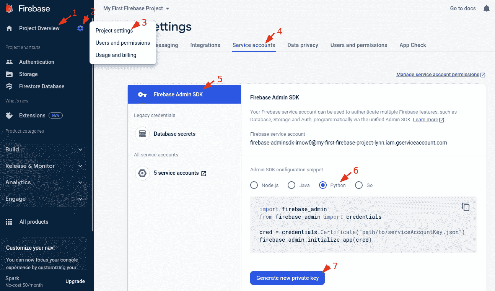
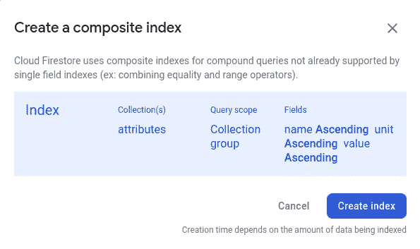

# Python 中 Firestore 的使用要点

> 原文：<https://towardsdatascience.com/essentials-for-working-with-firestore-in-python-372f859851f7>

## 学习用 Python 管理 Firebase 应用程序数据


[图片由 Pixabay 的 kreatikar 拍摄](https://pixabay.com/illustrations/developer-programmer-technology-3461405/)

Firestore 由 Firebase 和 Google Cloud 提供，是一个流行的 NoSQL 移动和网络应用云数据库。像 MongoDB 一样，Firestores 将数据存储在包含映射到值的字段的文档中。文档被组织成与关系数据库中的表相对应的集合。

为了使用 Python 管理 Firestore 数据，我们需要使用 Firebase Admin SDK，它是一组库，允许您从特权环境中与 Firebase 进行交互。在这篇文章中，我们将通过一些简单的例子介绍如何使用 Admin SDK 管理 Firestore 中的数据，这些例子涵盖了常见的 CRUD 操作。

## 创建一个 Firebase 项目

在 Python 中使用 Firestore 之前，我们需要有一个活动的 Firebase 项目。如果还没有，你可能想先看看[这篇文章](https://medium.com/codex/learn-the-basics-and-get-started-with-firebase-an-app-development-platform-backed-by-google-6c27b3be1004)，以便快速上手 Firebase。

## 安装 Firebase Admin SDK

为了在 Python 中使用 Firestore，我们需要首先安装 [Firebase Admin SDK](https://github.com/firebase/firebase-admin-python) ，它可以安装在您的[虚拟环境](https://lynn-kwong.medium.com/how-to-create-virtual-environments-with-venv-and-conda-in-python-31814c0a8ec2)中。您可以选择自己喜欢的工具来创建/管理虚拟环境。[这里使用 Conda](https://lynn-kwong.medium.com/how-to-create-virtual-environments-with-venv-and-conda-in-python-31814c0a8ec2) 是因为我们可以在虚拟环境中安装特定版本的 Python，如果您的系统的 Python 版本很旧，而您不愿意或无法升级它，这将非常方便。

```
# You need to specify a channel if you need to install the latest version of Python.
$ conda create --name firebase python=3.11 -c conda-forge
$ conda activate firebase

$ pip install --upgrade firebase-admin ipython
```

[安装 iPython](https://pypi.org/project/ipython/) 是为了更方便的交互运行 Python 代码。

## 在 GCP 初始化 Firebase Admin SDK

如果您的 Python 代码运行在 Google Cloud 环境中，如 Compute Engine、App Engine、Cloud functions 等，您可以在没有参数的情况下初始化 Firebase，因为凭证查找是自动完成的:

```
import firebase_admin
from firebase_admin import firestore

app = firebase_admin.initialize_app()
firestore_client = firestore.client()
```

## 在非 GCP 环境中初始化 Firebase Admin SDK

如果您的 Python 代码在非 GCP 环境中运行，您将需要使用您的 Firebase 服务帐户的私钥文件来验证 Firebase。创建 Firebase 项目时，会自动创建此服务帐户。

要为您的服务帐户生成私钥文件，请转到 [Firebase 控制台](https://console.firebase.google.com/)，并遵循以下说明:



作者图片

一旦生成了私钥文件，就可以用它来验证 Firebase。您可以将它与应用程序默认凭证(ADC)一起使用，这意味着将环境变量`GOOGLE_APPLICATION_CREDENTIALS`设置为包含您的服务帐户私钥的 JSON 文件的路径。这样，应用程序默认凭据(ADC)就能够隐式地确定 Firebase 凭据。这种方式更安全，在适用的情况下推荐使用。

```
$ export GOOGLE_APPLICATION_CREDENTIALS="/home/lynn/Downloads/service-account-file.json"
```

然后，您可以按如下方式初始化 Firebase SDK:

```
import firebase_admin
from firebase_admin import credentials
from firebase_admin import firestore

# Use the application default credentials.
cred = credentials.ApplicationDefault()
firebase_admin.initialize_app(cred)
firestore_client = firestore.client()
```

然而，如果您有多个 Firebase 项目或者您的 Firebase 项目不属于您的默认 Google Cloud 项目，那么设置`GOOGLE_APPLICATION_CREDENTIALS`环境变量是不适用的。在这些情况下，我们需要直接使用私钥文件进行身份验证:

```
import firebase_admin
from firebase_admin import credentials
from firebase_admin import firestore

# Use the private key file of the service account directly.
cred = credentials.Certificate("/home/lynn/Downloads/service-account-file.json")
app = firebase_admin.initialize_app(cred)
firestore_client = firestore.client()
```

您可以用上面演示的三种方法中的任何一种来初始化 Firebase Admin SDK。如果您在本地使用笔记本电脑工作，那么第三款最有可能适合您。

既然 Firebase Admin SDK 已经过验证和初始化，我们就可以开始用它创建集合和文档了。我们将用简单的代码片段介绍常见的 **C** reate、 **R** ead、 **U** pdate 和**D**delete(CRUD)操作。

## 创建文档

与 [MongoDB](https://lynn-kwong.medium.com/learn-the-essentials-and-get-started-with-mongodb-8380026642d5) 类似，Cloud Firestore 是无模式的，具有动态映射。第一次向文档添加数据时，它会隐式创建集合和文档。因此，我们不需要显式地创建集合或文档并指定映射(即字段的类型定义)。我们可以直接创建一个文档并将数据分配给它:

```
doc_ref = firestore_client.collection("laptops").document("1")
doc_ref.set(
    {
        "name": "HP EliteBook Model 1",
        "brand": "HP",
    }
)
```

请注意，文档 id(“1”)必须是唯一的，并且必须是一个字符串。

引用是指向 Firestore 数据库中目标集合或文档的位置的对象。创建对目标集合或文档的引用时，它不需要存在。一旦创建了引用，我们就可以添加数据。Firestore 中的所有 CRUD 操作都是通过引用实现的，我们将在后面看到。

运行该代码片段后，将创建集合和文档，这可以在 Firebase 控制台中查看:


作者图片

因为 Firestore 中的文档是无模式的，这意味着文档没有预定义的字段，所以我们可以在每个文档中有不同的字段。现在让我们添加一个新的笔记本文档，其中包含一些额外的字段:

```
doc_ref = firestore_client.collection("laptops").document("2")
doc_ref.set(
    {
        "name": "Lenovo IdeaPad Model 2",
        "brand": "Lenovo",
        "tags": ["Popular", "Latest"],
        "order": {"price": 9405.0, "quantity": 2},
    }
)
```

对于第二个文档，添加了两个新字段，即数组字段和映射字段，映射字段是嵌套对象(或者 Python 中的字典)。这是它们在 Firebase 控制台中的显示方式:


作者图片

在上面的例子中，我们指定了文档 id，这是唯一的字符串。但是，如果文档没有包含唯一值的字段，我们可以省略文档 ID，让 Firestore 使用`add()`方法为我们分配一个自动生成的 ID:

```
coll_ref = firestore_client.collection("laptops")
create_time, doc_ref = coll_ref.add(
    {
        "name": "Apple macbook air",
        "brand": "Apple",
    }
)

print(f"{doc_ref.id} is created at {create_time}")
# CnidNv3f6ZQD9K7MnLyy is created at 2022-11-13 09:55:23.989902+00:00
```


作者图片

## 创建带有子集合的文档

子集合是与特定文档相关联的集合。在本例中，我们将创建一个包含笔记本电脑属性的子集合。

```
laptop_ref = firestore_client.collection("laptops").document("4")
laptop_ref.set(
    {
        "name": "Apple Macbook Pro",
        "brand": "Apple",
    }
)

# Specify the subcollection for a laptop document.
attr_coll = laptop_ref.collection("attributes")

# Add documents to the subcollection.
attr_ref = attr_coll.document("storage")
attr_ref.set({"name": "Storage", "value": "1", "unit": "TB"})

# We don't need to create the doc ref beforehand if the metadata is not needed.
attr_coll.document("ram").set({"name": "ram", "value": "16", "unit": "GB"})
```

请注意子集合在 Firebase 控制台中的显示方式:


作者图片

使用子集合有许多限制。一个主要的，对我来说似乎是[错误的](https://firebase.google.com/docs/firestore/data-model#subcollections)是，当父文档被删除时，子集合没有被删除。然而，这可能不是使用子集合的好例子。一个更好的例子是官方文档中给出的[聊天室示例](https://firebase.google.com/docs/firestore/data-model#subcollections)，其中每个子集合中的消息都是独立且等价的实体，当父文档被删除时，保留这些消息更有意义。

在这个简单的示例中，attributes 子集合可以由一组映射替换:

```
laptop_ref = firestore_client.collection("laptops").document("5")
laptop_ref.set(
    {
        "name": "Apple Macbook Pro",
        "brand": "Apple",
        "attributes": [
            {"name": "Storage", "value": "1", "unit": "TB"},
            {"name": "ram", "value": "16", "unit": "GB"},
        ],
    }
)
```

Firestore 就像前端开发人员的傻瓜相机，如果你需要嵌套文档的更多高级功能，你可能想尝试更多专用的服务器端数据库，如 [MongoDB](https://levelup.gitconnected.com/learn-advanced-mongodb-queries-for-nested-documents-using-elemmatch-from-practical-examples-ec432efc2c0f) 或 [Elasticsearch](https://lynn-kwong.medium.com/learn-advanced-crud-and-search-queries-for-nested-objects-in-elasticsearch-from-practical-examples-7aebc1408d6f) 。

## 阅读文档

现在我们已经插入了一些文档，我们可以尝试用不同的方式阅读它们。

首先，让我们通过 ID 读取单个文档。

```
doc_ref = firestore_client.collection('laptops').document("1")

# We can read the id directly:
print(f"The document id is {doc_ref.id}")
# The document id is 1

# We need to use .get() to get a snapshot of the document:
doc = doc_ref.get()
print(f"The document is {doc.to_dict()}")
# The document is {'brand': 'HP', 'name': 'HP EliteBook Model 1'}
```

注意，我们需要调用文档引用的`.get()`方法来获取文档数据的快照。

现在，让我们阅读集合中的所有文档:

```
coll_ref = firestore_client.collection('laptops')

# Using coll_ref.stream() is more efficient than coll_ref.get()
docs = coll_ref.stream()
for doc in docs:
    print(f'{doc.id} => {doc.to_dict()}')
```

注意，`coll_ref.stream()`返回的是`DocumentSnapshot`的[生成器](/demystify-iterators-and-generators-in-python-f21878c9897)，而`coll_ref.get()`返回的是它们的列表。因此，`coll_ref.stream()`效率更高，大多数情况下应该首选。

以下是代码片段的结果:

```
1 => {'brand': 'HP', 'name': 'HP EliteBook Model 1'}
2 => {'tags': ['Popular', 'Latest'], 'order': {'quantity': 2, 'price': 9405.0}, 'brand': 'Lenovo', 'name': 'Lenovo IdeaPad Model 2'}
4 => {'brand': 'Apple', 'name': 'Apple Macbook Pro'}
5 => {'attributes': [{'value': '1', 'unit': 'TB', 'name': 'Storage'}, {'value': '16', 'unit': 'GB', 'name': 'ram'}], 'brand': 'Apple', 'name': 'Apple Macbook Pro'}
CnidNv3f6ZQD9K7MnLyy => {'brand': 'Apple', 'name': 'Apple macbook air'}
```

注意，缺省情况下不读取 document 4 的子集合，但是会读取 document 5 的映射数组。实际上，子集合中的文档需要像顶级文档一样被显式读取。让我们读一下文档 4 的`attributes`子集合中的属性文档:

```
attr_coll_ref = (
    firestore_client.collection("laptops")
    .document("4")
    .collection("attributes")
)

for attr_doc in attr_coll_ref.stream():
    print(f"{attr_doc.id} => {attr_doc.to_dict()}")
```

这次可以成功读取属性文档:

```
ram => {'value': '16', 'unit': 'GB', 'name': 'ram'}
storage => {'value': '1', 'unit': 'TB', 'name': 'Storage'}
```

## 使用过滤查询阅读文档

在上述读取操作中，在没有过滤条件的情况下读取文档。在实践中，执行简单和复合查询来获取我们需要的数据是很常见的。

首先，让我们尝试获得所有品牌为 Apple 的笔记本电脑:

```
# Create a reference to the laptops collection.
coll_ref = firestore_client.collection("laptops")

# Create a query against the collection reference.
query_ref = coll_ref.where("brand", "==", "Apple")

# Print the documents returned from the query:
for doc in query_ref.stream():
    print(f"{doc.id} => {doc.to_dict()}")
```

这是从这段代码中返回的内容:

```
4 => {'brand': 'Apple', 'name': 'Apple Macbook Pro'}
5 => {'attributes': [{'value': '1', 'unit': 'TB', 'name': 'Storage'}, {'value': '16', 'unit': 'GB', 'name': 'ram'}], 'brand': 'Apple', 'name': 'Apple Macbook Pro'}
CnidNv3f6ZQD9K7MnLyy => {'brand': 'Apple', 'name': 'Apple macbook air'}
```

注意，我们需要首先创建对集合的引用，然后基于它生成查询。

集合引用的`where()`方法用于过滤，它有三个参数，即要过滤的字段、比较运算符和值。常见查询操作符的列表可以在[这里](https://firebase.google.com/docs/firestore/query-data/queries#query_operators)找到。

有两个运算符很容易混淆，分别是`in`和`array-contains`，我们用两个简单的例子来检查一下。

`in`操作符返回给定字段匹配任何指定值的文档。例如，此查询查找品牌为“HP”或“Lenovo”的笔记本电脑:

```
query_ref = coll_ref.where("brand", "in", ["HP", "Lenovo"])
```

另一方面，`array-contains`操作符返回给定数组字段包含指定值作为成员的文档。以下查询查找带有“Popular”标签的笔记本电脑:

```
query_ref = coll_ref.where("tags", "array_contains", "Popular")
```

## 查询子集合并添加索引

因为我们在一个笔记本文档中有子集合，所以让我们看看如何通过子集合进行过滤，以及结果会是什么样子。

由于每个笔记本文档都可以有自己的`attributes`子集合，我们需要通过一个集合组进行查询，这个集合组就是具有相同 ID 的所有集合。

`collection_group`方法用于按采集组过滤。让我们查找名称为“Storage”、单位为“TB”、值为“1”的属性:

```
query_ref = (
    firestore_client.collection_group("attributes")
    .where("name", "==", "Storage")
    .where("unit", "==", "TB")
    .where("value", "==", "1")
)

for doc in query_ref.stream():
    print(f"{doc.id} => {doc.to_dict()}")
```

正如我们看到的，`where()`方法可以通过多个字段链接到过滤器。当上面的代码运行时，会出现一个错误，说明没有可用的索引。

```
FailedPrecondition: 400 The query requires an index. You can create it here: https://console.firebase.google.com.....
```

默认情况下，Firestore 会自动为每个字段创建单个字段索引，从而支持按单个字段进行筛选。然而，当我们按多个字段过滤时，就需要一个复合索引。

单击控制台中给出的链接，您将被定向到为上述查询创建相应的复合索引的页面:



作者图片

单击“创建索引”创建综合索引。这需要一些时间来完成。完成后，状态将变为“已启用”:


作者图片

当您再次运行上面的子集合查询时，您将成功地获得结果:

```
storage => {'value': '1', 'unit': 'TB', 'name': 'Storage'}
```

注意，它只返回`attributes`子集合中的文档，不返回父文档。

Firestore 的查询有很多[限制](https://firebase.google.com/docs/firestore/query-data/queries#query_limitations)，不适合复杂查询，尤其是嵌套字段和全文搜索。对于更高级的搜索，应该考虑使用 [MongoDB](https://levelup.gitconnected.com/all-you-need-to-know-about-using-mongodb-in-python-caa077c9a20f) 和 [Elasticsearch](https://lynn-kwong.medium.com/all-you-need-to-know-about-using-elasticsearch-in-python-b9ed00e0fdf0) 。然而，对于前端使用，上面提供的基本查询在大多数情况下应该足够了。

## 更新文档

当你到达这里的时候祝贺你！我们已经讨论了写作和阅读中最复杂的部分。更新和删除文档的其余部分要简单得多。

让我们首先更新特定字段的值。例如，让我们将 Apple MacBook air 的产品名称更新为全部大写:

```
doc_ref = firestore_client.collection("laptops").document(
    "CnidNv3f6ZQD9K7MnLyy"
)

doc_ref.update({"name": "Apple MacBook Air"})
```

这些更改应该是即时的，因为可以在 Firebase 控制台中找到。

然后让我们看看如何更新一个嵌套字段。让我们将 ID 为“2”的文档的数量更改为 5:

```
doc_ref = firestore_client.collection("laptops").document("2")
doc_ref.update({"order.quantity": 5})
```

请注意，嵌套字段是用点符号指定的。

最后，让我们更新`tags`字段，它是一个数组字段。让我们添加“库存”标签，并删除“最新”标签:

```
doc_ref = firestore_client.collection('laptops').document('2')

# Add a new array element.
doc_ref.update({'tags': firestore.ArrayUnion(["In Stock"])})

# Remove an existing array element.
doc_ref.update({'tags': firestore.ArrayRemove(["Latest"])})
```

请注意，要添加或移除的数组元素被指定为数组本身。当添加或删除一个元素时，看起来可能很奇怪，但是当处理多个元素时，就变得更自然了。

## 删除文档

最后，我们来看看如何删除文档。嗯，其实很简单。我们只需要在文档引用上调用`delete()`方法:

```
doc_ref = firestore_client.collection("laptops").document(
    "CnidNv3f6ZQD9K7MnLyy"
)
doc_ref.delete()
```

正如我们多次提到的，删除文档不会删除其子集合。让我们在实践中看看:

```
doc_ref = firestore_client.collection('laptops').document('4')
doc_ref.delete()
```

当我们在 Firebase 控制台中检查文档“4”时，我们可以看到数据被删除了，但是属性子集合仍然存在。文档 ID 为斜体灰色，表示文档已被删除。


作者图片

至于收藏本身，我们不能用库直接删除它。但是，我们可以在 Firebase 控制台中完成。要删除带有库的集合，我们需要首先删除所有文档。并且当所有文档都被删除时，该集合将被自动删除。

在这篇文章中，我们首先介绍了如何设置 Firebase Admin SDK 来使用 Python 中的 Firestore。使用服务帐户的私钥文件在大多数情况下适用于本地开发。当客户端库被认证和初始化后，我们可以在 Python 中执行各种 CRUD 操作。我们已经介绍了如何处理基本字段、数组字段、嵌套字段以及子集合。通过本教程，您将非常有信心用 Python 管理您的移动或 web 应用程序使用的数据。

## 相关文章

*   [学习基础知识，开始使用 Firebase——谷歌支持的应用开发平台](https://medium.com/codex/learn-the-basics-and-get-started-with-firebase-an-app-development-platform-backed-by-google-6c27b3be1004)