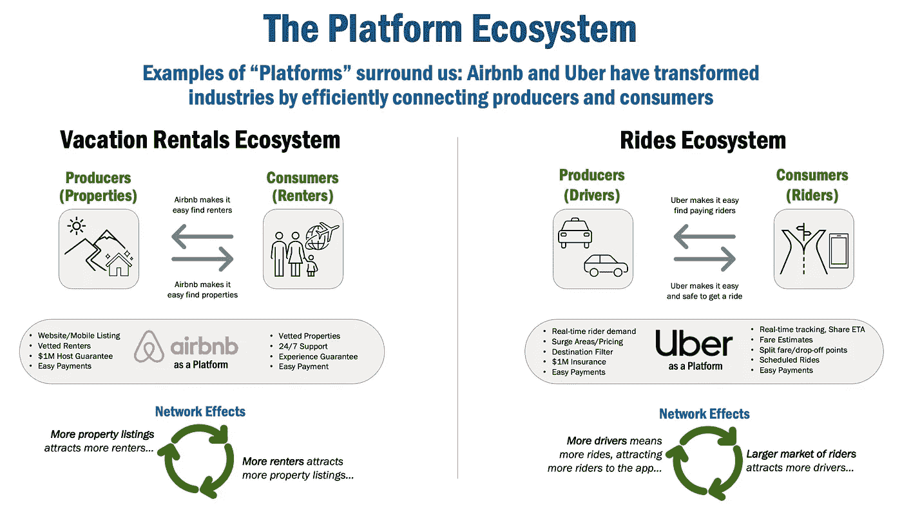

# 建立数据网格生态系统

> 原文：<https://towardsdatascience.com/establishing-the-data-mesh-ecosystem-172d9512f43d>

## 因优步和 AirBnB 而出名的平台生态系统正在改变行业。如何应用平台生态系统方法来转变您的企业数据网格？

照片由 [Aaron Burden](https://unsplash.com/@aaronburden?utm_source=unsplash&utm_medium=referral&utm_content=creditCopyText) 在 [Unsplash](https://unsplash.com/s/photos/map?utm_source=unsplash&utm_medium=referral&utm_content=creditCopyText)

# 平台生态系统正在改变行业

2016 年发表在《哈佛商业评论》上的一篇著名的[文章](https://hbr.org/2016/04/pipelines-platforms-and-the-new-rules-of-strategy)解释了一种新的“平台生态系统”方法将如何改变行业。作者的关键见解是，旧式的“管道”公司——那些创造产品并出售给客户的公司——将被“平台”所取代。这些所谓的平台将使“消费者”和“生产者”的**社区**能够安全可靠地找到彼此，进行互动和交易。通过将消费者和生产者聚集在一起，他们预测增长将呈爆炸式增长:随着更多的消费者使用该平台，它吸引了更多的生产者，随着更多的生产者加入进来并提供新的和创新的产品，它吸引了更多的消费者，如此这般，随着网络效应虚拟圈的形成。

历史证明，他们是对的。在交通方面，优步将需要乘车的“消费者”与提供乘车服务的“生产者”匹配起来。在住宿方面，AirBnB 为想要住宿的“消费者”和想要租赁他们住处的“生产者”牵线搭桥。还有交通住宿，还有很多其他行业，从来都不是这样！

那么，数据网格专业人员为什么要关心呢？简而言之，因为平台生态系统方法改变了数据网格的实施方式。这篇文章论证了数据网格原则——域所有权、数据即产品、自助式基础设施和联合治理——强烈鼓励在企业内部采用“平台生态系统”方法。事实上，我认为将平台生态系统方法与数据网格相结合意义深远，它将改变企业创建和执行数据策略的方式。

本文假设您对数据网格有很高的理解。如果你需要一些关于数据网格的背景信息，这里有一些链接，可以链接到一些关于数据网格[原则](https://martinfowler.com/articles/data-mesh-principles.html)、[架构](/an-architecture-for-the-data-mesh-32ff4a15f16f)和[模式](/data-mesh-architecture-patterns-98cc1014f251)的文章。

# 平台让生产者和消费者互动和交易

什么是平台？

首先，平台是关于创建生态系统(“平台生态系统”)。根据具有里程碑意义的 HBR 文章，平台生态系统中有几个参与者:**平台的所有者**控制他们的知识产权，并提供标准、协议和治理；生产者创造他们的产品；**消费者**使用这些产品；并且，**提供者**创建将生产者和消费者联系在一起的基础设施。

但有趣的是，将生产者和消费者联系在一起的能力创造了网络效应。随着越来越多的消费者加入一个平台，越来越多的生产者创造新的和创新的应用程序，随着更多的应用程序，更多的消费者加入，等等。一个由网络效应产生的良性循环开始了！

或许举几个例子就能说明这一点。再来看看[优步](https://www.uber.com/)，知名的拼车公司。在优步，提供游乐设施的人是生产者。想要搭车的人是消费者。优步是该平台的所有者和提供商，它创建和管理基础设施和应用程序，使消费者和生产者能够找到彼此，并安全地互动和交易以获得乘车服务。正如陈楚翔在他的新书《冷启动问题》(The Cold Start Problem中描述他与优步的旅程一样，一旦优步在某个特定城市获得了足够数量的司机(生产商)和想要搭车的人(消费者)，网络效应就开始发挥作用，优步在很短的时间内主导了拼车。

现在，让我们来看看著名的住宿租赁公司 AirBnB。在 AirBnB，想提供住宿出租的人是制作人。想要租赁住宿的人是消费者。AirBnB 是该平台的所有者和提供商，并创建和管理基础设施和应用程序，使消费者和生产者能够找到彼此，安全地互动和交易，并获得一个位置。与优步类似，陈楚翔在他的书中也描述了 AirBnB 的增长，并指出一旦他们有足够的出租单元，客户和生产者就会涌向 AirBnB，网络效应再次创造了一个行业巨头。

*图 1，平台生态系统*

# 数据产品是天然的平台

那么，这如何应用于数据网格呢？嗯，我想在几个方面。

首先，像平台一样，数据产品也有所有者。数据产品所有者负责建立允许数据生产者和数据消费者安全可靠地进行交互和交易的机制。在 AirBnB 或优步等平台提供基础设施和应用的情况下，数据产品所有者提供基础设施以及允许数据生产者和数据消费者互动的机制(使用 API 访问数据和数据产品目录来查找数据和消费)。

其次，数据产品——数据网格的核心概念——体现了**消费者**和**生产者**的概念。每个数据产品都拥有并生产数据，每个数据产品都有消费数据的群体。

第三，随着每个生产者创建新数据(或更新现有数据)，数据产品的价值增加。随着更多的数据或更好的数据，消费者从数据产品中获得更多的价值。

最后，价值越大，需求越大，这推动了额外的资金(通常通过新项目)，从而推动生产者创造更多新的更好的数据。和网络效应的良性循环有机会站稳脚跟。

*图 2，数据产品生态系统*

最后也是最重要的一点。将平台生态系统方法与传统的 It 共享服务相混淆可能是很自然的。所以，我强调:平台生态系统不是共享服务！

平台生态系统将生产者和消费者聚集在一起，因此专注于**资源协调**，而共享服务试图将稀缺资源聚集在一起，并充当**资源控制**的机制。平台生态系统专注于优化生产者和消费者群体之间的互动，而共享服务专注于优化内部流程。平台生态系统关注**灵活性，**而共享服务关注**成本效率**。

# 数据网格创造自然生态系统

优步或 AirBnB 等平台创建了一个社区。社区中参与者的互动创造了一个生态系统。当一个生态系统达到临界质量时，网络效应就会产生，价值就会呈指数增长。

从这个意义上说，数据网格是一个自然的生态系统。企业数据网格培育了许多社区，每个社区都由许多数据产品和它们自己的社区组成。因此，当单个数据产品开始与其他数据产品共享数据时，虽然每个数据产品社区都在创造价值，但创造的价值甚至更多。随着数据生产者和消费者的不断互动，数据网格(及其数据产品)的奇妙网络效应按照一种可预测的模式增长(如下图 3 所示):

1.  数据生产者创造数据。
2.  数据消费者用户数据，但随着更多或更好的数据产生，数据消费者的数量也在增长。
3.  随着消费者数量和数据需求的增加，网络效应开始显现，这推动了资金的增加(例如，通过新资助的项目)，这反过来又创造了新的数据生产者，等等。
4.  随着网络效应的出现，企业数据的价值呈指数级增长(回到第 1 步，清洗并重复)。

*图 3，企业数据网格生态系统*

平台生态系统方法忠实于核心数据网格原则:

*   **数据是产品**:数据产品为数据产品服务提供清晰的边界，平台为平台服务提供边界。每一个都有一个由生产者和消费者组成的生态系统，他们共同互动消费并创造价值。
*   **自助服务**:平台生态系统方法通过激励数据产品所有者让数据生产者和消费者更容易消费数据来促进自助服务。例如，在优步和 AirBnB 的案例中，他们(为生产者和消费者)创建了应用程序，使人们可以更容易地找到彼此，进行互动和交易。数据产品目录(及其企业数据产品目录表兄弟)和 API 通过使查找数据和消费数据变得容易来培养自助服务能力。
*   **分散的域所有权**:数据产品边界为所有权和服务提供提供了清晰的描述和责任。类似地，平台生态系统方法对所有者和提供者有明确的界限和责任。
*   **联合治理**:在优步或 AirBnB 等外部平台生态系统中，治理是完全联合的，因为每个企业都必须担保自己的财务状况，并遵守政府制定的法律法规。与平台生态系统方法一样，数据产品决策由数据产品所有者做出，他们有权在遵守企业规则和流程(例如，技术标准等)的同时，做出符合其数据生产者和消费者最大利益的决策。

# 数据网格和平台为企业数据战略创造了新规则

平台生态系统方法的引入提供了一种建立企业数据网格的新方法。但是这种方法具有基本的技术、治理和组织含义，需要重新思考企业数据战略的规则:

*   **共享服务 IT 成为联合平台**:如今，IT 共享服务制定技术决策并负责数据管理。在一个平台生态系统中，所有者(在我们的例子中是数据产品所有者)负责选择和实现他们自己的平台功能，同时在有意义的情况下根据他们的判断采用企业标准。
*   **敏捷性取代成本优化**:如今，IT(尤其是共享服务模式)针对成本进行优化。相比之下，平台生态系统方法重视敏捷性，这是通过让数据产品所有者(最了解其数据价值的人)能够根据其数据生产者和消费者的需求确定资金和活动的优先顺序来实现的。
*   **集中化 vs 康威定律**:康威定律表明(解释)系统和数据遵循组织结构。今天，IT 通常是在集中式服务中组织的(与康威定律相反)。相反，平台和生态系统方法允许数据产品由那些最接近和最了解数据的人拥有，这些人通常是业务部门。
*   **用户价值对生态系统价值**:今天，**用户**试图最大化他们的数据仓库的价值，不幸的是，超出这个范围是一项痛苦而昂贵的工作(参见前面的观点)。另一方面，平台生态系统方法寻求在生产者和消费者消费和交换数据时最大化他们的生态系统的价值。这种方法将生产者和消费者确立为一等公民。生产者和消费者与单个数据产品的互动，然后扩展到企业数据网格中的许多数据产品，创造了一个蓬勃发展的生态系统，如果运作良好，随着网络效应的形成，这将创造指数增长和价值实现的良性循环。

# 总结想法

显然，数据网格为我们如何管理企业数据并从中实现价值提供了新的机会。但是，在 tooday 的传统集中式 IT 共享服务中，组织、技术和治理方面的影响给实现数据网格带来了巨大的挑战。

这些挑战可以通过平台生态系统方法来解决，该方法实施数据网格“所有权”原则，为数据产品所有者提供明确的决策责任，使用“平台”从头开始实施联合治理，允许所有者以最佳服务于其数据生产者和消费者的方式建立自助服务能力，随着网络效应在企业内部扎根，通过数据生产和消费的良性循环，以指数方式放大数据的价值(并创建新的融资机制)。

因此，当您着手实施企业数据战略时，请记住平台生态系统方法提供了一种实用、可行且自然的方式来解决数据网格的基本组织、技术和治理挑战。

***

*除非另有说明，本文中的所有图片均由 Eric Broda(本文作者)创作。图像中使用的所有图标都是普通的 PowerPoint 图标，不受版权保护。*