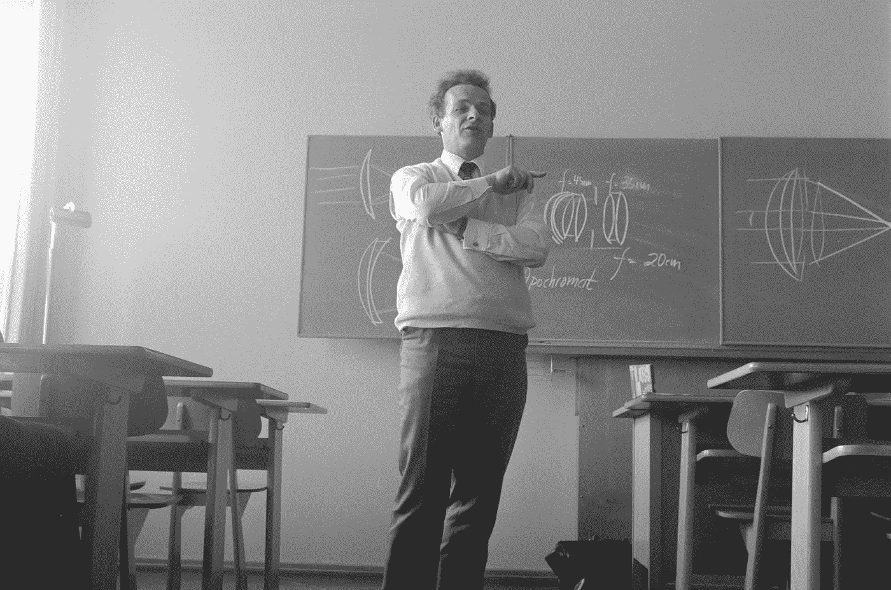
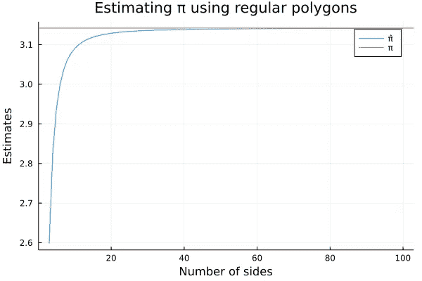
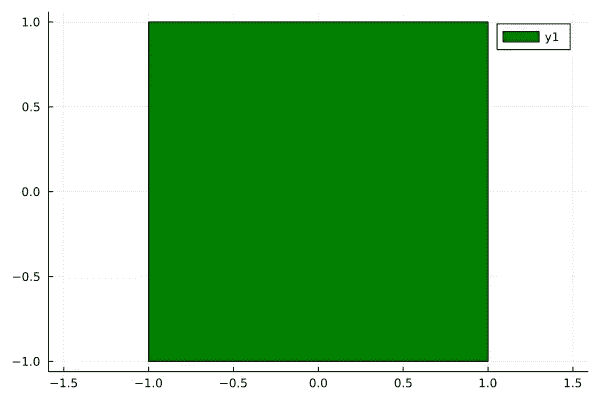
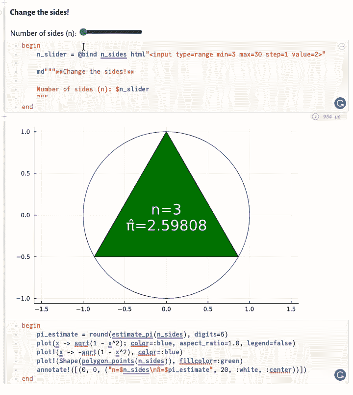

# 使用多边形估计π

> 原文：<https://towardsdatascience.com/estimating-%CF%80-using-polygons-d1a53a53f408>

## 利用朱莉娅玩各种形状和馅饼

π日(3 月 14 日)发什么帖子想了很多。我已经写了一篇关于用蒙特卡罗方法估计π的文章[这里](/estimate-pi-using-random-numbers-8b13a7e8c791)，所以我不能再做了。然后我想起在高中的时候，我们被展示了一种不同的估算π的方法:通过**使用 n 边正多边形**。所以我拿出我的冥王星笔记本，抓起 Plots.jl 为这篇文章编造一些东西。



向这些年来我最棒的数学老师们欢呼吧！—[伊莫·威格曼](https://unsplash.com/@macroman?utm_source=unsplash&utm_medium=referral&utm_content=creditCopyText)在 [Unsplash](https://unsplash.com/s/photos/teacher?utm_source=unsplash&utm_medium=referral&utm_content=creditCopyText) 拍摄的照片

> 这整篇文章作为冥王星笔记本放在 [GitHub 上。](https://github.com/niczky12/medium/blob/master/julia/estimate_pi.jl)

# 这几乎是一个圆

为了解释这个想法，想象画一个单位圆。在这个圆内，画一个等边三角形。现在试着画一个等边的正方形或五边形。**你画的边越多，形状就越接近圆形**。


看到这几乎是一个圆了吗？—作者截图

圆的周长为 2π(因为它是单位圆)——这是π的可能定义之一。如果我们想象画一个边越来越多的正多边形，我们会期望多边形的周长越来越接近 2π。现在，让我们算出边的长度，然后乘以边的数量。是时候让布鲁托出来了！

> 如果你需要对 Pluto.jl 的介绍，我写了一篇关于为什么我认为它很棒的文章。

# 编写一些函数

我承认这是我们开始作弊的地方…😬为了计算多边形的边长，我们需要使用正弦定律，这意味着我们使用 sin 函数，但是为了计算 sin 的值，我想我们需要知道π。如果我在这里说了什么愚蠢的话，请在评论里枪毙我。不管怎样，我们仍然可以玩得很开心，所以让我们写一些函数:

请注意，我们可以在这里使用度数而不是弧度

这里的技巧是把每个多边形想象成 n 个等腰三角形在圆心处连接在一起。两条相等的边具有单位长度，因为它们从圆心指向圆上的顶点。我们感兴趣的是第三方。以弧度表示的内角是 2π除以边数(记住一个完整的圆是 2π)。而且因为三角形的角之和是π，所以我们知道如何计算另外 2 个角(上面的β)。

但是我们如何知道这是否有效呢？嗯，我能想到的一个方法是检查它是否是正方形。根据毕达哥拉斯定理，适合单位圆的正方形的边长是 2 的平方根。所以正方形的周长必须是这个的 4 倍:

```
# this should be 4 times √2, using Pythagoras
circumference_polygon(4) == 2^0.5 * 4
```

这给了我们`true`,从而让我们确信我们不是完全的白痴。单元测试万岁！快速提示:在 Julia 中测试这个和`using Test`一样简单，然后:


在 Julia 进行测试——作者截图

要估算π，我们只需将这个数除以 2——注意，圆的周长是 2π，而不是π:


对于一个 100k 边的多边形，我们非常接近圆周率——作者截图


吉勒·Á·阿尔瓦雷斯在 [Unsplash](https://unsplash.com/s/photos/success?utm_source=unsplash&utm_medium=referral&utm_content=creditCopyText) 上拍摄的照片

如果我想偷懒，发表一篇 2 分钟的文章，这将是它。但是 Plots.jl 和 Pluto.jl 只是乞求被使用。这里还有更多好玩的东西。

# 多快才算快？

我们可以问的一个问题是:“我们的估计多快接近π？”。要回答这个问题，我们可以使用 Plots.jl 来绘制一些漂亮的线条:

如果你以前从未见过朱莉娅，上面有几件事正在发生:

*   `:`给你一个数字范围，使得`x`有点像向量。
*   `.`将我们的标量函数传播给`x`的所有值，给出π的 98 个估计值。
*   `plot`非常棒，知道如何处理我们的`x`和`y`坐标对。
*   `hline!`在π处添加一条水平线，因为该函数以`!`结束，所以它修改当前图形。
*   我写π和π̂是通过键入`\pi`和`\pi` + `\hat`来自动完成 Unicode 字符，让它看起来好像我懂数学。

> 专业提示:如果你想让别人相信你懂数学，在你的代码中使用 Unicode 字符和希腊符号。

我们光荣的阴谋在这里:



非常接近——作者策划的情节

# 多近才算近？

Gif 来自 [GIPHY](https://giphy.com/gifs/social-distancing-socialdistancing-6-feet-jUtavYMjaseLXBhbus)

我们可以问的另一个问题是:*“这些多边形实际上看起来像什么？”*。他们真的越来越接近一个圈子了吗？

嗯，我很高兴你问了，因为我们有与冥王星互动的滑块。所以我们来玩玩吧。

首先，我们将绘制我们的多边形。为此，我们可以使用绘图的`Shape`构造函数，并用我们选择的颜色填充它:



这给了我们一个无聊的正方形——作者的情节

我们如何知道顶点应该去哪里？我的方法是将第一个点任意设置为(0，1)。那么所有其他的点都将是这个向量旋转 2π/n 的[旋转，其中 n 是我们的多边形的边数。让我们再用数学来旋转这些点:](https://matthew-brett.github.io/teaching/rotation_2d.html)

让我们通过顺时针旋转我们的初始点 90 度来检查我们的函数是否工作(我们期望它落在(1.0，0.0)):


万岁！—作者截图

现在，让我们得到一个 n 边正多边形的所有点:

让我们通过在 Pluto 中添加一个滑块来实现这一点:

最后用我们的估计画出结果:



作者制作的 Gif

# 感谢阅读！

嗯，这很有趣。我希望你在阅读这篇文章的时候过得愉快，并且学到了一些关于几何(不太可能)或者朱莉娅(可能性稍微大一点)的新东西。如果你喜欢读这篇文章，**考虑在 Medium** 上关注我，我在这里发布关于数据科学、Julia 和有趣的东西。

[](/estimate-pi-using-random-numbers-8b13a7e8c791)  [](https://blog.devgenius.io/make-a-command-line-game-with-julia-a408057adcfe) 