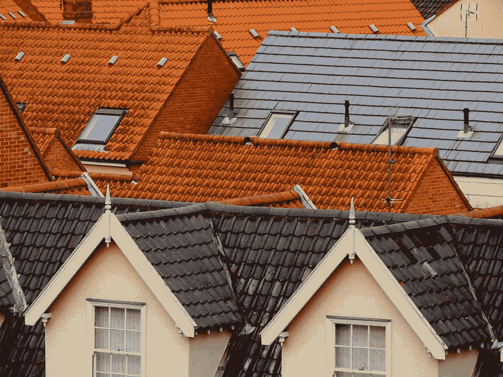
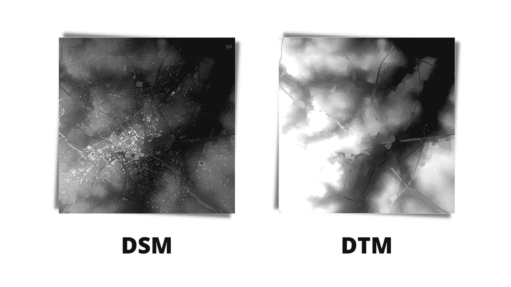
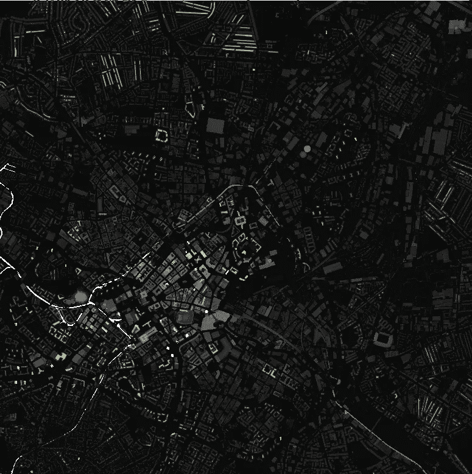
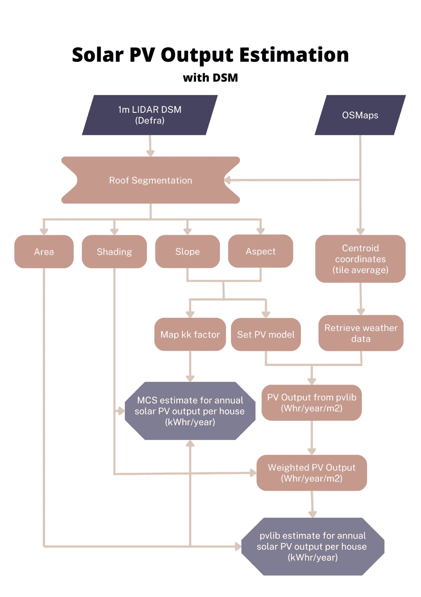
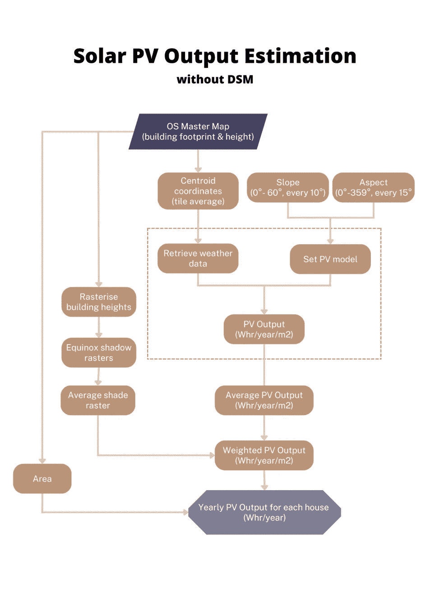

# 用开源数据估算太阳能电池板输出

> 原文：<https://towardsdatascience.com/estimating-solar-panel-output-with-open-source-data-bbca6ea1f523>

## 使用 Python 和 QGIS 估算太阳能电池板输出的综合指南

图片由来自 Unsplash 的 Jack Price-Burns 提供。

为了计算一个屋顶能产生多少太阳能，我们需要以下信息:

1.  屋顶坡度
2.  屋顶方位角(朝向太阳)
3.  一个屋顶可以容纳的太阳能电池板数量
4.  阴影系数(被阴影阻挡的光的百分比)
5.  太阳辐照度(屋顶接收的总阳光量)

问题是，确定前四个变量需要实地考察，这使得实施安装太阳能电池板的计划或政策更加困难。相反，我们可以使用公开可用的数据*来推导这些变量，以确定哪些区域具有高太阳能电池板输出的潜力。然后，我们可以使用不同的计算方法来估计每个屋顶的太阳能电池板年产量。

> *数据可用性的广度取决于感兴趣的区域。
> 
> 这篇文章是我在 DSSGxUK 为西米德兰兹郡联合权力机构和纯蛙跳应用的方法论的一个抽象的、概括的版本。参见 [GitHub 库](https://github.com/DSSGxUK/s22_wmca/tree/main/solar_pv)获取完整代码和西米德兰兹(英国)特定教程。

# 验证数据

*我们能在多大程度上信任这种方法论？*

我们需要验证数据来验证(1)导出的输入和(2)最终的太阳能电池板输出。困难在于获得它。

你可以从谷歌街景的房屋图像中取样，以确定屋顶的坡度和方位角，以及屋顶可以容纳的太阳能电池板的数量(尽管这个过程会很繁琐)，或者如果你幸运的话，可能会有一个收集的数据库。虽然说实话，我自己还没找到。

太阳能电池板输出的真正验证数据需要从安装的太阳能电池板中读取仪表读数，或者通过在随机设置的屋顶上安装仪表来收集数据，以测量屋顶遮阳的效果。

否则，你将不得不依赖于来自组织的评估，例如英国的[微型发电认证计划服务(MCS)](https://mcscertified.com) 来进行比较。从本质上说，你只是在比较不同形式的评估，而没有任何实际数据。然而，这些仍然可以作为很好的大概估计，所以你知道你的估计至少在正确的数量级内。

# 采购数据

您将需要四份数据:

*   **数字表面模型(DSM)** :地球表面的高程信息，包括人造结构(如:建筑物、桥梁)和自然特征(如:树木、草地)。
*   **数字地形模型(DTM)** :裸露的所有自然和人造结构的地球表面的高度信息。它仍然包括像河流和丘陵的地形特征。
*   **建筑足迹**:每个建筑用多边形表示的建筑位置信息。
*   **太阳辐照度:**一个地区接收到的太阳能的总量。

这些数据的可用性取决于您正在查看的区域。一些政府和开源项目收集并公开发布这些数据。有些人躲在付费墙后面。在本文中，我将分享我发现的提供全球数据和英国特定数据的来源(因为我的项目主要集中在西米德兰兹)。这些来源并不详尽，所以如果你找到其他人，请留下评论！

现在，我将解释所有这些数据是什么。

## 来自激光雷达数据的 DSM 和 DTM

如果你熟悉回声定位(鲸鱼和海豚使用)的工作原理，激光雷达的工作原理有些类似。在固定高度飞行的飞机会发出激光脉冲(高频光)。激光在表面上反射，激光返回所需的时间提供了距离(阅读[此处](https://m.futurecar.com/387/LIDAR--Changing-the-Face-of-Data-Collection)了解更多详情)。

我见过的英国数据的最高分辨率是 25 厘米(仅针对该国很小的一部分)，而 1 米和 2 米的分辨率几乎涵盖了一切。分辨率意味着每个像素代表 25 厘米的空间，这使得图像更清晰。

伯明翰部分地区的 DSM 和 DTM 模型。亮斑表示较高的高程，与图像成比例。【图片来自作者】。

激光雷达只是测量海拔的一种方法。研究人员利用这些数据得出 DSM 和 DTM。您也可以使用卫星成像或 3D 模型，但这些通常很难找到开源的，并且在相同的粒度水平下需要更多的处理能力。

## 开放街道地图中的建筑物覆盖区

建筑物覆盖区有助于识别您在 DSM 和 DTM 中看到的形状，并以 shapefiles 的形式出现。Shapefiles 是一种存储地理属性信息(例如:坐标、坐标参考系统、标签)的矢量化文件。

虽然有些 shapefiles 比其他 shapefiles 更容易访问，但您也可以转向开放数据源，如 [Open Street Map](https://www.openstreetmap.org/#map=5/54.910/-3.432) 来下载数据。他们也有一个 API，查看参考资料来学习如何使用它们。

查看你感兴趣地区的政府网站！他们将拥有建筑足迹数据，因为他们将其用于城市规划，这是一个数据是否公开的问题。例如,“法令测量”仅在许可建筑物覆盖区数据时发布建筑物的质心。

亮绿色代表住宅类型的建筑多边形。存储在 shapefile 中的地理信息允许面与激光雷达数据完美对齐。[图片由作者提供]

## 太阳辐照度数据

太阳辐照度是太阳从以下来源获得的能量:

*   **直接法向辐照度:**一个表面垂直接收的太阳光线量
*   **漫射水平照射:**没有垂直到达太阳能电池组件的太阳光线

当太阳能电池板在晴朗的天空下，倾斜等于纬度并面向南方时，获得最大的太阳辐照度。你可以在这里得到更详细的解释[。](https://www.pveducation.org)

欧盟 JRC PVGIS 在线工具是太阳辐照度数据的可靠来源。其他气象机构也会有这些数据，但是欧盟 PVGIS 联合研究中心很好地整合了我将在下面介绍的一种估算方法。

# 屋顶分割:坡度和方位角

与其将屋顶视为一个单独的单元，不如将其视为一组具有各自方位角(坡向)和坡度的部分，这样更准确。

以下方法改编自安布尔赛德中的[绘制太阳能光伏潜力图。我们的方法只需要 DSM 图层和建筑物覆盖区，而引用的论文额外需要 DTM 图层来过滤高度。我不需要 DTM，因为我有建筑高度的数据，但如果没有，你可以用 DTM 来补充这些数据。本质上，您可以找到 DSM 和 DTM 图层之间的差异来获得建筑高度。](https://aafaf.uk/uploads/7/2/0/5/72055569/mapping_solar_pv_potential_in_ambleside__final_updated__jan_2020.pdf)

图片来自作者。

屋顶分割结果甚至在论文中也是可疑的。屋顶部分看起来不像您自己绘制的部分(图 4)。作者仅使用了 20 个屋顶的测试集，分别获得了 75%和 70%的房屋的坡度和坡向在 10 度以内的精度。这些结果还有许多需要改进的地方，屋顶分割不佳表明了作者对未来工作的一些建议。

QGIS 中确定的屋顶部分(作者左侧)和谷歌地图上同一区域的实际屋顶视图。

# 估计阴影

阴影通常是由其他较高的建筑物或植被造成的。有了 DSM 层，我们可以对投射到屋顶上的阴影量有一个相当精确的概念(至少精确到一年前)。没有 DSM，我们仍然可以根据建筑高度信息创建伪 DSM 图层。

## 伪 DSM

如果没有 DSM，只要有建筑高度值和周围建筑的覆盖区，您仍然可以计算着色。要创建伪 DSM，请使用建筑物高度作为像素值栅格化矢量图层，并将所有其他像素保留为“0”。

因为我们的数据只包含住宅建筑的高度，而不是所有建筑的高度，所以不准确。它也没有考虑植被的高度。

## UMEP:太阳辐射:阴影生成器

UMEP(城市多尺度通用预测器)是一个开源的气候服务工具，作为 QGIS 上的插件提供。[阴影生成器](https://umep-docs.readthedocs.io/en/latest/processor/Solar%20Radiation%20Daily%20Shadow%20Pattern.html?)从 DSM 创建一天和一年的不同时间产生的阴影模型。然而，这是一个计算量很大的过程。对于比例，需要 1 小时 15 分钟来计算 500 像素乘 500 像素 DSM 在两天内以两小时为间隔的平均明暗度。

# 估计太阳能电池板输出

最终的太阳能电池板输出需要所有这些信息和关于用于说明不同系统的效率和容量的太阳能电池模块类型的细节。

[pvlib](https://pvlib-python.readthedocs.io/en/stable/user_guide/introtutorial.html#object-oriented-location-mount-array-pvsystem-modelchain) 是一个 Python 库，用于模拟光伏能源系统的性能。对于不同的模块，您可以使用许多选项。该模型还基于太阳能电池板模块的斜度、方位和高度中的坐标和因素从 [PVGIS](https://joint-research-centre.ec.europa.eu/pvgis-photovoltaic-geographical-information-system/pvgis-data-download_en) 获取气象数据。

如果屋顶坡度和坡向不可用，可以计算坡度(0 -60，每 10)和坡向(0 -359，每 10)的几种可接受组合的太阳能电池板输出。然后，我们将平均输出作为房子的太阳能光伏输出。

输出是潜在的太阳能光伏输出，单位为千瓦时/年/平方米。

我将我的估计与 MCS 的公式和最终计算进行了比较，发现我的结果在同一数量级内。然而，如果没有真实的数据，就没有办法确切地知道每个估计有多准确。

图片来自作者。

图片来自作者。

# 这有多靠谱？

> 我们能相信这些结果吗？是数据科学中最重要的问题之一。您的结果取决于它们的可靠性！

激光雷达数据相当精确(取决于您的数据源)，对于建筑物，1m 的分辨率对于我们正在寻找的粒度级别来说已经足够好了。但是如果您将这种方法扩展到更小的结构，您将需要小心行事。您还应该仔细检查激光雷达数据的最后更新时间，以便它与您的建筑数据保持一致。

构建足迹数据取决于您的来源。谁收集的数据？开放街道地图是由人们填充的开源数据和日志的集合。而政府来源可能有更严格的数据收集方法，您应该检查其可靠性。一些问题要问数据:

*   数据最后一次更新是什么时候？
*   谁收集的数据？是否涉及多方，如果是，他们如何确保数据收集的标准化？
*   是否进行了任何检查以确保数据的可靠性？
*   哪些房屋可能被排除在数据收集之外？哪些房子比其他房子更容易出错？有些房子是如何被概括的？

在 QGIS 上运行的计算反映了数据的可靠性。如果激光雷达数据与建筑物覆盖区数据不一致，则可能存在异常值。例如，在收集激光雷达数据后可能已经建造了一座建筑物。

也许我对太阳能输出估计的警告让你感到悲观。如果我不能验证它，那还有什么意义？这值得做吗？

我的希望是，这种方法将为建立适当的验证数据铺平道路，这些数据是推动未来太阳能电池板评估方法发展所必需的！所有地方议会和关注气候的组织都需要这样的数据来帮助增加我们的可再生能源使用份额，也许这将向你表明这是值得投资的。

# 资源

[Alex Boyd 绘制安布尔塞德的太阳能光伏发电潜力图](https://aafaf.uk/uploads/7/2/0/5/72055569/mapping_solar_pv_potential_in_ambleside__final_updated__jan_2020.pdf)

*QGIS*

*   [QGIS 教程](https://www.youtube.com/watch?v=OkALXzV0dYw)计算建筑高度
*   通过地理信息学对屋顶类型[进行分类的指南](https://www.youtube.com/watch?v=fitQGrrthH0)
*   [通过 3DBuildings 在 QGIS](https://3dbuildings.medium.com/how-to-create-a-3d-buildings-view-in-qgis-8351ea5a3138) 上创建建筑物高度的 3D 视图。(2020 年 12 月 9 日)
*   如果你在栅格化 shapefile 时遇到困难，看看这个视频[来帮你调试。](https://www.youtube.com/watch?v=AUV99OGF8Us)
*   [论文](https://www.researchgate.net/publication/289367896_DETECTION_OF_ROOF_SHADING_FOR_PV_BASED_ON_LIDAR_DATA_USING_A_MULTI-MODAL_APPROACH)比较了使用激光雷达数据检测光伏屋顶阴影的不同方法
*   太阳能 GIS 模拟的[光伏模拟不确定性中建筑物/地形阴影损失的不确定性较高。查看他们用于太阳能光伏计算的假设。](https://documents1.worldbank.org/curated/en/529431592893043403/pdf/Global-Solar-Atlas-2-0-Technical-Report.pdf)

*建筑足迹*

*   使用这个[向导](https://overpass-turbo.eu)为 override API 创建查询
*   [Python 的天桥 API 教程](/loading-data-from-openstreetmap-with-python-and-the-overpass-api-513882a27fd0)
*   [开源城市 GML 3D 语义建筑模型](/open-source-3d-semantical-building-models-in-2020-f47c91f6cd97)作者 Joe T. Santhanavanich

*激光雷达*

*   [英国开源激光雷达数据](https://environment.data.gov.uk/DefraDataDownload/?Mode=survey)(邮件索要批量文件；估计需要的时间)
*   GISGeography 的激光雷达完全指南:光探测和测距。(2022 年 5 月 28 日)
*   [如何:从激光雷达数据中提取建筑物高度并制作 3D 建筑物](https://blog.nadnerb.co.uk/?p=209)由 nadnerb 制作。(2015 年 9 月 18 日)