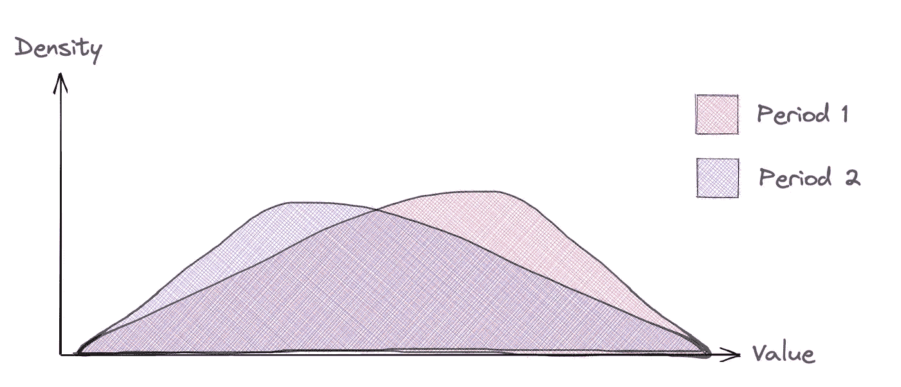
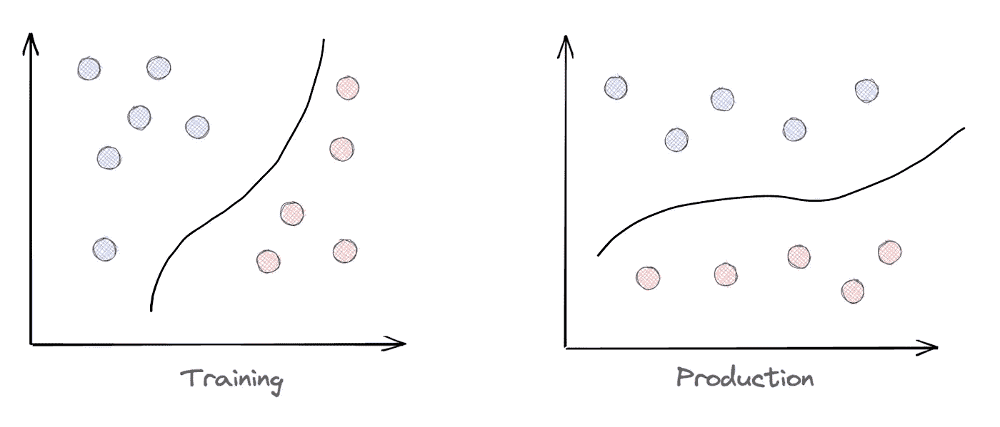
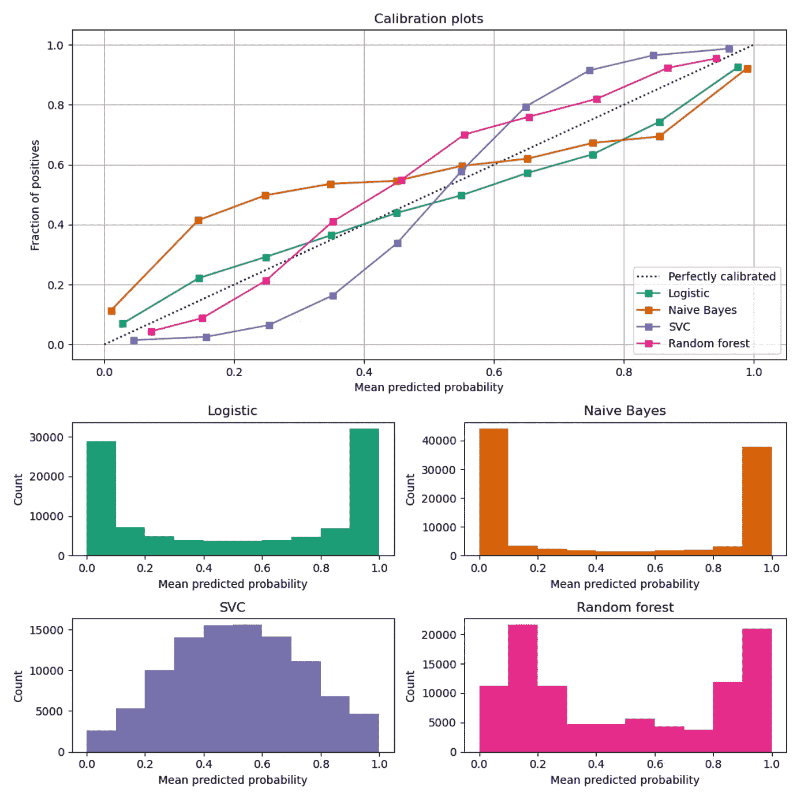
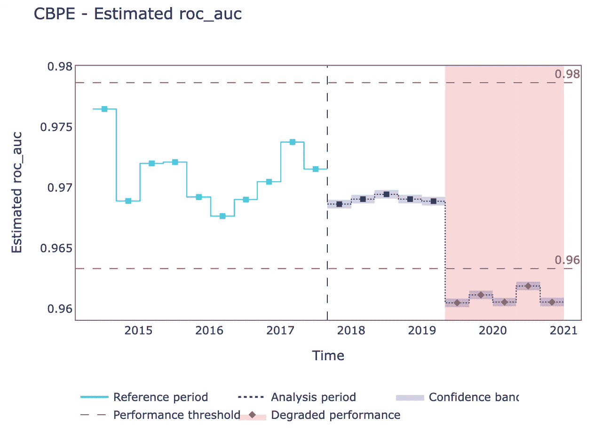

# 在缺乏基本事实的情况下估计最大似然模型的性能

> 原文：<https://towardsdatascience.com/estimating-the-performance-of-an-ml-model-in-the-absence-of-ground-truth-cc87dbf6e57>


阿菲夫·库苏马在 [Unsplash](https://unsplash.com/s/photos/target?utm_source=unsplash&utm_medium=referral&utm_content=creditCopyText) 上拍摄的照片

## 这可能吗？你应该如何接近它？

将机器和深度学习模型部署到生产中，对于每个从事该项目的数据科学家来说，绝对是一个非常令人满意的时刻。然而，这绝不是项目的最后一步。随着时间的推移，我们仍然需要监控模型及其性能，进行维护，并可能对其进行改进。

作为监控的一部分，我们应该特别注意我们的模型的**无声故障**——当我们的模型的性能随着时间的推移而恶化，而这并没有被注意到。换句话说，模型仍然输出它的预测，不管它是一个类别标签还是一些概率分数。然而，其性能不再与我们最初将其投入生产时所期望的相似。使检测这种故障尤其具有挑战性的是，事实真相信息可能缺失或延迟。在这种情况下，我们将不得不等待发现该模型已经表现不佳很长一段时间了。

在本文中，我们首先讨论模型静默失败的潜在原因，并提到检测它们的可能方法。然后，我们研究一种方法，这种方法可以帮助我们估计最大似然模型的性能，即使我们没有基本的真实信息。

# 为什么模型在生产中会失败？

在这一部分中，我们提供了模型无声失败的潜在原因的例子。

## 数据漂移

我们的模型在生产中可能失败的第一个原因是**数据漂移**，即模型输入的分布随时间的变化。下图说明了这个问题。



作者图片

数据漂移在与人类行为相关的表格数据中尤其明显。例如，当疫情启动时，电子商务平台中代表客户行为的特性可能已经发生了显著变化。

有许多可能的方法来检测数据漂移。检测单变量数据漂移的一种更简单的方法是使用统计检验(例如 Kolmogorov-Smirnov 检验)来比较给定变量(特征)在两个样本中的分布。我们可以对我们的每个特性重复这个过程，但是，这样做我们假设这些特性是独立的。在大多数情况下，这是一个非常强烈且不切实际的假设。

## 概念漂移

**概念漂移**可以理解为模型输入和目标之间映射的变化。这意味着用于进行预测的决策边界在评估期之间发生了变化。我们可以在下图中看到一个例子。



作者图片

如何检测概念漂移？我们可以尝试以下方法:

*   查看两个样本中的输入和标签(基础事实)之间的相关性。
*   尝试识别训练数据和更近的样本(上个月、上个星期、上一天等)之间的模型参数变化。).

## 各种因素的结合

我们已经讨论了模型无声故障的两个潜在来源。实际上，原因可能更复杂，或者只是两者的结合。

一种情况可能是数据漂移实际上导致了概念漂移。在另一个场景中，数据漂移和一些未观察到的变量的组合可能看起来像概念漂移。换句话说，看起来输入和输出之间的映射在变化，但实际上变化的是未观察到的变量如何表现以及它们如何影响目标。

# 预测没有基础事实的 ML 模型的性能

现在，我们将解释如何评估模型的性能，即使我们没有基本事实(目标)。

## 动机

在我们更深入地评估性能之前，我们应该回答这个问题，它为什么重要。凭直觉，我们可以将模型投入生产，计算预测值，然后简单地将它们与实际值进行比较。瞧啊！

你可能已经猜到了，现实生活并没有那么简单。例如，与 Kaggle 竞赛相比，我们并不总是有计算模型性能的基础事实。

首先，让我们来看看理想的场景。在这本书里，我们在做出预测后几乎立刻就能得到事实真相。我们可以观察到这种情况的一个行业例子是数字广告。一些模型预测客户最有可能点击哪个广告，然后我们几乎立刻就知道客户是否点击了它。不幸的是，并不是所有的场景都这么简单。

第一个棘手的情况是被**拖延了地真相**。在金融行业中，这种情况非常常见，银行或其他机构使用 ML 模型来预测哪些客户可能会拖欠贷款。自然，他们不知道某个客户是否违约，直到他们的贷款全部还清。或者，我们可以为电子商务业务建立一个客户流失预测模型，其中客户流失定义为 6 个月内没有交易。这意味着我们必须再次等待一段固定的时间，直到我们知道一个给定的预测是否正确。

在第二种情况下，可能根本就没有**地面真相**或者很难获得。我们可能不得不雇佣人类验证者来评估某个预测是否成真。首先想到的例子是在线 KYC(了解你的客户)过程。在被授权访问一些服务之前，我们需要提供一些关于我们的数据，并对我们的 ID 和面部进行拍照，以便系统可以检查它是否匹配以及 ID 是否是伪造的。

如果一张图片被标记，它可能会被人工代理进一步调查。然后，我们将有地面真相。对于所有图片看起来合法并且没有发现不匹配的观察结果，人类注释者可能会查看其中的一小部分来仔细检查模型的性能。然而，这很少涵盖模型实际评估的所有观察结果。

下图总结了考虑的场景。


作者图片

## 概率校准入门

假设我们有一个二元分类器。它们中的大多数返回两个输出—预测的类和分数，分数表明模型对其预测的信心。分数越接近极值(通常分别为 0 和 1)，模型的预测就越有信心。到目前为止，这应该不是什么特别新的东西。

潜在的新部分是将分数解释为概率。在分数与实际概率相符的情况下，我们可以用它来计算出错的概率。因此，当一个校准良好的模型以 0.8 分(可以解释为不出错的概率)做出 X 个预测时，我们可以假设大约 80%的此类预测确实是正确的。换句话说，校准良好的分类器是那些`predict_proba`方法的输出可以直接解释为模型置信度的分类器。

鉴于大多数模型侧重于性能而不是概率估计，它们的分数很少得到很好的校准。为了研究一个模型是否有很好的校准概率，我们可以使用**校准曲线**(又名可靠性图)。使用这样的图，我们可以看到阳性标记的真实频率是否与其预测的概率相匹配。在图中，预测的概率被分组到统一的桶中。这些轴可以解释如下:

*   *x-* 轴表示每个桶的平均预测概率，
*   *y-* 轴表示每个桶中阳性的比例，即类别为阳性的样本的比例。

对角线代表完全校准的分数。在下图中，我们可以看到默认情况下，逻辑回归分类器返回校准良好的预测。这是因为它直接优化了日志丢失。不幸的是，这不是其他分类器的情况。



来源:https://scikit-learn.org/stable/modules/calibration.html

底部的直方图通过显示每个预测概率箱中的样本数量提供了进一步的见解。

概率校准是一个非常有趣的话题，我将在另一篇文章中讨论。就目前而言，这个快速入门应该足以理解为什么我们需要良好校准的概率来估计缺乏基础事实的 ML 模型的性能。

## 怎么做

**基于信心的性能估计** (CBPE)是一种算法，允许我们在缺乏地面真相的情况下估计模型的性能。它是由 [NannyML](https://www.nannyml.com/) 开发的，这是一个用于部署后数据科学的开源 Python 库。

为了估计模型的性能，该算法利用模型对其预测(概率估计)和预期错误率的信心。为了直观地了解这种方法在实践中是如何工作的，我们将它应用于最简单的分类评估指标——准确性。使用完全相同的原理，我们可以估计其他分数，如精确度、召回率、F1 分数、F-beta 分数、ROC AUC 等。

在进入算法的本质细节之前，我们需要提到这种方法的两个基本假设:

*   我们有一个分类器产生精确的概率，
*   没有概念漂移。

因此，只要我们只预期数据漂移，算法就应该提供模型性能的可靠估计。

**逐步估算精度**

众所周知，精确度的定义如下:


作者图片

为了简化，我们实际上只需要真阳性、真阴性和样本大小 *n* (上式中的分母)。但是我们展示了如何计算所有元素，以防我们对不同的性能指标感兴趣。

首先，对于 1 到 n 的范围内的每个预测 *i* ，我们使用预测的概率计算混淆矩阵的元素。假设概率是相对于正类来表示的，请考虑以下两种情况:

*   概率为 90%的观察结果—这意味着 90%的模型是正确的( **TP** )，10%是假阳性( **FP** )。两个负面指标的概率都是 0%。
*   一个概率为 20%的观察——这表明出现真阴性( **TN** )的几率为 80%，出现假阴性( **FN** )的几率为 20%。两个正面指标的概率都是 0%。

使用这个模式，我们可以为样本中的每个观察值构建混淆矩阵的四个元素。

然后，我们将概率相加，以获得整个集合的混淆矩阵的聚合元素。为了计算精度，我们需要以下两个:


作者图片

使用这些值，我们可以计算出估计的精度:


作者图片

就是这样，仅使用一个校准良好的分类器的输出，我们就可以评估模型的性能(在这种情况下，它的准确性),而无需了解基础事实。

我们可以按照完全相同的步骤获得其他性能指标。ROC AUC 得分稍微复杂一些，因为它带来了为所有考虑的阈值重新计算上述步骤的额外复杂性。

正如你所看到的，算法非常简单，但是底层思想真正“落地”需要一点时间。对我来说，花费最多时间的是概率的总和。在一个正常的混淆矩阵中，我们简单地观察表示属于一个特定类别的观察数量的整数。

在这种方法中，我们有一个预期概率的总和，这导致了预期的真阳性、假阴性等的数量。这个期望值不是一个整数，但这没关系，因为在计算预期的性能评估指标时，这不是一个问题。

## 实践中的方法

为了加强我们对算法的理解，让我们用一个简化的例子来完成它的步骤。首先，我们导入库并创建一个玩具数据集。

我们可以把它看作是我们校准良好的分类器的输出:类别预测和相应的概率。使用典型的方法，我们假设超过 50%的概率导致肯定类别的预测。请记住，在这个练习中，我们没有地面真相！


作者图片

使用分类器的输出，我们为每个观察值计算混淆矩阵的元素。


作者图片

接下来，我们需要合计各个概率，以得出整个样本的合计值:

```
pred_df[["TP", "TN", "FP", "FN"]].sum()
```

它返回:

```
TP    2.35 
TN    1.40 
FP    0.65 
FN    0.60
```

最后，我们可以计算估计的精度(没有实际的标签)为`(2.35 + 1.4) / 5 = 0.75`。

我们也可以使用`[nannyml](https://github.com/NannyML/nannyml)`库，而不是手动计算估计的性能指标，这使得过程更加简单。使用`[nannyml](https://github.com/NannyML/nannyml)`的另一个好处是，它会自动检测分类器是否校准良好，并在必要时为我们进行校准。

首先，让我们假设我们的数据被分成两个分区:

*   *参考分区* —用于建立模型的基准性能。例如，我们可以使用模型已经投入生产并提供令人满意的性能时的数据。
*   *分析分区* —该分区通常包含最新的生产数据，我们根据这些观察结果来评估模型的性能(当我们仍然不知道实际情况时)。需要满足的一个条件是，它需要在引用分区结束的点之后开始。

使用`nannyml`，我们可以很容易地计算出参考分区的模型的观察性能和分析分区的估计性能。

下面，我们可以看到一个输出的例子。曲线的前半部分对应于参考期。然后，接下来的点实际上是模型的估计性能，以及置信区间(使用参考周期计算)。有趣的是，该库还使用参考周期来计算警报阈值——当估计的性能超过这些阈值时，这是一个信号，表明模型的性能发生了显著变化(变好或变坏)。



来源:[https://github.com/NannyML/nannyml](https://github.com/NannyML/nannyml)

# 外卖食品

*   数据漂移和概念漂移会导致我们的模型在生产中无声的失败。
*   使用基于置信度的性能估计，我们可以估计模型的性能，即使我们无法访问(可靠的)地面真相。
*   该算法有两个假设:没有概念漂移和分类器产生良好校准的概率。

一如既往，我们非常欢迎任何建设性的反馈。你可以在推特上或者评论里联系我。

*喜欢这篇文章？成为一个媒介成员，通过无限制的阅读继续学习。如果您使用* [*这个链接*](https://eryk-lewinson.medium.com/membership) *成为会员，您将支持我，无需额外费用。提前感谢，再见！*

您可能还会对以下内容感兴趣:

[](/pyscript-unleash-the-power-of-python-in-your-browser-6e0123c6dc3f) [## PyScript——在浏览器中释放 Python 的威力

### 如何从 HTML 代码中运行 Python

towardsdatascience.com](/pyscript-unleash-the-power-of-python-in-your-browser-6e0123c6dc3f) [](/pandas-is-not-enough-a-comprehensive-guide-to-alternative-data-wrangling-solutions-a4730ba8d0e4) [## 熊猫还不够？替代数据争论解决方案的全面指南

### 包括达斯克、摩丁、polars、Vaex、Terality 等 6 人

towardsdatascience.com](/pandas-is-not-enough-a-comprehensive-guide-to-alternative-data-wrangling-solutions-a4730ba8d0e4) [](/explaining-feature-importance-by-example-of-a-random-forest-d9166011959e) [## 以随机森林为例解释特征的重要性

### 了解 Python 中最流行的确定要素重要性的方法

towardsdatascience.com](/explaining-feature-importance-by-example-of-a-random-forest-d9166011959e) 

# 参考

*   尼古列斯库-米齐尔和卡鲁阿纳(2005 年 8 月)。用监督学习预测好的概率。在*第 22 届机器学习国际会议论文集*(第 625–632 页)。—[https://www . cs . Cornell . edu/~ alexn/papers/calibration . icml 05 . CRC . rev 3 . pdf](https://www.cs.cornell.edu/~alexn/papers/calibration.icml05.crc.rev3.pdf)
*   Naeini，Mahdi Pakdaman，Gregory Cooper 和 Milos Hauskrecht:“使用贝叶斯宁滨获得校准良好的概率”2015 年第二十九届 AAAI 人工智能大会。—[https://www . aaai . org/OCS/index . PHP/AAAI/aaai 15/paper/download/9667/9958](https://www.aaai.org/ocs/index.php/AAAI/AAAI15/paper/download/9667/9958)
*   [https://scikit-learn.org/stable/modules/calibration.html](https://scikit-learn.org/stable/modules/calibration.html)
*   [https://github.com/NannyML/nannyml](https://github.com/NannyML/nannyml)
*   [https://docs . nannyml . com/main/deep _ dive/performance _ estimation . html](https://docs.nannyml.com/main/deep_dive/performance_estimation.html)