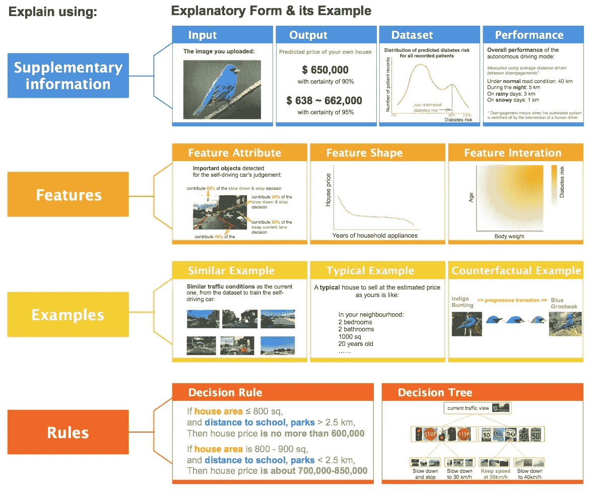
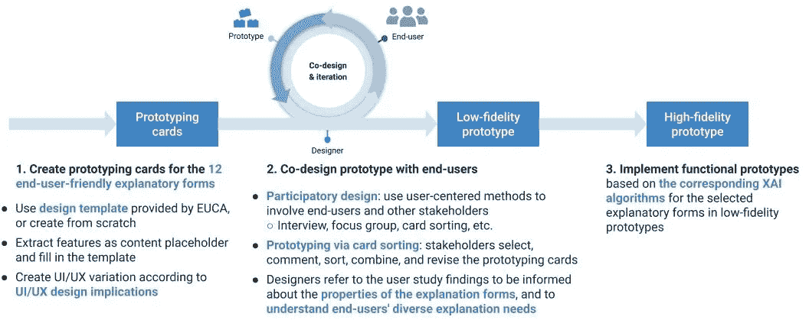

# EUCA——一个有效的 XAI 框架，让人工智能更贴近终端用户

> 原文：<https://towardsdatascience.com/euca-an-effective-xai-framework-to-bring-artificial-intelligence-closer-to-end-users-74bb0136ffb1>

## 在这篇文章中，我们将讨论如何使用 EUCA，一个可解释的人工智能框架来增加终端用户对人工智能的采用

来源: [Pixabay](https://pixabay.com/photos/web-network-people-profession-3706725/)

**人工智能(AI)** 正被积极用于解决许多领域的商业问题。但是人工智能算法通常被认为是复杂的 T4 或者神奇的黑匣子，可以准确预测未来。尽管人工智能在许多应用领域取得了突破性的进展，但由于人工智能不够透明，最终用户对关键应用领域采用人工智能犹豫不决。因此，解释复杂人工智能模型工作的能力是为关键决策过程提供人工智能解决方案的必要条件。缺乏透明度，在最终用户和人工智能解决方案之间造成了隔阂。所以， [**【可解释 AI (XAI)**](https://www.amazon.com/dp/1803246154/ref=as_sl_pc_as_ss_li_til?tag=adib0073-20&linkCode=w00&linkId=74817cc3f53ad04fe861a6ed9f619830&creativeASIN=1803246154) 方法被认为是在 AI 和终端用户之间架起桥梁的工具。

 [## 应用机器学习可解释技术:使 ML 模型可解释和可信…

### 应用机器学习可解释技术:使 ML 模型可解释和可信赖的实践…

www.amazon.com](https://www.amazon.com/Applied-Machine-Learning-Explainability-Techniques/dp/1803246154?_encoding=UTF8&pd_rd_w=Wr6SJ&content-id=amzn1.sym.716a1ed9-074f-4780-9325-0019fece3c64&pf_rd_p=716a1ed9-074f-4780-9325-0019fece3c64&pf_rd_r=6P2PM599T97MRG7NZD9J&pd_rd_wg=m4qUW&pd_rd_r=6e349d93-5ba0-4bfe-9055-905c0153fe58&linkCode=li3&tag=adib0073-20&linkId=35506e1847de5c011fc57aa66c2b1d8e&language=en_US&ref_=as_li_ss_il) 

# 什么是 XAI？

> [XAI](https://www.amazon.com/dp/1803246154/ref=as_sl_pc_as_ss_li_til?tag=adib0073-20&linkCode=w00&linkId=74817cc3f53ad04fe861a6ed9f619830&creativeASIN=1803246154) 是一系列用于解释“黑箱”人工智能模型的工作原理并证明这些人工智能模型产生预测背后的原因的方法。

由于未能产生准确的预测，人工智能模型已被仔细审查，尤其是在最近的时间。有偏见和不公平的模型是人工智能生产者和消费者的主要担忧。因此，建立了许多监管准则来揭开人工智能算法的复杂性和工作原理。因此，需要可解释性，这可以通过各种 XAI 技术来实现。

如果你对 XAI 概念不太熟悉，我强烈推荐你观看过去在 2021 年 APAC**人工智能加速器节上发表的关于 XAI 的演讲:**

可解释的人工智能:使 ML 和 DL 模型更易解释(作者谈)

****更新**如果你喜欢这篇文章，并希望更多地支持我为社区所做的贡献，请看看我的书“** [**【应用机器学习可解释技术**](https://www.amazon.com/dp/1803246154/ref=as_sl_pc_as_ss_li_til?tag=adib0073-20&linkCode=w00&linkId=74817cc3f53ad04fe861a6ed9f619830&creativeASIN=1803246154) **”，这是 GitHub 资源库，其中包含许多关于书中各个章节的实践教程:**[**https://GitHub . com/packt publishing/Applied-Machine-Learning-explability-Techniques**](https://github.com/PacktPublishing/Applied-Machine-Learning-Explainability-Techniques)**。如果你喜欢 GitHub 资源库中提供的教程，请在资源库中做 fork 和 star，以示你对这个项目的支持！这本书现在接受预购。请订购本书的** [**实体本**](https://www.amazon.com/dp/1803246154/ref=as_sl_pc_as_ss_li_til?tag=adib0073-20&linkCode=w00&linkId=74817cc3f53ad04fe861a6ed9f619830&creativeASIN=1803246154) **或** [**电子本**](https://www.amazon.com/dp/B0B2PTF5PC/ref=as_sl_pc_as_ss_li_til?tag=adib0073-20&linkCode=w00&linkId=e180f73d5590baee93582fc1a8b17d15&creativeASIN=B0B2PTF5PC) **以示支持。**

 [## 应用机器学习可解释技术:使 ML 模型可解释和可信…

### 应用机器学习可解释技术:使 ML 模型可解释和可信赖的实践…

www.amazon.com](https://www.amazon.com/Applied-Machine-Learning-Explainability-Techniques/dp/1803246154?_encoding=UTF8&pd_rd_w=Wr6SJ&content-id=amzn1.sym.716a1ed9-074f-4780-9325-0019fece3c64&pf_rd_p=716a1ed9-074f-4780-9325-0019fece3c64&pf_rd_r=6P2PM599T97MRG7NZD9J&pd_rd_wg=m4qUW&pd_rd_r=6e349d93-5ba0-4bfe-9055-905c0153fe58&linkCode=li3&tag=adib0073-20&linkId=35506e1847de5c011fc57aa66c2b1d8e&language=en_US&ref_=as_li_ss_il) 

通常对于机器学习(ML)模型，XAI 通常被称为**可解释的 ML** 或**可解释的 ML** 。

来源—[https://github.com/weinajin/end-user-xai](https://github.com/weinajin/end-user-xai)

简而言之，XAI 掌握着让人工智能更接近终端用户的关键。对于所有的工业用例及业务问题，XAI 现在是一个基本的必需品，而不仅仅是一个附加物。让我们讨论一下 XAI 框架的最新发展水平。

# 实践中使用的当前流行的 XAI 框架有哪些？

自成立以来，XAI 在学术和工业领域都取得了重大进展。以下是实践中实施 XAI 方法的一些最常用的框架:

1.  [石灰](https://github.com/marcotcr/lime)
2.  [SHAP](https://github.com/slundberg/shap)
3.  [DALEX](https://github.com/ModelOriented/DALEX)
4.  [不在场证明](https://github.com/SeldonIO/alibi)
5.  [骰子](https://github.com/interpretml/DiCE)
6.  [讲解仪表板](https://github.com/oegedijk/explainerdashboard)
7.  [TCAV](https://github.com/tensorflow/tcav)

所有这些框架都设计得非常好，在解决可解释性的不同方面和维度方面非常有用。由于 XAI 领域正在快速发展，未来将会有更多的框架出现。但是很难概括所有的可解释性问题，因此很难用一个统一的框架来解决模型可解释性的所有方面。

尽管这些框架各有各的优点，但几乎所有的框架都是为技术专家开发的，如数据科学家、ML 工程师、ML 架构师和数据产品所有者。因此，这些 XAI 框架提供的可解释性不容易被任何非技术终端用户理解。让我们在下一节中对此进行更多的讨论。

# 向非技术终端用户解释 AI 真的很容易吗？

大多数 XAI 框架试图根据 ML 模型使用的特性的相关性来提供可解释性。其中一些使用复杂的可视化，如部分依赖图、汇总分布图等，对于任何非技术用户来说都不容易理解。非技术用户更喜欢对人友好的预测，这些预测是可行的，并且与他们对该领域的先验知识一致。所以，向非技术终端用户解释人工智能并不容易。

人工智能和人工智能消费者之间存在差距的另一个原因是，大多数人工智能应用程序都是在孤岛中开发的，最终用户只是在部署过程之后才被介绍到解决方案中。因此，为了弥合这一差距，建议遵循**以最终用户为中心的人工智能(耐力)**方法，在这种方法中，消费者从设计过程开始就参与进来，人工智能解决方案的开发以用户为中心。

基于类似的思想，**以最终用户为中心的可解释人工智能框架(T15)*金等人*在他们的研究工作*中提出了以最终用户为中心的可解释人工智能框架*，。**

让我们在下一节讨论更多关于 EUCA 的内容。

# EUCA:以终端用户为中心的可解释人工智能框架

EUCA 框架是作为一个原型工具开发的，为非专业用户设计 XAI。GitHub 官方项目可以从这里获得:[https://github.com/weinajin/end-user-xai](https://github.com/weinajin/end-user-xai)。EUCA 可以帮助建立一个低保真度的 XAI 原型。它可用于快速构建“试错”原型，并通过获取最终消费者的反馈进行迭代改进。

# 谁能使用 EUCA？

EUCA 框架可以主要由 UX 研究人员、设计师、人机交互研究人员、人工智能开发人员和研究人员使用，以用户为中心为最终用户设计或构建 XAI 系统。

来源— [Pixabay](https://cdn.pixabay.com/photo/2016/09/08/17/46/user-interface-1655006_960_720.png)

# 这个框架是关于什么的？

该框架提供了以下主要组件:

*   12 种最终用户友好的解释表格
*   相关的设计示例/模板
*   相应的实现算法，以及
*   根据我们的用户研究结果确定的属性(它们的优点、缺点、用户界面/UX 设计含义以及适用的解释需求)。
*   [建议的原型法](https://github.com/weinajin/end-user-xai#prototyping)
*   最终用户的不同[解释需要分析](https://github.com/weinajin/end-user-xai/blob/master/need.md)(例如[校准信任](https://github.com/weinajin/end-user-xai/blob/master/need.md/#trust)、[检测偏差](https://github.com/weinajin/end-user-xai/blob/master/need.md/#bias)、[解决与 AI](https://github.com/weinajin/end-user-xai/blob/master/need.md/#unexpected) 的分歧)

查看设计模板的[说明表格页面](https://github.com/weinajin/end-user-xai/blob/master/explanatory_form.md)。

来源—[https://github.com/weinajin/end-user-xai](https://github.com/weinajin/end-user-xai)

EUCA 框架中的 12 种解释形式可以用下图来概括:

EUCA 的 12 种解释形式(来源—[https://github.com/weinajin/end-user-xai](https://github.com/weinajin/end-user-xai))

正如 GitHub 库中所提供的，每种形式都包含不同类型的解释方法，如下所示:

# [基于特征的解释](https://github.com/weinajin/end-user-xai/blob/master/explanatory_form.md/#feature)

1.  [特征属性](https://github.com/weinajin/end-user-xai/blob/master/explanatory_form.md/#fa)
2.  [特征形状](https://github.com/weinajin/end-user-xai/blob/master/explanatory_form.md/#fs)
3.  [特色互动](https://github.com/weinajin/end-user-xai/blob/master/explanatory_form.md/#fi)

# [举例说明](https://github.com/weinajin/end-user-xai/blob/master/explanatory_form.md/#example)

1.  [类似的例子](https://github.com/weinajin/end-user-xai/blob/master/explanatory_form.md/#se)
2.  [典型例子](https://github.com/weinajin/end-user-xai/blob/master/explanatory_form.md/#te)
3.  [反事实示例](https://github.com/weinajin/end-user-xai/blob/master/explanatory_form.md/#ce)

# [基于规则的解释](https://github.com/weinajin/end-user-xai/blob/master/explanatory_form.md/#rule)

1.  [规则](https://github.com/weinajin/end-user-xai/blob/master/explanatory_form.md/#rl)
2.  [决策树](https://github.com/weinajin/end-user-xai/blob/master/explanatory_form.md/#dt)

# [补充信息](https://github.com/weinajin/end-user-xai/blob/master/explanatory_form.md/#suppl)

1.  [输入](https://github.com/weinajin/end-user-xai/blob/master/explanatory_form.md/#input)
2.  [输出](https://github.com/weinajin/end-user-xai/blob/master/explanatory_form.md/#output)
3.  [性能](https://github.com/weinajin/end-user-xai/blob/master/explanatory_form.md/#perf)
4.  [数据集](https://github.com/weinajin/end-user-xai/blob/master/explanatory_form.md/#data)

接下来，让我们介绍使用 EUCA 进行 XAI 原型制作的步骤。

# 将 EUCA 用于 XAI 原型制作

XAI 原型制作的过程可以概括为三个主要步骤，如下图所示:

使用 https://github.com/weinajin/end-user-xai 的 EUCA 制作原型的步骤(来源— [)](https://github.com/weinajin/end-user-xai)

步骤如下—

1.  使用 EUCA 提供的[原型卡片模板](https://github.com/weinajin/end-user-xai/blob/master/prototype.md#card)使用基于卡片的原型。
2.  设计低保真度原型，并根据最终用户的反馈反复改进原型。
3.  开发[功能原型，在实践中实施 XAI 技术](https://github.com/weinajin/end-user-xai/blob/master/prototype.md#implement)。

# 引用

金，，等.《:一个面向以终端用户为中心的可解释人工智能的实用原型框架》arXiv 预印本 arXiv:2102.02437 (2021)。

# 摘要

EUCA 框架为 HCI/AI 从业者和研究人员提供了一个实用的原型工具包，帮助他们理解最终用户构建可解释的 AI/ML 系统的目标和需求。但是，在这一点上，它只能被认为是一个良好的开端。提供的模板为快速设计和开发 XAI 系统原型提供了很好的指导。

****更新**如果你喜欢这篇文章，并希望更多地支持我为社区所做的贡献，请看看我的书“** [**【应用机器学习可解释技术**](https://www.amazon.com/dp/1803246154/ref=as_sl_pc_as_ss_li_til?tag=adib0073-20&linkCode=w00&linkId=74817cc3f53ad04fe861a6ed9f619830&creativeASIN=1803246154) **”，这是 GitHub 资源库，其中包含许多关于书中各个章节的实践教程:**[**https://GitHub . com/packt publishing/Applied-Machine-Learning-explability-Techniques**](https://github.com/PacktPublishing/Applied-Machine-Learning-Explainability-Techniques)**。如果你喜欢 GitHub 资源库中提供的教程，请在资源库中做 fork 和 star，以示你对这个项目的支持！这本书现在接受预购。请订购本书的** [**实体本**](https://www.amazon.com/dp/1803246154/ref=as_sl_pc_as_ss_li_til?tag=adib0073-20&linkCode=w00&linkId=74817cc3f53ad04fe861a6ed9f619830&creativeASIN=1803246154) **或** [**电子本**](https://www.amazon.com/dp/B0B2PTF5PC/ref=as_sl_pc_as_ss_li_til?tag=adib0073-20&linkCode=w00&linkId=e180f73d5590baee93582fc1a8b17d15&creativeASIN=B0B2PTF5PC) **以示支持。**

 [## 应用机器学习可解释技术:使 ML 模型可解释和可信…

### 应用机器学习可解释技术:使 ML 模型可解释和可信赖的实践…

www.amazon.com](https://www.amazon.com/Applied-Machine-Learning-Explainability-Techniques/dp/1803246154?_encoding=UTF8&pd_rd_w=Wr6SJ&content-id=amzn1.sym.716a1ed9-074f-4780-9325-0019fece3c64&pf_rd_p=716a1ed9-074f-4780-9325-0019fece3c64&pf_rd_r=6P2PM599T97MRG7NZD9J&pd_rd_wg=m4qUW&pd_rd_r=6e349d93-5ba0-4bfe-9055-905c0153fe58&linkCode=li3&tag=adib0073-20&linkId=35506e1847de5c011fc57aa66c2b1d8e&language=en_US&ref_=as_li_ss_il) 

如果你想联系我分享任何反馈，请随时过来，在 LinkedIn 上说*hi*——[https://www.linkedin.com/in/aditya-bhattacharya-b59155b6/](https://www.linkedin.com/in/aditya-bhattacharya-b59155b6/)，我们也可以通过我网站上提到的其他方式联系:[https://aditya-bhattacharya.net/contact-me/](https://aditya-bhattacharya.net/contact-me/)。我的其他介质物品也可以从这里轻松获取:[https://adib0073.medium.com/](https://adib0073.medium.com/)。快乐学习:)