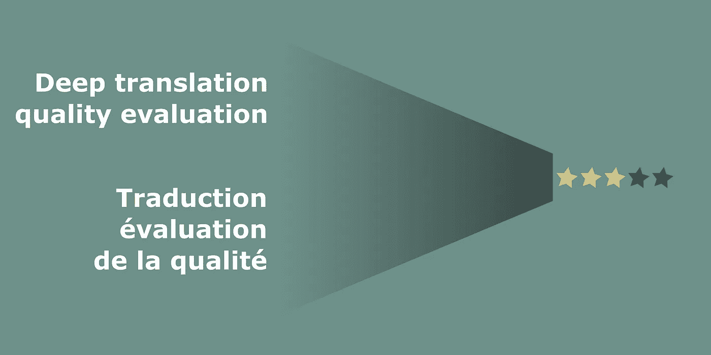
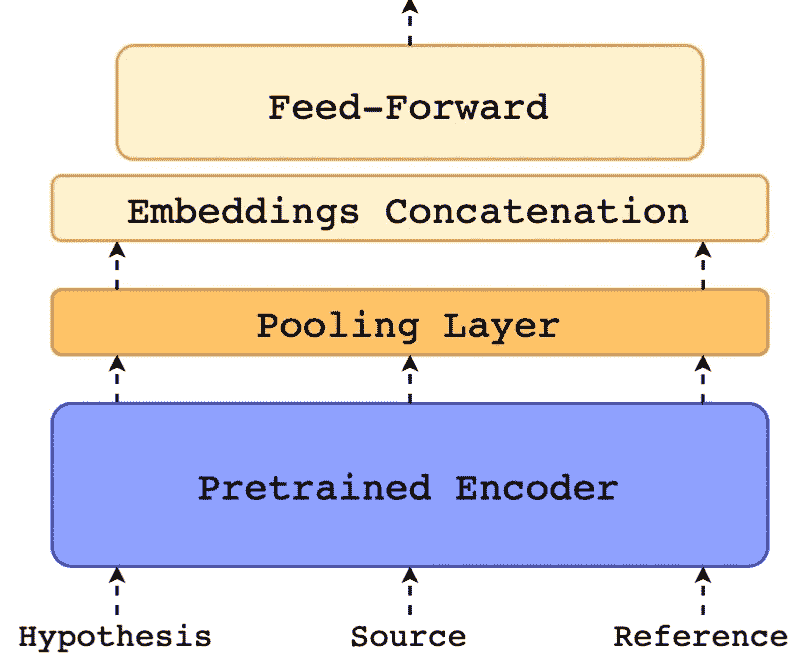
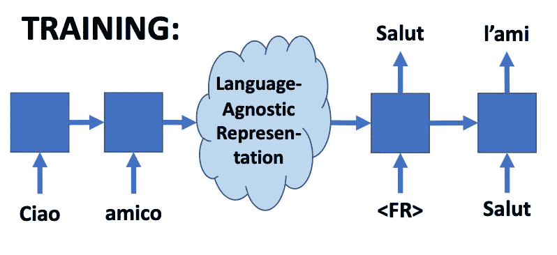
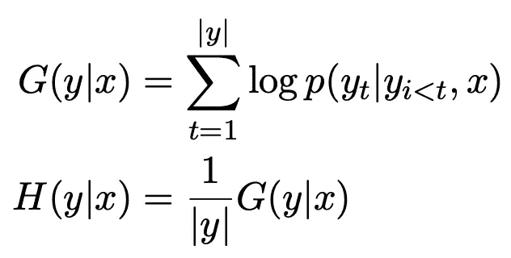

# 深度翻译质量评估——即使是谷歌也没有做对

> 原文：<https://towardsdatascience.com/even-google-does-not-get-it-right-a9685f7f63c9>

## 如何正确进行深度翻译质量评估——从衡量标准到常见注意事项

作者图片

十年前，学习一门新语言是一件艰难的事情。逐字翻译文本需要很长时间——你首先必须在字典中查找单词开头的字母，然后搜索单词本身，然后选择最符合句子意思的翻译。

今天，学习一门新语言变得容易多了。我们有太多的辅助工具供我们使用。显而易见的“去”资源是谷歌翻译。然而，即使是 google-translate，使用深度的、训练有素的神经网络也不是完美的。在互联网上有成千上万的例子，当它得到的翻译非常错误。纵观这些例子，我们似乎离完美的机器翻译(MT)工具还有很长的路要走。那么为什么设计一个如此具有挑战性呢？

翻译是一个人工智能不完整的问题——为了训练一个模型，以人类水平的准确性将翻译从一种语言映射到另一种语言，它需要纳入大量的社会，文化和历史信息，这意味着模型应该开发一种普遍的智能。

例如简单的问候“你好吗？”(法语 *)* 根据上下文可以翻译成*、【你好】、【瓦格万】、【你好】、*或*、*。考虑另一个例子——语言随时间的变化。如果给我们一本 19 世纪的小说，我们会期望模型使用适当的词汇——选择*兴奋*而不是*炒作*。

开发能够产生适当的、人类质量的翻译的机器翻译模型的更大挑战，可以通过增加模型的复杂性、在更大的数据集上训练或引入语言偏见来解决。但是，我们手上有多种模型，我们如何选择一个实际上运行良好的模型呢？我们将使用 MT 质量评估模型。很长一段时间以来，我们对 MT 模型的自动评估都是错误的，直到最近这些问题才开始自我纠正。

本文总结了机器翻译模型的自动评估指标。我将首先讨论传统的基于字符串的指标(那些实际上迫使我们犯错的指标)，质量评估的深度模型，最后讨论如何确保我们使用正确的参考来比较机器翻译模型。

# 机器翻译质量评估

评价翻译模型效果如何，最直接的方法就是请有经验的译者来评判。然而，这是非常昂贵的——你要花多长时间彻底检查一份两页的文件？要对翻译质量做出可靠的评估，两页纸是不够的。

对于那些感兴趣的人，我在关于[成对比较](/active-sampling-for-pairwise-comparisons-476c2dc18231)作为质量评估和数据集[合并用于评级和排名](/dataset-fusion-sushi-age-and-image-quality-and-what-the-hell-do-they-have-in-common-814e8dae7cf7)分数的协议的文章中谈到了主观(基于人的)评估的挑战。

自动化质量评估模型可以显著简化模型评估过程，其目的是评估参考翻译和输出翻译之间的重叠。

为了获得可靠的分数，我们需要一个与人类判断密切相关的好的度量标准，以及一组高质量的参考翻译，该度量标准将根据这些翻译进行基准测试。因此，让我们看看如何才能把两者都做好。

# 韵律学

通常，基于字符串的模型和基于深度学习的模型是有区别的。它们各有利弊。

## **字符串度量**

衡量标准最简单的形式是参考译文和目标译文中出现的单词数。有数百万个理由说明这个指标不是一个好主意——想想同义词！

[**蓝色**](https://aclanthology.org/P02-1040.pdf)

BLEU 是一种改进的精度指标，适用于 NLP 目的。其中精度是匹配参考的单词数除以候选句子中的单词总数。

机器翻译经常过度生成“合理的”单词，导致不太可能但高精度的结果(例如生成一个只包含冠词“the”的句子)。为了减轻这个问题，解决方案是清楚的:在匹配的候选单词被识别之后，参考单词应该被认为是耗尽的。因此，BLEU *修改了单字精度。*

为了计算它，我们取一个单词在任何单一参考译文中出现的最大次数；将每个候选词的总计数除以其最大引用计数，将这些被剔除的计数相加，然后除以候选词的总(未被剔除)数。

例如一个候选翻译:*“The The The The The The The”，*带参考 1: *“猫在沙发上”**参考 2: *“沙发上有只猫。”*冠词“the”在参考文献 1 中出现两次，在参考文献 2 中出现一次，我们取最大值——两次，候选词中“the”出现的总次数为七次。因此简单的 BLEU 分数是 2/7。*

*完整的 BLEU 分数结合了句子长度和各种 n-gram(一系列连续的 *n* 项)长度:*

**

*其中，BP 是简短惩罚，括号中的项是修改后的*N*-克精度、 *pn* 的几何平均值，使用*N*-克长度达到 *N* 和正权重 *wn* 之和为 1。*

*[**胭脂**](https://aclanthology.org/W04-1013.pdf) 是对 BLEU 的一种修改，然而在 **Bleu 测量精度**:多少单词(和/或 n-grams)在*机器生成的摘要*中出现在人类参考摘要中。**胭脂措施召回**:机器生成摘要中出现*人类参考摘要*中的单词(和/或 n-grams)的多少。*

*[**ChrF**](https://aclanthology.org/W15-3049.pdf)*

*ChrF 是字符 n-gram F-score(精确度和召回率的调和平均值)。与基于字符串的度量类似，它测量翻译和引用之间的重叠，但是与其他度量不同，它对短字符序列(n-grams)而不是单词进行操作。*

*这种基于字符的形式有几个优点，首先，它降低了对句子符号化的敏感性；第二，它对拼写错误的单词给予部分奖励。*

*CHRF emtric 的完整形式是:*

**

*   *CHRP:假设中的 n-grams 在引用中有对应项的百分比；*
*   *CHRR:在参照中出现在假设中的字符 n-grams 的百分比。*
*   *β是一个控制权衡的参数，通常设置为 1。*

## ***预培训指标***

*基于字符串的度量对于简单的 MT 模型来说已经足够了。现代机器翻译的神经方法产生了高得多的翻译质量，这通常偏离了语言之间单调的词汇转移。因此，需要更复杂的机制来评估翻译质量。*

*深度学习模型在这里有所帮助。典型地，这些或者是端到端的，或者是比较嵌入空间中的句子标记，而不是作为基于字符串的度量直接计数。*

*<https://arxiv.org/pdf/1904.09675.pdf>*

******

***用于计算 BertScore 的管道。图片由[张天翼](https://arxiv.org/pdf/1904.09675.pdf)提供。***

***BertScore 使用由预训练的 [Bert](https://arxiv.org/pdf/1810.04805.pdf) 模型产生的上下文嵌入，并使用余弦相似度计算匹配，可选地使用逆文档频率分数加权。***

***[**BLEURT**](https://arxiv.org/pdf/2004.04696.pdf)与 BertScore 类似，BLEURT 使用 Bert 作为主干，然而与它不同的是，BLEURT 是一个端到端的模型，它不使用手工制作的相似性度量，而是直接回归到分数。由于如此大的模型需要大量的数据来训练，而来自人类评分者的机器翻译数据很少，BLEURT rests 使用合成数据集和 BertScore 作为真实分数的代理来进行预训练。在微调阶段，使用真实数据集和翻译者排名来训练模型。***

***[**彗星**](https://arxiv.org/pdf/2009.09025.pdf)***

******

***彗星估计模型。图片由 [Ricardo Rei](https://arxiv.org/pdf/2009.09025.pdf) 拍摄。***

***与 BertScore 和 BLEURT 不同，COMET 在评估过程中也包括源语言的输入。该模型允许在没有模型输出(假设)的参考翻译的情况下进行预测。该模型被称为 COMET-src。***

***[**棱镜**](https://arxiv.org/pdf/2004.14564.pdf)***

************

***棱镜框架。图片由[布莱恩·汤普森](https://arxiv.org/pdf/2004.14564.pdf)***

***Prism 是一个句子的、序列到序列的解释器，用于强制解码机器翻译输出，并根据相应的人类参考对其进行评分。通过用特定的系统输出“查询”模型，我们可以使用模型分数来测量系统输出解释人类参考翻译的程度。该模型不基于任何人类质量判断进行训练，这在许多领域和/或语言对中是不可用的。***

***Prism 接受多语种平行示例的培训，例如“Ciao amico”翻译成法语是“Salut l'ami”。在评估时，该模型在零触发模式下使用，以根据其相应的人类参考对 MT 系统输出进行评分。例如，以人类参考“Hello world”为条件的 MT 系统输出“Hi world”被发现具有令牌概率[0.3，0.6]。***

***Prism 考虑了两种结合模型中记号级概率的方法—序列级对数概率(G)和平均记号级对数概率(H):***

******

***并且有和没有参考评估的最终棱镜得分由下式给出:***

******

# *****度量比较*****

************

***车型对比。图片由[汤姆·科米](https://arxiv.org/pdf/2107.10821.pdf)提供。***

***微软最近的一篇论文([To Ship or Not Ship:机器翻译自动度量的广泛评估](https://arxiv.org/pdf/2107.10821.pdf))对数百种语言对的度量进行了比较。***

***基于他们的发现，作者建议使用以下自动度量的最佳实践:***

*   ***使用预先训练的指标作为主要自动指标；有彗星推荐。对不支持的语言使用基于字符串的度量标准，并将其作为辅助度量标准，例如 ChrF。不要用 BLEU，它不如其他指标，已经被过度使用了。***
*   ***运行成对显著性检验，以减少随机抽样变异造成的度量误判。***
*   ***在公共测试集上发布您的系统输出，以允许比较和重新计算不同的指标分数。***

# ***参考数据***

***为了构建训练数据集，有经验的翻译人员将一种语言的文本映射到另一种语言的文本。为了确保翻译的真实性和准确性，翻译人员通常不能从框中复制文本，以防止使用自动翻译软件。孤立的句子评估是有效的，但不能惩罚上下文不匹配，因此通常会向译者展示更大上下文中的句子。通常，多个译者会收到相同的文本，并选择最相关的翻译。***

***除了所有这些机制，还有一个更强大的机制阻止翻译的准确性——人类的懒惰。***

***谷歌最近的一篇论文( [BLEU 可能有罪，但参考文献并非无辜](https://arxiv.org/pdf/2004.06063.pdf))显示，用于评估机器翻译模型的常用参考文献的质量远非完美。主要问题是翻译腔映射——带有源语言假象的句子，例如特定的词序和词汇选择。也许这并不奇怪，但是像 BLEU 这样对字符串值进行操作的度量标准会鼓励模型学习映射到翻译腔语言。***

***很容易看出，如果我们奖励翻译腔映射的一致性，劣质模型将如何被奖励和选择用于开发。***

***从谷歌的论文中可以看出，标准参考翻译可能会对改善机器翻译的机制产生偏见。先前的研究可能错误地丢弃了基于这些偏见的技术。为了纠正这个问题，他们建议重新措辞参考——这有助于改善自动评估指标的机器翻译模型选择，现在将惩罚多样化和相关的映射。***

# ***摘要***

***随着时间的推移，语言的变化和多种可能的翻译使机器翻译成为一个难以解决的问题。随着机器翻译模型的发展，质量评估模型也应该发展-正如我们所见，BLEU 足以进行简单的翻译，但是，它无法捕捉当前深度学习模型所实现的丰富的语言结构。***

***因为即使对专业口译员和笔译员来说，获得正确的翻译也是非常具有挑战性的，所以我们在使用参考翻译对模型进行基准测试时需要格外小心。然而，有专门的机制来解决这个问题。***

***在本文中，我介绍了以下基于字符串的**指标:，[胭脂](https://aclanthology.org/W04-1013.pdf)，[ChrF](https://aclanthology.org/W15-3049.pdf)；以及**基于深度学习**的度量:[慧星](https://arxiv.org/pdf/2009.09025.pdf)、[贝特斯科尔](https://arxiv.org/pdf/1904.09675.pdf)、[布莱恩特](https://arxiv.org/pdf/2004.04696.pdf)、[棱镜](https://arxiv.org/pdf/2004.14564.pdf)、 [ESIM](https://aclanthology.org/P19-1269.pdf) 。*****

***如果你喜欢这篇文章，请与朋友分享！要阅读更多关于机器学习、数据科学、计算机视觉和图像处理的内容，请点击订阅！***

***我错过了什么吗？不要犹豫，直接给我留言、评论或发消息吧！***