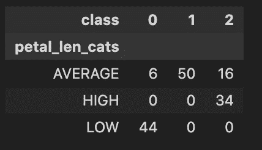

# 每次统计测试都要检查特征相关性

> 原文：<https://towardsdatascience.com/every-statistical-test-to-check-feature-dependence-773a21cd6722>

## 不同数据类型和假设的相关性和假设检验

本文涵盖了检测特征对之间相关性的统计测试，不管它们的数据类型如何，以及基于数据的属性使用哪种测试。

[尼古拉斯·卡佩洛](https://unsplash.com/@bash__profile?utm_source=unsplash&utm_medium=referral&utm_content=creditCopyText)在[号航天飞机](https://unsplash.com/s/photos/graph?utm_source=unsplash&utm_medium=referral&utm_content=creditCopyText)上拍摄的照片

您经常会发现自己在探索性数据分析过程中使用统计测试。在监督设置中，可以查看特征和目标变量之间是否存在相关性，从而决定数据集是否可用于预测目标结果。在无人监督的情况下，您可能会使用统计测试来查看是否存在相互依赖的特征。这种关系可能指向冗余特征，您可能需要将其删除。您使用的测试取决于要素类型和数据集属性。

特征可以有不同的类型，即[定性(名义/顺序)和定量(连续/离散)](https://www.reneshbedre.com/blog/others.html#variable-types)。因此，对于每对变量，我们必须使用适当的统计检验。此外，每个统计测试都假定数据集具有某些行为(例如,[正态分布、](https://statisticsbyjim.com/basics/normal-distribution/)单调关系等)。因此，还必须根据这些假设中的哪一个来选择统计检验。

让我们考虑[虹膜数据集](https://archive.ics.uci.edu/ml/datasets/iris)并设计一些特征来解释您需要了解的不同类型的统计测试

正在加载虹膜数据集。请注意，我们还创建了一个序号变量“花瓣 _len_cats ”,以显示如何处理序号数据。

# 定量&定量

对于变量对，其中两者都是定量的，我们使用统计测试，给我们一个称为相关性的度量。相关性被定义为两个随机变量之间的关联。在统计学中，它通常指一对变量线性相关的程度。

> 注意:在谈论相关性时必须提到的一个强制性警告是“相关性并不意味着因果关系”。查看[这篇文章](https://sundaskhalid.medium.com/correlation-vs-causation-in-data-science-66b6cfa702f0)了解更多相关信息。

让我们看看可以使用的不同相关性测试。

**皮尔逊相关检验**

这也被称为皮尔逊积矩相关(PPMC ),用于检测变量对之间的线性关系。它返回一个介于-1 和+1 之间的值。A -1 意味着有很强的负相关性，即一个变量增加，另一个变量减少。+1 表示有很强的正相关性，即一个变量增加，另一个变量也增加。0 表示没有相关性(这也称为**零相关性**)。

在以下情况下，您应该使用皮尔逊相关性检验

*   两个变量都是定量的
*   两个变量都是正态分布
*   数据没有异常值
*   变量之间的关系被假定为线性的

我们可以使用 scipy 的 stats 库来计算相关性。

使用 scipy stats 计算 pearson 相关性

> 注意:该软件包还提供了 p 值(查看为什么 p 值很重要[这里是](/should-you-use-pandas-corr-function-af82c454bc0))，它表示不相关的数据集能够产生相同相关性的概率。p 值用于确保相关数是可靠的。

**斯皮尔曼相关检验**

这也称为 Spearman 秩相关检验或 Spearman 秩相关检验，用于检测变量之间是否存在[单调关系](https://www.discoverphds.com/blog/monotonic-relationship)。它还返回一个介于-1 和+1 之间的值，其中-1 表示负单调关系，+1 表示正单调关系。

在以下情况下，您应该使用 spearman 相关性检验

*   变量是数量的或顺序的
*   变量不符合正态假设
*   变量具有[单调](https://www.discoverphds.com/blog/monotonic-relationship)关系

> 注:斯皮尔曼相关或斯皮尔曼等级相关之所以如此称呼，是因为它被设计用于顺序变量。然而，由于它的非参数性质，它也用于没有正态分布的定量变量

我们可以再次使用 scipy 的 stats 包来计算 spearman 相关性。

使用 scipy stats 计算 spearman 相关性

**肯德尔-陶相关检验**

这也称为肯德尔秩相关检验，用于检测[单调关系](https://www.discoverphds.com/blog/monotonic-relationship)的存在。

你应该使用肯德尔-陶

*   变量是顺序的或数量的
*   假设变量具有单调关系
*   数据的样本量很小(因数据集而异，但粗略的经验法则是小于 500)

我们可以再次使用 [scipy 的 stats](https://docs.scipy.org/doc/scipy/reference/generated/scipy.stats.spearmanr.html) 包来计算 kendall-tau 相关性。

使用 scipy stats 计算 kendall-tau 相关性

# 定量和定性

对于成对的变量，其中一个是定量的，一个是定性的，我们可以使用下面的统计测试

**方差分析测试**

方差分析(ANOVA)，也称为单向 ANOVA，用于比较两个以上组的平均值(本质上，我们按定性变量分组，取定量变量的平均值)。它被设置为假设检验，以确定两个或多个组的平均值是否相等(零假设)，或者是否至少一个组的平均值与其他组的平均值不同(交替假设)。既然是假设检验，我们就用 p 值来拒绝(如果 p 值<0.05) or accept the null-hypothesis.

Accepting the null hypothesis means that features do not have a dependence between them, while rejecting it means features do have a dependence between them.

> Note: When you have only 2-groups, you can also use a [t 检验](https://www.reneshbedre.com/blog/ttest.html))。然而，根据经验，t 检验和 ANOVA 的 p 值[通常是一致的](https://www.youtube.com/watch?v=rD6rLx1_SE8)。

在以下情况下，您应该使用方差分析

*   因变量是定量的，自变量是定性的
*   残差是正态分布的(残差是单个值和一组所有值的平均值之间的差)
*   组间方差相等(称为“同方差”)
*   一个群体中的各个价值观彼此之间，或者在他们自己内部，并不存在依赖关系。

我们可以使用 scipy 的统计软件包来计算 ANOVA 测试 p 值。

使用 scipy stats 计算 ANOVA p 值。

**克鲁斯卡尔-沃利斯试验**

这也被称为 Kruskal-Wallis H 检验或 Kruskal-Wallis ANOVA，因为它是单向 ANOVA 的非参数替代方法。它再次被用作假设检验来比较多于 2 组的平均值(类似于 ANOVA ),但是关于数据集的假设是不同的。

在下列情况下，您应该应用克鲁斯卡尔-沃利斯检验

*   因变量应该是数量型或序数型的
*   自变量应该至少有两组
*   一个群体中的各个价值观彼此之间，或者在他们自己内部，并不存在依赖关系。

因此，假设的数量本质上比方差分析的数量少(即不需要正态性或同方差)

> 注意:当您只有 2 组时，您也可以使用[曼-惠特尼 U 检验](https://www.reneshbedre.com/blog/mann-whitney-u-test.html)。根据经验，克鲁斯卡尔-沃利斯或曼恩-怀特尼的 p 值通常与[接近](https://stats.stackexchange.com/questions/34023/which-result-to-choose-when-kruskal-wallis-and-mann-whitney-seem-to-return-contr)

我们可以使用 [scipy 的 stats](https://docs.scipy.org/doc/scipy/reference/generated/scipy.stats.kruskal.html) 包来计算 Kruskal-Wallis 检验 p 值。

使用 scipy stats 计算 Kruskal p 值。

# 定性和定性

对于两个都是定性变量的变量对，我们使用卡方检验。

**卡方检验**

它也被称为独立性卡方检验，也是一种假设检验。我们创建一个定性变量的交叉表。(见下图)然后，如果变量之间没有关系，我们测试表中观察到的频率和预期频率之间是否有任何差异。零假设假设观察到的频率和预期的频率之间没有差异。因此，如果我们接受零假设(例如 p 值> 0.05)，那么我们说变量不相互依赖。

使用 iris 数据集中的“class”和“petal_len_cats”列的交叉列表数据

在下列情况下，您应该使用卡方检验

*   两个变量都是定性的
*   所有的观察都是独立的
*   我们观察到，当数据由单独的类别值对分组时，在创建的每个组中至少有 5 个频率。

我们使用 [scipy 的 stats](https://docs.scipy.org/doc/scipy/reference/generated/scipy.stats.chisquare.html) 包来计算卡方检验的 p 值。

使用 scipy stats 计算卡方 p 值。

# 结论

在这篇文章中，我们介绍了检查特性依赖性所需的所有统计测试。

*   皮尔逊相关检验
*   斯皮尔曼相关检验
*   肯德尔-陶相关检验
*   方差分析检验
*   克鲁斯卡尔-沃利斯 H 检验
*   卡方检验

> 注:需要注意的是，即使原始特征在上述测试中没有显示出相互之间或与目标变量之间的相关性，但在特征工程中(如宁滨是一个定量变量或压缩一个定性变量)，相关性可能会出现。因此，我们不应该简单地应用测试，而应该根据需要检查、理解和转换数据，以识别依赖性/关系。

# 参考

<https://www.scribbr.com/statistics/correlation-coefficient/#spearmans-rho>  <http://www.biostathandbook.com/spearman.html#:~:text=When%20to%20use%20it,tends%20to%20increase%20or%20decrease>  </kendall-rank-correlation-explained-dee01d99c535>  <https://www.reneshbedre.com/blog/anova.html>  <https://www.reneshbedre.com/blog/kruskal-wallis-test.html>  <https://en.wikipedia.org/wiki/Chi-squared_test>  <https://www.statology.org/chi-square-test-assumptions/> 