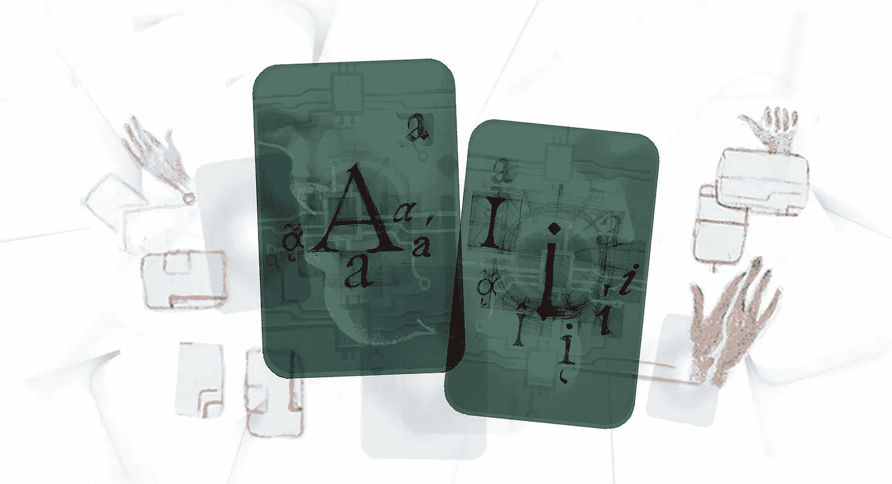

# 大家对 AI 写作工具的看法都是错的

> 原文：<https://towardsdatascience.com/everyone-is-wrong-about-ai-writing-tools-582439953cf3>

## 嗯，也许不是每个人，但我没有写这个标题…

Alina Constantin /更好的人工智能图像/手工人工智能/ CC-BY 4.0

我是一个人工智能作家。因此，我对这个话题有一个独特的双重视角:我的“我知道人工智能”思维和我的“我写作”思维有强烈的冲突意见。

我的 AI 脑子里不断重复着“放心吧，AI 是哑巴；它不能推理，也不能理解。”但是我的写作思维说，“嘿，我以前在区分 GPT-3 和人类方面有问题。”

当然，我的那些身份关心对他们每个人都重要的事情。正是在他们观点的交汇点上，我意识到双方都是对的——部分是对的。

一方面，即使是最复杂的人工智能写作工具——尽管令人印象深刻——也不过是精通的表象。这是一个海市蜃楼，源于我们的轻信和我们对他们完美咒语背后的现实的有限了解。

另一方面，对我们来说不幸的是，外表可能已经足够了:只要这感觉像是我写的，而且幻觉经得起你的仔细检查，那么你就满意了。

这是我写的还是人工智能写的，对你来说都不重要。

是吗？

# 人类语言的秘密

正如艾米丽·m·本德和亚历山大·柯勒教授在 2020 年关于人工智能语言模型的论文中雄辩地指出的那样，我们人类写作是为了交流一些东西。

总有一个意图——话语背后的目的。

然而，光靠文字无法传达这种意图。读者，无论我想在你身上引起什么样的效果，都藏在我的心里。一旦这些字母离开我的指尖永远不变地留在这一页上，它们就变成了一个空的外壳。

除非另一个头脑——你的头脑——偶然发现这些符号并赋予它们新的含义。可能和我的差不多。也许不是。

作为一个读者，你的任务是用你赋予它们的意义，结合我们共同的语言系统(英语)和你的世界知识，对我想要灌输到这些单词中的信息进行逆向工程。

钥匙来了。

就在那一刻——当你的意思压倒了我的意思，因为你重建了最初的意图，交流发生了——突然变得至关重要的是，这些话来自我的思维头脑，而不是来自人工智能[随机鹦鹉](https://dl.acm.org/doi/10.1145/3442188.3445922)。

为什么？因为如果不是一个人写的，你会毫无意义地寻找不存在的东西:

内在没有意义。也没有被收回的意图。

*本文选自*[***The algorithm Bridge***](https://thealgorithmicbridge.substack.com/subscribe?)*，这是一份旨在弥合算法与人之间鸿沟的教育通讯。它将帮助你理解人工智能对你生活的影响，并开发工具来更好地导航未来。*

 [## 算法桥

### 弥合算法和人之间的鸿沟。关于与你生活相关的人工智能的时事通讯。点击阅读…

thealgorithmicbridge.substack.com](https://thealgorithmicbridge.substack.com/subscribe) 

# AI 书写工具达不到的地方

我看过 GPT-3 写的[高质量散文](https://arxiv.org/pdf/2005.14165.pdf):

信用:OpenAI

[谜一般的诗歌](https://twitter.com/OwainEvans_UK/status/1500589899996672003):

[欧文·埃文斯的推特](https://twitter.com/OwainEvans_UK/status/1500589899996672003)

以及[引人入胜的哲学论文](https://twitter.com/raphaelmilliere/status/1289129723310886912):

[拉斐尔·米利耶的推特](https://twitter.com/raphaelmilliere/status/1289129723310886912)

然而，尽管它不可否认地掌握了语言的形式，但还是有人工智能永远达不到的地方——不管它有多好(在当前的范式下)。

在这些地方，意图比语言更重要。

如果你了解我，你在这里不是仅仅因为你想读一些东西或者得到一些未定义的值。你在这里是因为你想阅读我必须写的东西，并提取我能够提供的价值。

我作为作家对你来说有一些内在的重要性，因为你想通过我的文字，获得我隐藏在内心的交流意图。你想偷窥我的想法。

这些话只不过是达到那个目的的手段。

直截了当地说:如果这些话是 GPT-3 而不是我写的，这将扼杀写这些话的初衷。读这篇文章不会给你同样的价值，因为方法(文字)不会带你到你的目的(找回我的意图)。

让我用这句话来说明为什么(这句话来自一位老师要求学生不要用 GPT-3 写文章):

> “作为一名教师，我可以说这是我害怕的事情。如果我知道我的学生提交人工智能论文，我会退出。给一个人工智能写的东西打分是对我生命的一种令人沮丧的浪费。”

读者看重的是与作者之间值得信赖的关系，而不是表面上值得信赖的关系。

但是我承认——这要看情况。

读者对意图和文字的相对重视取决于许多因素:他们是在读一本书还是一则广告？他们了解作者还是只关心内容提供了什么？他们关心被辩护的论点和论题，还是只关心花些时间阅读？

读书可以是被动消费。在这种情况下，文字最有价值。

但是当阅读成为与作者永恒的主动对话时，文字就不重要了——有价值的是潜在的意图。

无论是 GPT-3 还是任何其他类似的人工智能语言模型——无论它多么擅长连贯地表达符号——都无法提供这种能力。

# 但是人工智能背后有一个人类！

你可能会说提示可以有效地保留人类的意图。

最终，人工智能不会自己想出单词，而是人类以自然语言输入的形式通过聪明的推动来引导它完成可能的完成。

然而，由于我上面列出的论点，提示不能包含人工智能背后的人的意图。而且，即使他们做到了，也没有人工智能能够捕捉到最初的目的。

人工智能系统不仅缺乏故意写*的能力。它们也缺乏从人类书写的文本中检索意图的能力。原因？他们无法获得意义，而意义通过将后者置于现实世界的实体中来调解意图和话语之间的关系。*

*底线是，每当一个人工智能出现在通信链中，就有一个有缺陷的环节。*

*一旦作者(提示者)接受人工智能的输出是有效的，他们就放弃了他们最初的意图——如果有的话。*

*对于作者来说，这可能是本文中最有价值的见解:在使用人工智能写作工具时，你可能会用人工智能决定输出的任何东西来取代你明智、有趣或有用的交流意图。*

*一旦你开始说，“那就够好了”，你在成品中的存在就开始减少。*

# *最后的想法*

*在这篇文章中，我强调了人类和人工智能写作工具之间的比较是多么的根本错误。*

*这种分析是理解谁处于风险中以及哪些任务可能最终被自动化的关键。例如，规模比风格更重要，对读者的影响比作者的意图更重要的任务。*

*在这种情况下，风险最高。如果你在读莎士比亚的故事，你会在意是他而不是一个模仿他声音的人工智能。如果一家营销机构想为下一次活动想出一个巧妙的广告，你和他们都不会在意。*

*作为一名时事通讯作者，我可能处于安全-不安全光谱的上半部分。但是，广告文案、广告营销人员、普通内容创作者、自由撰稿人，甚至代笔人——以及其他人——可能会面临更加严峻的未来。*

*最后，请记住这一点:*

*AI 能写出看似人为的文字吗？是的。读者能从 AI 写的作品中获得价值吗？是的。AI 写作工具能增强写作者的能力吗？是的。AI 写作工具能否冲击对人类作家的需求？很遗憾，是的。*

*但是 AI 能写出*如何*或者*为什么*人类会写吗？不，现在不会，以后也不会。*

*作者和读者都要记住的东西(也适用于其他生成性人工智能，如文本到图像模型)。*

**订阅* [**算法桥**](https://thealgorithmicbridge.substack.com/) *。弥合算法和人之间的鸿沟。关于与你生活相关的人工智能的时事通讯。**

**您也可以直接支持我在 Medium 上的工作，并通过使用我的推荐链接* [**这里**](https://albertoromgar.medium.com/membership) 成为会员来获得无限制的访问权限！ *:)**