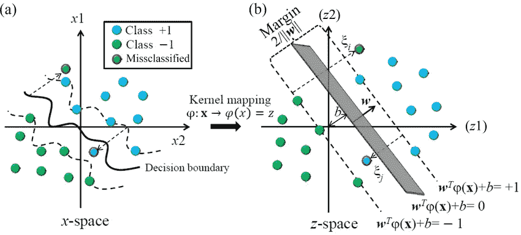
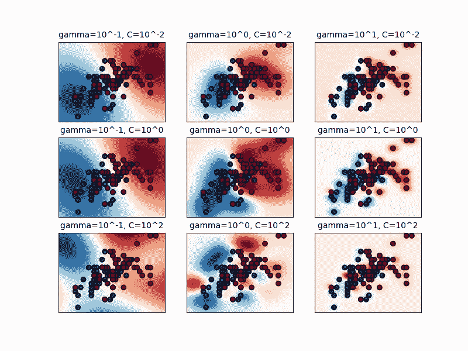
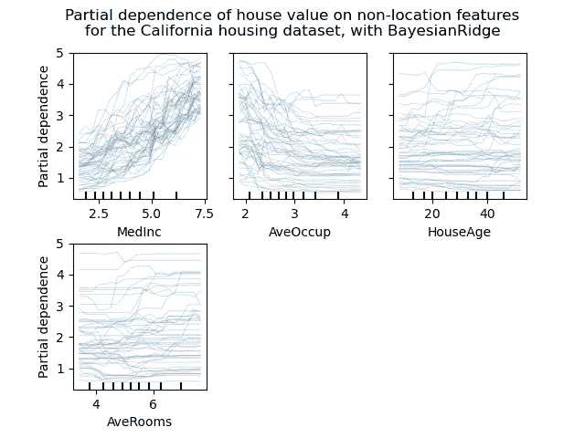
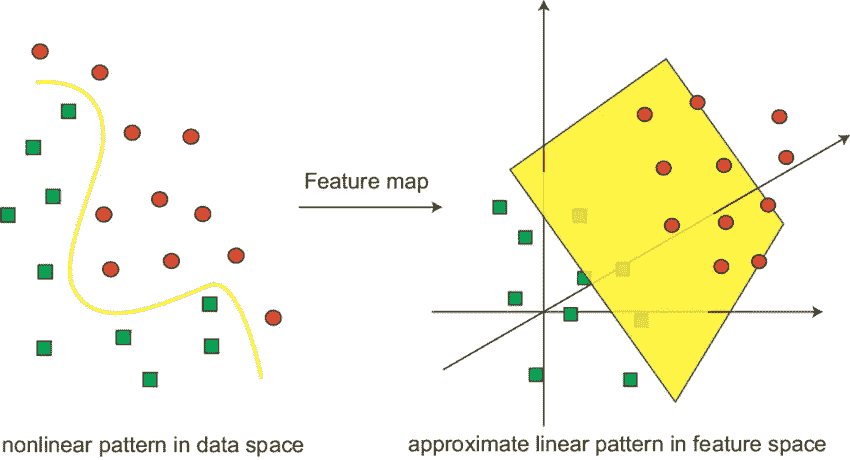
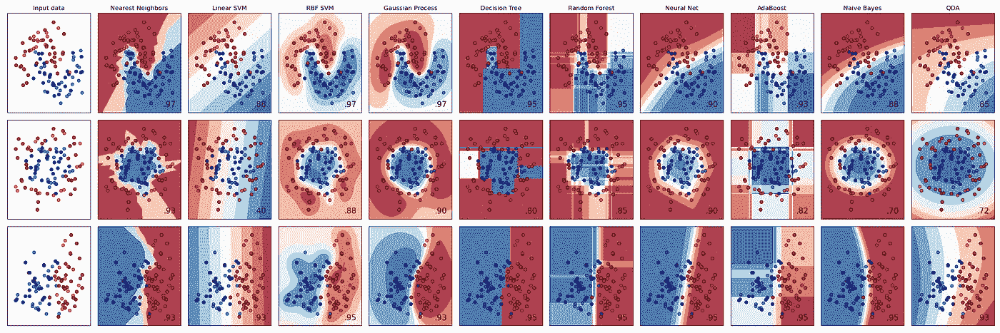

# 关于支持向量分类的一切——以上及以上

> 原文：<https://towardsdatascience.com/everything-about-svm-classification-above-and-beyond-cc665bfd993e>


图片来自[修补洞见](https://jobs.revampinsights.com/the-place-of-critical-thinking-in-the-21st-century-work-environment/)

## 支持向量分类综述

当涉及到识别和解决你所在领域的具体问题时，机器学习提供了很多可能性。试图掌握机器学习有时既复杂又难以理解。大多数初学者开始学习回归是因为它的简单和容易，然而这并没有解决我们的目的！当涉及到为不同的应用使用不同类型的算法时，人们可以做的不仅仅是回归。

分类是各种监督学习算法的一个应用领域。除了不自然的趋势和势头，这些分类器通常具有相似的性能。然而，当涉及到数据的复杂性及其范围时，支持向量机可能是制定更好决策的好选择。

在继续这篇文章之前，我建议你快速通读一下我以前的文章——[随机森林回归快速而肮脏的指南](/a-quick-and-dirty-guide-to-random-forest-regression-52ca0af157f8)和[释放支持向量回归的真正力量](/unlocking-the-true-power-of-support-vector-regression-847fd123a4a0)来研究集成学习和支持向量机的概念。如果你觉得这篇文章内容丰富，请考虑为这篇文章鼓掌，让更多的人看到它，并关注我获取更多#MachineLearningRecipes。

## **支持机罩下的向量机**

机器学习中发生的一切都有直接或间接的数学直觉与之相关联。类似地，使用支持向量机，大海中有大量的数学。有各种各样的概念，例如向量的长度和方向、向量点积以及与算法相关的线性可分性。



图片来自 [ResearchGate](https://www.google.com/url?sa=i&url=https%3A%2F%2Fwww.researchgate.net%2Ffigure%2FGraphical-presentation-of-the-support-vector-machine-classifier-with-a-non-linear-kernel_fig1_299529384&psig=AOvVaw2CqGhfXjB0toBHYmYyWGRT&ust=1648726769932000&source=images&cd=vfe&ved=0CAsQjRxqFwoTCPCBnoPg7fYCFQAAAAAdAAAAABAb)

虽然这是研究的一个重要部分，但它主要由研究人员进行研究，试图优化和/或扩展算法。在这一节中，我们将只研究定义超平面和分类器背后的数学直觉。二维可线性分离的数据可以用一条线分开。直线的函数由 y=ax+b 给出，用 x1 重命名 x，用 x2 重命名 y，得到 ax1 x2+b = 0。

如果我们定义 x = (x1，x2)和 w = (a，1)，我们得到:w⋅x+b=0.这是超平面的方程。一旦定义了超平面，就可以用它来进行预测。假设函数 h .超平面之上或之上的点将被分类为 class +1，超平面之下的点将被分类为 class -1。

## 什么是支持向量机？

支持向量机或 SVM 具有监督学习算法，可用于回归和分类任务。由于它的健壮性，它通常被用来解决分类任务。在该算法中，数据点首先在 n 维空间中表示。然后，该算法使用统计方法来寻找分隔数据中存在的各种类的最佳线。


图片来自 [ResearchGate](https://www.researchgate.net/figure/Block-diagram-of-a-Learning-Vector-Quantization-network-Refer-to-Table-42-for-a_fig11_34709753)

如果数据点被绘制在二维图中，那么决策边界被称为直线。然而，如果有两个以上的维度，这些维度被称为超平面。虽然可能有多个超平面来分隔类别，但 SVM 选择了类别之间距离最大的超平面。

超平面和最近的数据点(称为支持向量)之间的距离被称为余量。保证金可以是软保证金，也可以是硬保证金。当数据可以分成两个不同的集合，并且我们不希望有任何错误分类时，我们在交叉期间使用我们的训练集权重来训练具有硬边界的 SVM。

然而，当我们需要我们的分类器有更多的通用性时，或者当数据不能清楚地分成两个不同的组时，我们应该选择一个软余量，以便允许一些非零的误分类。支持向量机通常用于复杂的小型健壮数据集。


图片来自 [Pixabay](https://pixabay.com/illustrations/technology-artificial-intelligence-3762541/)

没有核的支持向量机可能具有与逻辑回归算法相似的性能，因此可以互换使用。与考虑所有数据点的逻辑回归算法不同，支持向量分类器仅考虑最接近超平面的数据点，即支持向量。

## **SVM 分类图书馆**

Scikit-learn 包含许多有用的库，可以在一组数据上实现 SVM 算法。我们有几个库可以帮助我们顺利实现支持向量机。这主要是因为这些库提供了我们需要的所有必要的函数，这样我们就可以轻松地应用 SVM 了。

首先，有一个 LinearSVC()分类器。顾名思义，这个分类器只使用线性核。在 LinearSVC()分类器中，我们不传递内核的值，因为它仅用于线性分类目的。Scikit-Learn 提供了另外两个分类器— SVC()和 NuSVC()，它们用于分类目的。



图片来自 [SkLearn](https://scikit-learn.org/stable/auto_examples/svm/plot_rbf_parameters.html#sphx-glr-auto-examples-svm-plot-rbf-parameters-py)

这些分类器大多相似，只是在参数上有一些差异。NuSVC()类似于 SVC()，但是使用一个参数来控制支持向量的数量。既然你已经掌握了什么是支持向量分类的关键，我们将试着构建我们自己的支持向量分类器。构建这个回归模型的代码和其他资源可以在[这里](https://www.kaggle.com/code/prashant111/svm-classifier-tutorial/notebook)找到。

## **步骤 1:导入库并获取数据集:**

第一步，导入我们将用于实现本例中的 SVM 分类器的库。没有必要只在一个地方导入所有的库。Python 给了我们在任何地方导入库的灵活性。首先，我们将导入 Pandas、Numpy、Matplotlib 和 Seaborn 库。

```
import numpy as np
import pandas as pd
import matplotlib.pyplot as plt
import seaborn as sns
%matplotlib inline

import os
for dirname, _, filenames **in** os.walk('/kaggle/input'):
    for filename **in** filenames:
        print(os.path.join(dirname, filename))
```



图片来自 [SkLearn](https://scikit-learn.org/stable/auto_examples/release_highlights/plot_release_highlights_0_24_0.html#sphx-glr-auto-examples-release-highlights-plot-release-highlights-0-24-0-py)

在这个例子中，使用了预测脉冲星恒星的数据集。该数据集包含 16，259 个由 RFI/噪声引起的虚假示例和 1，639 个真实脉冲星示例。每行首先列出变量，类标签是最后一项。使用的类别标签是 0(负)和 1(正)。

## **步骤 2:探索性数据分析和可视化:**

成功加载数据后，我们的下一步是浏览数据以获得关于数据的见解。数据集中有 9 个变量。8 是连续变量，1 是离散变量。离散变量是 target_class 变量。它也是目标变量。

```
df.columns = ['IP Mean', 'IP Sd', 'IP Kurtosis', 'IP Skewness', 
              'DM-SNR Mean', 'DM-SNR Sd', 'DM-SNR Kurtosis', 'DM-SNR Skewness', 'target_class']
df.column
df['target_class'].value_counts()/np.float(len(df))
df.info()plt.figure(figsize=(24,20))
plt.subplot(4, 2, 1)
fig = df.boxplot(column='IP Mean')
fig.set_title('')
fig.set_ylabel('IP Mean')
```

重命名列、删除前导空格以及处理丢失的值也是这一步的一部分。清理完数据后，将数据集可视化，以了解趋势。search 是一个优秀的库，可以用来可视化数据。

## **步骤 3:特征工程和拟合模型:**

特征工程是利用领域知识通过数据挖掘技术从原始数据中提取特征的过程。对于这个模型，我选择了只有数值的列。


图片来自 [Pixabay](https://pixabay.com/photos/algorithm-pictures-by-machine-3859537/)

为了处理分类值，应用了标签编码技术。默认的超参数意味着 C=1.0，内核=rbf，gamma=auto 以及其他参数。

```
from sklearn.preprocessing import StandardScaler
scaler = StandardScaler()
X_train = scaler.fit_transform(X_train)
X_test = scaler.transform(X_test)
```

选择所需参数后，下一步是从 sklearn 库中导入 train_test_split，该库用于将数据集拆分为训练和测试数据。之后，从 sklearn.svm 导入 SVR，并在训练数据集上拟合模型。

## **第四步:准确度、精确度和混淆矩阵:**

需要检查分类器是否过拟合和欠拟合。训练集准确度分数是 0.9783，而测试集准确度是 0.9830。这两个值相当。所以，不存在过度拟合的问题。**精度**可以定义为正确预测的阳性结果占所有预测阳性结果的百分比。

它可以被给定为真阳性(TP)与真阳性和假阳性之和(TP + FP)的比值。混淆矩阵是一种总结分类算法性能的工具。混淆矩阵将给出分类模型性能和模型产生的错误类型的清晰图像。



图片来自 [ResearchGate](https://www.google.com/url?sa=i&url=https%3A%2F%2Fwww.researchgate.net%2Ffigure%2FThe-illustration-of-nonlinear-SVM_fig1_228444578&psig=AOvVaw3GBolFdl58r-ijxCNALrkW&ust=1648725485422000&source=images&cd=vfe&ved=0CAsQjRxqFwoTCPjD0Kjb7fYCFQAAAAAdAAAAABAl)

它给出了按类别细分的正确和错误预测的摘要。这个概要以表格的形式表示。分类报告是评估分类模型性能的另一种方式。它显示模型的精确度、召回率、f1 和支持分数

```
svc=SVC() 
svc.fit(X_train,y_train)y_pred=svc.predict(X_test)
print('Model accuracy score with default hyperparameters: **{0:0.4f}**'. format(accuracy_score(y_test, y_pred))
```

另一个直观测量分类模型性能的工具是 ROC 曲线。ROC 曲线代表受试者工作特性曲线。ROC 曲线是显示分类模型在各种分类阈值水平的性能的图。

## SVM 分类器的优点:

支持向量分类具有下面提到的某些优点:

*   当阶级之间有明确的界限时，SVM 相对来说运作良好。
*   SVM 在高维空间中更有效，并且相对内存效率高
*   SVM 在维数大于样本数的情况下是有效的。



图片来自 [SkLearn](https://scikit-learn.org/stable/auto_examples/classification/plot_classifier_comparison.html#sphx-glr-auto-examples-classification-plot-classifier-comparison-py)

## SVM 分类器的缺点:

SVM 在处理分类时面临的一些缺点如下所述:

*   SVM 算法不适合大数据集。
*   当数据集具有更多噪声时，即目标类别重叠时，SVM 执行得不是很好。如果每个数据点的特征数量超过了训练数据样本的数量，则 SVM 将表现不佳。
*   由于支持向量分类器通过将数据点放在分类超平面的上方和下方来工作，因此没有对分类的概率解释。

至此，我们已经到了这篇文章的结尾。我希望这篇文章能帮助你了解 SVC 算法背后的思想。如果你有任何问题，或者如果你认为我犯了任何错误，请联系我！通过 [LinkedIn](https://www.linkedin.com/in/thisisashwinraj/) 与我联系，并查看我的其他机器学习食谱:

[](/an-exhaustive-guide-to-classification-using-decision-trees-8d472e77223f) [## Python 3.x 中决策树分类的详尽指南

### 使用决策树进行分类的端到端教程

towardsdatascience.com](/an-exhaustive-guide-to-classification-using-decision-trees-8d472e77223f) [](/getting-acquainted-with-k-nearest-neighbors-ba0a9ecf354f) [## 认识 K 个最近邻

### 一种逐步建立 KNN 分类器的方法

towardsdatascience.com](/getting-acquainted-with-k-nearest-neighbors-ba0a9ecf354f)