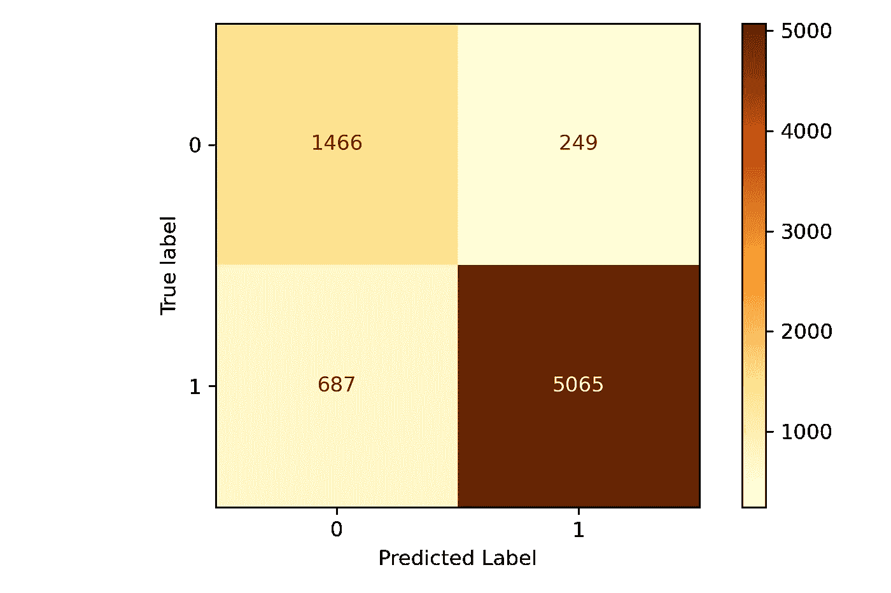

# 构建惊人的二进制分类器所需的一切

> 原文：<https://towardsdatascience.com/everything-you-need-to-know-to-build-an-amazing-binary-classifier-590de3482aad>

## 利用机器学习将产品评论自动分类为正面或负面


安妮·斯普拉特在 [Unsplash](https://unsplash.com?utm_source=medium&utm_medium=referral) 上的照片

# 机器学习中的分类是什么？

有两种最简单形式的**监督机器学习**方法。首先，你可能会遇到一个**回归问题**，你试图预测一个连续变量，比如温度或股票价格。第二个是**分类**问题，您希望预测一个分类变量，如*通过/失败*或*垃圾邮件/火腿*。此外，我们可能会遇到**二元分类**问题，我们将在此仅讨论两个结果，以及**多类分类**两个以上的结果。

# 准备数据

我们想采取几个步骤来为机器学习准备数据。对于文本，我们希望*清除*它移除不需要的字符或数字，我们希望移除*停用词*，或出现频率太高的词，我们还应该*词干*或*对*词进行去词法分析，这将把诸如*运行*和*运行*这样的词带到它们的根形式【T28 运行。我们可能想要创建*新列*或功能来帮助您的机器学习分类过程。

对于这个例子，我们将使用 Kaggle 上[女装电子商务服装评论的数据集，该数据集可以在](https://www.kaggle.com/nicapotato/womens-ecommerce-clothing-reviews) [CC0:公共领域](https://creativecommons.org/publicdomain/zero/1.0/)下供您使用。

像往常一样，让我们加载执行该分析所需的所有库:

```
# Gereral Imports
import numpy as np
import pandas as pd
import re
import string
from timeit import timeit

# Machine Learning Imports
from sklearn.model_selection import train_test_split
from sklearn.metrics import ConfusionMatrixDisplay
from sklearn.feature_extraction.text import TfidfVectorizer
from sklearn import metrics 
from sklearn.model_selection import cross_val_score
from sklearn.model_selection import RepeatedStratifiedKFold
from sklearn.linear_model import LogisticRegression
from sklearn.ensemble import RandomForestClassifier
from sklearn.preprocessing import MinMaxScaler
from sklearn.compose import ColumnTransformer
from sklearn.pipeline import Pipeline

# Model Persistence Imports
from joblib import dump, load

# Test Processing Imports
import nltk
from nltk.stem import PorterStemmer

# Plotting Imports
import matplotlib.pyplot as plt
%matplotlib inline
```

# 特征工程

该数据集包含评论、评级、部门名称和撰写评论的人的年龄。评级系统是经典的*1–5 星*系统。在清理之前，让我们导入数据并创建一些我们将在模型中使用的关键列，也称为**特征工程**。我们将使用`read_csv`函数读取数据并创建一个名为`df`的数据帧。

1.  由于我们正在执行*二进制分类*，我们的**目标**变量需要是`1`或`0`。在五星评论系统中，我们可以将`4`和`5`评论设为**正级**，然后将剩余的`1`、`2`和`3`评论设为**负级**。
2.  这组特殊的评论既有标题**又有**评论文本**字段。我们可以将这两列合并成一个名为 **Text** 的新列，以简化我们的处理。**
3.  作为模型中的另一个特性，我们可以创建一个新的列来表示评论文本的总长度。

**注意** : *这里我没有展示的一个步骤是 EDA 或者探索性数据分析。我建议你总是在建立模型之前这样做。你可以在我的帖子* [*探索性数据分析*](/exploratory-data-analysis-with-python-1b8ae98a61c5) *中找到我的过程。*

```
# Import the data
df = pd.read_csv("ClothingReviews.csv")

# add a column for positive or negative based on the 5 star review
df['Target'] = df['Rating'].apply(lambda c: 0 if c < 4 else 1)

# Combine the title and text into a single column
df['Text'] = df['Title'] + ' ' + df['Review Text']

# Create a new column that is the length of the text field
df['text_len'] = df.apply(lambda row: len(row['Text']), axis = 1)
```

# 清理文本

接下来，我们需要**清理**文本。我已经创建了一个适用于几乎所有 NLP 清理情况的函数。我们先来看看正文前的正文:

```
' Love this dress!  it\'s sooo pretty.  i happened to find it in a store, 
and i\'m glad i did bc i never would have ordered it online bc it\'s 
petite.  i bought a petite and am 5\'8".  i love the length on me- 
hits just a little below the knee.  would definitely be a true 
midi on someone who is truly petite.'
```

接下来是一个用于处理字符串的函数:

```
# Cleaning Function
def process_string(text):

    final_string = ""

    # Convert the text to lowercase
    text = text.lower()

    # Remove punctuation
    translator = str.maketrans('', '', string.punctuation)
    text = text.translate(translator)

    # Remove stop words and useless words
    text = text.split()
    useless_words = nltk.corpus.stopwords.words("english")
    text_filtered = [word for word in text if not word in useless_words]

    # Remove numbers
    text_filtered = [re.sub('\w*\d\w*', '', w) for w in text_filtered]

    # Stem the text with NLTK PorterStemmer
    stemmer = PorterStemmer() 
    text_stemmed = [stemmer.stem(y) for y in text_filtered]

    # Join the words back into a string
    final_string = ' '.join(text_stemmed)

    return final_string
```

我们使用 **Pandas** `apply`方法在我们的数据帧上运行这个。应用这个函数后，让我们来看看结果字符串。

```
df['Text_Processed'] = df['Text'].apply(lambda x: process_string(x))
```

```
'love dress sooo pretti happen find store im glad bc never would 
order onlin bc petit bought petit  love length hit littl knee would 
definit true midi someon truli petit'
```

我们可以看到字符串非常干净，没有*数字*、*标点符号*、*停用词*，单词被*词干化*成它们最简单的形式。我们已经*差不多*准备好开始建造我们的模型了！

# 不平衡数据测试

我们必须了解我们的数据集是否在目标中的两个类之间**不平衡**。我们可以用熊猫的一行代码很快做到这一点。不平衡数据是指一个类比另一个类有更多的观察值。当我们训练我们的模型时，结果将是模型将*偏向*具有最多观察值的类。

```
df['Target'].value_counts()
```

```
1    17433
0     5193
Name: Target, dtype: int64
```

计数让我们知道**数据不平衡**。正面类别`1`的观察数量是负面类别`0`的三倍。我们必须确保在我们的模型中恰当地处理不平衡。在本文中，我将介绍几种不同的方法。

# 管道建设

**流水线**是*正确*构建机器学习模型的必备条件。它们帮助您组织转换数据和重复使用模型所需的所有步骤。您可以单独执行这些步骤，但是在将您的模型应用到新数据时，如果您不这样做，就不容易。稍后，我将向您展示这在新数据上的实际工作方式，但现在让我们先构建管道。

我们有一个创建[管道](/using-pipelines-in-sci-kit-learn-516aa431dcc5)的函数。管道被包装在一个函数中，以便在我们评估我们的选项时利用多个模型。

该功能中的第一个是**列变压器**。列转换器允许我们以任何适合我们模型的方式预处理数据。有许多不同的方法来转换你的数据，我不会在这里一一介绍，但是让我解释一下我们使用的两种方法。

*   **tfidf 矢量器**:TF-IDF 矢量器将文本转换成数值。关于这方面的详细描述，请查看我在 [BoW 和 TF-IDF](/a-quick-introduction-to-bag-of-words-and-tf-idf-fbd3ab84ecbf) 上的帖子。在这里，我们正在转换我们的`Text_Processed`列。
*   **最小最大缩放器**:将所有数值转换成一个介于`0`和`1`之间的范围。大多数 ML 算法不处理具有大范围值的数据；扩展数据始终是一种最佳做法。你可以在 Scikit-Learn 的[文档](https://scikit-learn.org/stable/modules/preprocessing.html)上阅读更多相关内容。这里我们正在扩展我们的`text_len`列。

第二个是**管道**本身的创建。管道列出了我们想要对数据运行的步骤。我们这里有一个相当简单的管道，但是您可以添加任意多的步骤。我们有以下内容。

1.  **准备**:这是从上面看的柱形变压器。它将矢量化我们的文本，并缩放我们的文本长度。
2.  clf :这是我们选择分类器实例的地方。你可以看到这被传入我们的函数，我们把它传入函数，用相同的数据测试不同的分类器。

**注意** : *分类器的实例就是类本身。比如* `*LogisticRegression()*` *就是* `*LogisticRegression*` *的一个实例。*

```
def create_pipe(clf):

    column_trans = ColumnTransformer(
            [('Text', TfidfVectorizer(), 'Text_Processed'),
             ('Text Length', MinMaxScaler(), ['text_len'])],
            remainder='drop') 

    pipeline = Pipeline([('prep',column_trans),
                         ('clf', clf)])

    return pipeline
```

# 通过交叉验证选择模型

当构建机器学习模型时，最佳实践是执行**模型选择**。模型选择允许您对数据测试不同的算法，并确定哪种算法的性能最好。首先，我们将把数据集分成`X`和`y`数据集。`X`代表我们模型的所有特征，`y`将代表目标变量。目标是我们试图预测的变量。

```
X = df[['Text_Processed', 'text_len']]
y = df['Target']
```

现在是**交叉验证**两个分类器的时候了。交叉验证是将数据划分为 *n* 个不同部分的过程，然后您使用这些部分来验证您的模型。交叉验证很重要，因为在某些情况下，它从*训练*集中学习的观察值可能不代表*测试*集中的观察值。因此，您可以通过运行不同的数据片来避免这种情况。在 [Scikit-Learn 的文档](https://scikit-learn.org/stable/modules/cross_validation.html)上阅读更多相关信息。

**重要** : *下面有一点我要特别注意的是*[***RepeatedStratifiedKFold***](https://scikit-learn.org/stable/modules/generated/sklearn.model_selection.RepeatedStratifiedKFold.html)*进行交叉验证。*分层的*交叉验证器将确保在*不平衡的*数据的情况下，分区*在分割中保持相对的类频率*。*

最后，我们将使用一个支持`class_weight`参数的分类器来处理不平衡数据。Scikit-Learn 的一些模型支持这一点，只需将值设置为`balanced`，我们就可以解决不平衡的数据。其他方法包括 [SMOTE](https://www.jair.org/index.php/jair/article/view/10302) (合成生成少数类观察值以平衡数据，但这是一个很好的起点。你可以从我的另一篇文章中读到更多关于处理不平衡数据的信息。

```
models = {'LogReg' : LogisticRegression(random_state=42, 
                                        class_weight='balanced', 
                                        max_iter=500),
          'RandomForest' : RandomForestClassifier(
                                        class_weight='balanced', 
                                        random_state=42)}

for name, model, in models.items():
    clf = model
    pipeline = create_pipe(clf)
    cv = RepeatedStratifiedKFold(n_splits=10, 
                                 n_repeats=3, 
                                 random_state=1)
    %time scores = cross_val_score(pipeline, X, y, 
                             scoring='f1_weighted', cv=cv, 
                             n_jobs=-1, error_score='raise')
    print(name, ': Mean f1 Weighted: %.3f and StdDev: (%.3f)' % \
        (np.mean(scores), np.std(scores)))
```

```
CPU times: user 23.2 s, sys: 10.7 s, total: 33.9 s
Wall time: 15.5 s
LogReg : Mean f1 Weighted: 0.878 and StdDev: (0.005)
CPU times: user 3min, sys: 2.35 s, total: 3min 2s
Wall time: 3min 2s
RandomForest : Mean f1 Weighted: 0.824 and StdDev: (0.008)
```

在上面的函数中，你可以看到评分是用`f1_weighted`完成的。选择正确的指标是一个完整的讨论，理解它至关重要。我写过如何选择正确的[评估指标](/evaluating-ml-models-with-a-confusion-matrix-3fd9c3ab07dd)。

下面简单解释一下我为什么选择这个指标。首先，我们有不平衡的数据，而且我们**从未**想要使用`accuracy`作为我们的衡量标准。不平衡数据的准确性会给你一种虚假的成功感，但准确性会使更多的观察偏向这个类。还有`precision`和`recall`可以帮助你最小化误报(精确度)或者最小化漏报(召回)。根据您想要优化的结果，您可以选择其中之一。

由于我们不喜欢预测正面评价和负面评价，在这种情况下，我选择了`F1`分数。`F1`顾名思义就是将精确度和回忆的调和平均值结合成一个单一的度量。然而，也有一种方法可以告诉这个指标用`weighted`标志对不平衡的数据进行评分。正如 [Sciki-learn](https://scikit-learn.org/stable/modules/generated/sklearn.metrics.f1_score.html) 文档所述:

> 计算每个标签的指标，并根据支持度(每个标签的真实实例数)计算其平均值。这改变了“宏”以解决标签不平衡；它会导致精确度和召回率之间的 F 值。

基于这些结果，我们可以看到`LogisticRegression`分类器表现稍好，速度更快， **15 秒**对 **3 分钟**。因此，我们可以继续前进，用它来训练我们的模型。

同样，请阅读我对[模型评估](/evaluating-ml-models-with-a-confusion-matrix-3fd9c3ab07dd)的完整解释，让您更好地了解使用哪一个以及何时使用。

# 模型训练和验证

我们终于到了！是时候训练我们的最终模型并验证它了。我们将把我们的数据分成**训练**和**测试**分区，因为我们在上面执行*交叉验证*时没有这样做。你永远不会想用你所有的数据来训练你的模型，而是留一部分出来测试。每当模型在训练期间看到所有数据，它就会知道这些数据并导致*过拟合*。过度拟合是指模型过于擅长预测它所看到的数据，而不能推广到新数据。

```
# Make training and test sets 
X_train, X_test, y_train, y_test = train_test_split(X, 
                                                    y, 
                                                    test_size=0.33, 
                                                    random_state=53)
```

接下来，一个快速函数将适合我们的模型，并用一个`classification_report`和一个*混淆矩阵* (CM)对其进行评估。我认为与 CM 一起运行分类报告是至关重要的，它将向您展示您的每个关键评估指标，并告诉您模型的表现如何。CM 是可视化结果的好方法。

```
def fit_and_print(pipeline, name):

    pipeline.fit(X_train, y_train)
    y_pred = pipeline.predict(X_test)

    print(metrics.classification_report(y_test, y_pred, digits=3))

    ConfusionMatrixDisplay.from_predictions(y_test, 
                                            y_pred, 
                                            cmap=plt.cm.YlOrBr)

    plt.tight_layout()
    plt.ylabel('True label')
    plt.xlabel('predicted label')
    plt.tight_layout()
    plt.savefig('classification_1.png', dpi=300)
```

```
clf = LogisticRegression(random_state=42, 
                         class_weight='balanced', 
                         max_iter=500)
pipeline = create_pipe(clf)
fit_and_print(pipeline, 'Logistic Regression')
```

```
 precision    recall  f1-score   support

           0      0.681     0.855     0.758      1715
           1      0.953     0.881     0.915      5752

    accuracy                          0.875      7467
   macro avg      0.817     0.868     0.837      7467
weighted avg      0.891     0.875     0.879      7467
```



作者图片

结果出来了！分类报告显示了我们需要的一切。因为我们说过不一定要针对正类或负类进行优化，所以我们将使用`f1-score`列。我们可以在`0.758`看到`0`班，在`0.915`看到`1`班。每当您有不平衡的数据时，您可以期望较大的类执行得更好，但是您可以使用上面的一些步骤来提高模型的性能。

**92%** 的时候，该模型会正确地将评论分类为正面类，而 **76%** 的时候会正确地将评论分类为负面类。仅仅通过查看用户提交的评论文本，就能给人留下深刻的印象！

# 坚持模型

我们可以很容易地将我们的模型持久化以备后用。因为我们使用了一个**管道**来构建模型，所以我们执行了所有必要的步骤来预处理我们的数据并运行模型。持久化模型使得在生产服务器上运行它或者稍后加载它变得容易，并且不需要再次训练它。保存到磁盘后，这个模型在磁盘上还不到`500KB`简直不可思议！

```
# Save the model to disk
dump(pipeline, 'binary.joblib') 

# Load the model from disk when you're ready to continue
pipeline = load('binary.joblib')
```

# 测试新数据

现在来演示真正重要的部分。你的模型对以前从未见过的新观测的预测有多好？这个过程在生产中会有很大的不同，但是我们可以通过创建一些新的评论来模拟它。我还创建了一个函数，它将字符串列表转换成带有干净文本和`text_len`列的格式正确的数据帧。

```
def create_test_data(x):

    x = process_string(x)
    length = len(x)

    d = {'Text_Processed' : x,
        'text_len' : length}

    df = pd.DataFrame(d, index=[0])

    return df
```

```
# Manually Generated Reviews
revs = ['This dress is gorgeous and I love it and would gladly recommend it to all of my friends.',
        'This skirt has really horrible quality and I hate it!',
        'A super cute top with the perfect fit.',
        'The most gorgeous pair of jeans I have seen.',
        'This item is too little and tight.']
```

```
# Print the predictions on new data
print('Returns 1 for Positive reviews and 0 for Negative reviews:','\n')
for rev in revs:
    c_res = pipeline.predict(create_test_data(rev))
    print(rev, '=', c_res)
```

```
Returns 1 for Positive reviews and 0 for Negative reviews: 

This dress is gorgeous and I love it and would gladly recommend it to all of my friends. = [1]
This skirt has really horrible quality and I hate it! = [0]
A super cute top with the perfect fit. = [1]
The most gorgeous pair of jeans I have seen. = [1]
This item is too little and tight. = [0]
```

# 结论

你有它！构建二元分类器的端到端示例。用几个步骤构建一个可能很简单，但是这篇文章概述了你应该用来正确地*构建你的分类器的优选步骤。我们从清理数据和一些轻量级的*特征工程*、*管道*建筑、*模型选择*、*模型训练和评估*开始，最后*持久化模型*。最后，我们还在新数据上进行了测试。这个工作流程应该适用于几乎任何二元或多类分类问题。享受和快乐的模型建设！*

这里我还遗漏了另外两个步骤，稍后我会讲到。**特征选择**和**超参数调整**。根据数据的复杂性，您可能希望深入研究特征选择，并充分发挥模型的性能，请查看超参数调整。

这篇文章的所有代码都可以在 [GitHub](https://github.com/broepke/Classification) 上找到

如果你喜欢阅读这样的故事，并想支持我成为一名作家，可以考虑报名成为一名媒体成员。一个月 5 美元，让你可以无限制地访问成千上万篇文章。如果你使用[我的链接](https://medium.com/@broepke/membership)注册，我会赚一小笔佣金，不需要你额外付费。