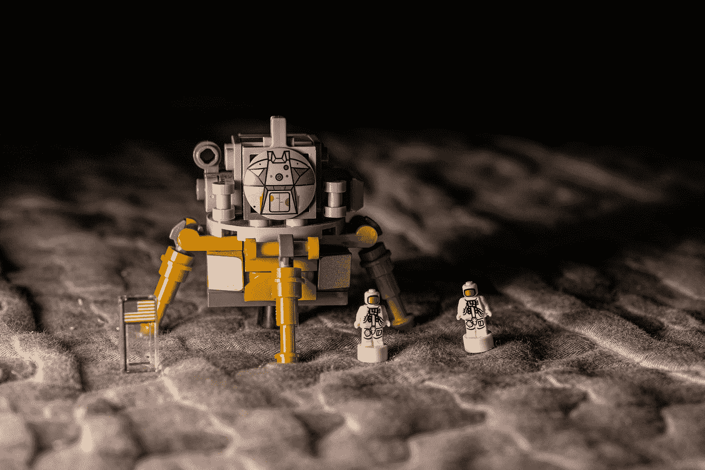
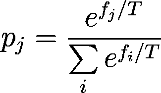
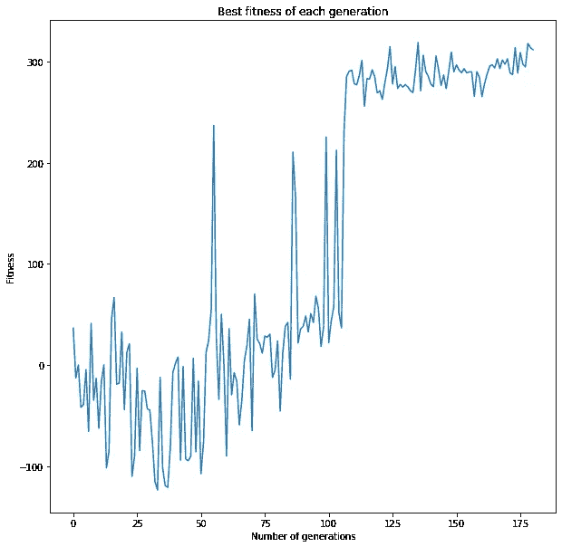
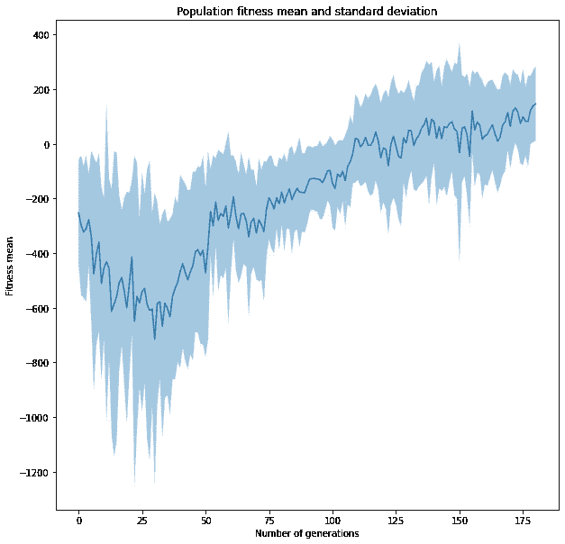
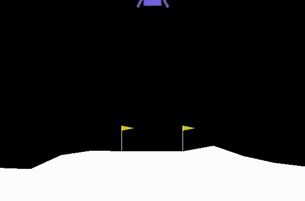
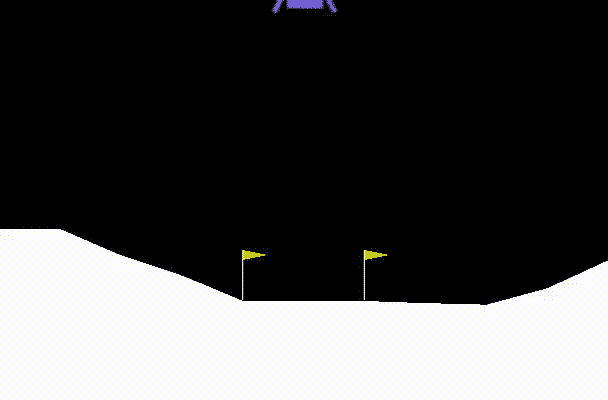
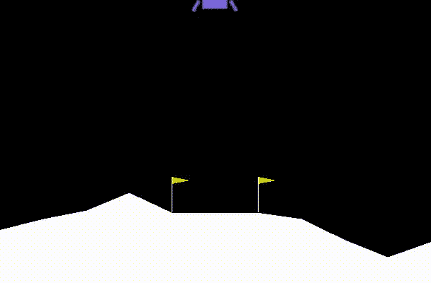

# 在稀疏回报环境中进化神经网络

> 原文：<https://towardsdatascience.com/evolving-a-neural-network-in-a-sparse-reward-environment-db1f596d5dc6>

## 用遗传算法求解月球着陆器连续环境下的稀疏回报

温斯顿·陈在 [Unsplash](https://unsplash.com?utm_source=medium&utm_medium=referral) 上的照片

遗传算法是一种受生物进化启发的解决优化问题的强大方法。它们由一个连续的过程组成，通过随机突变和交叉创建解决方案，并选择最佳解决方案(根据要最大化的数量)进行繁殖。选择最佳解决方案的一个关键要素是 ***适应度函数*** ，该函数将任何解决方案关联到一个名为的解决方案的 ***适应度*** 。适应度应该对应于优化问题中要最大化的目标。每个解都由一组称为 ***基因*** 的参数来参数化，这些参数构成解的 ***染色体*** 。每一步所有当前解的集合称为 ***群体*** 。一个遗传算法由若干后续步骤组成，称为***其中:***

*   ***评估每个解决方案的适合度；***
*   ***从由*选择函数指定的种群中选择下一代的*双亲，偏好具有最高适应度的解；*****
*   ***按照 ***交叉函数*** 的规定，每对父母通过混合他们染色体中的基因产生新的解；***
*   **根据 ***变异函数对新溶液的基因进行变异；*****
*   **从群体中移除低适应性解决方案。**

**随着世代数量的增加，群体将充满更高适应性的个体，因为这些个体有更高的概率将其基因传播给下一代。此外，由于交叉，使解决方案在获得更高适应度方面具有优势的突变将组合并累积到后代中。**

**遗传算法是非常通用的，只要有可能写出一个全局最大值解决任务的适应度函数，就可以应用于各种优化问题。**

**一个非常有趣的应用是使用遗传算法来优化神经网络的权重，这与通常的梯度下降方法相反。尽管对于许多任务，遗传算法可能收敛得更慢(因为我们放弃了一条有价值的信息，即损失函数的梯度)，但它们可以克服基于梯度的方法带来的一些限制。例如，遗传算法不会遭受通常的爆炸/消失梯度问题。遗传算法可能是基于梯度的方法的有趣替代的另一种情况是当梯度几乎总是零或无信息时。**

**遗传算法可能有用的一个用例是解决带有稀疏回报的顺序决策问题。顺序决策问题对应于需要一系列行动才能解决的任务。作为一个例子，让我们考虑逃离迷宫的问题:我们需要在每个十字路口选择我们想要遵循的方向，而遵循的方向取决于迷宫中的当前位置。当许多决策步骤没有外部奖励时，奖励稀疏就会发生，例如，当奖励只在任务结束时提供。在我们的例子中，如果只在成功逃离迷宫后给予奖励，而在中间步骤没有奖励，这种情况就会发生。这种问题对简单的强化学习算法提出了挑战，因为许多步骤不会提供信息梯度。**

**由于我很好奇遗传算法在稀疏奖励环境中的表现，我用它们在 OpenAI gym 的[月球着陆器连续环境中进化了一个神经网络。在香草版本中，这种环境有一种奖励，它不是稀疏的。为了模拟一个稀疏的奖励环境，我使用了在整个剧集的每个时间点获得的奖励总和作为适应度函数。这样，对于遗传算法来说，在每个时间步提供奖励的原始环境和在最后一步立即给予奖励的环境没有区别。](https://gym.openai.com/envs/LunarLanderContinuous-v2/)**

**我在这个 [Colab 笔记本](https://colab.research.google.com/drive/1rVE2SxHp_h_0ZZbeoMXTdW9u_XRlqysF?usp=sharing)中提供了完整的代码，它使用了我在[这个 GitHub 库](https://github.com/GabrieleSgroi/genetic_algorithm)中实现的遗传算法包。让我们一起来看看各个部分。**

# **环境**

**正如预期的那样，我已经使用了 OpenAI gym 的月球着陆器连续环境。环境期望我们的代理提供一个由二维向量组成的动作，向量的值介于-1 和 1 之间。第一个条目控制主发动机:它从 0 (-1)到 100% (+1)改变功率。但是，主机不能在低于 50%的功率下工作。第二个条目控制侧边引擎:在区间[-1，-0，5]启动左侧引擎，在区间[-0.5，0.5]关闭侧边引擎，[0.5，1]启动右侧引擎。**

**环境为代理提供一个由包含以下信息的 8 维向量组成的观察状态:**

*   **着陆器的 x 坐标；**
*   **着陆器的 y 坐标；**
*   **着陆器的水平速度；**
*   **着陆器的垂直速度；**
*   **着陆器的角度；**
*   **着陆器绕其中心的角速度；**
*   **一个布尔值，指示左腿是否接触地面；**
*   **表示右腿接触地面的布尔值。**

**目标着陆位置由一个平滑的水平线段组成，总是位于坐标原点。每集开始时，着陆器以随机速度向随机方向启动。这种随机性使得问题对于遗传算法来说更加困难，因为有时由于初始条件的随机性，好的解决方案可能接收到较差的总回报。由于总回报是我们用来将解决方案传播给下一代的指标，一些好的解决方案可能仅仅因为运气不好而无法将它们的基因传递下去。我预计这将减缓算法的收敛，但它将使它对不同的初始条件更鲁棒。**

# **遗传算法**

**我现在将详细解释我进行小实验的遗传算法的各个部分。**

****变异函数:**我用了一个变异概率为 0.1 的高斯变异。这意味着新创建的子解的每个基因有 0.1 的概率发生突变。突变包括从平均值为 0、标准偏差为 0.1 的高斯分布中取样的随机值的加法。**

****交叉函数:**我用的是 0.5 概率的单点交叉。这意味着，通过交配 2 个亲本解而获得的新解有 0.5 的概率通过单点交叉从两个亲本获得，并且有 0.5 的概率等于亲本 1。单点交叉选择从 0 到染色体长度的随机索引 *i、*，并创建由父代 1 的染色体的基因直到位置 *i* 和父代 2 的染色体的基因从位置 *i* 到末端组成的新染色体。**

****适应度函数:**分配给每个解的适应度就是一集获得的总奖励。再次注意，这没有利用环境提供的详细的逐步奖励。**

****选择函数:**在每一代结束时，根据亲本的适合度，通过从波尔兹曼分布中取样解决方案来选择亲本。这意味着解决方案被选为父解决方案的概率等于**

****

**图片作者。**

**其中 *fᵢ* 是所考虑的解决方案的适合度，分母中的和超过群体中的所有解决方案。玻尔兹曼选择的温度 *T* 调节解的选择压力:在高温下，解具有相似的被选择的概率，而在低温下，具有更高适应度的解具有显著更高的被选择的概率。我从温度 *T=1* 开始，随着世代数 *n* 的增加，温度逐渐降低**

****

**图片作者。**

**一直到最小值 0.1，之后我保持不变。**

****精英主义:**为了避免由于变异和交叉的随机效应而失去一些好解的风险，将前 10%的解不加任何改变地传递给下一代。**

**我选择了一个规模为 50 的群体，从随机初始化的神经网络权重开始。**

# **神经网络**

**现在让我们来看看神经网络，其权重将构成群体中解的基因。我选择了一个简单的结构，由一个前馈神经网络组成，它有两个隐藏层，每个隐藏层有 256 个特征。每一层都通过一个双曲正切激活函数。这将把输出限制在[-1，1]之间。最后一层的输出直接作为动作。有趣的是，在梯度下降的常规优化情况下，对中间层使用 *tanh* 激活会导致梯度饱和，可能不是一个好的选择。相反，在我们的例子中，我们不希望出现这样的问题，因为我们没有渐变，而且 tanh 激活看起来确实工作得很好。实际上，激活的饱和部分可能对我们的设置有益，因为它们将鼓励我们群体中解决方案的多样性，因为不同的权重将具有相似的激活。**

# **结果**

**让我们最终可视化我的小实验的结果吧！**

**作为免责声明，我没有太多的时间来广泛地优化算法或神经网络架构的参数，所以如果结果可以很容易地得到改善，我不会感到惊讶。此外，进化在 180 个时期终止。这个值完全是任意的，由于时间限制，我在这里停止了它。数据似乎表明性能仍在提高，因此让算法运行更多代可以产生更好的结果。**

**下面是每一代的最佳适应度图**

****

**图片作者。**

**以及每一代群体中所有解的平均适合度(阴影区域代表区域[均值-标准差，均值+标准差])**

****

**图片作者。**

**正如我们所看到的，不仅每一代的最佳解在 100 代之后急剧上升，而且群体中所有解的平均适应度随着时间稳步增加。因此，作为一个整体，人类正在进化，越来越好地解决这个问题！**

**让我们通过查看不同代中具有最高适应性的解决方案所生成的片段来可视化进化过程。**

****第 50 代****

****

**在第 50 代使用最高适应性解决方案生成 5 集。图片作者。**

****第 100 代****

****

**在第 100 代使用最高适应性解决方案生成 5 集。图片作者。**

****第 150 代****

****

**在第 150 代使用最高适应性解决方案生成 5 集。图片作者。**

****第 180 代****

****

**在第 180 代使用最高适应性解决方案生成 5 集。图片作者。**

**我们看到最近几代人的技能有了令人印象深刻的提高！**

**虽然在 50 代之后，神经网络除了自由降落之外什么也没有学到，但是我们开始看到第 100 代着陆器的方向稳定，并试图软着陆。到第 150 代时，最佳解决方案能够避免崩溃，在最后一代(180)时，我们观察到完美的目标着陆！**

**一个重要的问题是在探索的解决方案中找到一个能更好地完成任务的解决方案。事实上，每个解决方案的适用性是在单集结束时评估的，并且由于环境的随机性，不同集的相同解决方案的总回报具有很大的可变性。因此，如果我们要选择与最高记录的适应性相对应的解决方案，我们可能会选择一个平均表现不佳但运气不错的解决方案(或者是因为环境配置特别简单，或者是因为它仅适用于少数情况)。这个问题的一个解决方案可能是不仅仅使用单个情节的奖励，而是使用 N 个这样的情节的平均奖励作为适应度，这也有助于使进化过程更加稳定。这个。然而，由于 N 或群体中的解的数量变得非常大，这将是计算上昂贵的(因为适应度评估是算法中最慢的部分)。或者，由于整个群体的平均水平随着世代数的增加而提高，因此将注意力限制在上一代的解决方案上是有意义的。平均而言，它们应该比前几代的解决方案更好。尽管如此，计算群体中所有解决方案的 100 集的平均回报还是非常慢。因此，我对上一代中适应性最高的解决方案进行了评估。我注意到，如前所述，不能保证这是有史以来探索过的最好的解决方案(按平均回报计算)，甚至不能保证是上一代的解决方案。然而，这个解决方案已经在 100 集以上获得了令人印象深刻的 238.84 的平均奖励！**

# **结论**

**我对我的小实验结果非常满意。在仅仅 180 代之后，并且在对参数和神经网络架构进行最小到没有优化的情况下，遗传算法能够找到可靠地解决月球着陆器连续任务的解决方案。该算法成功了，尽管事实上它没有被传递关于环境的细粒度奖励的详细信息，而只是在每集结束时模拟稀疏奖励环境的累积奖励。我相信，总的来说，对于只有少量奖励的任务，遗传算法可以成为通常的强化学习方法的一种有竞争力的替代方法。**

**我希望你喜欢这篇文章，我很高兴听到你的想法！**