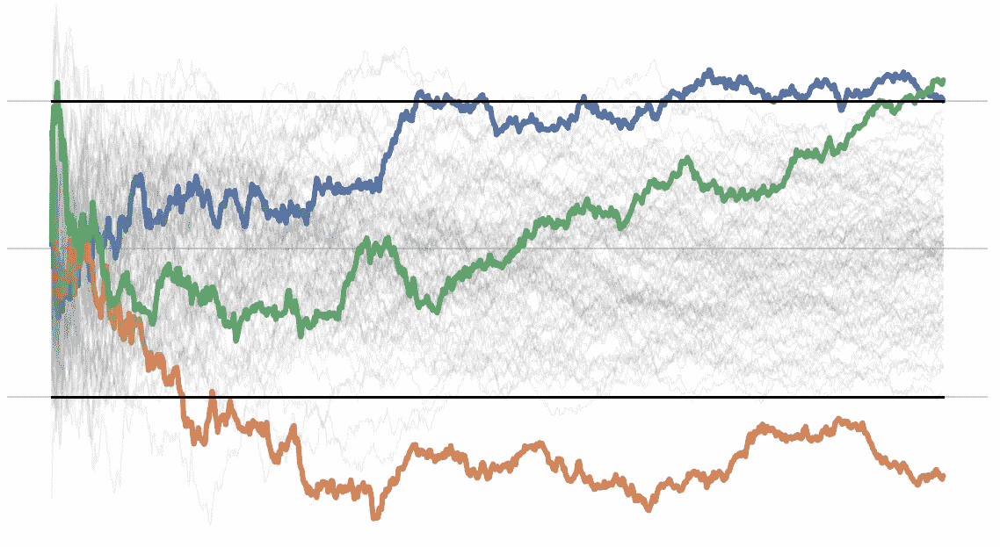
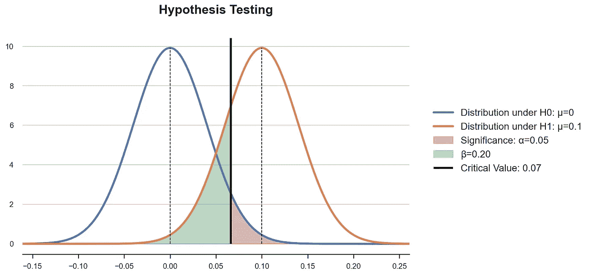
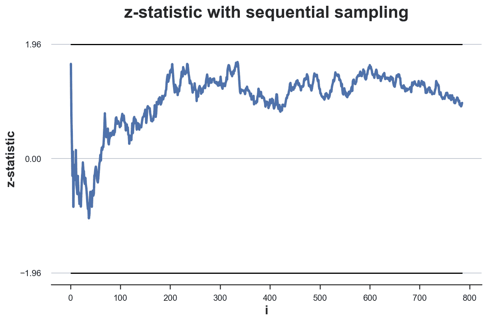
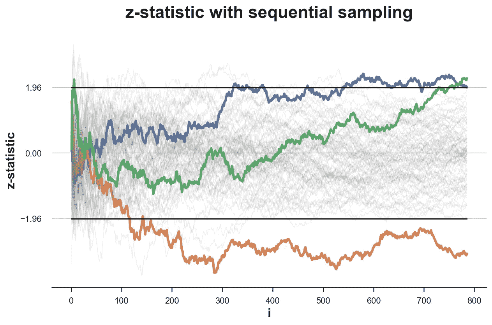
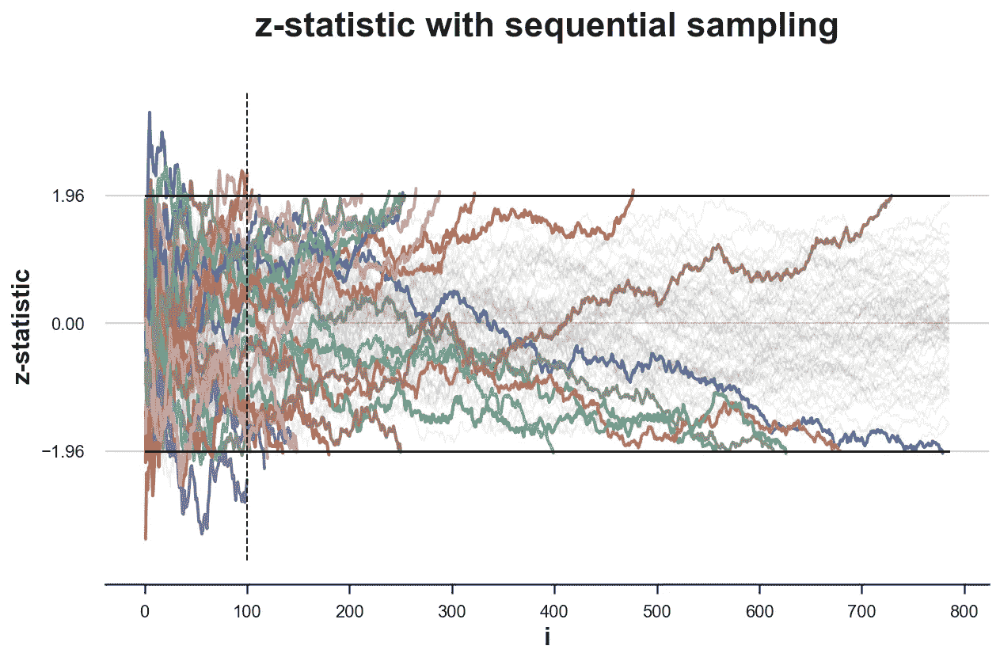
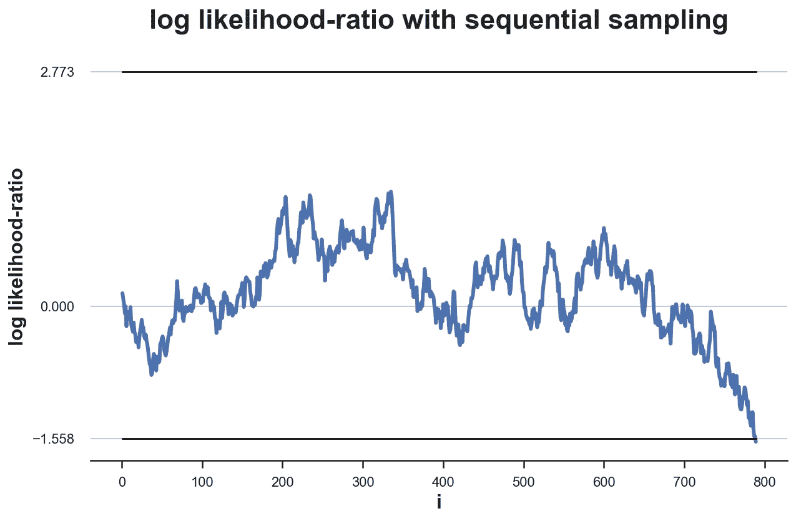
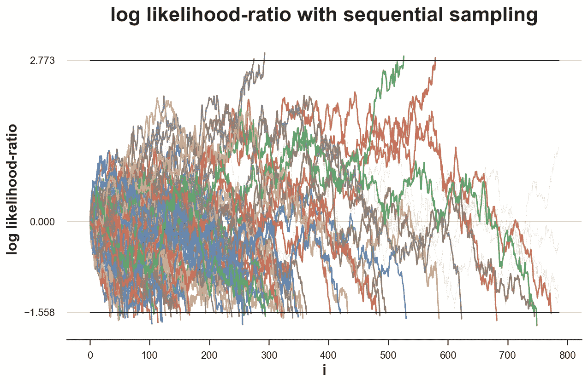

# 实验、窥视和最佳停止

> 原文：<https://towardsdatascience.com/experiments-peeking-and-optimal-stopping-954506cec665>

## [因果数据科学](https://towardsdatascience.com/tagged/causal-data-science)

## 如何用序贯概率比检验进行较小样本量的有效实验



封面，作者图片

在第二次世界大战前的十年里，战争物资的工业生产大量增加，因此有必要确保产品，特别是弹药的可靠性。战争物资的**测试**不仅**昂贵**而且**破坏性**因为，例如，子弹需要发射才能被测试。

因此，美国政府面临着如下的困境:在宣布一批子弹可靠之前，一个人应该从一批子弹中射出多少颗子弹？显然，如果我们要发射所有的子弹，我们就会知道一个板条箱中有效子弹的确切数量。然而，没有子弹了。

由于这些统计问题越来越重要，1939 年，一群杰出的统计学家和经济学家在哥伦比亚大学的 [**统计研究小组(SGR)**](https://en.wikipedia.org/wiki/The_Statistical_Research_Group_of_World_War_II) 联合起来。这个小组包括，除了其他人之外，w·艾伦·沃利斯、雅各布·沃尔福威茨和亚伯拉罕·瓦尔德。根据 Wallis 自己的说法，SGR 小组是由“从数量和质量两方面考虑，肯定是有史以来最非凡的统计学家组成的小组”。

他们的工作非常重要，被列为机密，沃利斯报道说:

> 据说，当沃尔德进行顺序分析时，他的文件被拿走并被列为机密。作为一名“敌国人”，他没有安全许可，因此，据说，他不被允许知道他的结果。 [ [沃利斯(1980)](https://www.jstor.org/stable/2287451) ]

事实上，该小组在美国陆军的压力下工作，以交付可随时部署在战场上的快速实用解决方案。例如，沃利斯报告说

> 在 1944 年 12 月的 [*突出部战役*](https://en.wikipedia.org/wiki/Battle_of_the_Bulge) *中，几名高级军官从战场飞到华盛顿，花了一天的时间讨论对地面部队进行空中轰炸的近炸引信的最佳设置，然后飞回战场，将来自其他人的建议付诸实施* [*米尔顿·弗里德曼*](https://en.wikipedia.org/wiki/Milton_Friedman) *，他早期对引信的研究使他对引信的实际性能有了广泛而准确的了解*[沃利斯(1980)](https://www.jstor.org/stable/2287451)

来自 SGR 经验的最突出的结果无疑是顺序概率比测试。沃利斯和弗里德曼首先意识到

> 使用一种测试可能是值得的，如果取 N 个样本，这种测试可能不如传统测试有效，但当顺序使用时，它提供了一个很好的提前终止的机会，从而大大抵消了这一缺点[沃利斯(1980)](https://www.jstor.org/stable/2287451)

这两位经济学家向统计学家雅各布·沃尔福威茨提出了这个想法

> “对于像米尔顿和我这样对数学如此无知的人，竟然冒险干涉最强大的统计学等神圣的概念，这似乎有些令人反感。毫无疑问，这种反感因我们称新测试为‘超级色狼’而加强，理由是它们比‘最强大’的测试更强大。” [ [沃利斯(1980)](https://www.jstor.org/stable/2287451) ]

最终，这两位经济学家设法引起了沃尔福威茨和沃尔德的注意，开始正式研究这个想法。这些结果一直是最高机密，直到战争结束，沃尔德发表了他的《统计假设的序列测试》一文。

在这篇文章中，在简单介绍了假设检验之后，我们将探索序列概率比检验，并在 Python 中实现它。

# 假设检验

当我们设计一个 A/B 测试，或者更一般地说，一个实验时，标准步骤如下

1.  定义一个**零假设** *H₀* ，通常是实验对感兴趣的指标没有影响
2.  定义一个**显著性水平** *α* ，通常等于 *0.05* ，代表当其为真时拒绝零假设的最大概率
3.  定义一个**替代假设** *H₁* ，通常是我们想要检测的最小效应大小
4.  定义一个**功率水平** *1-β* ，通常等于 *0.8* (即 *β=0.2* )，代表当备选项 *H₁* 为真时，拒绝零假设 H₀的最小概率
5.  选择一个**测试统计量**，其分布在两种假设下都是已知的，通常是感兴趣的度量的样本平均值
6.  在给定所有测试参数的情况下，计算最小**样本大小**，以达到期望的功率水平 *1-β*

然后，我们**运行测试**，根据测试统计的实际值，我们决定**是否拒绝**零假设。特别是，如果 **p 值**，即在零假设下观察到的统计量等于或大于样本统计量的概率，低于显著性水平 *α* ，我们拒绝零假设。

请记住，拒绝零假设并不意味着接受替代假设。

# 偷看

假设在实验进行到一半时，我们要**偷看数据**并注意到，对于检验统计量的中间值，我们会拒绝零假设。我们应该停止实验吗？如果我们做了，会发生什么？

答案是我们**不应该停止**实验。如果我们这样做，测试将不会达到预期的显著性水平，或者，换句话说，我们的置信区间将会有**错误覆盖**。

## **示例**

让我们用一个例子来看看我的意思。假设我们的**数据生成过程**是一个均值 *μ* 未知，方差*σ= 1*:*X∾N(μ，1)* 的[标准正态分布。](https://en.wikipedia.org/wiki/Normal_distribution)

让我们挑选以下(任意的)**假设**来测试:


测试假设，作者图片

每次观察 *n* 后，我们计算 [**z 检验统计量**](https://en.wikipedia.org/wiki/Z-test)


z 检验统计，按作者分类的图像

其中 *X̅ₙ* 是来自大小为 *n* 的样本 *X₁、X₂、…、Xₙ、*的[样本均值](https://en.wikipedia.org/wiki/Sample_mean_and_covariance)， *σ* 是总体的标准差， *μ₀* 是在零假设下的总体均值。分母中的项是样本均值的方差。在零均值的零假设下，检验统计量分布为具有零均值和单位方差的**标准正态分布**， *N(0，1)* 。

让我们用 Python 编写测试代码。我从[实用程序](https://github.com/matteocourthoud/Blog-Posts/blob/main/src/utils.py)中导入了一些代码，让情节更漂亮。

```
import numpy as np
from src.utils import *

zstat = lambda x: np.mean(x) * np.sqrt(len(x))
zstat.__name__ = 'z-statistic'
```

假设我们想要一个显著性水平 *α=0.05* 和功效 *1-β=0.8* 的测试。我们需要多大的样本量？

我们需要一个**样本大小**

1.  当 *H₀* 为*真*时，拒绝零假设 *H₀* 的概率最多为 *α=0.05*
2.  当 *H₀* 为*假*(即 *H₁* 为真)时，*不*拒绝零假设 *H₀* 的概率，最多为 *β=0.2*

即我们需要找到一个**临界值** *c* 使得


临界值方程，作者图片

其中 *zₚ* 是在 *p* 处的 CDF 倒数(或[百分点函数](https://en.wikipedia.org/wiki/Quantile_function)),而 *μᵢ* 是不同假设下的平均值。

如果我们不知道未知平均值 *μ* 的**符号**，我们必须运行一个**双边测试**。这意味着，在分布的每一侧，类型 1 错误的最大概率必须是 *α/2 = 0.025* ，这意味着 *z* ₀.₉₇₅.

将这两个表达式结合在一起，我们可以求解出**所需的最小样本量**。


最小样本量公式，作者图片

以便


最小样本量方程求解，图片由作者提供

我们至少需要 785 次观察。

我们可以通过图形化绘制带有临界值的两个分布来获得更好的直觉。我写了一个函数`[plot_test](https://github.com/matteocourthoud/Blog-Posts/blob/main/notebooks/src/figures.py)`来画一个标准的假设检验设置。

```
from src.figures import plot_test

plot_test(mu0=0, mu1=0.1, alpha=0.05, n=n)
```



假设检验，作者图片

临界值是这样的，给定两种假设下的分布，红色的**拒绝面积**等于 *α* 。样本大小 *n* 缩小了两个分布的方差，因此绿色区域等于 *β* 。

现在让我们**模拟一个实验**，在这个实验中，我们绘制一个有序的观察序列，在每次观察之后，我们计算检验统计的值。

让我们看看样品是什么样的。

```
df = experiment(zstat)
df.head()
```


数据快照，图片由作者提供

现在，随着我们在采样过程中积累观察值，我们可以绘制检验统计量的时间趋势图。我还用横线标记了在 *α=0.05* 的测试中拒绝零假设的值。

```
plot_experiment(df, ybounds=[-1.96, 1.96])
```



使用顺序抽样的测试统计，按作者分类的图像

在这种情况下，测试不会越过临界值。所以偷看是没有效果的。我们不会过早地停止实验。

如果我们多次重复这个实验，会发生什么？由于数据是在零假设下生成的， *H₀: μ=0* ，我们预计只在 *α=5%* 的时候拒绝它。

让我们模拟数据生成过程 *K=100* 次。

我们绘制了样本的 z 统计分布图。

```
simulate_experiments(zstat, ybounds=[-1.96, 1.96], early_stop=False);Bounds crossed: 3 (67% upper, 33% lower)
Average experiment duration: 785
```



超过 100 个模拟的连续抽样的测试统计，图片由作者提供

在上图中，我突出显示了我们拒绝零假设**而不偷看**的实验，即在采样过程结束时给出 z 检验统计量**的值。只有在 3 个实验中，最终值位于临界值之外，因此我们拒绝零假设。这意味着 3%的**拒绝率**非常接近预期拒绝率 *α=0.05* (在零假设下)。**

相反，如果我们**不耐烦**并且在收集了第一个 *100 个*观察值之后，一旦我们看到 z 统计量越过边界，我们就停止**会怎么样？**

```
stops_zstat_h0 = simulate_experiments(zstsat, xmin=99, ybounds=[-1.96, 1.96], early_stop=True, lw=2);
plt.vlines(100, ymin=plt.ylim()[0], ymax=plt.ylim()[1], color='k', lw=1, ls='--');Bounds crossed: 25 (48% upper, 52% lower)
Average experiment duration: 523
```



测试统计超过 100 个模拟，图片由作者提供

在上图中，我突出显示了从第 100 次观察开始 z 统计值跨越其中一个边界的实验。这发生在 *100* 的 *25* 模拟中，这意味着**的拒绝率**为 *25%* ，这与 *α=0.05* 的预期拒绝率(在零假设下)相差甚远。偷看**会扭曲**测试的显著性水平。

一个潜在的解决方案是序贯概率比检验。但是，为了理解它，我们首先需要介绍一下**似然比检验**。

# 似然比检测

**似然比检验**是一种试图评估观察数据由两个竞争统计模型之一生成的概率(或似然性)的检验。

为了执行假设检验的似然比检验，我们需要在两种假设下完全指定数据生成过程。例如，以下假设就是这种情况:


测试假设，作者图片

在这种情况下，我们说统计检验是完全指定的。如果替代假设是 *H₁: μ ≠ 0* ，那么数据生成过程将不会在替代假设下指定。

当一个统计检验被完全指定时，我们可以将似然比计算为两个假设下[似然函数](https://en.wikipedia.org/wiki/Likelihood_function)的比值。


似然比，按作者分类的图像

似然比检验提供了如下决策规则:

*   如果*λ>c*，则拒绝*h₀*；
*   如果*λ<c*，不要拒绝*h₀*；
*   如果*λ= c*，以概率 *q* 拒绝

选择值 *c* 和 *q* 以获得指定的显著性水平 *α* 。

[**ney man–Pearson 引理**](https://en.wikipedia.org/wiki/Neyman%E2%80%93Pearson_lemma) 指出，在这种情况下，这种似然比检验是所有水平 *α* 检验中最有效的。

## 特例:正态分布均值检验

让我们回到我们的**示例**，其中数据来自具有未知均值 *μ* 和已知方差 *σ* 的正态分布，我们希望执行以下测试


测试假设，作者图片

具有未知均值 *μ* 和已知方差 *σ* 的正态分布的可能性为


可能性，按作者分类的图像

因此，两种假设下的似然比是


可能性比率，按作者分类的图像

我们现在已经具备了进入这篇博文的最后阶段的所有要素:顺序概率比测试。

# 序贯概率比检验

给定一对完全指定的假设，比如说 *H₀* 和 *H₁* ，序贯概率比检验的**第一步**是计算对数似然比检验*log(λᵢ*，随着新数据的到来:用 *S₀=0* ，那么，对于 *i=1，2，…，n* 。


公式，作者图片

我们现在可以使用 *Sᵢ* 来生成一个简单的阈值方案:

*   *Sᵢ≥ b* :接受 H₁
*   *Sᵢ≤答*:接受 H₀
*   *a < Sᵢ < b* :继续监控(临界不等式)

其中阈值 *a* 和*b*(*-∞<a<0<b<∞*)应取决于期望的[I 型和 II 型误差](https://en.wikipedia.org/wiki/Type_I_and_type_II_errors)、 *α* 和 *β* 。我们应该如何挑选 *a* 和 *b* ？

[Wald (1945)](https://www.jstor.org/stable/2235829) 表明，选择以下边界进行测试时，第 1 类和第 2 类错误的预期概率分别不大于 *α* 和 *β* 。


最佳 alpha 和 beta，作者图片

由于数据生成过程的离散性，这些方程是近似的。

[Wald 和 Wolfowitz (1948)](https://www.jstor.org/stable/2235638) 已经证明，具有这些边界的检验是**最有效的**序贯概率比检验，即具有相同功效 *1-β* 和显著性 *α* 的所有 SPR 检验至少需要相同数量的观察值。

## 特例:测试无效效果

让我们回到我们的例子，数据来自正态分布，具有未知的均值 *μ* 和已知的方差 *σ* 以及假设 *H₀: μ=0* 和 *H₁: μ=0.1* 。

我们已经看到大小为 n 的样本的似然比是


似然比，按作者分类的图像

因此，对数似然(更容易计算)为


对数似然比，作者图片

## 模拟

我们现在准备执行一些模拟。首先，让我们对刚刚计算的**对数似然比检验统计量**进行编码。

```
log_lr = lambda x: (np.sum((x)**2) - np.sum((x-0.1)**2) ) / 2
log_lr.__name__ = 'log likelihood-ratio'
```

我们重复开始时做的相同实验，只有一点不同:我们将计算对数似然比作为一个统计量。数据生成过程有 *μ=0* ，如在零假设下。

```
df = experiment(log_lr)
df.head()
```


数据快照，图片由作者提供

给定显著性水平 *α=0.05* 和幂 *1-β=0.8* ，现在让我们计算最佳界限。

```
alpha = 0.05
beta = 0.2a = np.log( beta / (1-alpha) )
b = np.log( (1-beta) / alpha )
print(f'Optimal bounds : [{a:.3f}, {b:.3f}]')Optimal bounds : [-1.558, 2.773]
```

由于显著性和(一减)功效不同，零假设的界限比替代假设的界限更接近。这意味着，在中间效应为 *μ=0.05* 的情况下，我们将更有可能接受零假设 *H₀: μ=0* 而不是备选方案 *H₁: μ=0.1* 。

我们可以绘制在零假设 *H₀: μ=0* 下抽取的样本的似然比分布。

```
plot_experiment(df, ybounds=[a,b])
```


序贯抽样的对数似然比，图片由作者提供

在这种特殊情况下，测试在我们的抽样框架内是不确定的。为了做出决定，我们需要**收集更多的数据**。

```
plot_experiment(experiment(log_lr, n=789), ybounds=[a,b]);
```



序贯抽样的对数似然比，图片由作者提供

需要 789 次观察才能得出结论，而之前的样本量是 785。该测试程序可能需要一个比前一个更大的**样本量**。平均来说是真的吗？

如果我们重复实验 *K=100* 次会发生什么？

```
simulate_experiments(log_lr, ybounds=[a, b], early_stop=True, lw=1.5);Bounds crossed: 96 (4% upper, 96% lower)
Average experiment duration: 264
```



对数似然比，超过 100 次模拟的顺序采样，图片由作者提供

我们对 100 个模拟中的 96 个做出了决定，其中 96%是正确的决定。所以我们的**拒绝率**非常接近预期的 *α=0.05* (在零假设下)。

但是，对于 *4* 的实验，测试是没有定论的。如果我们在每个实验中取样直到得出结论，会发生什么？

```
simulate_experiments(log_lr, ybounds=[a,b], early_stop=True, lw=1.5, n=1900);Bounds crossed: 100 (4% upper, 96% lower)
Average experiment duration: 275
```


对数似然比，超过 100 次模拟的顺序采样，图片由作者提供

从图中我们可以看出，在一个特别不走运的实验中，我们需要收集 *1900* 次观测结果才能得出结论。然而，尽管有这个异常值，平均实验持续时间是惊人的 275 个 T21 样本，几乎是 785 个样本的三分之一！

如果另一个假设 *H₁: μ= 0.1* 是真的，会发生什么？

```
simulate_experiments(log_lr, ybounds=[a,b], early_stop=True, mu=0.1, lw=1, n=2100);Bounds crossed: 100 (84% upper, 16% lower)
Average experiment duration: 443
```


对数似然比，超过 100 次模拟的顺序采样，图片由作者提供

在这种情况下，我们只在 *84%* 的模拟中做出了正确的决策，这与 *80%* (替代假设下)的期望值，即实验的功效 *1-β* 非常接近。

此外，同样在这种情况下，我们需要一个小得多的样本量:平均来说，只有 *443* 个观察值。

# 结论

在这篇文章中，我们已经看到了在随机实验中**偷看**的危险。过早停止测试可能是危险的，因为它会扭曲推断，使置信区间的覆盖范围发生偏差。

这是否意味着我们总是需要用预先指定的样本量进行测试？不要！存在允许最佳停止的程序。这些程序是为了一个特定的目的而诞生的:在不牺牲准确性的情况下，尽可能地减少样本量。第一个也是最著名的是序贯概率比检验，Wallis 将其定义为“*过去三分之一世纪*中最强大和最具开创性的统计思想”(1980 年)。

SPRT 不仅是 80 年前测试弹药箱的强大工具，而且今天仍被用于非常实际的目的(例如，它是如何在网飞[或 T2【优步】T3 使用的)。](https://netflixtechblog.com/improving-experimentation-efficiency-at-netflix-with-meta-analysis-and-optimal-stopping-d8ec290ae5be)

## 参考

[1] A .沃尔德，(1945)，*《数理统计年鉴》*。

[2] A .沃尔德和 J .沃尔福威茨，[序贯概率比检验的最优特征](https://www.jstor.org/stable/2235638) (1948 年)，*《数理统计年鉴》*。

[3] W. A .沃利斯，[统计研究小组，1942–1945](https://www.tandfonline.com/doi/abs/10.1080/01621459.1980.10477469)(1980)，*美国统计协会杂志*。

## 密码

你可以在这里找到 Jupyter 的原版笔记本。

[](https://github.com/matteocourthoud/Blog-Posts/blob/main/notebooks/optimal_stopping.ipynb)  

## 感谢您的阅读！

*真的很感谢！*🤗*如果你喜欢这个帖子并且想看更多，可以考虑* [***关注我***](https://medium.com/@matteo.courthoud) *。我每周发布一次与因果推断和数据分析相关的主题。我尽量让我的帖子简单而精确，总是提供代码、例子和模拟。*

*还有，一个小小的* ***免责声明*** *:我写作是为了学习所以错误是家常便饭，尽管我尽了最大努力。当你发现他们的时候，请告诉我。也很欣赏新话题的建议！*