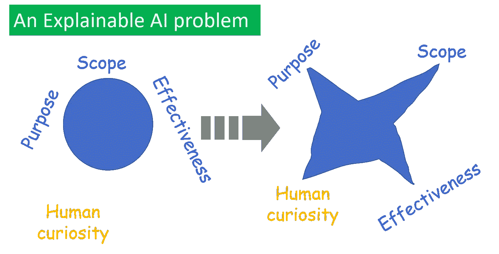
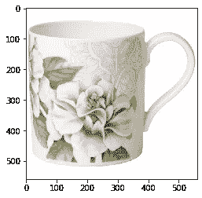
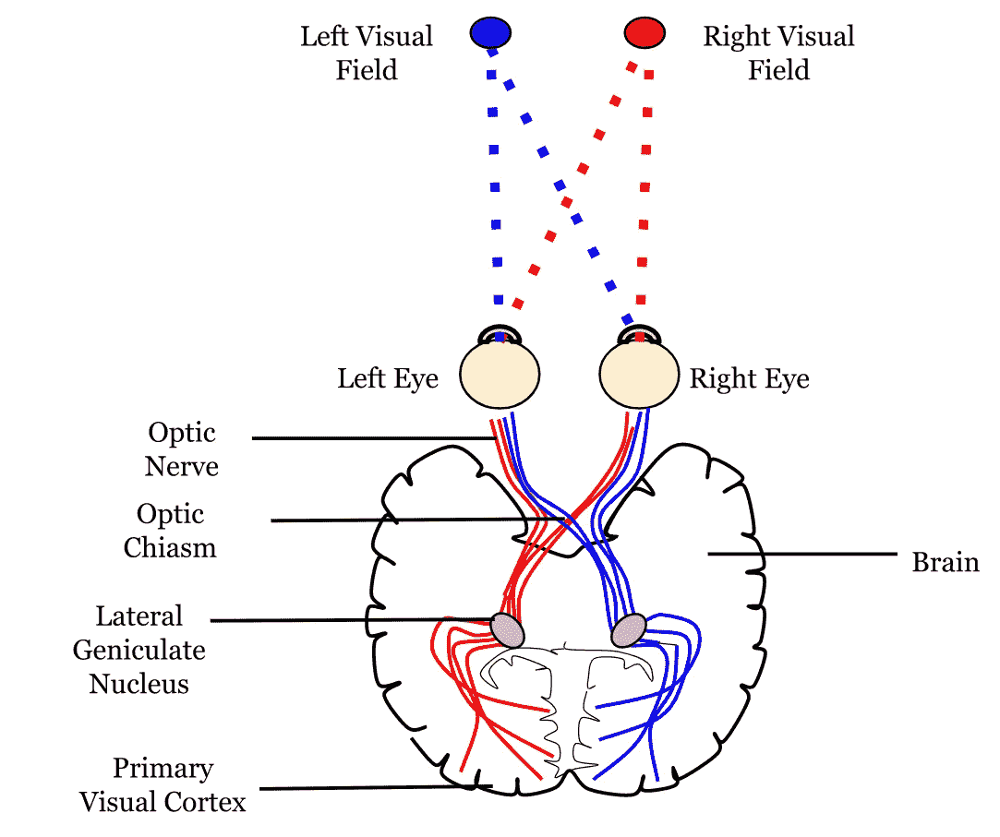
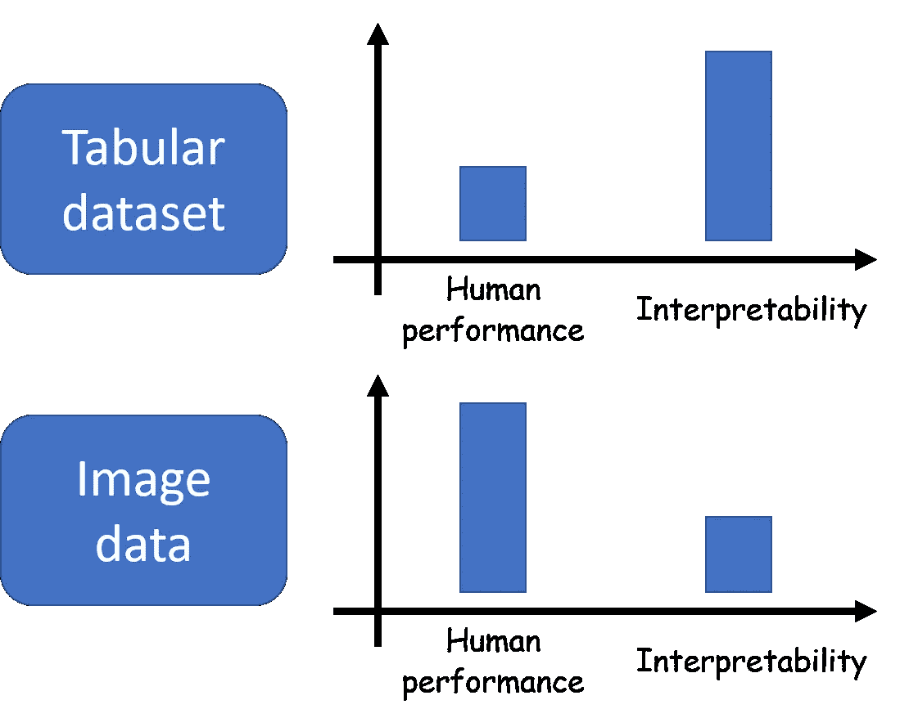
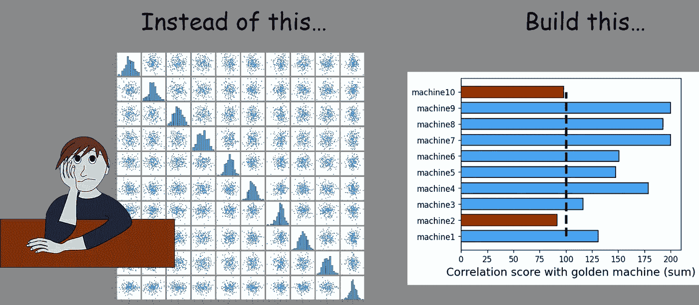
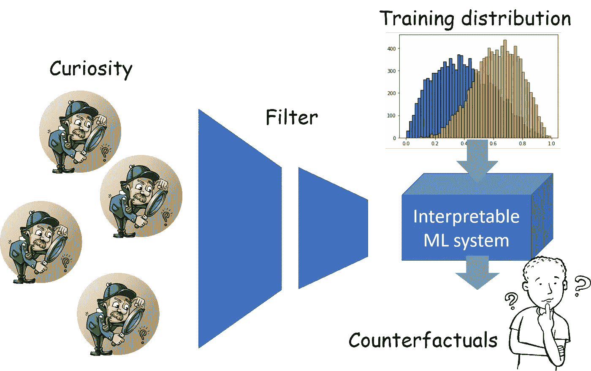
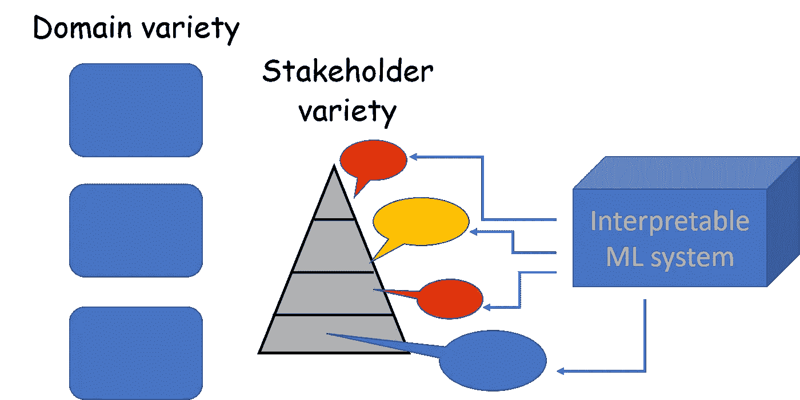
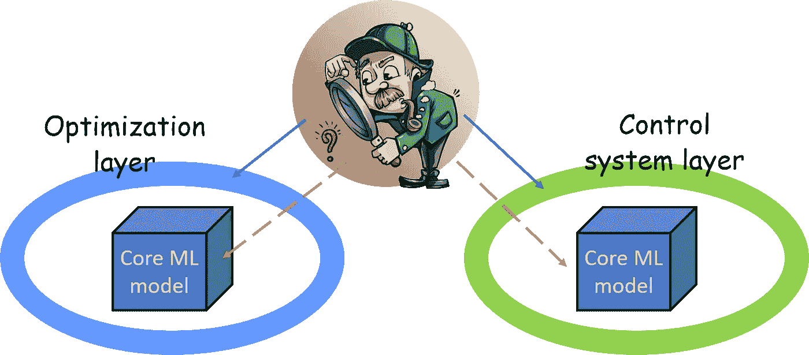

# 可解释的人工智能和对人类好奇心的关注

> 原文：<https://towardsdatascience.com/explainable-ai-and-the-focus-on-human-curiosity-aa816aaf3caa>

# 可解释的人工智能和对人类好奇心的关注

## 专注于最重要的几个因素和反事实

图片来源: [Pixabay 免费图片](https://pixabay.com/vectors/alice-in-wonderland-alice-fantasy-4515463/)

# 可解释的人工智能很难

可解释的人工智能——或有时被称为“xAI”——很难——无论是形象上还是计算上。

因为可解释性的范围、目的和有效性通常很难在问题定义或用户案例研究中精确预测和形式化。这些属性呈现出一种流动的形式，并且迅速而不可预测地扩散开来。

图片来源:作者创作

xAI 的*计算*挑战来自于计算度量的机制，如 [**Shapley 值**](https://christophm.github.io/interpretable-ml-book/shapley.html) (针对输入特征的大量可能组合，即使不是针对整个幂集)。这主要是这样一个事实的副作用，即最成功的机器学习模型往往具有很大的参数空间，并处理大量的特征(或图像或自然语言等高维数据类型)，因此，提供可解释性是很重要的。

有很多关于这些的高质量文章。令人兴奋的创业公司正在努力解决这些问题。

在本文中，我们只想关注一个方面— *预测用户的好奇心*如何帮助指导 xAI 系统的设计工作。

# 两个定义—一个要避免

提姆·米勒在这个领域有一篇里程碑式的论文:《人工智能中的 [***解释:来自社会科学的洞见***](https://arxiv.org/abs/1706.07269)》(2017)。它对“机器学习的可解释性”有两种(非数学的)定义。

一个定义是— ***可解释性是人类能够理解决策原因的程度*。**

另一个说法是——***可解释性是人类能够持续预测模型结果的程度*。**

## 依靠人类的预测是很棘手的

我认为应该避免第二个定义，即使它很简单，很容易理解。

为什么很容易被跟踪？因为在这两者之间，这个有**更清晰的测量机制**。此外，测量对于设计工程系统非常重要。人们可以通过雇用人类评估者来测试 ML 系统的可解释性，并测量他们预测模型结果的一致性。

这也与所有深度学习模型及其设计者谈论的著名的“**人类水平的性能**”基准平行。

但是，我们不要忽视一个棘手的事实，即依赖人脑持续预测结构化结果——本质上是模仿复杂的计算机程序——并不总是明智的选择。这就是为什么应该避免 ML 可解释性的定义。

让我给你看一个例子——就在本文中。

## 示威游行

我写了一篇文章，介绍了如何构建一个单一的效用函数，通过训练图像存储位置的一个输入来训练一个完整的卷积神经网络模型。

 [## 使用 Keras 简化影像分类的单一功能

### 我们展示了如何构建一个单一的、通用的、实用的函数来从一个目录中自动提取图像…

towardsdatascience.com](/a-single-function-to-streamline-image-classification-with-keras-bd04f5cfe6df) 

这里是[笔记本](https://github.com/tirthajyoti/Deep-learning-with-Python/blob/master/Notebooks/Keras_flow_from_directory.ipynb)。其中一个例子是关于著名的 [**Caltech-101 数据集**](https://www.tensorflow.org/datasets/catalog/caltech101) 中“杯子”或“螃蟹”的分类。让我问你——读者——对测试图像进行分类。

这是什么？一杯还是一只螃蟹？

图片来源:来自加州理工学院-101 测试集

你花了多少时间来分类？可能不到 100 毫秒？

这个怎么样？

图片来源:来自加州理工学院-101 测试集

还是那句话，瞬间识别，不是吗？现在，这个怎么样？

图片来源:来自加州理工学院-101 测试集

你笑了，是吗？“*对机器来说是个棘手的问题，*”你默默地想。

所以，作为一个人类评估者，你做得很好。

但是，在这个练习中，将您的性能与 ML 算法进行比较(纯粹从可解释性的角度来看)是非常困难的。因为一个 5 层卷积神经网络有点像一个黑盒，它的内部工作很难向任何人解释。你永远不会满足于比较和**与你的思维和 ML 模型**一脉相承的事实和解。

你只是不知道 ML 模型的思路是什么！

现在，考虑这个例子。

假设您已经为您的制造工厂建立了一个化学过程的**逻辑回归模型**，以根据输入过程参数(由复杂的传感器测量)预测质量— *好*或*差*。

这里是测试数据的快照(把它想象成与你在上面看到的测试图像平行)。

我已经部分隐藏了“目标”列，因为这是你看不到的，但将被评估。

看着这些错综复杂的数字，你有多大的几率预测出正确的目标？你能在 100 毫秒内快速做出正确预测的几率有多大？

对于这个模型来说，使用人类评估者作为最大似然可解释性度量的宏大计划将会失败。然而，具有讽刺意味的是，从可解释性的角度来看，选择简单的二元逻辑分类是完美的。这确实是一个可以解释的模型。只是不像我们让人类评估者来反对它。

## 人类的大脑还没有进化到处理表格数据的地步

表格数据，以一种漂亮的书写形式，是人类历史上最近的发展。苏美尔或亚述楔形文字是书写文字的一些最早的例子，它们是出于记录的需要而发展起来的——土地销售、农业产出、税收。

**微软 Excel 的青铜时代版本！**

图片来源:维基百科(维基媒体[图片-1](https://en.wikipedia.org/wiki/Cuneiform#/media/File:Sumerian_26th_c_Adab.jpg) 、[图片-2](https://en.wikipedia.org/wiki/Cuneiform#/media/File:Sales_contract_Shuruppak_Louvre_AO3766.jpg) )

但是，这只是青铜时代。就在农业革命前后，其对粮食生产、人口密度和城市化的影响导致了这种表格数据集。

人类的认知革命已经发生了很长时间——远在那之前。这是一个大概的时间表。

图片来源:作者创作

而且，上面的图表甚至没有涵盖最令人惊叹的视觉皮层和人眼的**进化的时间线。这种生物学是由在非洲大草原生存的需要形成的——区分捕食者和猎物，安全的浆果和有毒的浆果。**

图片来源:[维基媒体免费图片](https://en.wikipedia.org/wiki/Visual_cortex#/media/File:Neural_pathway_diagram.svg)

出生于奥地利的美国机器人专家和计算机科学家汉斯·莫拉维克 ，目前是卡耐基梅隆大学[机器人研究所](https://www.ri.cmu.edu/)的兼职教师，用一种稍微不同的方式表达了这一点——“让计算机在智力测试或玩跳棋时表现出成人水平的表现相对容易，而在感知和移动性方面，很难或不可能让它们拥有一岁儿童的技能”。

 [## 为什么数学对人工智能来说很容易，但园艺却不容易:莫拉维克悖论

### 对于人工智能来说，进行高级推理很容易，但获得像样的运动技能却非常困难。

towardsdatascience.com](/why-math-is-easy-for-ai-but-gardening-is-not-moravecs-paradox-99994b201d10) 

所有这一切都是说，人类评估者可以很好地完成对象分类工作，但使用表格数据集进行二进制分类会惨败。

虽然从可解释性的角度来看，用于这些任务的常见 ML 模型将完全相反——难以解释的神经网络和相对更容易的逻辑回归。

图片来源:作者创作

# 跟着好奇心走

因此，对于可解释的 AI/ML 系统来说，不要让人类与机器对抗，看看系统预测是否与人类产生的预测一致，这是有意义的。

相反，这些系统需要通过观察人类用户自然好奇心的多样性和本质来从头开始设计。

## “为什么”和“假设”

人类的思维需要被尊重。这包括—“***为什么*** ”和“ ***什么如果*** ”。

*   *我没有根据预测来测试自己*
*   *我很好奇导致这一预测的前三大因素*
*   *我还想知道，如果这些因素中的一个或多个发生变化，预测是否会有所不同*

## 前 3 名或前 4 名就足够了，也是可取的

前 3(或 4)个因素值得注意。一个设计良好的可解释的 ML 系统不应该试图用数据中导致模型预测的所有强模式来淹没用户。

这又一次与我们的生物学密切相关。**我们只擅长一小组数字**。人脑的短期工作记忆大约在[7–8 项/数](https://human-memory.net/short-term-working-memory/)左右。

因此，一个好的系统将集中于显示一些视觉概念或图表来解释一个 ML 模型。**UX/用户界面设计扮演着重要角色**。

这也适用于一般的数据分析问题。这是我的文章《T21》中的一个例子。对于涉及多台相似机器的相关性问题，构建一个简单的条形图，清楚地突出显示异常机器，而不是显示实际的相关性图。

图片来源:作者创作(来自[作者所有文章](/manufacturing-data-analytics-with-python-a-hands-on-example-6de8817a24dc))

## 反事实

*假设*问题通常都不是无关紧要的，涉及到揭示*没有发生*但*可能会发生*的情景。如果我们有一个给定的模型，你可能会认为这很容易做到——只需将输入的详尽组合扔给模型，记下所有的响应，并很好地呈现它们。

但是谁来决定这个组合呢？如何为模型第一次测试的刺激列表分配优先级？这里，用户(人类)的好奇心将是决定优先级和过滤列表的关键。此外，我们必须小心不要用与它所看到的训练案例的分布没有太大差别的场景来测试模型。

图片来源:作者用 [Pixabay 免费图片](https://pixabay.com/vectors/thinker-thinking-person-idea-28741/)创作

## 好奇心随着领域的变化而变化

关键是要记住，好奇心会随着该域内用户的**域**和**级别而变化。对于一个制造组织来说，各种利益相关者会对 ML 模型预测的各个方面感到好奇，**

图片来源:作者创作

因此，一个好的可解释的 ML 系统必须努力覆盖尽可能多的基本设计模式，例如已经被证明对大部分用户有效的可视化分析。

## 这种可解释性可能来自不同的层面

人类的好奇心是没有界限的，它很容易以流动的方式跨越界限。大多数 ML 供电系统不仅仅是一个 ML 盒。通常情况下，他们有**其他层包裹着 ML 模型**，外部用户只能看到这个外层的推荐或建议。

人类的好奇心会被吸引去问更多关于外层结构的问题。可解释的 ML 系统应该准备好解决这个问题，因为它们必须正确地识别用户的好奇心已经触及的子系统。

图片来源:作者用 [Pixabay 免费图片](https://pixabay.com/vectors/detective-searching-man-search-1424831/)创作

# 摘要

可解释的人工智能是一个伟大的领域，它将推动人工智能/人工智能系统的采用，成为人类努力的真正助手。要取得成功，除了设计和计算方面的挑战，预测人类好奇心的多样性和微妙性将是关键。领域知识和实验态度(例如设计最吸引人的 UI)也是成功的关键因素。

# 加州理工学院 101 数据集的引用

长度飞飞、r .弗格斯和 p .佩罗娜。*“从少量训练实例中学习生成视觉模型
:在
101 个对象类别上测试的增量贝叶斯方法”* IEEE。CVPR 2004，基于生成模型
的视觉研讨会。2004.

喜欢这篇文章吗？成为 [***中等会员***](https://medium.com/@tirthajyoti/membership) *继续* ***无限制学习*** *。如果您使用以下链接，* ***，我将收取您的一部分会员费，而不会对您产生额外费用*** *。*

 [## 通过我的推荐链接加入媒体

### 作为一个媒体会员，你的会员费的一部分会给你阅读的作家，你可以完全接触到每一个故事…

medium.com](https://medium.com/@tirthajyoti/membership)