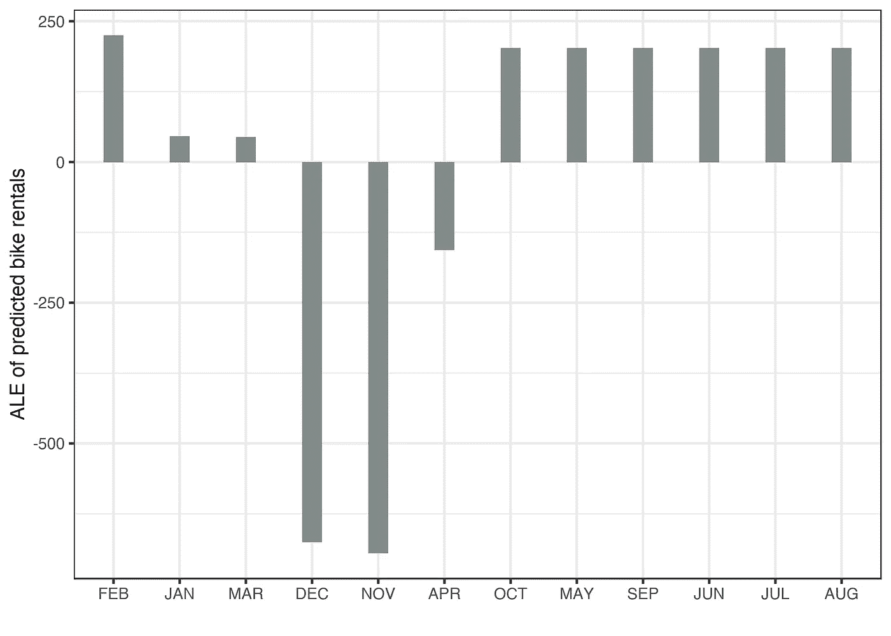

# 可解释的人工智能(XAI)方法第三部分——累积局部效应(ALE)

> 原文：<https://towardsdatascience.com/explainable-ai-xai-methods-part-3-accumulated-local-effects-ale-cf6ba3387fde>

## 关于累积局部效应(ALE)的教程，侧重于它的使用、解释和利弊

在[像素点](https://www.pexels.com/ko-kr/photo/7191988/)免费使用照片。

# 对以前职位的审查

可解释的机器学习(XAI)指的是努力确保人工智能程序在目的和工作方式上是透明的。[1]这是我打算写的 XAI 系列文章中的第三篇。

在我的第一篇[帖子](/explainable-ai-xai-methods-part-1-partial-dependence-plot-pdp-349441901a3d)中，我介绍了部分相关(PD)和**部分相关图(PDP)** 的概念，这是一种使用那些 PD 值来显示特征对目标变量的边际平均影响的可视化。[2]我建议在继续下一步之前先看一下[的帖子](/explainable-ai-xai-methods-part-1-partial-dependence-plot-pdp-349441901a3d)！

在我的第二篇[帖子](/explainable-ai-xai-methods-part-2-individual-conditional-expectation-ice-curves-8fe76919aab7)中，我介绍了**个人条件期望(ICE)** 曲线，它在与 PDP 联合使用时特别有效。[3]是因为我们可以同时观察到特性的整体/平均效果和特性的观察级效果！

# **累积局部效应(ALE)与标准 PDP**

累积局部效应(ALE)与部分相关(PD)的概念相似，都旨在描述特征如何影响模型的平均预测。ALE 确实比 PD 具有竞争优势，因为它解决了当感兴趣的特征与其他特征高度相关时 PD 中出现的偏差。让我们看看，由于计算部分相关性的方式，部分相关性图(PDP)中的特征之间的相关性是如何成为问题的。

假设我们有一个简单的回归模型，它根据其他身体特征，如体重、性别、父亲的身高等，预测一个人的身高。这里，我们感兴趣的是理解体重对目标变量的边际平均效应，在本例中，目标变量是身高。对于权重的每个网格值，我们将用该网格值替换整个权重列，计算预测值，并对它们进行平均。这将是权重网格值的部分相关值。然而，为了计算部分依赖图，我们可能不得不容忍一些不现实的情况。例如，如果体重的网格值是 30kg，我们将所有观察的体重替换为 30kg，即使是像{性别:男性，父亲身高:185cm …}这似乎不太可能。

ALE plots 解决了这个问题，它计算预测值的**差值，而不是平均值。 ***用“差异”代替“平均值”可以让我们屏蔽相关特征的影响。***【4】**

Molnar 的可解释机器学习书用两个简短的句子很好地对 PDP 和 ALE 进行了比较。

> **PDP** :“让我向您展示当每个数据实例都具有该特性的值 v 时，模型平均预测的结果。我忽略了值 v 是否对所有数据实例都有意义。”
> 
> v.s
> 
> **ALE 图**:“让我向您展示模型预测如何在 v 周围的一个小“窗口”中针对该窗口中的数据实例改变**。”[4]**

# 理论和解释

Molnar 的[可解释机器学习书籍](https://christophm.github.io/interpretable-ml-book/ale.html)涵盖了 ALE 的理论，非常深入和详细。我将把重点放在解释和应用上！

以下节选自这篇[博客文章](https://www.enjine.com/blog/interpreting-machine-learning-models-accumulated-local-effects/)，很好地总结了 ALE works 如何与其名称相匹配。

> 一个足够小的窗口允许我们对这段时间内的变化做出相当准确的估计。然后通过*累加*所有的局部区域，我们就能够全面了解我们的输入对输出的影响。因此，如果我们想知道 20 摄氏度的一天对我们的跑步者有什么影响，我们会找到 21 度的影响，然后减去 19 度的差异。通过**平均**预测中的变化，我们可以确定该窗口的特征的**效果**。然后，我们对数据重复这个过程，并**累加** …

## 数字特征的解释…

对于单个数值特征，ALE 值可以解释为与数据 的平均预测相比，该特征在某一值的 ***主效应。这种解释是可能的，因为 ALE 图以零为中心，所以 ALE 曲线的每个点都代表与平均值预测的差异。[4]例如，特征值 12.2 的 ALE 值为 5 将意味着如果感兴趣的特征等于 12.2，则它将产生的预测比平均预测高 5。***

## 两个数字特征的解释…

二阶效应是在我们考虑了特征的主要效应之后，特征的附加交互效应。[4]

## 对分类特征的解释…

顾名思义，效果朝着某个方向累积，因此特征值需要有一个“**顺序**”。对于分类特征，在计算 ALE 值之前，应首先设置变量中值的顺序。

确定分类变量中值的顺序的一种方法是，根据其他特征将具有高相似性的值视为连续顺序或彼此接近的顺序。为了计算数值特征之间的相似性，使用 Kolmogorov-Smirnov 距离，对于分类特征，使用相对频率表。[4]

可解释机器学习书籍中的自行车租赁数量预测示例—分类变量“月”的 ALE 图

可解释的机器学习书提供了一个预测自行车租赁数量的例子。[4]从上面分类变量的 ALE 图中可以看出，性质相似的月份值排列在一起或彼此接近。例如，被认为是冬季或早春的月份，如 12 月、11 月、3 月和 1 月被聚集在一起。同样，高温的夏季月份在 x 轴上彼此相邻。这是有意义的，因为我们根据表征每个月的其他特征的相似性分数给这些值赋予了顺序。

至于解释，这类似于我们解释一个数值变量。12 月份的 ALE 值约为-660，这意味着在 12 月份，预测的自行车租赁数量将比平均预测值低 660 辆。我们也可以通过观察每个条形图的绝对长度来说明影响的大小。例如，一月、三月和四月的柱线非常短，这意味着与其他月份相比，它们对自行车租赁预测数量的影响。

# **麦酒地块的利与弊**

如前所述，在我们比较 PDP 和 ALE 图的部分，即使感兴趣的特征与其他特征相关，我们的 ALE 图也是无偏的。但是 PDP 肯定比 ALEs 更容易理解。另一方面，ALE 图在解释图时需要注意细节，这取决于您正在处理的特征类型(如数值、分类)以及您正在查看的交互特征的数量。

尽管如此，对 ALE 图的解释仍然相当简单。它是“在给定值的条件下改变特征对预测的相对影响”。[4]此外，ALE 图以零为中心，这使得很容易理解 ALE 曲线中的每个点都代表平均预测值的差异。

然而，ALE 图也有其局限性。它比 PDP 或 ICE 图更难解释。这种解释也通常被限制在所定义的“窗口”或“间隔”内。如果特征高度相关(这是经常发生的情况)，解释跨区间的影响是不可能的。请记住，影响是在每个区间内计算的，并且每个区间包含不同的数据点集合。这些计算出的效应被累加(因此命名为“累加的”局部效应),只是为了使线平滑。

ALE 图的另一个麻烦之处是需要确定最佳间隔数。如果定义了太多的间隔，图形中的起伏会使绘图变得嘈杂。减少间隔的数量将使图更加稳定，但这是有代价的-它可能会掩盖模型中存在的一些复杂性或相互作用。

# 履行

ALE 图可以用 R 和 Python 实现。

如果你正在使用 R…

*   ALEPlot 包
*   iml 包

都是值得一看的好地方！

如果你正在使用 Python…

*   ALEPython 包
*   Alibi 套餐

是最受欢迎的。

这里有一些很好的文档和博客帖子，它们使用了上面的包来实现 ALE 图，所以请查看它们！

    

ALIBI 包文档

# 参考

[1] [可解释的人工智能(XAI)](https://www.techopedia.com/definition/33240/explainable-artificial-intelligence-xai) (2019)，Technopedia

[2] S. Kim，[《可解释的人工智能(XAI)方法第一部分—部分依赖图(PDP)](/explainable-ai-xai-methods-part-1-partial-dependence-plot-pdp-349441901a3d) (2021)，走向数据科学

[3] S. Kim，[《可解释的人工智能(XAI)方法》第 2 部分—部分依赖图(PDP)](/explainable-ai-xai-methods-part-1-partial-dependence-plot-pdp-349441901a3d) (2021)，走向数据科学

[4] C. Molnar *，* [可解释机器学习](https://christophm.github.io/interpretable-ml-book/ice.html) (2020)