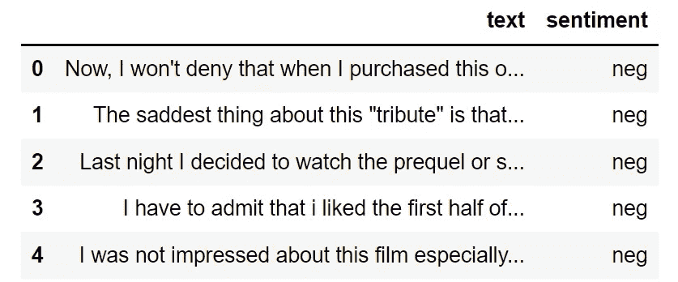
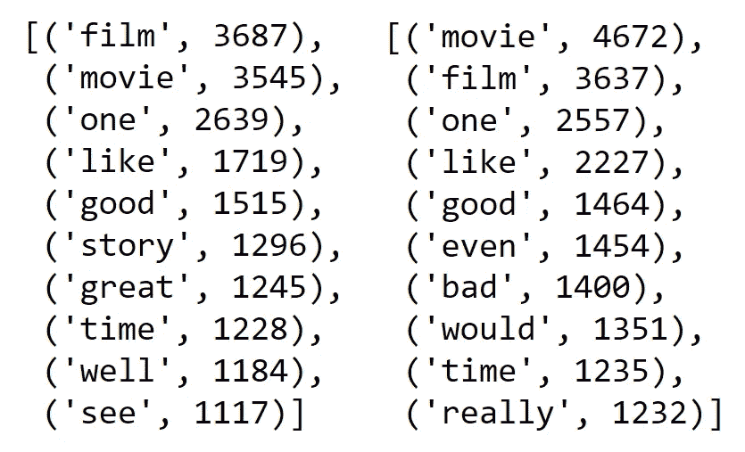
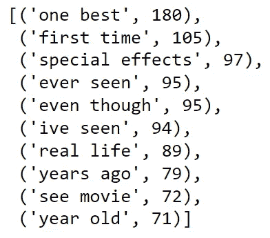
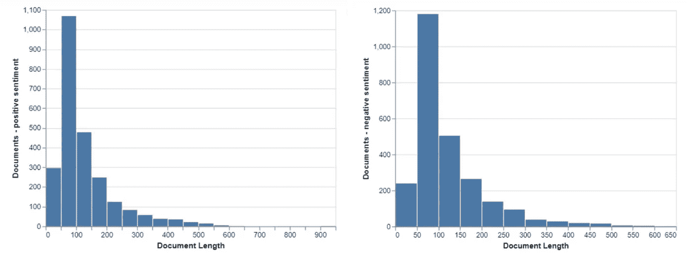

# 文本数据的探索性数据分析——用 Text Data 做得更快

> 原文：<https://towardsdatascience.com/exploratory-data-analysis-of-text-data-do-it-faster-with-textdata-f7354dc72269>

## TextData 简化了文本数据的探索性数据分析，并节省了大量编码时间

由[马库斯·斯皮斯克](https://unsplash.com/@markusspiske?utm_source=medium&utm_medium=referral)在 [Unsplash](https://unsplash.com?utm_source=medium&utm_medium=referral) 上拍摄

数据科学工作流程通常包括在第一阶段收集、预处理和清理数据。接下来是探索性数据分析(EDA ),千万不要跳过。通过查看数据、显示汇总统计数据和绘制图表，我们可以了解数据集的结构、发现异常值、观察变量的分布并做出初始假设。文本数据也不例外。

在 python 中执行文本数据的基本 EDA，我们可以使用`pandas,`描述数据，使用`seaborn`或`plotly`绘制直方图和热图，进行一些编程并接收术语频率，使用`nltk`接收二元模型和三元模型。最后，术语频率可以用`matpltlib`或`plotly`显示在条形图中。有许多其他的方法可以做到这一点，虽然这很有趣，但它需要相当多的编码时间。

[**TextData**](https://github.com/maxblee/text_data) 是一个 python 库，旨在探索和分析文本数据。它提供了文本数据探索的主要方法，旨在用尽可能少的代码高效地完成基本的 EDA 任务。

在本文中，您将通过 TextData 了解基本的 EDA 方法:

*   文本语料库的数据总结
*   二元模型和三元模型计算
*   数据可视化(直方图和条形图)。

经典的 [IMDb 50K 电影评论](https://www.kaggle.com/datasets/atulanandjha/imdb-50k-movie-reviews-test-your-bert)数据集非常适合我们的目的(数据许可在这里是)。已经清理了 5000 篇评论的子集(删除了数字、停用词和特殊字符)并用于语料库。

# 1.准备语料库

数据如下所示:

图 1: IMDb 数据集

我们从评论的文本中创建语料库如下:

让我们也将语料库分成正面和负面情感子集，并设置它们的索引:

一旦我们创建了语料库，我们就可以使用几个函数来搜索包含它们的特定单词、短语或文档。这里，我们在语料库中查询包含二元“优秀电影”的评论的数量和百分比:

*IMDb 数据集包括* 195 *条包含该短语的评论，这使得*占我们子集中所有评论的 3.9 *%。*

照片由 [max fuchs](https://unsplash.com/@designfuchs?utm_source=medium&utm_medium=referral) 在 [Unsplash](https://unsplash.com?utm_source=medium&utm_medium=referral) 上拍摄

# 2.总结数据

我们现在将更仔细地研究语料库结构，总结数据并做一些基本的频率分析。

*语料库中有* 49 539 *个独一无二的单词，总共有* 611 098 *个单词。*

带有正面和负面情绪标签的评论中最常见的单词是这样打印的:

图 2:按情感标签排列的前 10 个最常出现的词

现在让我们打印 10 个最常见的正面评论。相应地，我们可以计算最频繁的三元模型。

图 3:十大最常见的二元模型，积极情绪

在`numpy`的帮助下，我们将绘制一个条形图，显示该子集中最常见的二元模型:

非常奇怪的是，条形图描绘了无序的短语。

图 4:十大双图条形图，积极情绪

# 3.检查分布情况

检查数据分布是 EDA 的必要部分。TextData 提供易于实现的直方图，代码简单。

这里，我们按情感标签绘制评论长度的分布:

我们可以看到，不开心的评论者(带有负面情绪的评论)倾向于写出他们的心声，而满意的评论者则写得稍微短一些。

图 5:按情感标签划分的评论长度直方图

*TextData 还提供了一些其他的实用方法(热图、频数图、对数比值比等。).不要犹豫，自己去探索它们* [*这里*](https://docs.maxblee.com/text_data/index.html) *。*

# **结论**

TextData 提高了人们处理文本数据的效率。一个很大的优势是与高质量数据可视化的强大库 Altair 的集成。它进一步加快了 EDA 研究，并使编码更短。

不利的一面是， *TextData* 目前没有提供一个完整的文本分析工具所能提供的一些图形(例如，word cloud)。该库似乎仍在开发中，一些小问题(例如，图 4 中无序的条形图)应该在以后的版本中解决。

完整的 python 代码可以在我的 [GitHub](https://github.com/PetrKorab/Exploratory-Data-Analysis-of-Text-Data---Do-it-Faster-with-TextData/blob/main/analysis_medium.ipynb) 上找到，所以请放心使用。

*PS:你可以订阅我的* [*邮件列表*](https://medium.com/subscribe/@petrkorab) *每次我写新文章都会收到通知。如果你还不是中等会员，你可以在这里加入*<https://medium.com/@petrkorab/membership>**。**