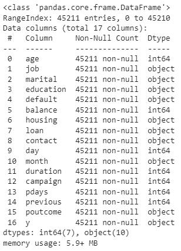
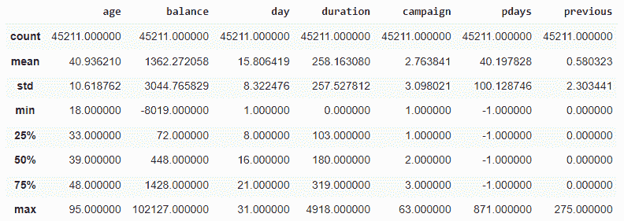
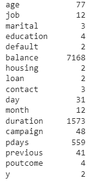
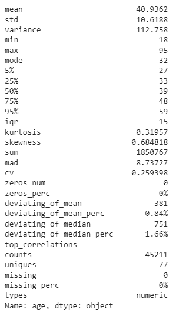

# 使用数据切片探索熊猫数据框

> 原文：<https://towardsdatascience.com/explore-pandas-dataframe-with-datatile-59c425b55d01>

## *只需几行代码就能快速洞察您的数据*


艾米丽·莫特在 [Unsplash](https://unsplash.com?utm_source=medium&utm_medium=referral) 上的照片

# 介绍

当开始使用一个新的数据集时，获得关于 Pandas 数据帧中各列的更多信息的一个常用方法是使用`.info()`和`.describe()`方法。

`.info()`方法提供了数据帧中每一列的空值数量和数据类型的信息。

```
import pandas as pddf = pd.read_csv('path/to/bank.csv', sep = ';') #reference[1]
df.info()
```



作者图片

`.describe()`方法为数据帧中的数字列提供汇总统计信息。

```
df.describe()
```



作者图片

要查找每列中不同值的数量

```
df.apply(lambda x: x.nunique())
```



作者图片

要查找每列中缺失值的百分比

```
df.isnull().sum() * 100 / len(df)
```


作者图片

任何列中都没有空值。

如果我们可以用一个命令而不是 4 个不同的命令来获取所有这些信息，这不是很好吗？

# 数据切片

DataTile 设想成为一个用于管理、汇总和可视化数据的库。它以前被称为`pandas-summary`,后来被重命名为`DataTile`,这是一个更具雄心的项目，具有几个计划的功能和增强功能，以添加对可视化、质量检查、将摘要链接到版本以及与第三方库集成的支持。许多功能仍在开发中，让我们看看现在有什么可用的。

安装数据切片

```
!pip install datatile
```

导入库并加载数据

```
import pandas as pd
from datatile.summary.df import DataFrameSummarydf = pd.read_csv('/path/to/bank.csv', sep = ';')
```

快速浏览数据

```
dfs = DataFrameSummary(df)
dfs.summary()
```


作者图片

`.summary()`方法用两行代码返回每一列的缺失值的百分比、唯一值的数量、数据类型和汇总统计信息。

按数据类型查找列数

```
dfs.columns_types
```


作者图片

我们还可以只获取选定列的信息。如果数据集很大，并且计算所有列的信息需要很长时间，这将非常有用。

```
dfs['age']
```



作者图片

# 结论

在本文中，我们研究了如何使用 DataTile 用几行代码概括一个 Pandas 数据帧。DataTile 仍处于早期阶段，因此与其他低代码 EDA 软件包(如 Pandas-Profiling、AutoViz 和 SweetViz)相比，它可能缺乏高级功能。尽管如此，DataTile 的未来计划听起来令人兴奋和乐观，这绝对是值得期待的。

# 参考

[1]来自 [UCI 知识库](https://archive-beta.ics.uci.edu/ml/datasets/bank+marketing)的数据集。由 4.0 在 CC 下授权。c .萨卡尔&金尤美·卡斯特洛创建的数据集。

[加入 Medium](https://medium.com/@edwin.tan/membership) 阅读更多这样的故事。