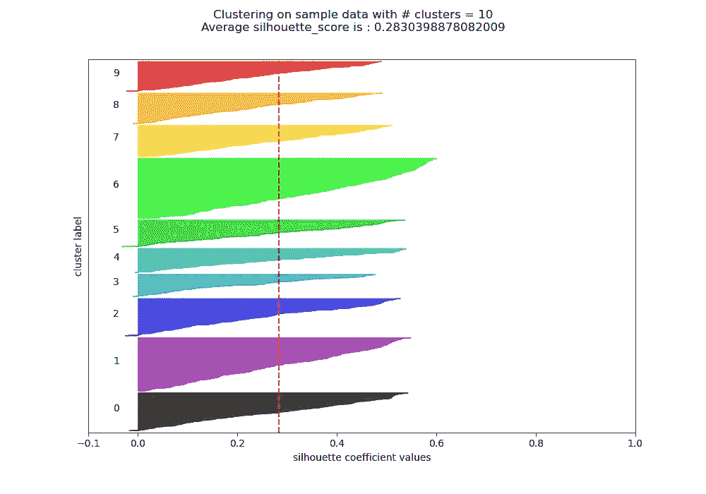
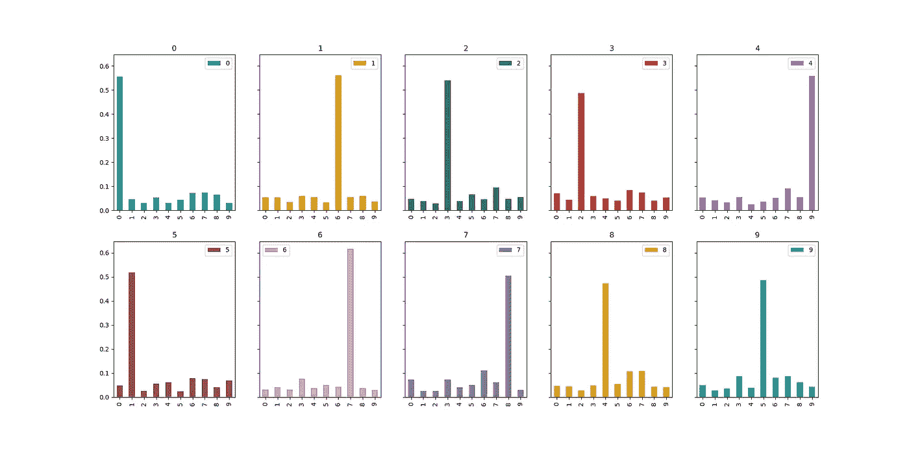

# 利用无监督主题建模探索大型文档集—第 2/4 部分

> 原文：<https://towardsdatascience.com/exploring-large-collections-of-documents-with-unsupervised-topic-modelling-part-2-4-8897248053d3>

## 通过聚类了解文档分布

图片作者。

在这一系列的文章中，我们将重点探索基于主题建模的大量未标记文档。我们假设除了语料库的上下文之外，我们对语料库的内容一无所知。我们的目标是用一些新的、量化的知识来完成对语料库中所讨论内容的探索。

*   转到本系列的[第 1 部分。](/exploring-large-collections-of-documents-with-unsupervised-topic-modelling-part-1-4-404f4931dab7)

## 关于前一部分…

在这个系列的[第一部分](/exploring-large-collections-of-documents-with-unsupervised-topic-modelling-part-1-4-404f4931dab7)中，我们看到了如何执行主题建模，并且回顾了几种尝试和解释提取的主题的方法(这不是一个简单的任务！).我们收集的文件由 1904 个短篇恐怖故事组成，摘自[r/short cary stories subreddit](https://www.reddit.com/r/shortscarystories/)。如果你想学习如何自己提取这些和其他的，请阅读我的帖子[，详细介绍整个过程](/how-to-collect-a-reddit-dataset-c369de539114)。根据 Reddit 的[使用条款](https://www.reddit.com/wiki/api-terms)，这些数据是使用 Reddit 的 API ( [PRAW](https://praw.readthedocs.io/en/stable/) 和 [PSAW](https://pypi.org/project/psaw/) 收集的。和前一部分一样，我们假设文本已经过充分的预处理，文档中的单词由一个空格分隔。

最后，从一个完全未知的短篇恐怖故事集开始，我们学到了以下内容:

1.  一些恐怖故事发生在圣诞节期间，或者以某种方式与一年中的那个时候有关。
2.  一些恐怖故事涉及家庭成员。
3.  一些恐怖故事涉及有趣的物体或地点。
4.  我们知道哪些恐怖故事具有这些特征，并能准确量化它们具有多少这些特征:
    →所有故事中 0.5%的故事在 topic 0 — Christmas 中的权重超过 0.5；
    → 2.3%的所有故事在主题 7 —感兴趣的物体/位置中的权重超过 0.5；
    → 4.7%的故事在话题 8——家庭成员中的权重超过 0.5。
5.  通过同样的量化，我们可以确定一个给定的故事是否比任何其他故事与这些特征更相关。

这是 4 部分系列的第二部分。让我们开始吧。

# 介绍

## 问题是

从本系列第一部分的结论中，我们看到我们可以做出类似“4.7%的文集以某种方式提到家庭成员”的陈述。但这是我们有目的地去寻找的东西，依赖于特定的查询。我们现在感兴趣的是学习如何概括这种说法，让我们回答以下问题:

1.  就提到的话题而言，所有的恐怖故事都是相似的吗？
2.  如果不是，它们是如何关联或分组的？
3.  如果有多个小组，每个小组讨论什么？

## 拟议解决方案

在本帖中，我们将看到如何依靠聚类技术来回答上述问题。换句话说，我们尝试根据主题分布对文档进行分组，并根据这些结果回答这些问题。

# 履行

## 聚类 101

聚类是试图将给定人群的样本分组到离散的组中的任务。这些样本属于给定的 D 维空间，并且，一般来说，它们越接近，它们越有可能属于同一组或聚类。然而，我们没有一个标签或任何指示，表明具体的样本应该聚集在一起。

那么，我们如何知道样本的一个聚类比另一个更好呢？我们永远无法确定，因为，再说一次，我们没有黄金标准，但我们可以评估 D 维空间中的聚类和样本分布。例如，我们可以说，一个聚类越紧密(低聚类样本方差)，它的定义就越好。我们也可以说，集群之间的距离越大，它们的定义就越清晰。下图举例说明了这些概念(请记住，我们也不知道可能有多少个集群，所以我们需要进行一些实验，或者使用其他指标，我们将在后面的部分中讨论)。我们也在 2D 思考和概念化，因为它更容易形象化，但这很少发生。例如，在我们的 *k* 主题的例子中，每个文档都被投影在一个 *k* 维空间中。

以各种方式在二维空间中对样本进行聚类。图片作者。

## 文档聚类—第一种方法

关注我们的主题建模环境，让我们假设我们的语料库是根据主题分布来描述的。也就是说，对于任何给定的文档，我们都有一个权重向量对应于每一个 *k* 主题。因此，每个文档向量是 *k-* 维空间中的一个样本。

让我们假设我们知道在主题空间中有多少个文档集群。具体说就是 *C=10。*这就是我们如何用 [K-Means](https://scikit-learn.org/stable/modules/generated/sklearn.cluster.KMeans.html) 算法对它们进行聚类:

在上面的代码中，我们用指定数量的集群 *C* 实例化了集群类，然后对主题空间中投影的文档进行集群，返回给每个文档的集群标签。预计文档(变量 *doc_topic* )在本系列第一部分[之后获得。](/exploring-large-collections-of-documents-with-unsupervised-topic-modelling-part-1-4-404f4931dab7)

## 文档聚类—找到理想的聚类数

然而，正如我们之前所说的，我们不知道理想的集群数量，我们也永远无法确切知道。在一个 *D* -dim 空间(其中 *D* 远高于 2)中，应对这一挑战的标准方法是观察样本集群分布指标，并找到集群数量的最佳点。一些常见的指标是:

1.  [**惯性**](https://scikit-learn.org/stable/modules/clustering.html#k-means)对于给定的聚类模型，该度量作为整体给出。它报告每个样本与其最近的聚类中心之间的平方距离之和。惯性越低，聚类的定义越好——但在极限情况下，每个样本都是自己的单样本聚类，具有完美的惯性，但不是很有趣。该度量促进高度凸起的簇，具有尽可能最小的直径。
2.  [**剪影系数**](https://scikit-learn.org/stable/modules/clustering.html#silhouette-coefficient)这个分数范围从-1 到 1，适用于每一个样本。简而言之，一个样本与同一聚类中的所有其他样本越接近，该样本与下一个最近聚类中的所有样本越远，该样本的得分越高。因此，零左右的分数表示重叠的聚类。这个度量促进了高度凸的、分离良好的集群，就像上图中显示的那样。

我们可以通过在一系列值上采取这些措施并找到“最佳点”，即平衡上述权衡，来找到最合适的集群数量。对于惯性，人们通常在图中寻找“肘”，也就是说，惯性只是从这个点稍微减小。这可以被认为是在更多的群中分离样本没有相关的增益。对于轮廓系数，通常寻找使所有样本的平均轮廓系数最大化的聚类数。

我们可以用以下代码绘制这些指标:

这是我们的恐怖故事文档的结果:

主题空间中投影文档的聚类度量。图片作者。

从上面的图中，我们可以看到最大平均轮廓值是用 10 个聚类获得的。我们还在惯性图中看到了一个清晰的“肘”，在相同的集群数下。具体来说，在 2 到 10 个集群之间，惯性下降超过 300 点，而在 10 到 20 个集群之间，惯性仅下降大约 75 点。这是“在更多的群中分离样本没有相关的增益”的经验版本。从这两个图中，我们可以有把握地说 *C=10* 是一个合适的集群数。

## 文档聚类—样本轮廓

既然我们已经决定了合适的集群数量，我们想知道样本是如何分布在这些集群中的。它们中的大部分是在一个巨大的星团中，而其他几个形成了微小的星团吗？还是分布好，分好？绘制每一个样本的轮廓系数，每一个聚类的颜色，可以让我们回答这些问题。

绘制样本轮廓系数的代码如下:

以下是我们 10 组文档的轮廓:

10 个聚类的主题空间中每个文档的轮廓系数。图片作者。

在上面的图中，每条彩色水平线是给定样品的轮廓。如前所述，该值介于-1 和 1 之间。垂直虚线是平均轮廓分数，其与轮廓-惯性度量图中的最大值一致。从该图中，我们得出结论，样本分布似乎几乎是均匀的(除了少数例外)，但是每个聚类都具有密集的质心和分散的样本，因此每个聚类中的轮廓值快速下降。一个理想的、高密度的星团应该有一个类似于水平条的轮廓，而不是我们所拥有的尖三角形。这也反映在平均剪影分数(~0.28)并不太大。

## 文档聚类—他们在讨论什么？

假设我们知道每个主题是关于什么的，那么发现每个集群通常在讨论什么是相当简单的。一种简单的方法是在给定的群集中抽取每个样本，并观察哪些主题是“重要的”，即赋予它们很高的权重。简而言之，我们可以查看每个集群的平均主题分布，以推断该集群中通常讨论的内容。下面是代码和结果:

每个聚类的平均主题重要性，共 10 个聚类(从 0 到 9)。总共有 10 个主题(从 0 到 9)。图片作者。

从上面的图表中，我们可以很容易地得出结论，一般来说，每个集群正在讨论什么。例如，我们可以陈述如下:“群集 0 包含对主题 0 非常重要的简短恐怖故事”。

# 结论

在第二部分([在这里阅读第一部分](/exploring-large-collections-of-documents-with-unsupervised-topic-modelling-part-1-4-404f4931dab7)，我们继续进一步探索我们收集的文件，这些文件我们在开始时一无所知。这一次，我们将重点放在集群上。

我们发现这些文档可以根据它们的主题分布分成 10 个组。我们了解到，这种分组虽然不是完美的，但也是定义良好的。我们还了解到，除了少数例外，这些组的规模大体相同。

我们继续进一步探索每个集群在谈论什么，一般来说，这是由该集群的平均主题分布/重要性给出的。我们了解到，聚类主要基于一个单一的高权重主题，这解释了为什么 *C=10* 是最合适的聚类数(记住 *k=10* 是主题数)。

最后，我们可以将这一分析与第一部分的分析结合起来，并为“话题 X”的陈述添加语义，例如“圣诞节的话题”。

# 下一部分

在本系列的下一部分，我们将再次深入主题本身。我们将试图准确理解每个话题被提及的次数，或少，以及它与总体人口的关系。