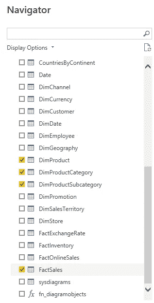
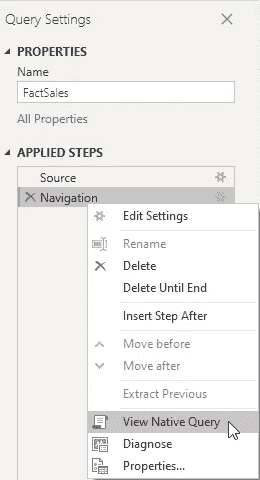
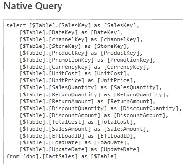
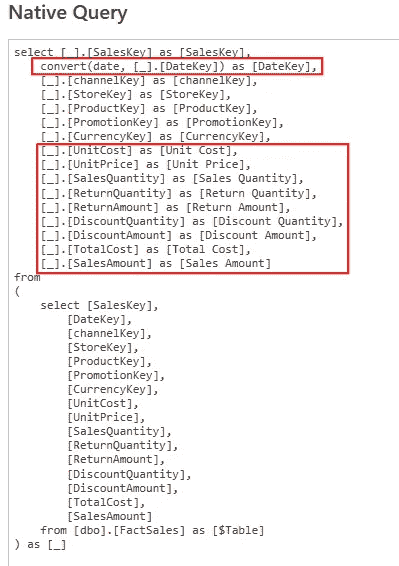
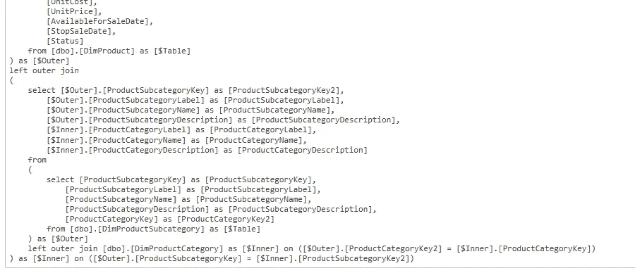
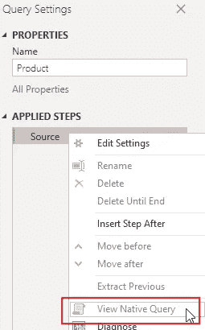
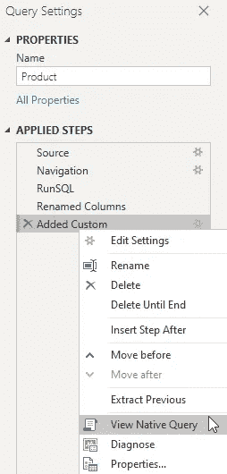

# 探索电力查询中的查询折叠

> 原文：<https://towardsdatascience.com/exploring-query-folding-in-power-query-8288fb3c9c2f>

## 查询折叠是 Power Query 中的一个重要特性，可以将处理步骤卸载到数据源。有了这个特性，电源查询可以减少 CPU 和 RAM 的消耗。让我们看看如何使用它。


由[元素 5 数码](https://unsplash.com/@element5digital?utm_source=medium&utm_medium=referral)在 [Unsplash](https://unsplash.com?utm_source=medium&utm_medium=referral) 上拍摄

# 什么是查询折叠，我们如何使用它？

查询折叠是将超级查询转换推回到源的机制，以减少超级查询的负载。

这只适用于某些数据源，即关系数据库和类似于关系数据库的数据源。

例如，请看下图，其中显示了 Power BI，它从数据库中获取数据:


图 1 —来自数据库的数据(由作者提供)

在 Power 查询中添加转换步骤时，我们希望避免 Power 查询上不必要的负载。

用原生数据库语言 SQL 将这种转换推回到源数据库会很好。

但是我们为什么要拥有它呢？

# 为什么我们需要查询折叠？

您可能知道，关系数据库引擎在管理数据方面非常有效。

关系数据库引擎擅长的操作有:

*   数据排序(排序依据)
*   组合数据(连接/合并)
*   对大量数据执行计算(计算列)
*   只做必要的事情(优化查询)

但最关键的一点是，关系数据库引擎运行在服务器硬件上，这是为了处理大量数据而优化的。这些服务器拥有比我们简陋的笔记本电脑或个人电脑更多的 CPU 内核和内存，处理数据的限制也比我们少得多。

所有支持 SQL 的数据源都可以支持查询折叠。除了明显的关系数据库(如 SQL Server、Oracle、DB/2 等。)，OData sources、Exchange、Active Directory 等都支持查询折叠。

让我们仔细看看。

# 让我们从 SQL Server 数据库中获取数据

现在，我使用我常用的 Contoso 数据库来查看查询折叠的运行情况。

我切换到 Power Query，并使用 Azure SQL 数据库源以导入模式从我的数据库中获取一些表:



图 2 —源表(作者提供的图)

将表加载到 Power Query 后，您可以右键单击其中一个应用的步骤，并查看“查看本地查询”项是否处于活动状态:



图 3 —获取原生查询(作者提供的图)

如果它是活动的，则使用查询折叠，您可以看到 Power Query 生成并发送到源数据库的查询:



图 4 —第一个本地查询(作者提供的图)

在这种情况下，查询很简单，直接发送到源数据库。

# 探索查询折叠

现在，让我们应用一些修改:

*   删除一些列
*   更改列的名称
*   更改列的数据类型

当我得到本机查询时，我看到这样的内容:



图 5 —修改后的原生查询(由作者提供)

如您所见，该查询已经更改，以反映 Power Query 中的步骤。

您可以注意到，该查询不再包含已删除的列，而是直接使用该查询转换 DateKey 列。

这比在 Power Query 中这样做要高效得多，Power Query 会消耗我们计算机中的 CPU 和内存。

现在，让我们做一个更复杂的转换。

为了描述产品，我们有以下层次结构:


图 6 —产品层次结构(作者提供的图)

你可能知道，Power BI 不喜欢这样的表层次结构。Power BI 最适合事实表和维度表之间的单步关系。

目标是将这些表合并成一个产品表。

我们可以使用 Power Query 中的 Merge 转换将产品类别合并到产品子类别中，并将结果合并到产品中(是的，我们可以直接从产品表中执行此操作，因为 Power Query 可以识别数据库中的现有关系，但是让我们看看手动执行此操作时会发生什么):



图 7 —带有合并表的本地查询(由作者提供)

查询要复杂得多，因为它必须合并(连接)源表来形成结果。

但是数据库引擎是为做这类事情而优化的，它将比 Power Query 更好地完成这项任务。

# 不可折叠操作

不幸的是，并不是所有的转换都可以折叠。

但是很容易确定哪个不会折叠:

1.  影响多个源(数据库)的转换
    例如，当您想要合并数据库中的表格和文本文件中的表格时，查询折叠是不可能的，因为文本文件不理解 SQL。
    遗憾的是，这同样适用于合并来自两个不同数据库的数据，即使它们驻留在同一个数据库服务器上
2.  当您应用无法翻译成 SQL
    的复杂转换时，例如，当您使用 M 函数来操作数据时。

您可以在下面参考资料部分的文章中找到关于不可折叠转换的更多信息。

你必须意识到这些限制。因此，在查询折叠不再可能之前，您必须执行尽可能多的转换。这种方法通过将计算卸载到数据库引擎来提高负载性能。

# 本地查询和查询折叠

当从数据库中检索数据时，我们可以编写自己的查询。

例如，假设我们编写了一个 SQL 查询，将三个产品表连接在一起，将结果导入到 Power Query 中:

```
SELECT [P].[ProductKey]
,[P].[ProductLabel]
,[P].[ProductName]
,[P].[ProductDescription]
,[PSC].[ProductSubcategoryName]
,[PSC].[ProductSubcategoryLabel]
,[PSC].[ProductSubcategoryDescription]
,[PC].[ProductCategoryName]
,[PC].[ProductCategoryLabel]
,[PC].[ProductCategoryDescription]
,[P].[Manufacturer]
,[P].[BrandName]
,[P].[ClassID]
,[P].[ClassName]
,[P].[StyleID]
,[P].[StyleName]
,[P].[ColorID]
,[P].[ColorName]
,[P].[Size]
,[P].[SizeRange]
,[P].[SizeUnitMeasureID]
,[P].[Weight]
,[P].[WeightUnitMeasureID]
,[P].[UnitOfMeasureID]
,[P].[UnitOfMeasureName]
,[P].[StockTypeID]
,[P].[StockTypeName]
,[P].[UnitCost]
,[P].[UnitPrice]
,[P].[AvailableForSaleDate]
,[P].[StopSaleDate]
,[P].[Status]
  FROM [dbo].[DimProduct] AS [P]
    INNER JOIN [dbo].[DimProductSubcategory] AS [PSC]
      ON [PSC].[ProductSubcategoryKey] = [P].[ProductSubcategoryKey]
    INNER JOIN [dbo].[DimProductCategory] AS [PC]
      ON [PC].[ProductCategoryKey] = [PSC].[ProductCategoryKey];
```

在超级查询中，如下所示:


图 8 —用本地查询导入表(作者提供的图)

执行此操作时，会自动禁用查询折叠:



图 9 —使用原生查询禁用查询折叠(作者提供的图片)

要启用查询折叠，您必须更改 M 代码，如下面引用的文章中所述([在 Power Query Using Value 中对 SQL 查询进行查询折叠)。NativeQuery()和 EnableFolding=true(克里斯·韦伯的博客)](https://blog.crossjoin.co.uk/2021/02/21/query-folding-on-sql-queries-in-power-query-using-value-nativequery-and-enablefoldingtrue/)。

在我们的例子中，我必须将 M 脚本更改为以下内容:

```
let
Source = Sql.Databases(“sca4tvddemo.database.windows.net”),ContosoRetailDW = Source
                {[Name = “ContosoRetailDW”]}
                 [Data],RunSQL = Value.NativeQuery(
                  ContosoRetailDW,“SELECT [P].[ProductKey]
,[P].[ProductLabel]
,[P].[ProductName]
,[P].[ProductDescription]
,[PSC].[ProductSubcategoryName]
,[PSC].[ProductSubcategoryLabel]
,[PSC].[ProductSubcategoryDescription]
,[PC].[ProductCategoryName]
,[PC].[ProductCategoryLabel]
,[PC].[ProductCategoryDescription]
,[P].[Manufacturer]
,[P].[BrandName]
,[P].[ClassID]
,[P].[ClassName]
,[P].[StyleID]
,[P].[StyleName]
,[P].[ColorID]
,[P].[ColorName]
,[P].[Size]
,[P].[SizeRange]
,[P].[SizeUnitMeasureID]
,[P].[Weight]
,[P].[WeightUnitMeasureID]
,[P].[UnitOfMeasureID]
,[P].[UnitOfMeasureName]
,[P].[StockTypeID]
,[P].[StockTypeName]
,[P].[UnitCost]
,[P].[UnitPrice]
,[P].[AvailableForSaleDate]
,[P].[StopSaleDate]
,[P].[Status]
  FROM [dbo].[DimProduct] AS [P]
    INNER JOIN [dbo].[DimProductSubcategory] AS [PSC]
      ON [PSC].[ProductSubcategoryKey] = [P].[ProductSubcategoryKey]
    INNER JOIN [dbo].[DimProductCategory] AS [PC]
      ON [PC].[ProductCategoryKey] = [PSC].[ProductCategoryKey]”,
null,
**[EnableFolding = true]**
)
in
RunSQL
```

请注意，我已经删除了查询末尾的分号。

这是必要的，因为在执行查询折叠时，Power query 会将此查询包含在外部查询中。

这意味着这种方法只适用于不在每个查询末尾强制使用分号的数据库引擎，如 SQL Server 和 Postgres 等。

现在本地查询选项是可用的，并且在添加转换后仍然可用。因此，这些转换被合并到源数据库中:



图 10 —修改 M 代码后获得原生查询(图由作者提供)

# 结论

当您访问数据库时，您应该知道查询折叠是如何优化数据加载性能的。

然后，一旦将一个源中的数据与另一个源中的数据组合起来，就应该注意转换的顺序，以便将尽可能多的转换推送到源数据库中。

如果你只有几千行也没关系。但是，一旦装载了数百万行，性能就变得至关重要。

如您所见，利用查询折叠的强大功能并不需要了解 SQL。只需查看查看原生查询的选项是否可用，或者不查看查询折叠是否发生。

当然，你可以开始学习 SQL，直接在查询时进行所有的转换。

你决定什么对你最好。

感谢您的阅读。


照片由[乔恩·泰森](https://unsplash.com/@jontyson?utm_source=medium&utm_medium=referral)在 [Unsplash](https://unsplash.com?utm_source=medium&utm_medium=referral) 上拍摄

# 参考

有关超级查询和查询折叠如何工作的详细信息，请参阅以下资源:

*   [Power Query 中查询求值和查询折叠概述(MS 文档)](https://docs.microsoft.com/en-us/power-query/query-folding-basics)
*   [PowerQuery 查询折叠(MS 文档)](https://docs.microsoft.com/en-us/power-query/power-query-folding)(务必阅读本文末尾链接的文章)
*   [增强查询中的查询折叠以提高性能(MSSQL 提示)](https://www.mssqltips.com/sqlservertip/3635/query-folding-in-power-query-to-improve-performance/)
*   [使用值对 SQL 查询进行查询折叠。NativeQuery()和 EnableFolding=true(克里斯·韦伯的博客)](https://blog.crossjoin.co.uk/2021/02/21/query-folding-on-sql-queries-in-power-query-using-value-nativequery-and-enablefoldingtrue/)
*   [原生查询上的查询折叠—超级查询|微软文档](https://docs.microsoft.com/en-us/power-query/native-query-folding)
*   [克里斯·韦伯博客上“查询折叠”的搜索结果](https://blog.crossjoin.co.uk/?s=Query+folding&submit=Search)

一定不要错过@Nikola Ilic 关于查询折叠的文章。

我使用 Contoso 样本数据集，就像我以前的文章一样。数据集可以在 MIT 许可下自由使用，如这里的[所述](https://github.com/microsoft/Power-BI-Embedded-Contoso-Sales-Demo)。

下载链接在这里:[从微软官方下载中心](https://www.microsoft.com/en-gb/download/details.aspx?id=18279)下载面向零售业的微软 Contoso BI 演示数据集。

或者，您可以使用 SQLBI 的工具 [Contoso 数据生成器](https://www.sqlbi.com/tools/contoso-data-generator/)来生成 Contoso 数据集的副本。

[](https://medium.com/@salvatorecagliari/membership) [## 通过我的推荐链接加入 Medium-Salvatore Cagliari

### 阅读萨尔瓦托勒·卡利亚里的每一个故事(以及媒体上成千上万的其他作家)。您的会员费直接…

medium.com](https://medium.com/@salvatorecagliari/membership)