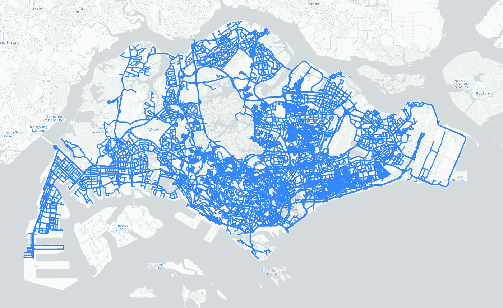
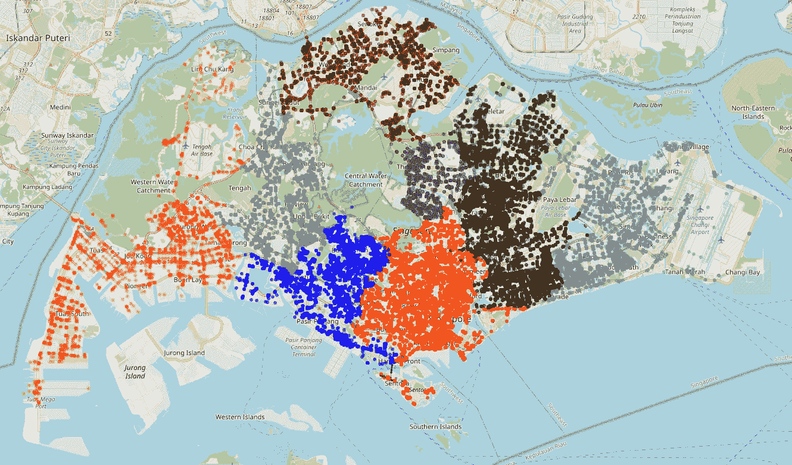

# 使用 OpenStreetMap 的道路网络和街区

> 原文：<https://towardsdatascience.com/exploring-road-networks-and-neighborhoods-with-openstreetmap-3e133becb60d>

## 使用社区检测和 K 均值聚类等常用聚类算法，通过 OpenStreetMap 工具确定新加坡的社区

照片由 [shawnanggg](https://unsplash.com/@shawnanggg?utm_source=medium&utm_medium=referral) 在 [Unsplash](https://unsplash.com?utm_source=medium&utm_medium=referral) 上拍摄

邻里是我们生活、工作和玩耍的地方，已经成为我们身份不可或缺的一部分。街区是由各种自然和人为因素形成的，包括历史、文化、政治、人口和地理。

那么，我们如何区分社区呢？道路网络让我们能够逆向工程城市规划者如何组织社区并在它们之间划定界限。这种方法在调查城市地区的社区时特别有用，因为城市地区的连通性更高，交通网络更密集(因此有更多的节点)可供我们分析。

在这篇文章中，我们旨在研究新加坡这个城市国家的道路网络是如何影响邻里组织的。新加坡是一个东南亚小国，也是世界上城市化程度最高的城市之一。自独立以来，已经进行了大量的城市规划来发展城市，社区已经成为高度连接的微观经济，居民可以方便地获得他们的服务和设施。这极大地影响了道路网络的结构

首先，我们可以使用 [OSMnx Python 包](https://osmnx.readthedocs.io/en/stable/)从 OpenStreetMap (OSM)导入数据，以便下载可驾驶的城市网络。我们可以用[叶子](https://python-visualization.github.io/folium/)来可视化下载的路网。

图 1:新加坡的道路网(使用薄层绘制，图片由作者提供)

上面的道路网络被表示为一个图形，它是节点和边的集合。[图](https://www.tutorialspoint.com/graph_theory/graph_theory_introduction.htm)被定义为节点(或点)和边(点之间的连接/关系)的集合。在地理空间环境中，每个节点表示交叉点或弯曲处，边将节点连接在一起形成道路。每个节点(或地图上的点)还包含纬度和经度等属性，为我们提供节点和边在地图上的位置。

使用我们的图，我们现在可以使用图聚类，使用我们将在以下段落中探索的一些常见算法，将地理上和结构上彼此更接近的节点和边分组。

## 社区检测

我们要试验的第一种聚类方法是 Louvain 社区检测方法，在划分一个图后最大化模块性(参见本文的[这里的](https://iopscience.iop.org/article/10.1088/1742-5468/2008/10/P10008))。这种优化算法将一个图(或网络)分割成更紧密连接的社区，并且以一种相当有效的方式来完成。

在我们的分析环境中，社区检测是一种根据网络的结构特征将道路网络分成社区的方法，而不是使用坐标。我们断言，与邻里之间(通常由主干道或高速公路连接)相比，邻里之间将有更密集的(即连接更紧密的)道路网络，这种结构差异将允许我们筛选出我们的个体社区。

为了可视化不同的聚类(即邻域)，我们可以将节点(交叉点或弯曲点)绘制到 OSM 图上。不同的颜色代表不同的集群，总共有 10 个集群。

图 2:使用社区检测识别的集群(Tuas 检查站的最后一个粉色集群，几乎不可见)(图片由作者提供)

## k 均值聚类

我们在这里使用的 K-means 聚类算法利用节点的坐标来确定它们属于哪个邻域。首先，我们确定聚类的数量。此后，该算法通过最小化成本函数(惯性)来选择质心，以确保簇内的节点尽可能彼此靠近。更多信息，你可以在这里阅读[。](https://scikit-learn.org/stable/modules/clustering.html#k-means)

在我们的例子中，K-Means 聚类是一种从地理上(而不是结构上)确定我们的聚类的方法。街区通常被某些地理特征所分隔。在新加坡，这些可能是雨林、水体或空军基地。此外，邻域内的节点也可能在地理上彼此更接近。为了使用我们之前的方法进行标准化，我们将集群的数量预设为 10。

图 3:使用 K 均值聚类识别的聚类(图片由作者提供)

## 结果

这两种聚类方法产生了非常相似的结果，并且与当今新加坡的实际社区非常吻合。这是新加坡的区域划分图。

图 4:基于各自市议会的新加坡社区(图片来自[维基媒体](https://commons.wikimedia.org/w/index.php?curid=112207510))

从上图中可以看出，我们的聚类算法很好地反映了新加坡的社区，并且可以很好地衡量我们应该如何根据社区之间的物理连接程度来区分不同的社区。

比较这两种不同的方法，我们看到使用 K-Means 聚类的邻域之间的分裂要整齐得多，因为更关注节点之间的地理差异。然而，社区检测方法有时可以更准确地反映邻域，因为邻域不能总是被直线分开。

我希望这是地理空间数据分析、聚类和数据可视化的一次有趣尝试。要查看本文中使用的代码，请单击此处的。

## 参考资料:

*   OpenStreetMap(【https://www.openstreetmap.org/copyright】T2
*   大型网络中社区的快速展开，Vincent D Blondel，Jean-Loup Guillaume，Renaud Lambiotte，Renaud Lefebvre，统计力学杂志:理论与实验 2008(10)，P10008 (12pp)
*   图 4 来自 AridCeption —自己的作品，CC BY-SA 4.0，【https://commons.wikimedia.org/w/index.php?curid=112207510 