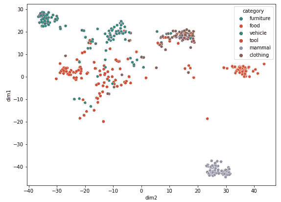
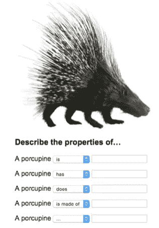
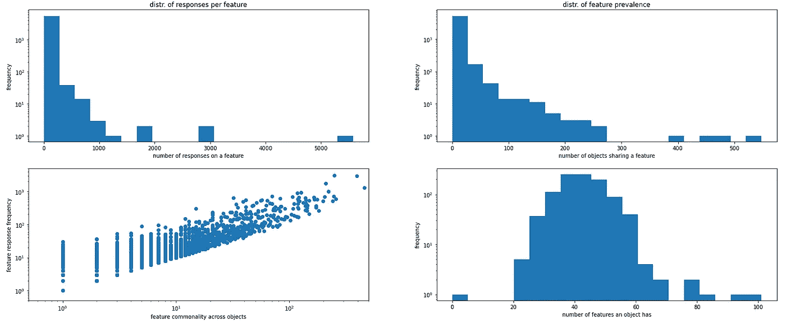
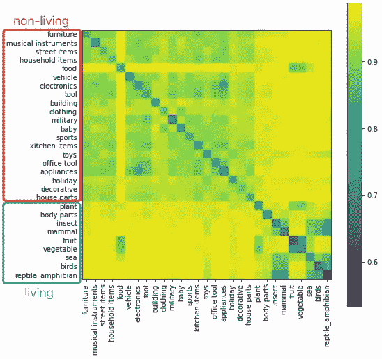
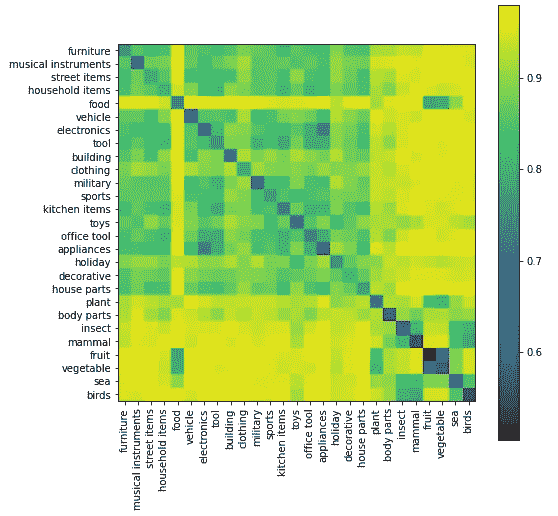
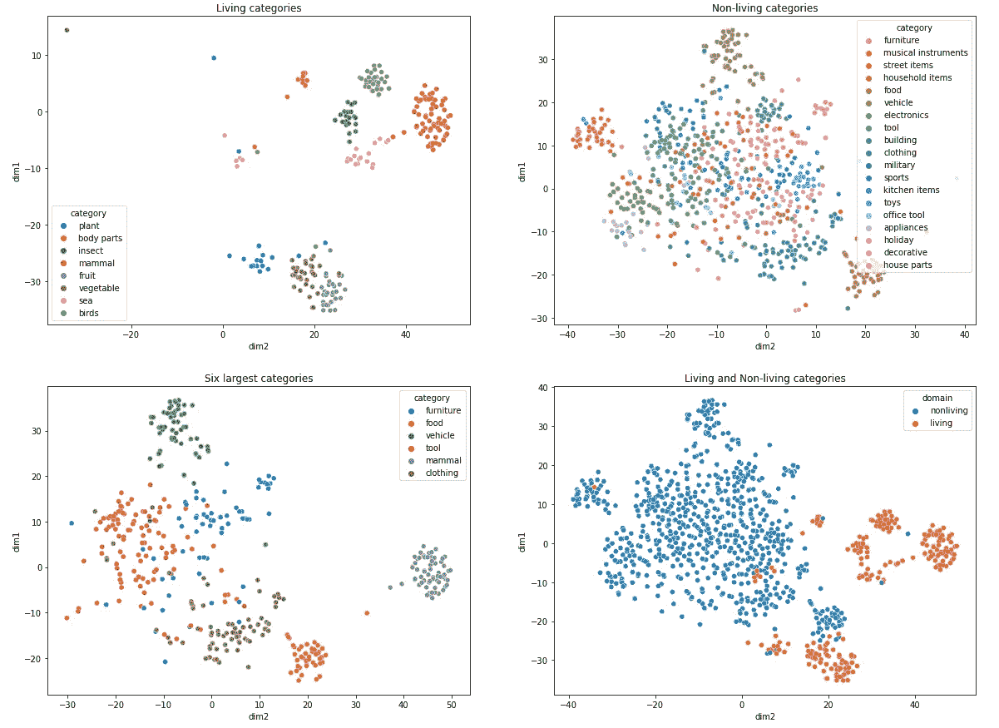
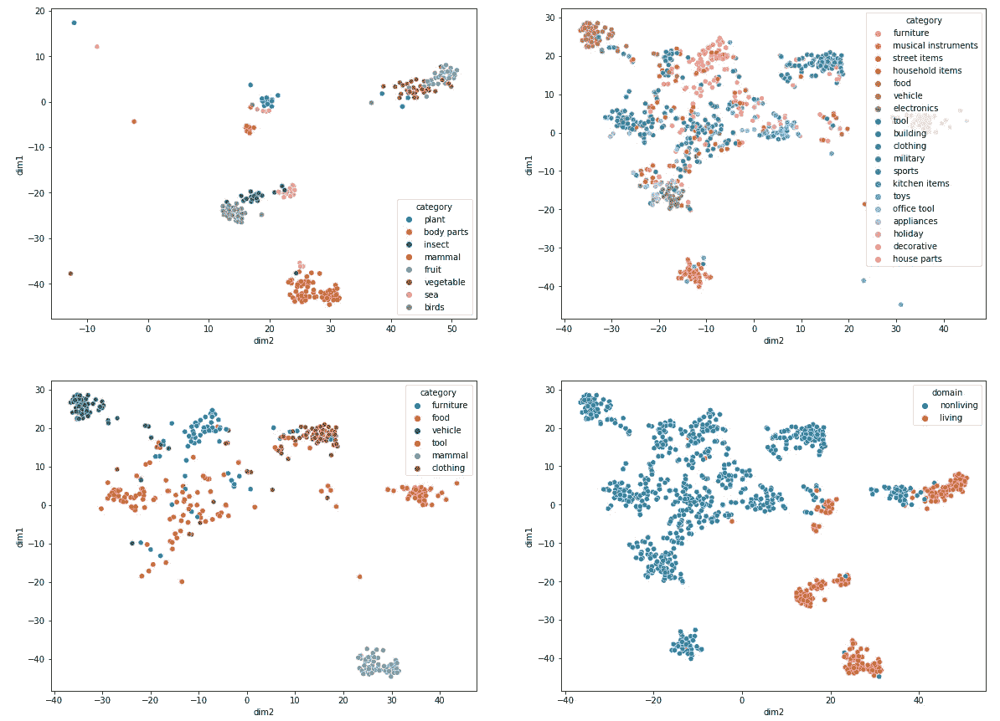

# 探索人类对常见事物知识的特征空间

> 原文：<https://towardsdatascience.com/exploring-the-feature-space-of-human-knowledge-about-common-objects-e86940c1638a>

# 探索人类对常见事物知识的特征空间

## 人脑能够将日常生活中生动感知的事物和瞬间加工成抽象的概念和语义知识

作者图片

理解人类知识的本质一直是心理学的一个中心问题，对于人工智能领域也具有理论和实践意义。人类知识的一个关键特征是其结构化的性质，这使得新的信息片段(例如，一个人第一次看到的植物)可以通过将其*整合到*现有的**类别**(兰科- >芦苇属)中而被有效地学习。同时，这些类别是建立在人们随着时间的推移已经经历的具体信息(例如，不同的兰花种类)上的。

我们如何对语义知识进行定量理解？一种方便的方法是以无监督的方式从大的文本语料库中计算单词嵌入(例如，word2vec、GloVe ),但是完全理解嵌入空间的含义仍然是一个挑战。另一种方法，具有更好的可解释性(尽管更加劳动密集型)，是从人类参与者那里获得概念的描述/标签。标记概念的结构化数据集可以用属于每个单独概念的可解释语义属性列表来管理。最近在这一领域的努力包括我目前工作的研究小组的工作(见我们的论文，由 Mariam Hovhannisyan 牵头:[https://link . springer . com/article/10.3758/s 13421-020-01130-5](https://link.springer.com/article/10.3758/s13421-020-01130-5))(如果你有进一步的兴趣，也可参见麦克雷小组的精彩作品[https://sites.google.com/site/kenmcraelab/contact](https://sites.google.com/site/kenmcraelab/contact))。

在我们小组的研究中，566 名参与者在亚马逊机械土耳其人平台上被招募来执行关于 995 个物体概念的描述任务。对于每个物体，参与者都被展示了该物体的样本图像，并被提示使用下拉菜单和文本框来标记/描述 5 个独特的特征。然后，所有参与者的回答按对象进行汇总，这导致了对所有对象特征的 **5559 个独特描述**。换句话说，每个对象可以被视为位于一个 **5559 维语义特征空间中的某处。**此外，每个对象还被手动分类为 29 个类别中的一个，以及生物或非生物领域。

对象描述任务的示例试验。资料来源:Hovhannisyan 等人，2021，《记忆与认知》。[https://doi.org/10.3758/s13421-020-01130-5](https://doi.org/10.3758/s13421-020-01130-5)CC-BY 4.0

在下文中，我将首先给出数据集的简要概述，然后讨论不同对象之间相似性的可视化和量化。

# **1。对 995 个现实世界对象的人类知识的结构化描述**

该数据集可在开放科学基金会网站上公开获得(【https://osf.io/49zej/】T2)。请注意，数据集还包括对象图像，这可能会引起某些专业知识涉及人类/计算机视觉的读者的兴趣。对于当前的分析，我们将只关注语义特征。

下面是数据框架的一部分。“功能”列中的数字(从第 5 列开始)表示某个功能为给定对象命名的总次数。例如，木吉他被 28 位参与者描述为“木头做的”。

作者图片

这是每一类物品的数量分类。对象最多的类别包括工具、衣服、家具、哺乳动物、车辆和食物。

每个类别中的对象数量。作者图片

接下来，让我们看看电子表格中值的分布。一些事情可能是感兴趣的:1)一个特征被提及/描述了多少次(*特征频率*)；2)多少对象共享给定特征(*特征流行度*)；3)特征频率*和患病率*的联合分布；4)一个物体通常具有的特征的数量。

从上面的图中可以观察到:1)一个特征最有可能在所有参与者和所有对象中被描述 1000 次；2)一个特征很少存在于超过 200 个不同的对象中；3)一个特征被描述得越频繁，它在多个对象中存在得越普遍；4)大多数物体具有大约 20~60 个独特的特征。

# **2。测量对象和类别之间的语义相似度**

现在，我们探索属于同一类别的对象在特征空间中是否会更相似。首先，我们将每一行特征描述视为一个表示对象的向量。然后，我们使用**余弦距离**来定义两个对象之间的相似性。对于分别具有特征向量 ***X*** 和 ***Y*** 的两个对象，它们之间的距离将是:

为简单起见，特征向量被二进制化，意味着 ***X*** 和 ***Y*** 中的条目将是 1 或 0(指示特征是否存在)。

然后，我们可以将两个类别 ***A*** 和 ***B*** 之间的距离定义为给定两个类别中对象之间的平均距离:

最后，让我们将类别显著性定义为类别之间的平均余弦距离除以每个类别内的平均距离。显著性越大于 1，这些类别之间的区别就越明显。换句话说，该独特性值捕获了与其他类别中的对象相比，相同类别中的对象有多相似。

类别级相似度矩阵如下所示。注意，类别内距离(相同类别中对象之间的平均距离，表示为矩阵中的对角线条目)小于类别间距离(不同类别中对象之间的平均距离，表示为矩阵中的非对角线条目)，这意味着相同类别中的对象在其语义特征上更相似。此外，视觉上很明显，生物类别与其他生物类别更相似(在右下方形成一个更暗的正方形)，而非生物类别与其他非生物类别更相似(在左上方形成另一个更暗的正方形)。类别显著性(=1.21)和领域显著性(=1.08)都在 1 以上，进一步支持了视觉直觉。

类别之间的特征距离。较冷的颜色表示距离较低，即相似性较高。作者图片

在继续之前，执行数据清理以降低特征空间的维度。如第一部分所示，大多数特征很少被参与者一致描述，也很少在对象间共享，这意味着它们在描述对象时不是很有用。为了简单起见，我们排除了被提及少于 25 次的特征，以及存在于少于 5 个对象中的特征。这种方法将特征维数从 5559 急剧减少到 655。此外，有几个对象被丢弃是因为它们很少(<5) features or belong to categories of very limited size (‘baby’ and ‘reptile-amphibian’).

将特征数量限制为 655 后类别之间的特征距离。作者图片

We can see that the ‘cleaned’ feature space has higher categorical and domain distinctiveness (=1.31 and 1.12, respectively). This is perhaps because eliminating uncommon features reduced the uniqueness of each object and emphasized the commonalities between them.

# **3。使用降维可视化对象的分类身份**

高维数据不能被直接可视化，除非它被转换到一个低维空间，那里的维数通常是 2 或 3。有许多不同的降维算法，而最著名的可能是主成分分析(PCA)。但是，PCA 基于协方差方法，最适用于连续和正态分布的数据。由于对象的特征向量是二元的(对象将具有或不具有某个特征)，PCA 可能不是使用的理想方法。相反，我们使用 **t-SNE** 来降低数据集的维度。

来自维基百科的以下文字解释了 t-SNE 的工作原理:**“t-分布式随机邻居嵌入(t-SNE)** 是一种通过在二维或三维地图中给每个数据点一个位置来可视化高维数据的统计方法。”“这是一种非线性降维技术，非常适合在二维或三维的低维空间中嵌入用于可视化的高维数据。**具体来说，它通过一个二维或三维点对每个高维对象进行建模，相似的对象通过附近的点进行建模，不相似的对象通过远处的点进行建模的概率很高。**t-SNE 算法包括两个主要阶段。首先，t-SNE 在高维对象对上构建概率分布，使得相似的对象被分配较高的概率，而不同的点被分配较低的概率。第二，t-SNE 定义了低维地图上的点的类似概率分布，并且它最小化了关于地图上的点的位置的两个分布之间的 kull back-lei bler 散度(KL 散度)

我们现在将所有对象的特征向量(或特征矩阵𝑋X)馈送到 t-SNE 中，并获得特征空间的低维嵌入(𝑋_𝑒𝑚𝑏𝑒𝑑𝑑𝑒𝑑X_embedded ):

二维嵌入的输出可视化:

用 t-SNE 嵌入表示的物体相似性。作者图片

万岁！上面的图清楚地表明了低维空间的存在，在这些低维空间中，对象就其类别而言是可分的。

然而，有一个警告:t-SNE 不能提供从原始特征空间到低维空间的映射。这是有问题的，例如，当我后来获得一些新物体的特征向量时。在这种情况下，不能使用现有的方程或参数将这些新对象直接放入现有的二维图中。相反，人们需要将新的向量放入旧的数据集中，并再次运行 t-SNE 算法，这非常耗时，并且限制了 t-SNE 在这里的应用。**那么，除了 PCA 和 t-SNE，有没有另一种降维算法更适合这个数据集，也能够提供原始特征空间和低维空间之间的显式转换？**事实证明，受限玻尔兹曼机(RBM)，一种具有可见单元和隐藏单元的神经网络，可能是一种合适的算法。当隐藏单元的数量小于可见单元的数量时，RBM 用作降维算法。下图显示了隐藏单元(维数=75)激活的 2D t-SNE 嵌入，其中可见单元接收 655 维特征向量作为输入。有趣的是，分类的区别不仅通过降维得以保留，而且变得更加突出。

RBM 隐藏单元激活编码的对象相似性，在 t-SNE 嵌入中可视化。作者图片

在这个数据集中，RBM 有更多的技术细节和有趣的行为，超出了故事的范围，我可能会在后续文章中谈到它们。敬请期待:)

# **结论**

现实世界对象的概念可以通过它们的特征来标记，并在数学上表示为二进制特征向量。这种结构化描述允许我们通过将不同对象视为线性空间(即特征空间)中的点并分析它们之间的距离来测量它们的相似性。特征空间揭示了不同对象之间的分类区别。使用降维技术，我们可以在二维图中可视化这种分类差异。