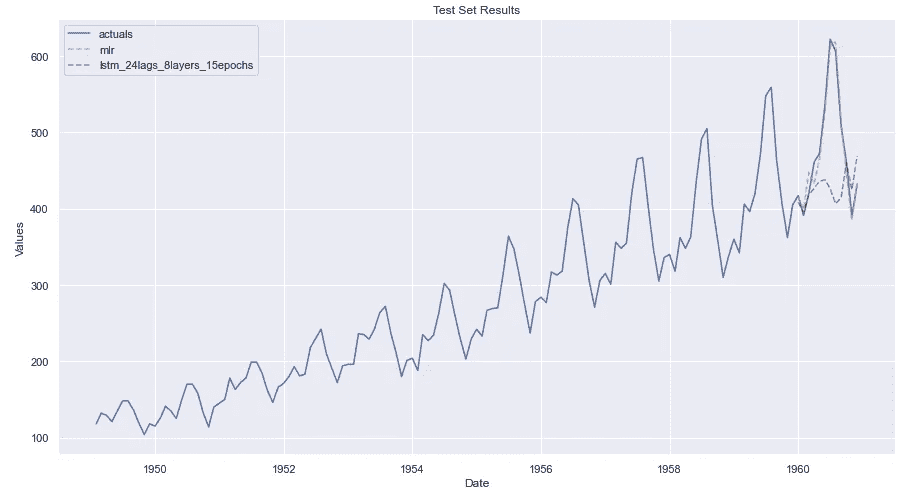
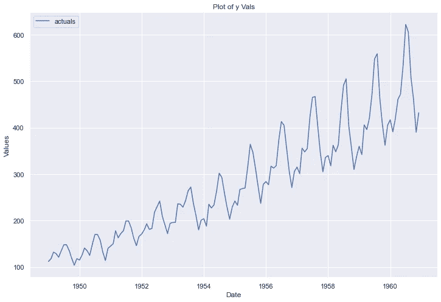
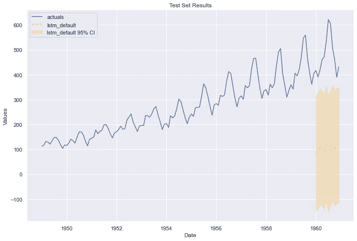
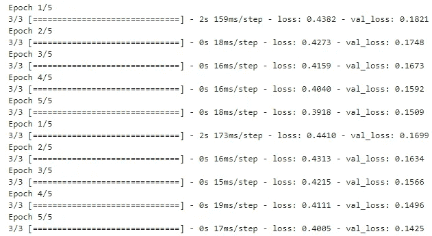
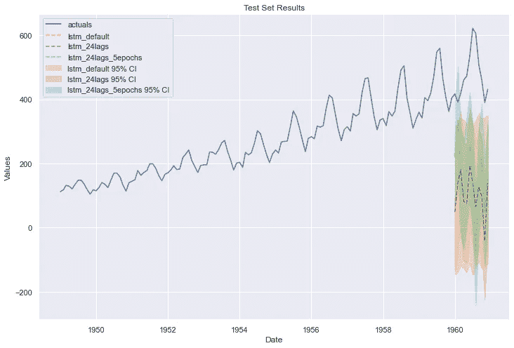
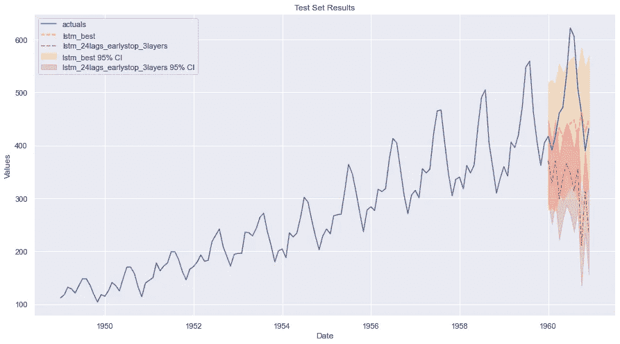
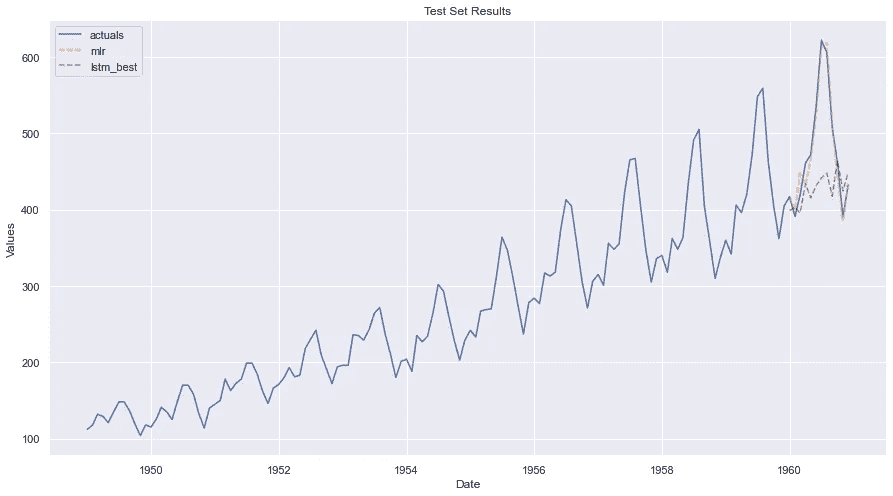
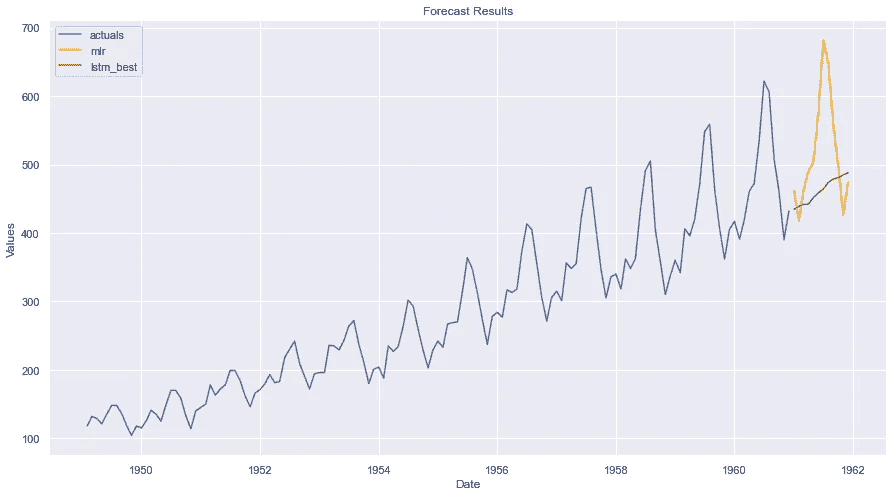

# 探索时间序列的 LSTM 神经网络模型

> 原文：<https://towardsdatascience.com/exploring-the-lstm-neural-network-model-for-time-series-8b7685aa8cf>

## scalecast 库的实用、简单实现



作者图片

预测时间序列的最先进的模型之一是长短期记忆(LSTM)神经网络。根据 Korstanje 在他的书*中所说，使用 Python 进行高级预测*:

> *“LSTM 细胞以一种更有效的方式增加了长期记忆，因为它允许学习更多的参数。这使得它成为最强大的(递归神经网络)来做预测，特别是当你的数据中有一个长期趋势时。LSTMs 是目前最先进的预测模型之一，“* (2021)。

这是好消息。坏消息是，如果你在 TensorFlow 中使用过这个概念，你就会知道，设计和实现一个有用的 LSTM 模型并不总是简单的。网上有很多优秀的教程，但大多数都没有把你从 A 点(读取数据)带到 Z 点(从完成的模型中提取有用的、适当缩放的、未来预测的点)。我见过的很多教程在显示了训练过程中的损失图后就停止了，证明了模型的准确性。这是有用的，我感谢任何在这个问题上提供他们智慧的人，但这还不完全*。*

还有一个办法。

[](https://github.com/mikekeith52/scalecast)  

[scalecast](https://scalecast.readthedocs.io/en/latest/Forecaster/_forecast.html#module-src.scalecast.Forecaster.Forecaster._forecast_lstm) 库托管 TensorFlow LSTM，可轻松用于时间序列预测任务。该软件包旨在消除实施时间序列预测的许多麻烦。它在引擎盖下使用 TensorFlow。以下是你应该尝试一下的一些理由:

*   易于实施和查看结果，大多数数据预处理和后处理在后台执行，包括缩放、取消缩放和评估置信区间
*   测试模型是自动进行的——模型一次适合训练数据，然后再次适合完整的时间序列数据集(这有助于防止过度拟合，并为比较许多方法提供了一个公平的基准)
*   类似于 TensforFlow，在验证数据的每个训练时期验证和观察损失是可能的和容易的
*   针对其他建模概念的基准测试，包括脸书预言家和 Scikit-learn 模型，是可能且容易的

还有一些你可能会远离的原因:

*   因为所有的模型都适合两次，训练一个已经很复杂的模型会慢两倍
*   您无法使用直接与 TensorFlow 合作所能提供的所有工具来干预模型
*   对于一个鲜为人知的包，您永远不知道会出现什么不可预见的错误和问题

希望这能给你足够的时间来决定继续读下去是否值得。好了，让我们进入教程，你可以在这里找到笔记本形式的[。](https://github.com/mikekeith52/scalecast-examples/blob/main/lstm/lstm.ipynb)

# 数据预处理

首先，我们安装库:

```
pip install scalecast --upgrade
```

您还需要 tensor flow(Windows 版)或 tensor flow-MAC OS(MAC 版)。

```
pip install tensorflow
```

或者

```
pip install tensorflow-macos
```

接下来，让我们导入库并读入数据(可以在 [Kaggle](https://www.kaggle.com/rakannimer/air-passengers) 上通过开放数据库许可获得):

```
import pandas as pd
import numpy as np
import pickle
import seaborn as sns
import matplotlib.pyplot as plt
from scalecast.Forecaster import Forecaster

df = pd.read_csv('AirPassengers.csv',parse_dates=['Month'])
```

该集合捕获了一家航空公司 12 年的月度航空乘客数据。它始于 1949 年 1 月，止于 1960 年 12 月。这是一个很好的预测数据集示例，因为它具有清晰的趋势和季节模式。我们来直观的看一下:



作者图片

# 探索性数据分析

要开始使用 scalecast 进行预测，我们必须首先调用指定了`y`和`current_dates`参数的`Forecaster`对象，如下所示:

```
>>> f = Forecaster(
>>>    y=data['#Passengers'],
>>>    current_dates=data['Month']
>>> )
>>> f

Forecaster(
    DateStartActuals=1949-02-01T00:00:00.000000000
    DateEndActuals=1960-12-01T00:00:00.000000000
    Freq=MS
    ForecastLength=0
    Xvars=[]
    Differenced=0
    TestLength=1
    ValidationLength=1
    ValidationMetric=rmse
    CILevel=0.95
    BootstrapSamples=100
)
```

让我们通过查看 PACF(部分自相关函数)图来分解这个时间序列，该图测量 y 变量(在我们的情况下，航空乘客)与它本身的过去值的相关程度，以及统计上显著的相关性存在多远。PACF 图与 ACF 图的不同之处在于，PACF 控制了过去各项之间的相关性。很高兴看到这两个，这两个都在我为这篇文章创建的笔记本中，但只有 PACF 将在这里显示。

```
f.plot_pacf(lags=26)
plt.show()
```


作者图片

从这个图中，看起来在数据中可能存在长达两年的统计上显著的相关性。这将是建模时使用的好信息。让我们进一步将该系列分解为趋势、季节和剩余部分:

```
f.seasonal_decompose().plot()
plt.show()
```


作者图片

我们在这个数据中看到了明显的线性趋势和很强的季节性。残差似乎也遵循一种模式，尽管不清楚是哪种模式(因此，为什么它们是残差)。

最后，让我们测试序列的平稳性。

```
>>> stat, pval, _, _, _, _ = f.adf_test(full_res=True)
>>> stat
0.8153688792060569
>>> pval
0.9918802434376411
```

检查序列的平稳性很重要，因为大多数时间序列方法不能有效地模拟非平稳数据。“非平稳”是一个术语，表示数据的趋势不是均值回复，而是在整个系列的时间跨度内持续稳定地向上或向下。在我们的例子中，趋势显然不是平稳的，因为它逐年上升，但扩展的 Dickey-Fuller 测试的结果为我们的肉眼所见提供了统计上的证明。由于 p 值不小于 0.05，我们必须假设序列是非平稳的。

所有这些序言有时看起来都是多余的，但是在尝试建模之前彻底研究数据是一个很好的练习。在这篇文章中，我将探索阶段减少到了最低限度，但是如果我不做至少这么多，我会觉得自己疏忽了。

# LSTM 预测

要在 scalecast 中建模，我们需要完成以下三个基本步骤:

1.  **指定检验长度—** 检验长度是完整时间序列中最后一次观测值的离散数。您可以将百分比或离散数字传递给`set_test_length`函数。在较新的 scalecast 版本中，可以通过将测试长度设置为 0 来跳过测试。
2.  **生成未来日期—** 您在此步骤中生成的日期数将决定所有模型的预测时间。
3.  **选择估计量** —我们将使用“lstm”估计量，但也有其他几种估计量。

要完成这些步骤，请参见下面的代码:

```
f.set_test_length(12)       # 1\. 12 observations to test the results
f.generate_future_dates(12) # 2\. 12 future points to forecast
f.set_estimator('lstm')     # 3\. LSTM neural network
```

现在，打电话给 LSTM 天气预报。默认情况下，该模型将使用 8 大小的单个输入层、Adam 优化器、tanh 激活、用于训练的单个滞后因变量值、0.001 的学习率和无辍学来运行。所有数据都通过最小-最大缩放器进行缩放，然后输出未缩放的数据。任何可以传递给 [TensorFlow](https://www.tensorflow.org/api_docs/python/tf/keras/Model#Fit) 中的`fit()`方法的东西，也可以传递给 scalecast `manual_forecast()`方法。

```
f.manual_forecast(call_me='lstm_default')
f.plot_test_set(ci=True)
```



可以预见的是，这种模式表现不佳。但事实上，我们能够轻松获得结果是一个巨大的开端。对其进行微调以产生有用的东西应该不会太难。

让我们从简单的开始，给它更多的滞后来预测。我们在 PACF 看到了 24 个月的显著自相关，所以让我们使用它:

```
f.manual_forecast(call_me='lstm_24lags',lags=24)
f.plot_test_set(ci=True)
```


作者图片

我们已经看到了一些明显的改进，但这还远远没有准备好。一个明显的下一步可能是给它更多的时间来训练。在这个宇宙中，更多的时间意味着更多的纪元。让我们看看五个时代会带给我们什么。我们还在模型训练时通过指定下面的`validation_split=.2`来验证模型:

```
f.manual_forecast(
    call_me='lstm_24lags_5epochs',
    lags=24,
    epochs=5,
    validation_split=.2,
    shuffle=True,
)
f.plot_test_set(ci=True)
```



作者图片



作者图片

再近一点。这次有几个值甚至落在 95%的置信区间内。接下来，让我们尝试将网络中的层数增加到 3，将历元增加到 25，但监控验证损失值，并在超过 5 次迭代后告诉模型退出，如果没有改善。这就是所谓的提前停止。

```
from tensorflow.keras.callbacks import EarlyStopping

f.manual_forecast(
    call_me='lstm_24lags_earlystop_3layers',
    lags=24,
    epochs=25,
    validation_split=.2,
    shuffle=True,
    callbacks=EarlyStopping(
        monitor='val_loss',               
        patience=5,
    ),
    lstm_layer_sizes=(16,16,16),
    dropout=(0,0,0),
)

f.plot_test_set(ci=True)
```


作者图片

再次，缓慢改善。到目前为止，您可能已经厌倦了看到像这样的建模过程。给我找个能用的型号就行了！因此，我将直接跳到使用这种方法找到的最佳模型。参见代码:

```
f.manual_forecast(
    call_me='lstm_best',
    lags=36,
    batch_size=32,
    epochs=15,
    validation_split=.2,
    shuffle=True,
    activation='tanh',
    optimizer='Adam',
    learning_rate=0.001,
    lstm_layer_sizes=(72,)*4,
    dropout=(0,)*4,
    plot_loss=True
)
f.plot_test_set(order_by='LevelTestSetMAPE',models='top_2',ci=True)
```


作者图片



作者图片

这花了很长时间，比我愿意承认的时间还要长，但最终我们有了一些像样的东西。除了两个点之外，所有的实际点都在模型的 95%置信区间内。它唯一的问题是预测季节性高峰的最高点。这是一个我们可以考虑在现实世界中使用的模型。

# MLR 预测和模型基准测试

现在我们终于找到了一个可接受的 LSTM 模型，让我们将其与一个简单的模型，最简单的模型，多元线性回归(MLR)进行比较，看看我们浪费了多少时间。

要在 scalecast 中从 LSTM 模式切换到 MLR 模式，我们需要遵循以下步骤:

1.  **选择 MLR 估计量** —就像我们之前选择 LSTM 估计量一样。
2.  **向模型添加回归变量**—在 LSTM，我们只使用了系列自身的历史，并让模型自己参数化。使用 MLR，我们仍然可以使用序列自身的历史，但我们也可以添加关于任何给定观测值属于哪个月、季度或年份的信息，以捕捉季节性和时间趋势(以及其他选项)。我们甚至可以摄取我们自己的回归变量的数据框架(这里没有显示)。
3.  **差异非平稳数据** —这是我们如何减轻显示我们有非平稳数据的增强 Dickey-Fuller 测试的结果。我们也可以在 LSTM 身上做到这一点，但我们希望它足够复杂，不需要这一步。

这都是在下面的代码中完成的:

```
from scalecast.SeriesTransformer import SeriesTransformer

transformer = SeriesTransformer(f)
f = transformer.DiffTransform()

f.add_ar_terms(24)
f.add_seasonal_regressors('month','quarter',dummy=True)
f.add_seasonal_regressors('year')
f.add_time_trend()
```

现在，我们运行预测，并对照最佳 LSTM 模型查看 MLR 的测试集性能:

```
f.set_estimator('mlr')
f.manual_forecast()

f = transformer.DiffRevert(
    exclude_models = [m for m in f.history if m != 'mlr']
) # exclude all lstm models from the revert

f.plot_test_set(order_by='TestSetMAPE',models=['lstm_best','mlr'])
plt.title('Top-2 Models Test-set Performance - Level Data',size=16)
plt.show()
```



作者图片

绝对难以置信。用最简单的模型，我们很快就造出了比最先进的模型更好的东西。这可能是由于用户错误造成的。也许你可以用 LSTM 模型找到比我发现的更好的东西——如果是这样，请留下评论并分享你的代码。但我预测了足够多的时间序列，知道在这种情况下很难超越简单的线性模型。也许，由于数据集的规模很小，LSTM 模型从一开始就不合适。

然后我们可以看到我们的模型对未来数据的预测:

```
f.plot(
    models=['mlr','lstm_best'],
    order_by='LevelTestSetMAPE',
    level=True,
)
```



作者图片

我们还可以在样本外测试数据上看到所有模型的误差和准确性指标:

```
f.export('model_summaries',determine_best_by='LevelTestSetMAPE')[
    ['ModelNickname',
     'LevelTestSetMAPE',
     'LevelTestSetRMSE',
     'LevelTestSetR2',
     'best_model']
]
```


作者图片

scalecast 软件包使用动态预测和测试方法，通过自己的预测传播 AR/lagged 值，因此不存在数据泄漏。MLR 模型没有过度拟合。

# 结论

我希望你喜欢这个关于如何在 scalecast 中与 LSTM 一起建模的快速概述。希望你学到了一些东西。我的观点是，对于任何给定的问题，立即采用最先进的方法并不总是明智的。更简单的模型通常更好、更快、更容易理解。


布雷特·乔丹在 [Unsplash](https://unsplash.com?utm_source=medium&utm_medium=referral) 上的照片

# 引用的作品

Korstanje，J. (2021)。LSTM RNNs。在 J. Korstanje 的文章中，*使用 Pyton* 进行高级预测(第 243–251 页)。加州伯克利:新闻。