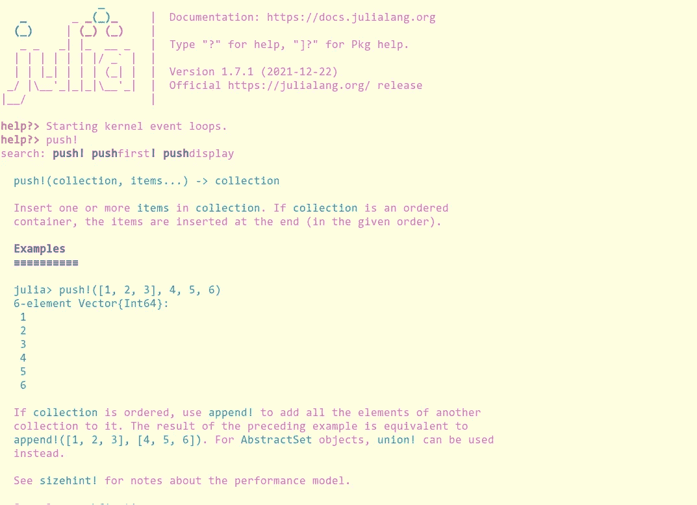
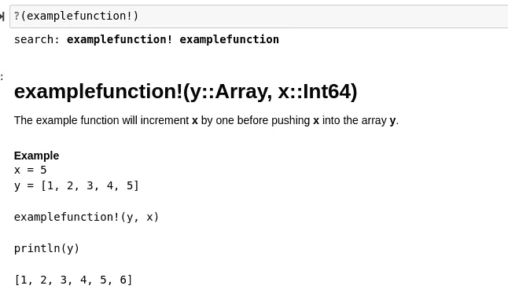
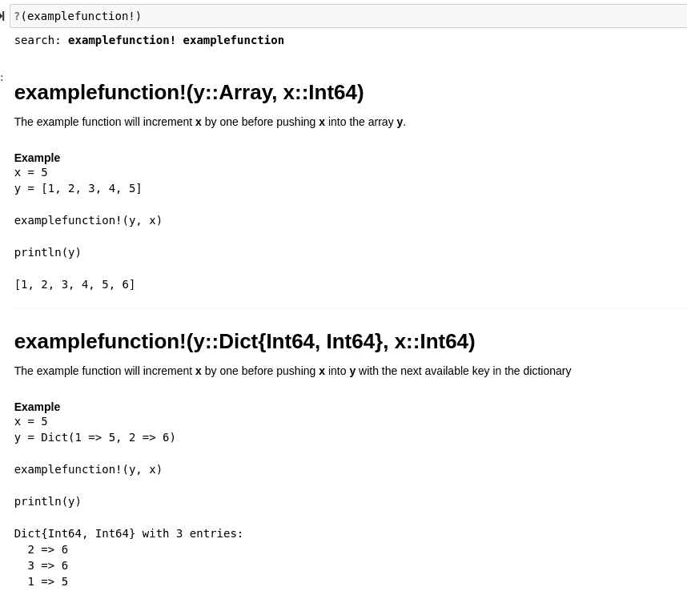

# 探索 Julia 中文档的细微差别

> 原文：<https://towardsdatascience.com/exploring-the-nuances-of-documentation-in-julia-f4153be19d3d>

# 探索 Julia 中文档的细微差别

## 浏览 Julia 文档的所有奇怪之处，以及如何处理这些奇怪之处


(图片由 [MediaModifier](https://pixabay.com/images/id-3033204/) 在 [Pixabay](http://pixabay.com) 上拍摄)

# 介绍

文档无疑是软件最重要的组成部分之一，尤其是在为其他计算机程序员制作模块和库的时候。在大多数情况下，对于作为依赖项加载模块的最终用户来说，文档将是他们方法的唯一参考点。这意味着如果没有足够的文档，在很多情况下，许多模块对这类用户来说是完全无用的。

也就是说，虽然文档非常重要，但它并不总是导航或编写的最显而易见的东西。这适用于许多语言，但特别是一种语言——我最喜欢的语言，它有一个相当健壮的文档系统，功能齐全，非常好用，但也有一些细微差别，可能会使普通程序员对另一种编程语言感到困惑或产生无法回答的问题。我以前写过文章，讨论 Julia 的文档，它的缺点，甚至为什么我认为 Julia 有很棒的文档字符串。如果您想对我将在本文中讨论的主题有所了解，它们可能值得一读，您可以在这里找到它们:

[](/why-julia-code-is-so-hard-to-document-properly-abccec3a42a) [## 为什么 Julia 代码如此难以正确记录

### Julia 包没有被很好地记录的真正原因。

towardsdatascience.com](/why-julia-code-is-so-hard-to-document-properly-abccec3a42a) [](/julias-doc-string-system-is-awesome-and-here-is-why-197ba6a0236b) [## Julia 的文档字符串系统非常棒，原因如下

### 概述为什么我认为 Julian 文档优于大多数其他语言的方法

towardsdatascience.com](/julias-doc-string-system-is-awesome-and-here-is-why-197ba6a0236b) 

我认为像这样的概念

> "一种使用多重分派作为范例的语言."

本质上是很难记录下来的，不管你怎么处理它。这是因为对于每个单独的调用，文档通常会有很大的不同，因为输出可能会根据输入发生很大的变化，而输入是唯一变化的东西。也就是说，我确实认为 Julia 处理得很好，但是我要第一个承认**我使用 Julia 大约半年，在我意识到一些关于文档字符串系统**的事情之前。在这方面，我并不孤单，我可以肯定地说，对 Julia 的一个批评是在语言的内置文档中。是的，我知道这是一个令人困惑的句子，但是在 Julia 中创建文档的文档是非常重要的——如果没有正确的文档，那么，我们在其他任何地方都会有糟糕的文档。

为了证明这种说法是正确的，让我们试着在谷歌上快速搜索一下……通过查询“Julia documentation documentation ”,我们得到了常规的 Julia 文档。我想这是有道理的，因为我们有两次列出的文档，谷歌搜索查询并不完全像我们的英语一样工作，但在我们进一步深入之前，让我们深入了解基本的文档。此外，为了演示这种语言的文档系统，有一个笔记本，记录了我编写和记录的一些代码，所以如果您想查看实际运行的代码，可以看看这里的笔记本:

[](https://github.com/emmettgb/Emmetts-DS-NoteBooks/blob/master/Julia/documenting%20Julia.ipynb) [## Emmetts-DS-NoteBooks/documenting Julia . ipynb at master emmett GB/Emmetts-DS-NoteBooks

### 各种项目的随机笔记本。通过创建帐户，为 emmettgb/Emmetts-DS 笔记本电脑的开发做出贡献…

github.com](https://github.com/emmettgb/Emmetts-DS-NoteBooks/blob/master/Julia/documenting%20Julia.ipynb) 

# 基本文件

在我们继续之前，重要的一点是，Julia 是一种主要由自身编写的语言。在一个普通的 Julia 软件组件中调用的大多数方法都包含在一个叫做 Base 的模块中。这个包包含从基本数据类型到索引的所有内容，对于今天的主题，它还包含

> 文档。

文件部分存放在基地。文档模块。既然我们意识到了这一点，质疑“朱丽亚基地。Google 上的“文档”文档仍然很少或没有显示关于 Julia 的文档字符串或文档系统的文档或信息..我能找到的最好的文档不是在正规的 Julia 文档网站上，而是在*阅读文档*:

 [## 证明文件

### Julia 使包开发者和用户能够通过一个内置的…

julia-doc.readthedocs.io](https://julia-doc.readthedocs.io/en/latest/manual/documentation/) 

让我们从最基本的开始。来自大多数其他语言的人可能会熟悉在他们的代码上添加一个多行字符串来记录它:

```
"""
The example function takes y, an Array{Int64} and x, a 64-bit integer.
"""
function examplefunction!(y::Array, x::Int64)
    x += 1
    push!(y, x)
end
```

对于上面的例子，这个文档工作得很好——但是，我认为这个文档字符串很糟糕。如果我们想要查看与给定模块、函数或类型相关的文档，我们可以使用？()方法。让我们看看上面的 doc-string 在使用这个方法调用时的情况:

```
?(examplefunction!)
```


(图片由作者提供)

首先，虽然这个 doc-string 解释了函数的输入，但它是以一种非常冗长的方式解释的。这对 Julia 来说也很奇怪，因为通常类型是用::，而且任何 Julia 程序员都应该能够通过函数头识别函数名和每个多态调用传递的参数。这个文档的另一个问题是没有输出的概要，我们不知道这个函数的返回是什么。我有一个简短的技术列表，我用它来提供 Julia 和其他地方的文档的基本要素，如果人们希望学习更多关于编写好的文档的知识，他们可以研究一下，所以如果你想提高这方面的技能，研究一下那篇文章中讨论的一些主题可能是有意义的。你可以在这里找到这篇文章:

[](/5-incredibly-useful-tips-for-writing-pristine-documentation-803155ae4f45) [## 编写原始文档的 5 个非常有用的技巧

### 我用来改进软件文档的一些技术

towardsdatascience.com](/5-incredibly-useful-tips-for-writing-pristine-documentation-803155ae4f45) 

关于 Julia 的文档，需要记住的一件重要事情是，它也可以用 markdown 编写。此外，这种降价是普遍的，并转移到 REPL 真的很好，只要看看这个例子从基地。推！()在 REPL:



(图片由作者提供)

减价的特点是粗体、标题、例子和其他各种吸引眼球的东西。虽然这看起来有些武断，但文档通常需要分章节完成——在某种程度上，所以使用 markdown 是一个很好的主意，这样可以使文档更容易被人理解，而不仅仅是机器人和书呆子。从我们的文档字符串的顶部开始，让我们从定义输入开始:

```
"""
# examplefunction!(y::Array, x::Int64)"""
function examplefunction!(y::Array, x::Int64)
    x += 1
    push!(y, x)
end
```

然后我们将添加输出，一个简短的描述这个方法实际做什么的描述符，然后是一个例子——都是典型的 Github 风格的标记:

```
"""
# examplefunction!(y::Array, x::Int64)
The example function will increment **x** by one before pushing **x** into the array **y**.
#### Example
```
x = 5
y = [1, 2, 3, 4, 5]examplefunction!(y, x)println(y)[1, 2, 3, 4, 5, 6]
```
"""
function examplefunction!(y::Array, x::Int64)
    x += 1
    push!(y, x)
end
```

鉴于没有输出，我们真的不需要去了，解释点！，在我们函数的末尾，通常是一个很好的提纲，说明要么没有函数的返回，要么函数的返回将是一个突变的类型。在朱莉娅，这！添加到方法的末尾意味着它将改变我们提供给它的类型。我个人喜欢做的另一件事是用粗体提供参数描述，在我的主观观点中，我觉得这使它们更容易与方法调用中的位置参数名联系起来。

这种描述输入的方法明显优于后者，因为那些习惯于用 Julia 编程的人会毫不费力地意识到在这个函数的哪个位置提供了哪些类型。再者，看起来更快。就标题级别而言，您可能已经注意到基础文档不包含任何标题级别的使用。我认为这是一个错误。请允许我详细说明…

# 多份发货文件

正如我前面提到的，记录一种围绕多重分派的编程语言是一项艰巨的任务。这是因为不同函数名的输入经常发生变化，这些调用中的每一个都需要在同一个别名下有不同的描述符。这使得调用。()方法的别名非常困难，因为我们必须导航所有相关的函数。让我们看看目前为止我们所拥有的，例如 function！():

```
?(examplefunction!)
```



(图片由作者提供)

这很好，但是在 Julia 中，很多时候我们会对不同的方法使用相同的别名。这使事情变得复杂，因为在同一个函数名下有两个不同方法的情况下，Julia 会怎么做呢？幸运的是，Julia 为我们将它们连接在一起，因此如果我们只单独调用方法的名称，我们将会收到包含在该函数定义中的每个方法的所有文档。请允许我向您介绍 examplefunction！(::Dict，:Int64)。

```
function examplefunction!(y::Dict{Int64, Int64}, x::Int64)
   x += 1
    key = maximum(keys(y)) + 1
    push!(y, key => x)
end
```

这需要一个字典，包含成对的 Int64 和一个整数。与之前的函数的唯一区别是，现在我们必须为推送获取一个键！()方法，我们现在不是推送整数，而是推送一对。为了得到这个键，我只需要得到字典中当前键的最大值，然后将这个值加 1。和以前一样，让我为此写一个简短的文档字符串:

```
"""
# examplefunction!(y::Dict{Int64, Int64}, x::Int64)
The example function will increment **x** by one before pushing **x** into **y**
with the next available key in the dictionary
#### Example
```
x = 5
y = Dict(1 => 5, 2 => 6)examplefunction!(y, x)println(y)Dict{Int64, Int64} with 3 entries:
  2 => 6
  3 => 6
  1 => 5```
"""
function examplefunction!(y::Dict{Int64, Int64}, x::Int64)
   x += 1
    key = maximum(keys(y)) + 1
    push!(y, key => x)
end
```

现在，终于让我们称之为？()方法在这个函数上重复一遍:

```
?(examplefunction!)
```



(图片由作者提供)

现在让我们试着删除标题级别，

# /#，并用纯文本替换它，以演示为什么我认为推！()示例的分离可能有问题:


(图片由作者提供)

这里的一个大问题是，虽然这个文档在大多数情况下肯定是有效的，但是很难看出我们可以在这个函数中使用哪些不同类型的参数和调用。我认为，根据方法调用的类型，使用标记来分离方法调用无疑是一个好主意。

您可能已经注意到的最后一件事是 Julia 使用逻辑右操作符来表示函数的输出。我认为这是一个伟大的想法，所以在未来，我想我会采取这一点。我认为它用一行输入和输出很好地描述了这个函数:

```
"""
# examplefunction!(y::Dict{Int64, Int64}, x::Int64) -> y
The example function will increment **x** by one before pushing **x** into **y**
with the next available key in the dictionary
#### Example
```
x = 5
y = Dict(1 => 5, 2 => 6)examplefunction!(y, x)println(y)Dict{Int64, Int64} with 3 entries:
  2 => 6
  3 => 6
  1 => 5```
"""
```

关于这种文档，最后要注意的一点是，我们还可以通过在调用？()方法，像这样:

```
?(examplefunction!(::Array, ::Int64)
```

这将特别为该方法生成更具体的文档。

# 基地。文件（documents 的简写）

在这篇概述中，我想讨论的最后一个主题是基础。文档模块本身。这个模块的大部分实际上是一个宏的后端，这个宏就是@doc 宏。我们可以像这样直接导入宏:

```
using Base.Docs: @doc
```

每当我们在一个给定的定义上创建多行字符串时，这个宏实际上会被调用。让我们用幽默来娱乐自己。()来浏览记录我们代码的宏文档，以便我们可以使用？()方法在上面。

> 这感觉像是一个悖论。

```
?([@doc](http://twitter.com/doc))
```


(图片由作者提供)

> 看哪！

这是迄今为止我们所看到的关于 Julia 文档的最好的文档(我已经厌倦这么说了)!每当我们使用。()为了获得文档…等等…这给了我一个可怕的想法..

```
?(?)
```


(图片由作者提供)

> Awwww

离开这个有趣的话题，让我们来看看在 Julia 中使用@doc 宏来记录代码。首先要考虑的是，这个宏通常与现有的定义一起使用。换句话说，我们需要某种已定义的名称，不管它是构造函数还是函数。@doc 宏首先接受一个字符串，即我们希望分配的文档，然后是我们希望记录的内容。在名副其实的 examplefunction 的例子中！，我们可以这样记录它:

```
[@doc](http://twitter.com/doc) "I'm not writing any more than this." examplefunction!(::Array, ::Int64)
```

一般来说，这种方法的使用非常有限，在大多数情况下，忽略@doc 宏会好得多——以前每当编写文档字符串时(Julia 1.0 之前的版本)都需要使用该宏，而只是坚持编写常规的文档字符串而不使用@doc。也就是说，我认为了解底层的方法调用很重要，这样可以更好地理解为什么有些东西不能正常工作，或者更好地理解文档系统。此外，还有一些更奇怪的 Julian 移动的场景，例如在内部构造函数的范围内定义函数并需要记录它们，这个宏当然可以方便地生成文档，而不必像通常定义的那样定义函数。

# 结论

尽管在 Julia 中使用多分派的**全功能**方法创建优秀文档的挑战肯定是存在的，但还是有一些方法可以减轻多态性带来的问题。幸运的是，Julia 已经有了很多这样的系统，非常棒，唯一的问题是，在很多情况下，和他们一起工作的人不理解这些系统。希望这篇文章有助于揭示 Julia 编程语言中一个缺乏文档记录的部分。

Base 中的很多东西都是这样的，其中有一些模块，人们几乎不知道它们是如何工作的。我发现这是一个很大的失望，因为我认为编程朱莉娅的 REPL 做一些完全不同的事情，例如，很有趣——但由于缺乏内部文档，变得更加困难。当然，这并不是说 Julia 开发人员的 Julia 文档，但是即使在那里，这些模块的文档范围也是非常有限的。由于 Julia 是一门如此伟大的语言，人们只能希望这些东西会随着时间的推移而开花结果，在它们开花结果之前，我会在这里分享我发现的知识，希望以一种有吸引力的方式。感谢您阅读我的文章，它对我来说意味着整个世界，祝您用您的文档技能自信地编写代码时愉快！