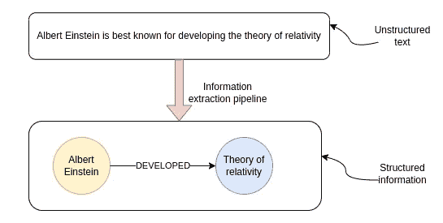
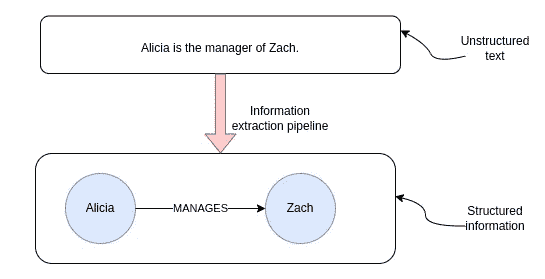
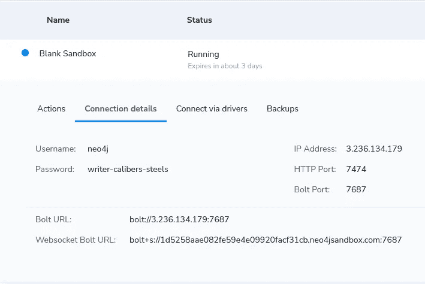
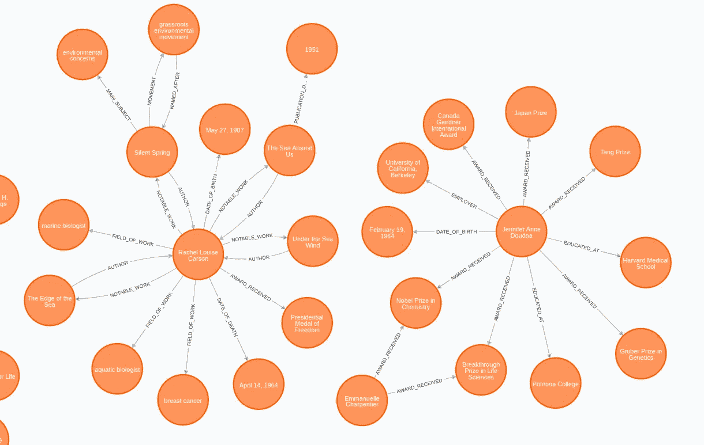
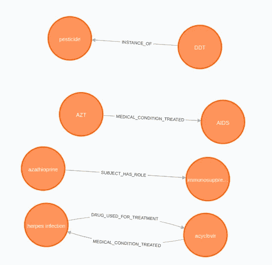
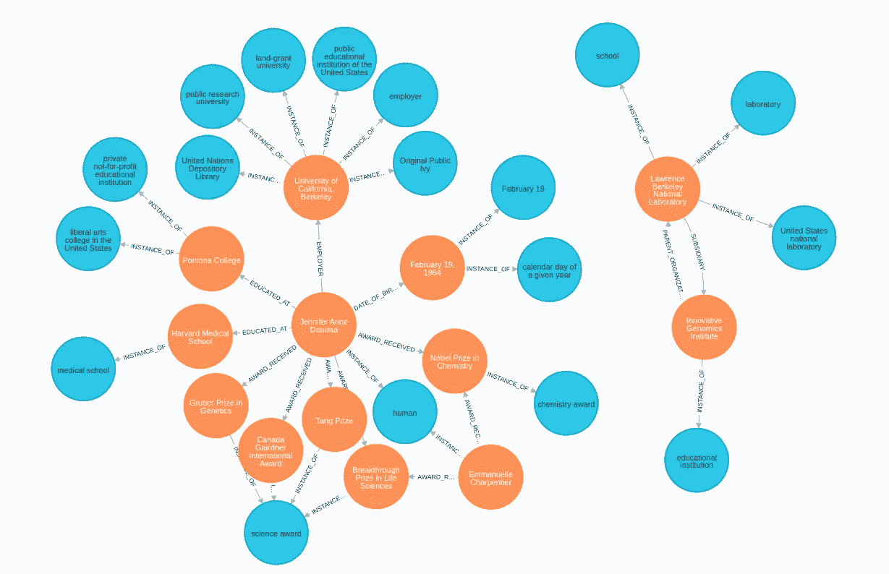

# 从文本中提取知识:使用 spaCy 和 Neo4j 的端到端信息提取管道

> 原文：<https://towardsdatascience.com/extract-knowledge-from-text-end-to-end-information-extraction-pipeline-with-spacy-and-neo4j-502b2b1e0754>

## 了解如何使用 spaCy 实现定制的信息提取管道，并将结果存储在 Neo4j 中

自从我第一次涉足自然语言处理以来，我一直对信息提取(IE)管道有着特殊的兴趣。信息提取(IE)管道从文本等非结构化数据中提取结构化数据。互联网以各种文章和其他内容格式的形式提供了丰富的信息。然而，虽然你可能会阅读新闻或订阅多个播客，但几乎不可能跟踪每天发布的所有新信息。即使您可以手动阅读所有最新的报告和文章，组织数据以便您可以使用您喜欢的工具轻松地查询和聚合数据也将是令人难以置信的乏味和劳动密集型工作。我绝对不想把这当成我的工作。幸运的是，我们可以采用最新的自然语言处理技术来自动提取信息。

信息抽取管道的目标是从非结构化文本中抽取结构化信息。图片由作者提供。

虽然我已经[实现了 IE 管道](/from-text-to-knowledge-the-information-extraction-pipeline-b65e7e30273e#:~:text=What%20exactly%20is%20an%20information,unstructured%20data%20such%20as%20text.)，但我注意到开源 NLP 模型中有许多新的进步，尤其是围绕[空间](https://spacy.io/)。我后来了解到，我将在本文中使用的大多数模型都被简单地包装成一个 spaCy 组件，如果您愿意，也可以使用其他库。然而，由于 spaCy 是我玩过的第一个 NLP 库，我决定在 spaCy 中实现 IE 管道，以此来感谢开发人员制作了如此棒且易于上手的工具。

随着时间的推移，我对 IE 管道的步骤的看法保持不变。

信息提取流程中的步骤。图片由作者提供。

IE 管道的输入是文本。这些文本可能来自文章，也可能来自内部业务文档。如果你处理 pdf 或图像，你可以使用计算机视觉来提取文本。此外，我们可以使用 voice2text 模型将录音转换成文本。准备好输入文本后，我们首先通过**共指消解**模型运行它。共指消解将代词转换成所指的实体。通常，指代消解的例子是人称代词，例如，模型用被指代人的名字替换代词。

下一步是识别文本中的实体。我们想要识别哪些实体完全取决于我们正在处理的用例，并且可能因域而异。例如，您经常会看到经过训练的 NLP 模型可以识别人、组织和位置。然而，在生物医学领域，我们可能想要识别基因、疾病等概念。我还见过一些例子，在这些例子中，企业的内部文档被处理，以构建一个知识库，该知识库可以指向包含用户可能有的答案的文档，甚至可以为聊天机器人提供燃料。识别文本中实体的过程被称为**命名实体识别**。

识别文本中的相关实体是一个步骤，但是您几乎总是需要标准化实体。例如，假设文本引用了*相对论*和*相对论*。显然，这两个实体指的是同一个概念。然而，尽管这对您来说很简单，但我们希望尽可能避免手工劳动。并且机器不会自动将两个参考识别为相同的概念。这里是名为 **的**实体消歧**或**实体链接**发挥作用的地方。命名实体消歧和实体链接的目标都是为文本中的所有实体分配唯一的 id。通过实体链接，从文本中提取的实体被映射到目标知识库中相应的唯一 id。在实践中，你会看到维基百科被大量用作目标知识库。然而，如果您在更具体的领域工作，或者想要处理内部业务文档，那么 Wikipedia 可能不是最佳的目标知识库。请记住，实体必须存在于目标知识库中，以便实体链接过程能够将实体从文本映射到目标知识库。如果文中提到了你和你的经理，而你们两个都不在维基百科上，那么在实体链接过程中使用维基百科作为目标知识库是没有意义的。**

最后，IE 管道然后使用**关系提取**模型来识别文本中提到的文本之间的任何关系。如果我们坚持以经理为例，假设我们有以下文本。

> 艾丽西娅是扎克的经理。

理想情况下，我们希望关系提取模型能够识别两个实体之间的关系。

提取实体之间的关系。图片由作者提供。

大多数关系抽取模型被训练以识别多种类型的关系，从而使得信息抽取尽可能丰富。

既然我们很快地复习了理论，我们可以直接看实际例子了。

## 在空间开发 IE 管道

在过去的几周里，spaCy 有了很大的发展，所以我决定尝试新的插件，并用它们来构建一个信息提取管道。

和往常一样，所有代码都可以在 [Github](https://github.com/tomasonjo/blogs/blob/master/ie_pipeline/SpaCy_informationextraction.ipynb) 上获得。

## 共指消解

首先，我们将使用新的[跨语言共指](https://spacy.io/universe/project/crosslingualcoreference)模型，由[大卫·贝伦斯坦](https://www.linkedin.com/in/david-berenstein-1bab11105/)贡献给 s [paCy Universe](https://spacy.io/universe) 。SpaCy Universe 是 SpaCy 的开源插件或附加组件的集合。spaCy universe 项目最酷的一点是，将模型添加到我们的管道中非常简单。

就是这样。在 spaCy 中建立共指模型只需要几行代码。我们现在可以测试共指管道了。

正如你所注意到的，人称代词 *He* 被所指的人 *Christian Drosten 所取代。*看似简单，但这是开发准确信息提取渠道的重要一步。对 David Berenstein 的大声喊出来，感谢他持续开发这个项目，让我们的生活变得更简单。

## 关系抽取

您可能想知道为什么我们跳过了命名实体识别和链接步骤。原因是我们将使用 [Rebel](https://github.com/Babelscape/rebel) 项目，该项目识别文本中的实体和关系。如果我理解正确的话，Rebel 项目是由 Pere-Lluís Huguet Cabot 开发的，作为他与 Babelscape 和 Sapienza 大学博士研究的一部分。再次，对 Pere 大呼小叫，因为他创建了这样一个不可思议的库，为关系提取提供了最先进的结果。反叛者型号[有 Hugginface](https://huggingface.co/Babelscape/rebel-large) 和[spaCy 组件](https://github.com/Babelscape/rebel/blob/main/spacy_component.py)两种形式。

然而，该模型不做任何实体链接，所以我们将实现我们的实体链接版本。我们将简单地通过调用搜索实体 WikiData API 来搜索 WikiData 上的实体。

正如您从代码中注意到的，我们只是从第一个结果中获取实体 id。我一直在寻找如何改善这一点，偶然发现了 [ExtEnd 项目](https://github.com/SapienzaNLP/extend)。ExtEnd project 是一种新颖的实体消歧方法，可以在 [Huggingface](https://huggingface.co/spaces/poccio/ExtEnD) 和 s [paCy 组件](https://github.com/SapienzaNLP/extend#spacy)上作为演示使用。我对它进行了一点试验，并设法使用候选人维基数据 API 而不是最初的 AIDA 候选人来使它工作。然而，当我想让所有三个项目(Coref、Rebel、ExtEnd)在同一个管道中时，由于它们使用不同版本的 PyTorch，所以存在一些依赖性问题，所以我现在放弃了。我想我可以将管道对接以解决依赖性问题，但我想在一个空间管道中同时拥有扩展和反叛。然而，我开发的扩展代码在 GitHub 上是可用的[，如果有人想帮我让它工作，我非常乐意接受拉请求。](https://github.com/tomasonjo/SpaCIE/blob/master/src/extend_component.py)

好了，现在，我们不会使用 ExtEnd 项目，而是使用一个简化版本的实体链接，只需从 WikiData API 中取出第一个候选项。我们唯一需要做的就是将我们简化的实体链接解决方案整合到 Rebel 管道中。由于 Rebel 组件不能作为 spaCy Universe 项目直接使用，我们必须手动从他们的库中复制[组件定义。我冒昧地在 Rebel spaCy 组件中实现了我版本的 *set_annotations* 函数，而其余代码与原始代码相同。](https://github.com/Babelscape/rebel/blob/main/spacy_component.py)

*set_annotations* 函数处理我们如何将结果存储回空间的 Doc 对象。首先，我们忽略所有的自循环。自循环是在同一实体开始和结束的关系。接下来，我们使用 regex 在文本中搜索关系的头部和尾部实体。我注意到反叛者模型有时会产生一些不在原文中的实体。因此，我添加了一个步骤，在将两个实体附加到结果之前，验证它们是否确实在文本中。

最后，我们使用 WikiData API 将提取的实体映射到 WikiData ids。如前所述，这是实体消歧和链接的简化版本，例如，您可以采用更新颖的方法，如扩展模型。

既然 Rebel 空间组件已经定义，我们可以创建一个新的空间管道来处理关系提取部分。

最后，我们可以在之前用于共指消解的样本文本上测试关系提取管道。

反叛模式从文本中提取了两种关系。例如，它识别出 WikiData id 为 Q1079331 的 Christian Drosten 受雇于 id 为 Q95 的 Google。

## 存储信息提取管道结果

每当我听到实体之间的关系信息时，我会想到一个图表。开发图形数据库是为了存储实体之间的关系，所以什么更适合存储信息提取管道结果。

你可能知道，我偏向于 [Neo4j](https://neo4j.com/) ，但是你可以用任何你喜欢的工具。在这里，我将演示如何将信息提取管道的实现结果存储到 Neo4j 中。我们将处理几个著名女科学家的维基百科摘要，并将结果存储为图表。

如果你想了解代码示例，我建议你在 Neo4j 沙盒环境中创建一个[空白项目。创建 Neo4j 沙盒实例后，可以将凭证复制到代码中。](https://sandbox.neo4j.com/?usecase=blank-sandbox)

Neo4j 沙盒连接详情。图片由作者提供。

接下来，我们需要定义一个函数，该函数将检索著名女科学家的维基百科摘要，通过信息提取管道运行文本，并最终将结果存储到 Neo4j。

我们使用了[维基百科](https://pypi.org/project/wikipedia/) python 库来帮助我们从维基百科中获取摘要。接下来，我们需要定义用于导入信息提取结果的 Cypher 语句。我不会深入 Cypher 语法的细节，但是基本上，我们首先通过它们的 WikiData id 合并头部和尾部实体，然后使用来自 [APOC 库](https://neo4j.com/labs/apoc/)的过程来合并关系。如果你正在寻找学习更多 Cypher 语法的资源，我推荐你去参加 Neo4j Graph Academy 的课程。

现在我们已经准备好了一切，我们可以继续解析几个维基百科的摘要。

处理完成后，您可以打开 Neo4j 浏览器来检查结果。

工业工程管道的结果。图片由作者提供。

结果看起来出奇的好。在这个例子中，Rebel 模型识别了实体之间的 20 多种关系类型，从奖励和雇主到用于治疗的药物。只是为了好玩，我会给你看模型提取的生物医学关系。

提取的生物医学关系。图片由作者提供。

似乎有些女士在生物医学领域工作。有趣的是，该模型确定阿昔洛韦用于治疗疱疹感染，硫唑嘌呤是一种免疫抑制药物。

## 丰富图表

因为我们已经将实体映射到了 WikiData ids，所以我们可以进一步使用 WikiData API 来丰富我们的图表。我将向您展示如何从 WikiData 中提取关系的**INSTANCE _ 并在 APOC 库的帮助下将它们存储到 Neo4j，该库允许我们调用 web APIs 并将结果存储在数据库中。**

为了能够调用 WikiData API，您需要对 SPARQL 语法有一个基本的了解，但这超出了本文的范围。然而，我写了一篇[帖子，展示了更多用于丰富 Neo4j 图的 SPARQL 查询，并深入研究了 SPARQL 语法](/lord-of-the-wiki-ring-importing-wikidata-into-neo4j-and-analyzing-family-trees-da27f64d675e)。

通过执行下面的查询，我们将**类**节点添加到图中，并将它们与适当的实体链接起来。

现在，我们可以在 Neo4j 浏览器中检查丰富的结果。

通过 WikiData API 中的类丰富的实体。图片由作者提供。

## 结论

我真的很喜欢 s [paCy](https://spacy.io/) 最近在做的事情以及围绕它的所有开源项目。我注意到各种开源项目主要是独立的，将多个模型组合成一个单一的 spaCy 管道可能很棘手。例如，您可以看到在这个项目中我们必须有两条管道，一条用于共指解析，一条用于关系提取和实体链接。

至于 IE 管道的结果，我对它的结果很满意。正如你可以在 [Rebel repository](https://github.com/Babelscape/rebel) 中观察到的，他们的解决方案在许多 NLP 数据集上都是最先进的，所以结果如此之好并不奇怪。我的实现中唯一的薄弱环节是实体链接步骤。正如我所说的，添加类似于 [ExtEnd](https://github.com/SapienzaNLP/extend) 库的东西来实现更精确的实体消歧和链接可能会大有裨益。也许这是我下次要做的事情。

尝试 IE 的实现，请让我知道你的想法，或者如果你有一些改进的想法。有很多机会可以让这条管道变得更好！

和往常一样，代码可以在 [GitHub](https://github.com/tomasonjo/blogs/blob/master/ie_pipeline/SpaCy_informationextraction.ipynb) 上获得。