# 从历史家谱文献中提取信息

> 原文：<https://towardsdatascience.com/extracting-information-from-historical-genealogical-documents-ab3068b10715>

# 从历史家谱文献中提取信息

## *HTR(手写文本识别)和相关技术如何推动家庭发现*

## 概观

这篇文章解释了机器学习(ML)技术，如 HTR(手写文本识别)和 NLP(自然语言处理)如何改善人们通过历史文献了解其家族根源的前景。它也概述了一些困难的(然而值得的)问题，这些问题仍然需要 ML 研究者去解决。

## 介绍

我们的世界充斥着数字内容。很有可能在*某一年*创作的新文本比数字时代之前的一千年里创作的还要多。例如，仅在 Twitter 上，估计每年就有 2000 亿条推文( [Twitter 使用统计](https://www.internetlivestats.com/twitter-statistics/)，2021)。假设平均推文长度为 28 个字符，那么在一个社交媒体平台上，一年就有超过 5.5 万亿个字符的新文本。相比之下，到 1975 年(现代数字时代之前)，美国国会图书馆的藏书约为 1700 万册[1]。估计每本书平均有 450，000 个字符，相当于大约 7.5 万亿个字符。换句话说，在一年内，一个社交媒体平台现在产生的文本几乎相当于美国国会前数字图书馆的所有书籍！

今天网上惊人的内容数量可能会让不熟悉数字化世界宗谱记录的人认为大多数历史(非数字)内容已经被数字化并可供使用。或者，最重要的*内容已经被数字化了。这根本不是真的。*

将物理历史文档转换为在线可搜索文本的过程非常耗时、复杂、昂贵，并且难以复制。技术并不是唯一的问题。通常，更大的挑战是与档案的关系、所需的合同、当地法律的导航以及对源文件的物理访问。每一个重大的数字化项目都涉及大量的“定制工作”这一事实经常导致大型在线信息经纪人到别处寻找他们的内容。然而，我们低估了仍然锁在我们无法访问的旧的、未数字化的文档中的文本的价值。在许多情况下，与目前网上可获得的任何内容相比，未数字化的内容可能信息量更大、更有趣、更有用。

重要的是要记住，在个人电脑和互联网出现之前，书面交流更加困难和昂贵。因此，人们通常把写作精力集中在他们认为重要的事情上。此外，16 世纪大规模印刷的出现并没有改变大多数书面内容仍然不能以任何方式复制的事实。因此，幸存的实体文件通常包含在我们庞大的数字世界中找不到的关键信息。这些文件的发现和数字化继续改变着我们的全球历史叙事。此外，可能有文件会改变你的个人历史叙述！

举例来说，考虑一个美国的 FamilySearch 用户(碰巧是作者)的经历，他想知道他的曾祖母(Susanna Neises)在德国的什么地方出生，她的父母是谁。下面的历史婚姻记录(图 1)不仅回答了这些问题，而且也是识别和联系仍然生活在德国的亲属的起点。

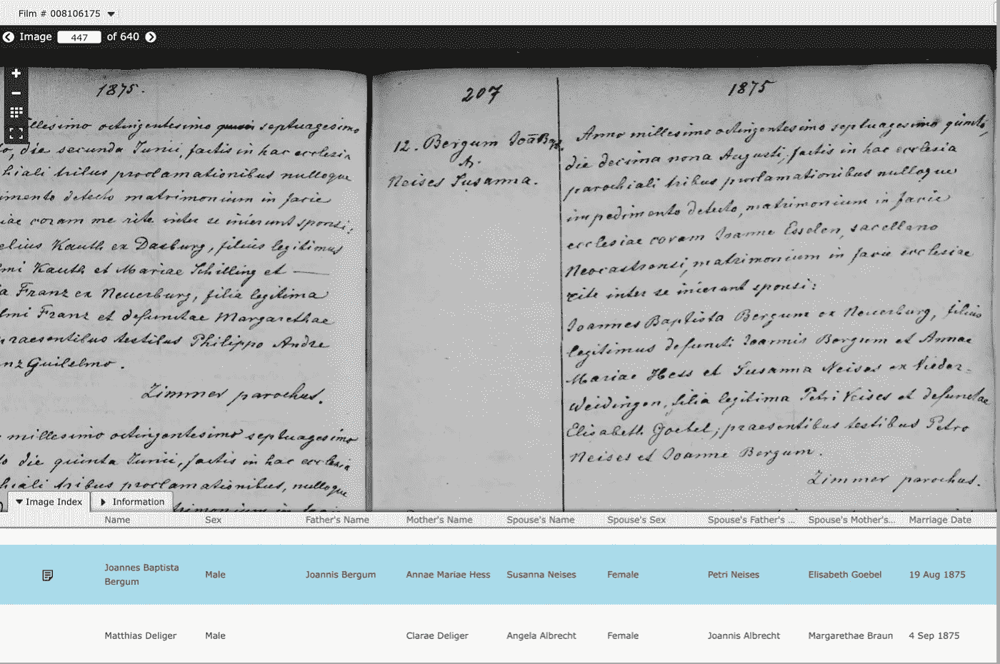

图 1:婚姻记录(拉丁文),标明了苏珊娜·内塞斯的父母和出生地。图片版权**。经许可使用。**

**

**图 2:2015 年，作者的母亲(左)与她在德国的 Neises 表妹团聚。图片作者。**

*进入族谱学科，是对家族历史的研究，是对一个人世系(家谱)的追溯。系谱学家和家庭历史学家依赖历史文献，如人口普查、教会和民间记录、日记、遗嘱等。研究远古的血统和祖先故事。不幸的是，到目前为止，只有一小部分历史家谱文件可以通过名字和其他领域在网上进行搜索，这使你能够找到你正在寻找的人或事。原因很简单，就是成本与收益的对比。数字扫描和手动转录仍然很昂贵，所以档案馆和家谱企业将资源集中在吸引最大数量付费客户的收藏上——这通常意味着英语记录。如果*你的*祖先出现在那些重要的收藏品中，这对*你*来说很好。然而，通常你需要的信息在另一个历史文件中的某个地方，或者一种不同的语言，它还没有被转录和提供搜索。那份文件对大多数人来说可能没什么价值，但它对你来说肯定很重要，有助于解开你家族历史的额外线索。*

*OCR(光学字符识别)、HTR(手写文本识别)和相关的信息提取技术有望改变这一成本等式，并使几乎任何历史文档都可以在线搜索。事实上， [FamilySearch](http://www.familysearch.org/) 和我们行业中的其他公司已经开始利用这些技术取得良好的效果。另一方面，正如我们将看到的，历史文献可能包含最难解决的问题。在本文中，我们将概述其中的一些挑战，以及我们如何应对这些挑战。*

## *背景:关于我们*

*[family search International](http://www.familysearch.org/)是一家非营利组织，通过其网站、移动应用程序和 5000 多个当地家族历史中心的面对面帮助，帮助人们发现他们家族的历史。由耶稣基督后期圣徒教会经营的 FamilySearch 向所有人免费提供这些服务，不论其传统、文化或宗教信仰如何。FamilySearch 资源帮助世界各地数百万人发现他们的遗产并与家人联系。*

*FamilySearch 起源于犹他宗谱协会，该协会由教会于 1894 年成立，旨在帮助从世界各地移民到落基山脉的一批批拓荒者为他们新家园的后代记录他们家族的历史。1938 年，该协会开始对世界范围内的教会和政府档案中发现的历史文件进行微缩摄影。*

## *计算机辅助标引(CAI)的诞生*

*在 21 世纪初，在犹他宗谱学会成为家庭研究之后，我们开始将这些缩微胶片(准确地说超过 240 万卷)转换成数字格式，以便为更多的人提供更多的在线访问。我们还与其他宗谱组织合作，以扩大我们的集体控股。迄今为止，FamilySearch 在我们的网站上免费提供了超过 120 亿张历史记录图片。由于志愿者和朋友组织的努力，许多这些图像也有关键信息的文本搜索转录(我们称之为“索引”)。然而，人类转录/索引项目很难跟上图像采集的步伐。通常，为单个文档编制索引可能需要几个小时。对于我们的在线志愿者来说，旧的和非英语的收藏尤其具有挑战性。如果不从根本上改变我们的索引方法，大多数图像将在未来几年内保持未索引状态，因此对大多数人来说是不可发现的。*

*为此，大约在 2011 年，FamilySearch 开始在技术、研究、数据和人才方面进行大量投资，以自动转录和索引我们所有的历史文档图像。我们也在商业和学术研究团体中寻找合作兴趣来共同解决这个问题。从那时起，我们组建了一个由科学家和工程师组成的能干的内部团队，致力于我们现在所说的历史记录的“计算机辅助索引”(CAI)。*

*我们最早的 CAI 工作包括对 2600 万份美国报纸中的现代讣告进行自然语言处理(NLP)。在此之前，志愿者必须仔细阅读每份讣告，以提取关键的家谱信息，如姓名、家庭关系和事件日期。2015 年，我们能够使用我们内部构建的 NLP 系统自动索引和发布超过 1.7 亿条讣告。最初，我们将这些技术应用于“原生数字”讣告文本，不需要之前的 OCR。之后，我们开始开发机器学习技术来寻找、分割和转录印刷在纸上的讣告图像。*

*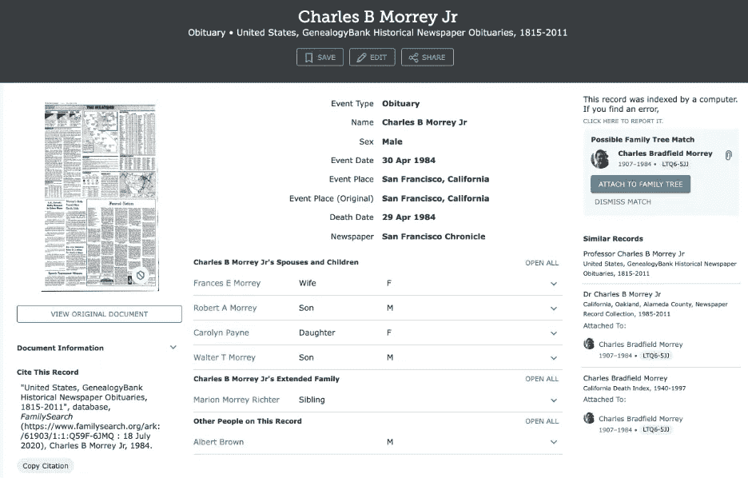*

**图 3:完全由我们的 CAI 系统(与 GenealogyBank 合作)索引的印刷讣告。图片版权*[*FamilySearch.org*](https://www.familysearch.org)*。经许可使用。**

*在这一点上，值得注意的是为什么我们选择在内部构建我们的 CAI 堆栈。在我们可以使用 OCR 技术的历史文件的情况下，我们很早就发现没有商业 OCR 软件可以足够准确地读取历史报纸印刷物以产生可用的索引。事实上，这在我们的习题集中是一个反复出现的主题。优秀的商业解决方案经常存在，但是它们被调整到为解决方案提供商的客户产生收入的现代文档。相比之下，历史文献是非营利组织、学术界、教会、档案馆和少数家谱组织的领域。与医疗账单、律师事务所等领域相比，这些细分市场代表了此类服务的一小部分潜在收入来源。也就是说，FamilySearch 和我们的朋友组织在让机器学习对历史文档进行工作所需的训练数据方面非常丰富。甚至一些大型科技公司都对我们多年来积累并逐渐注释的图像数据表示惊讶。*

*事实证明，我们构建(而不是购买)OCR 的决定特别有益，因为我们将重点从历史报纸转向了历史手写文档。术语“OCR”(光学字符识别)有点误导，因为它意味着对每个不同字符的分割和识别。相反，我们的引擎在行级别进行分段，并识别字符序列。我们采用了一个语言模型来进一步细化实际单词上下文中的每个字符级预测。这种方法更适用于 HTR(手写文本识别)，因为在草书笔迹中，不同的字符通常非常难以分割。对我们来说，向 HTR 转移只是利用新的训练数据的问题。在充分披露，我们最初建立我们的光学字符识别系统与 HTR 铭记。*

*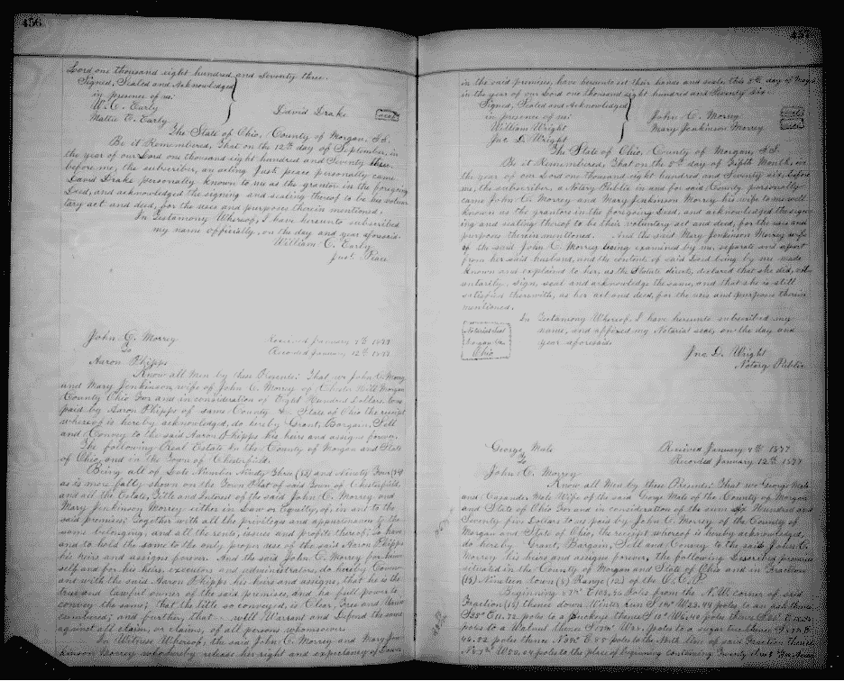*

**图 4:2016 年我们与 HTR 一起抄写的 19 世纪地契示例。图片版权*[【FamilySearch.org】T21](https://www.familysearch.org)*。经许可使用。**

*大约在这个时候，我们还与杨百翰大学的研究人员合作，他们帮助塑造了我们的机器学习(ML)识别方法。其结果是一个最先进的 HTR 系统，用于历史段落/散文风格的手写草书文档。到 2018 年底，我们在美国历史手写遗嘱、遗嘱认证和土地记录的超过 1.1 亿张图像上运行了该系统，以受益于各种各样的手写风格和样本。据我们所知，这是(并且可能仍然是)有史以来通过 HTR 处理的最大的单个语料库。FamilySearch 尚未正式发布这些记录/索引，但我们预计很快就会发布。*

*从那以后，我们通过为几种新的语言/脚本构建模型和创建生产 ML 管道，继续扩展我们的 OCR/HTR、NLP 和相关能力。此外，我们现在有了一个识别器，它可以在一行中在手写和打印文本之间转换。到 2021 年底，我们将发布超过 1.5 亿条西班牙语和葡萄牙语记录，如图 5-7 所示。事实上，今天我们网站上的用户已经可以获得数百万条这样的记录。*

*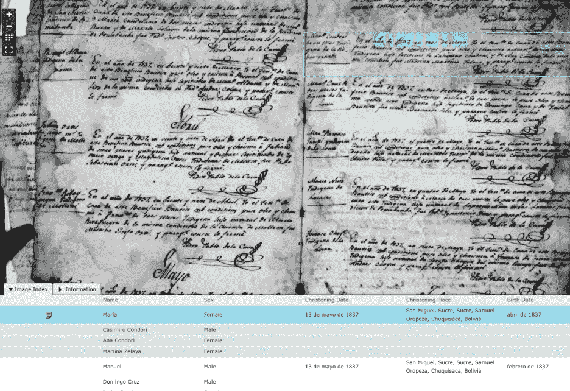*

*图 5:自动索引的玻利维亚西班牙洗礼记录。图片版权[*FamilySearch.org*](https://www.familysearch.org)*。经许可使用。**

*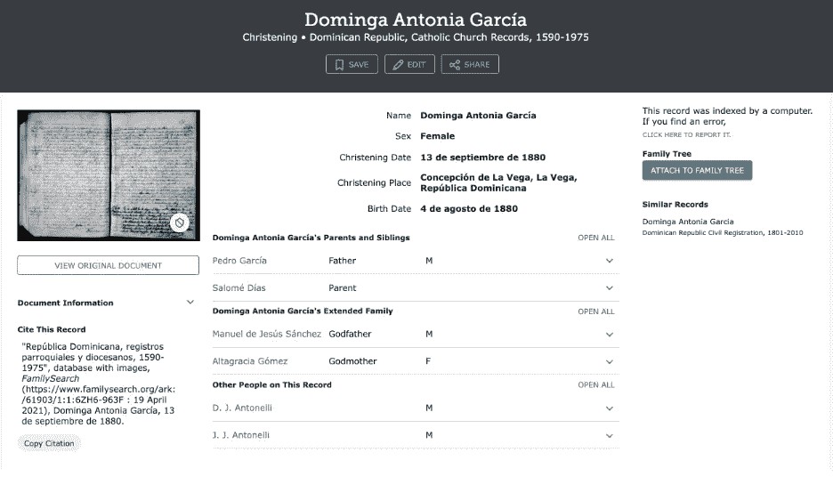*

**图 6:来自多米尼加共和国的西班牙洗礼记录的自动索引。图片版权*[*FamilySearch.org*](https://www.familysearch.org)*。经许可使用。**

*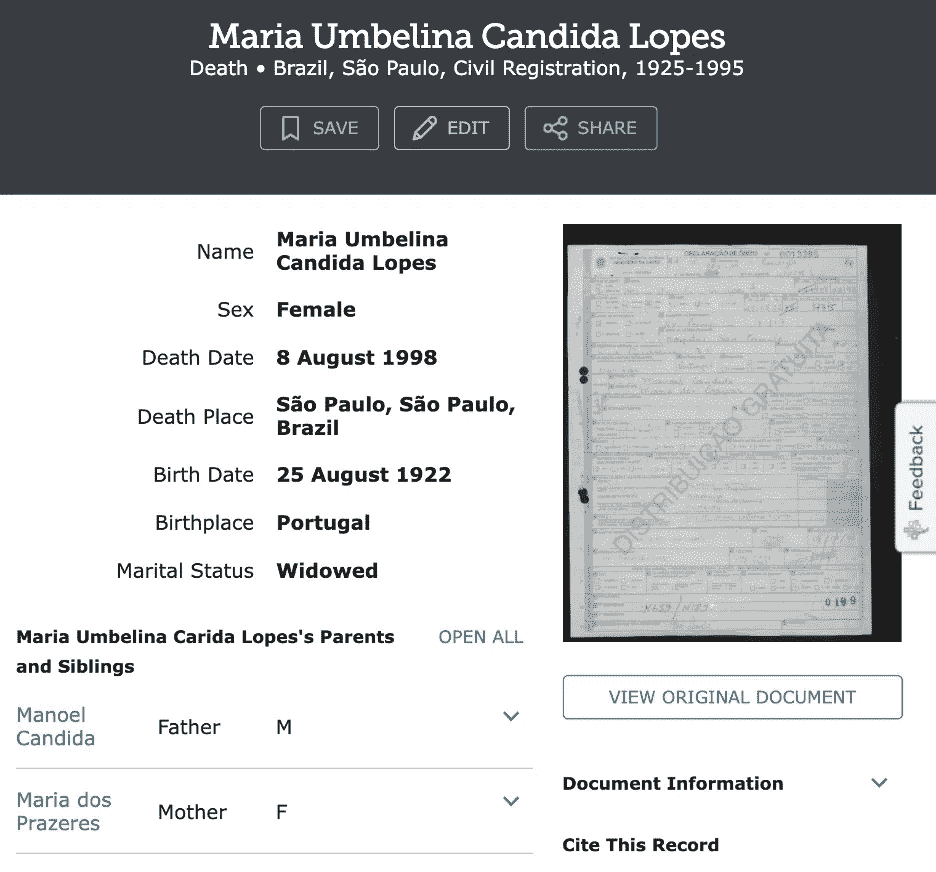*

**图 7:巴西自动索引的民事死亡记录。图片版权*[*FamilySearch.org*](https://www.familysearch.org)*。经许可使用。**

*2021 年，我们将通过 CAI 出版比任何其他单一记录索引来源更多的新西班牙记录。我们预计这种趋势会跨语言发展。与此同时，我们认识到，即使我们最好的 ML 模型也不太可能与经验丰富的人类索引员的整体准确性和推理能力相匹配。考虑到这一点，FamilySearch 正在设计新的在线和移动体验，允许用户随时随地“及时”纠正索引错误。我们还使用自动化技术，通过相似性对人类索引任务进行预分组，以减轻志愿者的认知负担。*

## *持续的挑战*

*虽然我们已经取得了显著的成功，但随着我们朝着让每张图像都可以搜索的目标迈进，并且使用越来越多的语言，ML 研究问题变得越来越困难。事实上，像我们拥有的这样的历史文档可能包含一些最难解决的文档处理问题。在下一部分中，我们将详细介绍其中的一些挑战，以及我们将如何应对这些挑战。*

## *语言和文字*

*我们的目标是让每个人都有可能进行家谱研究，不管他们的语言、国籍或背景如何。FamilySearch 目前正式拥有 227 种不同的语言。非官方的数字可能更大。我们在记录图像中发现了我们团队中没有人听说过的语言！甚至这些晦涩难懂的文件也很重要，因为它们包含了某人祖先的姓名和关键生活事件。事实上，如果我们研究我们的家谱，我们所有人都会开始遇到我们不理解的语言。*

*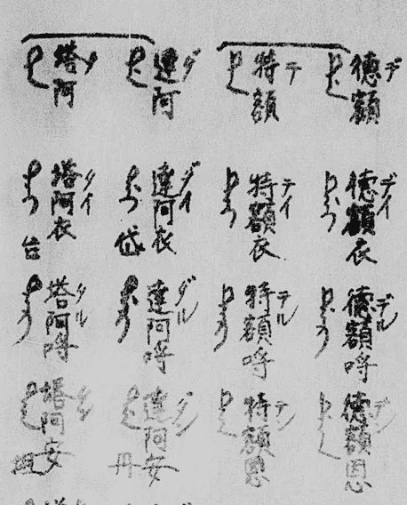*

*图 8:满语(一种濒临灭绝的语言)旁边的汉语。图片版权[*FamilySearch.org*](https://www.familysearch.org)*。经许可使用。**

**

*图 9:来自印度的梵文。图片版权[*FamilySearch.org*](https://www.familysearch.org)*。经许可使用。**

**

*图 10:一个古老的英文手稿(大约。1665).图片版权[*FamilySearch.org*](https://www.familysearch.org)*。经许可使用。**

*“语言”这个术语本身就把问题过于简单化了。首先，历史文献通常包含独特的子语言。在每种主要语言中，专门的主题都有自己的词汇和概念。举例来说，您可能在学校学过西班牙语会话，但尝试用西班牙语向某人描述数据科学概念！*语言*和书面*文字*之间还有一个重要的区别。说某种语言的人可能非常流利，但仍然完全看不懂剧本。事实上，如果你没有在小学学过草书，你甚至会被这篇文章中的一些图片吓到！现代草书只是在我们的文献中发现的许多不同的脚本之一。*

*这些因素在当今数据饥渴的监督 ML 算法的背景下复合。为了自动阅读特定语言和脚本的文档，我们需要大量用该语言编写的经过仔细注释的脚本示例。与此同时，很难找到能够完成所需注释的人。在我们目前的收藏中，甚至有一些“灭绝”的语言和文字，只有世界上少数学者能够理解。*

*到目前为止，我们解决这个问题的主要方法是迁移学习结合从非常规来源获取训练数据。例如，对于我们的葡萄牙语 HTR 模型，我们最初注释的训练数据只有西班牙语的 1/10。我们还选择性地将来自更大的西班牙语训练语料库的西班牙语数据合并到我们的葡萄牙语模型中。最后，我们从已经编入索引的葡萄牙语记录中修补了更多的葡萄牙语培训示例。由此产生的葡萄牙语 HTR 模型的准确性正在迅速接近西班牙语的准确性，而家庭研究的成本要低得多。虽然西班牙语和葡萄牙语确实相似，但我们注意到，即使在更不相似的语言(通常在同一语系/文字中)之间选择性地共享训练数据，仍然可以减少所需的训练数据总量。*

*关于古老的文字和语言，我们有一个想法是“回溯时间”FamilySearch 拥有如此庞大的资源，以至于我们有时可以在自己的文档中观察到特定语言或文字向现代(可读)方向的演变。通过以相反的顺序(通常从最容易到最难)对这些文档排序，我们可以使用半自动的“清洗-重复”方法来训练我们的识别器，直到理解了古老的文本。*

## *各种记录类型*

*大约 60%的 FamilySearch 历史文档中的内容符合少量预定义的“记录类型”类别(为系谱学家所熟悉)，如出生证明、人口普查等。然而，大约 40%的历史文献很难在谱系学意义上进行分类。在生成结构化的可搜索索引时，这种分类很重要。它在“记录提示”的上下文中甚至更重要，这是历史记录索引和已经记录在家谱中的经过充分研究的人之间的自动新链接。FamilySearch 用户非常依赖这些记录提示来研究他们自己的家谱。*

*记录类型的基本问题是它们需要根据固定的本体或模式提取信息。反过来，在某些时候，提取过程通常涉及到不灵活的基于规则的方法(理解为:硬编码的软件规则而不是 ML)。这对于我们的主要记录类型来说没问题，但是对于难以分类的长尾文档来说就有问题了。这种文档的一个例子是法庭记录，它可以是从刑事审判程序到金融交易分类账的任何内容。当然，我们可以自动转录这些文档，并提供某种程度的搜索能力，但很难用一种通用的(但有意义的)方式来解释它们。*

*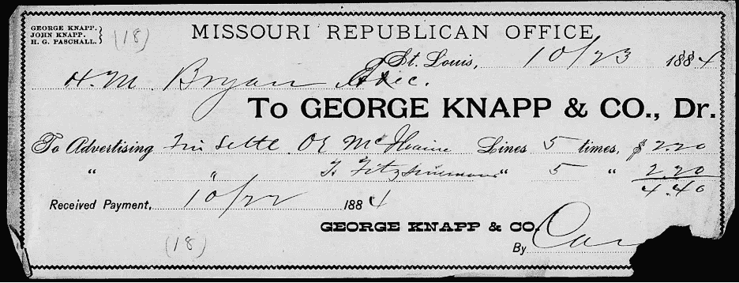*

**图 11:来自一个不太结构化的集合的货币收据。图片版权***。经许可使用。***

**这种任意文档“理解”可能无法用当前的 ML 技术完全解决，因为它可能需要人类级的推理。我们有时开玩笑说，当我们拥有可以解决这类问题的人工智能时，人工智能可能不会想去做！也就是说，我们正在探索替代的记录搜索范例，这些范例有助于结构化程度较低的数据(包括全文搜索)。此外，即使对于非结构化/不可分类的文档，我们的技术也可以准确地检测常见的实体，如人名、组织、日期、事件等。我们还可以经常以有意义的方式将这些实体相互联系起来。换句话说，我们的系统可能并不总是确切地知道一个文档*是什么意思*(从系谱上来说)，但它仍然可以找到有用的结构化信息，比如人和他们的亲属。**

## **复杂布局**

**从历史文档中提取结构化信息通常不仅仅涉及理解(NLP)转录的散文文本。许多文档通过非文本提示，如字体大小/粗细、分割线、箭头、图表等来传达额外的语义。表格就是一个很好的例子(参见图 12 和图 13)。表格根本不是“自然语言”。然而，作为人，我们很容易理解行、列、标题等之间的关系。并且可以相应地解释数据。可以肯定的是，在简单的情况下，有一些 ML 模式可以近似我们的直观视觉理解能力。然而，根据我们的经验，这些技术在更复杂的情况下会失效。**

**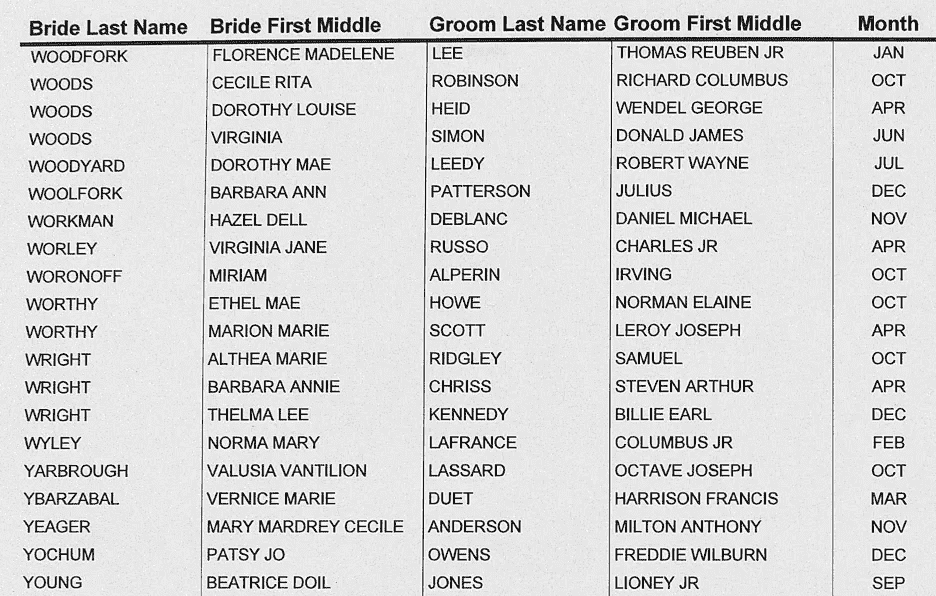**

***图 12:一个简单的表格布局，它易于使用 ML 和通用规则的组合进行处理。图片版权*[*FamilySearch.org*](https://www.familysearch.org)*。经许可使用。***

**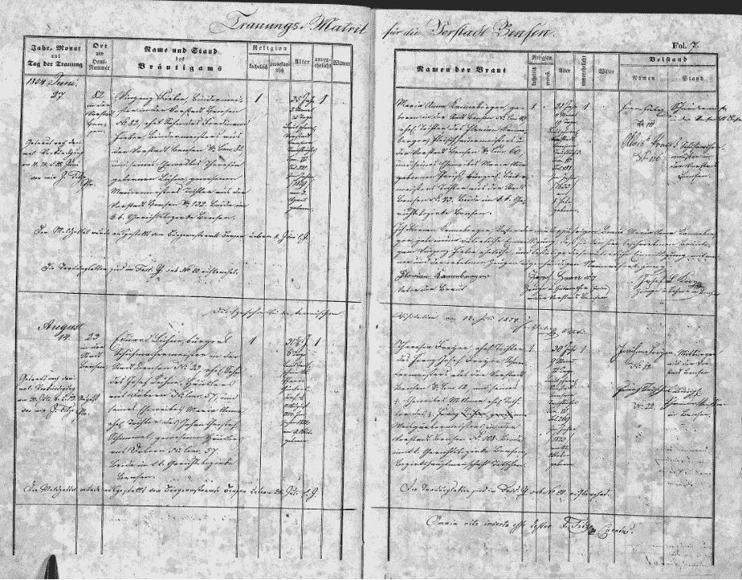**

***图 13:一个复杂的表格文档，具有更难理解的视觉语义。图片版权*[*FamilySearch.org*](https://www.familysearch.org)。经许可使用。**

**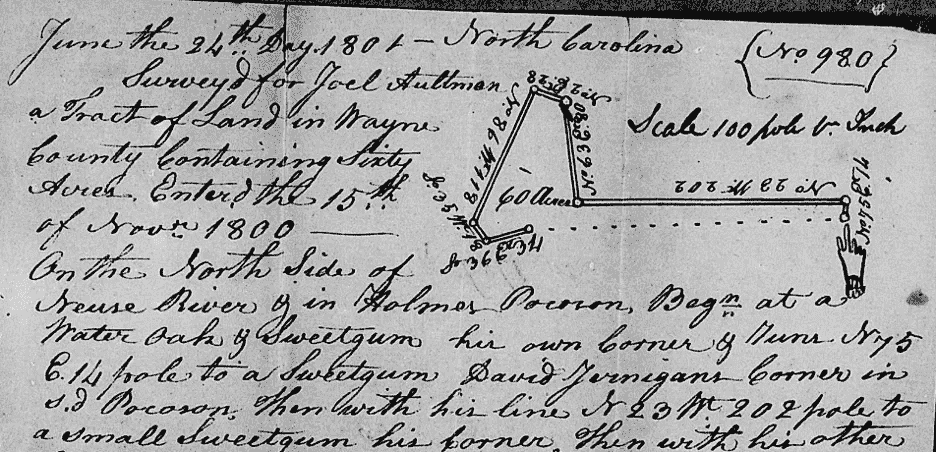**

***图 14:地契附补充图。图片版权*[*FamilySearch.org*](https://www.familysearch.org)*。经许可使用。***

**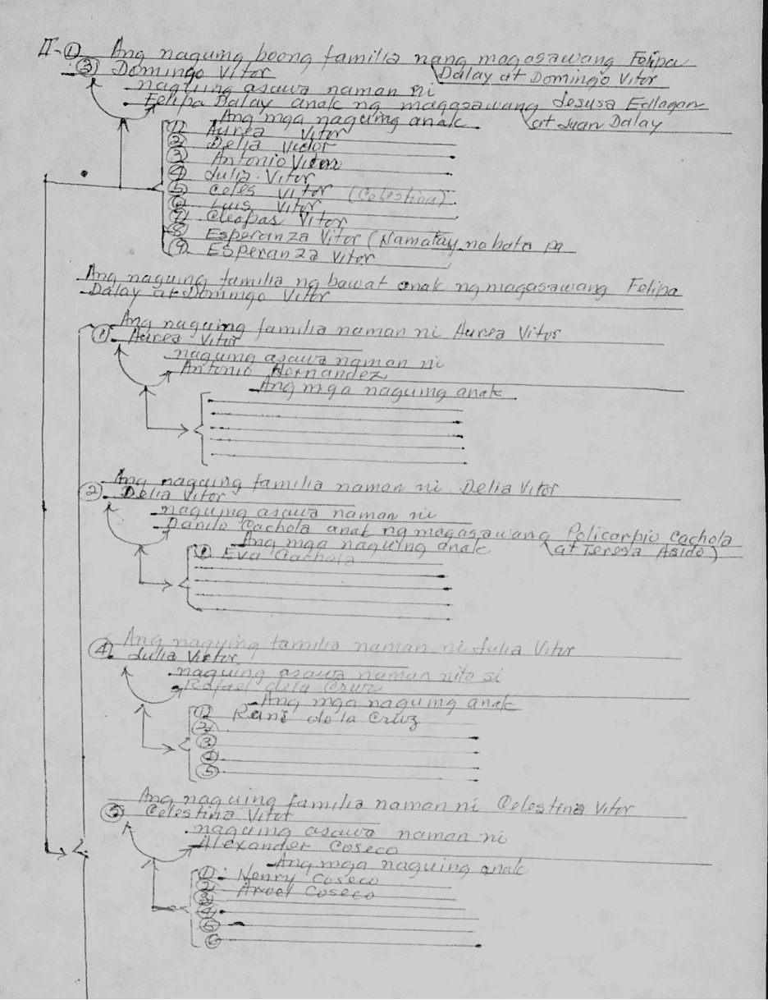**

***图 15:一个视觉语义甚至对人类读者都很难理解的文档。图片版权*[*FamilySearch.org*](https://www.familysearch.org)*。经许可使用。***

**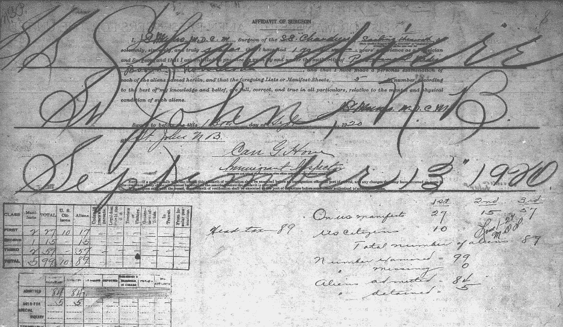**

***图 16:特别有挑战性的布局！图片版权*【FamilySearch.org】**。经许可使用。****

*在某些方面，复杂布局的问题集类似于前面提到的非标准记录类型。我们已经可以通过 ML 和代码规则的结合来“解决”许多这样的问题，但是不能以一种通用的方式可靠地适应以前看不到的布局。尽管如此，我们的引擎仍然出色地完成了在许多复杂布局中分割和正确转录文本的工作。同样，我们仍然可以识别实体(如名称、地点等。)而不完全理解布局。*

## *文档损坏、噪音和图像质量差*

*与现代办公室中扫描的大多数业务文档不同，历史文档可能已有数百年的历史。在它们漫长的一生中，它们可能会受到霉菌、昆虫、火和各种形式的损害。大多数商业文档处理系统对这类问题没有弹性。除了文件损坏之外，我们的许多图像都是早在 20 世纪 30 年代就开始微缩拍摄的。胶卷本身可能已经变质，或者曝光本来就不好。而且，在许多情况下，简单地重新扫描原始文档(可能已不存在)并不是一个选项。*

*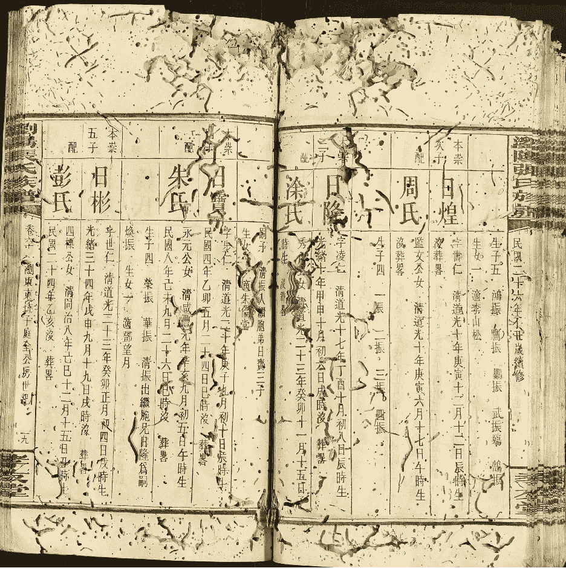*

**图 17:虫蛀的中国甲谱。图片版权*[*FamilySearch.org*](https://www.familysearch.org)*。经许可使用。**

**

**图 18:一份严重变质的文件。图片版权*[*FamilySearch.org*](https://www.familysearch.org)*。经许可使用。**

*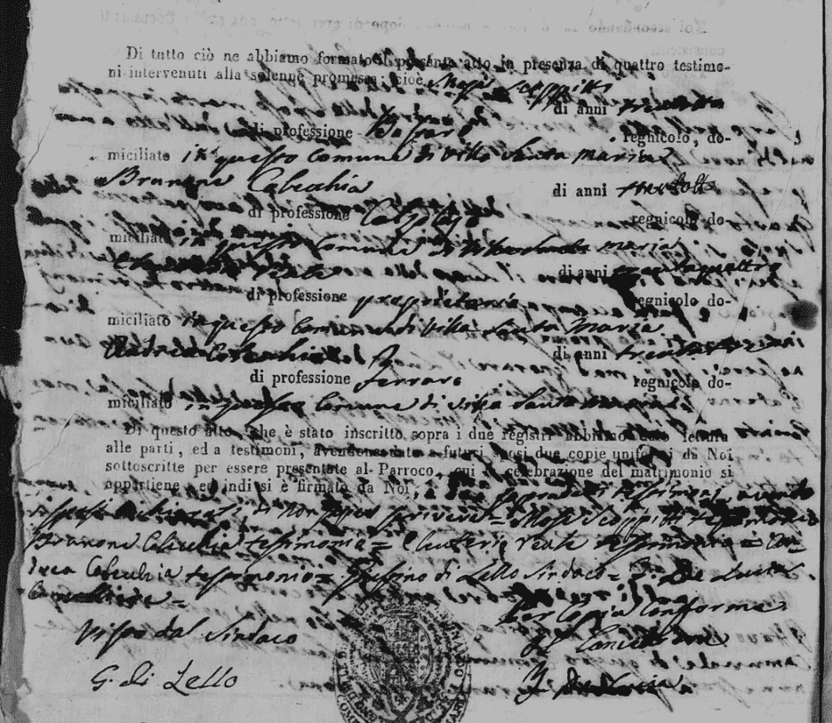*

**图 19:从反面“出血”的文件。图片版权*[*FamilySearch.org*](https://www.familysearch.org)*。经许可使用。**

*显然，我们无法从一份不存在的文件中提取信息。也就是说，我们的语言模型在“猜测”其他文档中频繁出现的缺失/不可读文本方面做得非常合理。此外，我们发现我们的识别模型对噪声(如渗色、污点等)具有弹性。)当用足够的例子训练时。*

*作为一种不同的方法，在我们的识别过程开始之前，我们已经试验了从图像中去除常见噪声的模型。这些模型的训练数据是合成的。我们通过在干净的历史文档图像上叠加伪造的伪像(如邮票、杂散标记和奇怪的纸张纹理)来模拟“嘈杂”的图像。该模型是一个自动编码器架构，它接受合成图像作为输入，并产生干净的图像作为目标。这个实验在某些场景中相当成功(见图 20)。然而，我们的一般方法是训练我们的识别器直接处理噪声。*

**

**图 20:用我们的自动编码器擦除的印记(“噪声”)。图片版权*[*FamilySearch.org*](https://www.familysearch.org)*。经许可使用。**

*一些源文档的物理损坏可能太严重，无法仅通过成像后数字清理来恢复信息。然而，技术可能会带来希望，即使一份文件对人的眼睛来说是不可读的。我们的一位业界朋友 Ancestry.com 在历史文献的多光谱成像方面做了一些有前途的研究。在这项研究中，祖先证明了他们可以恢复隐藏在可见光谱之外的重要信息。*

## *了解当地环境*

*尽管我们认为大部分历史文献是“家谱文献”，但它们很少是由家谱学家创建的。大多数是为了法律、税收或宗教目的而创建的。最初的作者没有想到他们的文件会被试图寻找他们家族根源的人阅读，通常是在数百年后的另一个国家。相反，记录员认为读者会有与该地区和最初预期目的相关的当地背景。地点的缩写就是一个很好的例子。我们在巴西圣保罗州的死亡记录中包含了晦涩的地名缩写，比如“SJC”在全球谱系背景下，这个缩写几乎是不可能解析的。它不会作为巴西城市的标准缩写出现。事实上，它很容易被误认为是加州圣何塞的机场代码。然而，居住在圣保罗的民事登记员会立即认出“SJC”是圣保罗的一个主要城市“so josédos Campos”。*

*幸运的是，FamilySearch 已经拥有一个庞大的标准化值数据库，可以很容易地过滤到不同级别的地理边界。每当我们遇到一个新的本地变体(比如上面的“SJC”)，我们目前的方法是用新的信息手动更新我们的标准数据库。*

## *结论*

*代表系谱部门，FamilySearch 要感谢整个行业的 ML 从业者，他们的研究有助于发掘我们历史文献图像的价值。人工智能的进步正在帮助成千上万的人们了解他们的家庭，最终了解他们自己。我们邀请所有感兴趣的读者在 FamilySearch.org 直接体验这一点，或者直接与我们联系。*

*[1]科尔，约翰·杨，[为国会和国家:国会图书馆编年史](https://books.google.com/books/about/For_Congress_and_the_Nation.html?id=gdC0h1y0kIUC) (1979)，国会图书馆*