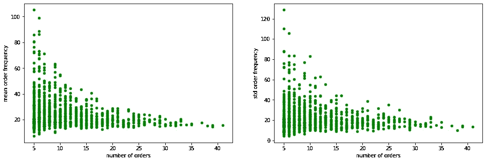

# 极端流失预测:没有特征的预测

> 原文：<https://towardsdatascience.com/extreme-churn-prediction-forecasting-without-features-8ebd4a8dc8b>

## 研究事件频率以识别异常行为

照片由 [Isravel Raj](https://unsplash.com/@isravelraj?utm_source=medium&utm_medium=referral) 在 [Unsplash](https://unsplash.com?utm_source=medium&utm_medium=referral) 上拍摄

如今，我们生活在一个以数据为中心的世界。我们的每一项行动都会产生大量数据，这些数据可以被收集并用于产生有价值的商业见解。大型科技公司非常了解这些动态。**通过监控我们的日常活动，有可能识别我们的习惯和偏好，以定制优惠并增加参与的可能性**。

同时访问和利用由每个个人/用户产生的大量各种各样的数据可以增加业务成果，更好地满足客户，并授予领先的市场地位。正如我们想象的那样，产生和储存的信息是巨大的，而且种类繁多。从这个意义上来说，**商业智能和机器学习在为我们处理的数据提供有价值的意义并做出最有效的决策方面发挥着至关重要的作用**。

**在商业价值最大化的范围内，我们可以采用机器学习来检测客户何时接近于搅动**，确定最佳的保留策略，根据他们的偏好推荐最佳的服务或产品，等等。将人工智能解决方案应用于客户参与的可能性有很多。拥有一套完整而丰富的数据可能会为我们的需求带来巨大的附加值。作为数据科学家，**我们可以通过合并不同的数据源和构建有意义的特征来构建强大而复杂的管道，以支持我们的预测算法**。

这听起来像是魔法，也是每个数据科学家的梦想。由于收集和存储数据应该是每个以数据为中心的公司的必经之路，所以它可能不会那么容易和免费。**使用少量观察值、低质量数据或没有有意义的预测值的工作可能经常发生**。在这种情况下，我们应该重塑自我，利用我们所拥有的一切来提供最佳解决方案。

在这篇文章中，我们开发了一个检测顾客何时离开的解决方案。我们不采用标准或复杂的机器学习方法。我们模拟极端场景中的操作，其中我们只存储了每个用户的购买信息以及相对数量。我们对客户一无所知，也无法合并任何有价值的外部数据源来帮助我们丰富数据集。**通过简单有效的统计技术，我们旨在获得合理的结果，这些结果也可用于更复杂解决方案的基准测试**。

# 模拟设置

我们想象自己是一家销售产品或服务的公司。我们不提供订阅。我们的顾客在需要时会自行购买。对于每个客户的订单，我们可以检索日期和相应的金额。这些是我们唯一能收集和获得的东西。

在本文的范围内，我们模拟在给定的时间范围内固定数量的客户的一些订单。当客户停止从我们这里订购并且不再购买任何东西时，我们会注册一个客户流失。

订单频率(图片由作者提供)

根据我们掌握的信息，我们可以检索两次连续购买之间的间隔天数(即订单频率)。**计算两个相邻订单的天数差异是开发我们解决方案的基础。我们的目标是主要通过查看每个客户的订单频率分布来识别客户流失**。如果自上次购买以来的天数与通常的客户订单频率相差甚远，我们有信心遇到客户离开。换句话说，对于每个客户，我们验证今天和最后一个订单日期之间的差异是否大于过去。

*订单数量 vs 订单频率均值/标准差*(图片由作者提供)

实际上，我们必须开发一种算法，通过研究订单频率分布，可以提醒每个客户在任何日期的交易风险。我们提出两种简单而有效的方法:

*   **西格玛建模**
*   **累积分布函数(CDF)建模**

通过 **sigma 建模**，我们计算了历史参考期内每个客户订单频率的平均值和标准差。在推断过程中，我们验证今天和最后一个订单日期之间的差异是否大于平均值加上 n 倍 sigma。如果发生这种情况，我们的客户不再像以前那样频繁购买，这可能表明可能会有客户流失。

使用 **CDF 方法**，我们将订单频率建模为一个随机变量(精确地说是一个截尾正态),根据每个客户的历史参考期构建相应的反单调 CDF。在推理时，我们可以确定今天和最后一个订单日期之间的任何差异的概率，该差异大于预定义的置信水平。和以前一样，如果发生这种情况，我们的客户不再像以前那样频繁购买。为了提高 CDF 建模的有效性，如果我们认为它对客户流失检测有意义，我们还可以在公式中包含订单量。如果我们希望更重视金额接近普通客户历史支出的采购，这一点很重要。

# 结果

为了测试所提出的技术是如何工作的，我们按照一种滑动窗口方法将它们应用于我们所处理的所有模拟数据。我们在每个月的第一天评估每个客户的搅动倾向。作为基本事实，我们知道客户何时向我们下了最后一笔订单(也就是说，我们知道他们何时流失)。通过这种方式，就有可能计算出准确性、精确度和召回率等标准指标。

对于这两种方法，我们只在固定的购买量(在我们的例子中是 6 个订单)后评估每个客户，以建立可靠的订单频率分布，并使程序更可信。另一方面，我们更愿意对这些客户什么都不说，等以后再评价。

回忆结果。比较方法论(图片由作者提供)

精确结果。比较方法论(图片由作者提供)

准确性结果。比较方法论(图片由作者提供)

提议的方法似乎在识别可能的混乱方面做得很好。sigma 的精度似乎最高，而 CDF 的精度更高，召回率也更高。通过调整 sigma 水平或 CDF 置信度，可以对这些方法进行可能的调整和调节。

# 摘要

在这篇文章中，我们介绍了两种利用事件频率研究来识别可能的异常行为的方法。我们在一个 churn 应用程序中应用了上述方法。这同样适用于所有任务，在这些任务中，对事件之间的时间的研究对于做出决策至关重要。由于其简单性和适应性，当有可能采用更复杂的解决方案时，所提出的方法也可以用作基准。

[查看我的 GITHUB 回购 ](https://github.com/cerlymarco/MEDIUM_NoteBook)

保持联系: [Linkedin](https://www.linkedin.com/in/marco-cerliani-b0bba714b/)