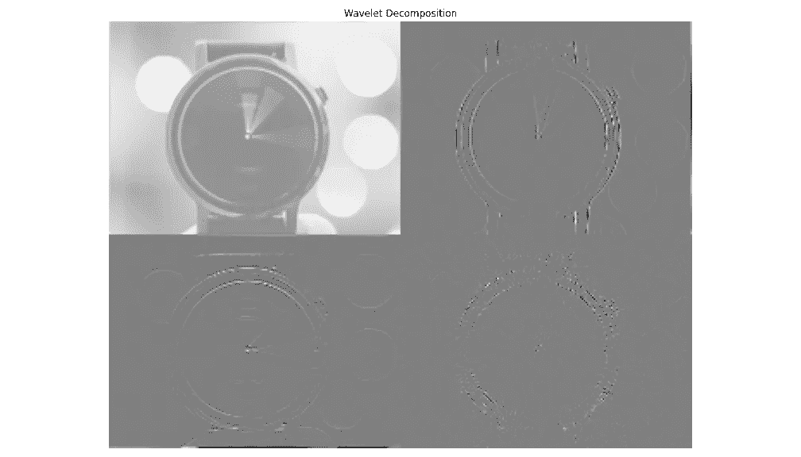
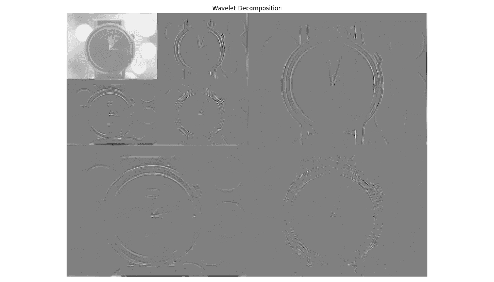

# 用 Python 实现图像中的快速异常检测

> 原文：<https://towardsdatascience.com/fast-anomaly-detection-with-images-f612a6a897ca>

## 我如何将速度提高 10 倍

照片由[萨夫](https://unsplash.com/@saffu?utm_source=medium&utm_medium=referral)在 [Unsplash](https://unsplash.com?utm_source=medium&utm_medium=referral) 上拍摄

最近，我一直在为工作中的一个项目开发一个异常检测模型。我需要将我的代码速度提高 10 倍。

在这篇文章中，我将描述我是如何实现这个目标的，以及在这个过程中我遇到的一些挑战。

粗略地说，异常检测技术试图识别数据中不符合典型行为的模式。这可用于识别系统中的问题、欺诈行为或其他异常活动。在我的案例中，我们需要从视频图像中实时识别异常情况。

典型的方法是从无异常的图像中构建参考概率分布，并计算新图像和参考分布之间的距离，以找出我们是否面临异常值。

这种方法的问题是，我们假设参考分布不会随时间而改变。此外，我们还需要获得涵盖所有可能结果的整个数值范围的数据，这些数据没有出现异常。

幸运的是，有一种方法可以解决这个问题:创建一个滑动窗口并使用无监督的异常检测方法。

在我们的例子中，我们可以从相机拍摄的最后 200 张照片中创建一个参考分布，并将这个分布与新输入的照片进行比较。

但是这种方法有一个主要问题:

> 每次更新滑动窗口都需要训练算法。

这意味着算法应该很快，并且我们从图片中提取的特征向量应该很小——在我们的情况下只有 10 维——如果我们希望有机会在边缘设备上花费不超过几毫秒的时间来训练模型。

# 小波分解

小波是一种信号处理技术，可用于将信号分解成不同的频率分量。通过将图像分解成不同的频带，它可以用于图像处理。

> 为了让开始学习 Python 中的小波变换，我们可以使用一个名为[py wavelet](https://pywavelets.readthedocs.io/en/latest/)的库。

小波也可以用来压缩图像，通过识别和删除不必要的细节。通过这样做，小波压缩可以在不影响质量的情况下产生更小的文件。此外，小波可以用于各种其他任务，如去模糊、去噪和边缘检测。

我们不需要小波分解来发现图像中的异常，但这种技术可以在行业中使用，主要有两个原因:

*   压缩图像以节省数据库空间并加快文件在网络上的传输，以及
*   根据关键特征在图像中的出现频率和方向，分离出关键特征。

> 经验 1:通过从小波分解本身提取特征，你可以赢得一些宝贵的毫秒。这样，我们就不需要将图片重新组合回它的初始形式。

例如，下图显示了第一级分解:

*   左上方是低分辨率图像，
*   右上角的垂直细节，
*   左下角的水平细节，以及
*   右下角的对角线细节。

具有一个分解级别的小波变换示例(原始照片由[萨夫](https://unsplash.com/@saffu?utm_source=medium&utm_medium=referral)在 [Unsplash](https://unsplash.com?utm_source=medium&utm_medium=referral) 上拍摄)

我们可以有几个分解步骤。为了便于说明，第二个分解步骤如下图所示:

具有两个分解级别的小波变换示例(原始照片由[萨夫](https://unsplash.com/@saffu?utm_source=medium&utm_medium=referral)在 [Unsplash](https://unsplash.com?utm_source=medium&utm_medium=referral) 上拍摄)

当寻找异常时，边缘通常是提取的好特征。这些信息大多可以从水平和垂直的细节中获得。

> 经验之二:对于边缘检测，对角线细节主要是噪声。

为了提取边缘，我们遵循“低冗余小波熵边缘检测算法”中提出的方法[1]如下所示:

1.  对于每个级别的分解，将水平和垂直分量组合在一起并进行归一化。例如，对于第一级分解，我们将通过对右上图像和左下图像求和来创建新的图片。
2.  使用最小-最大归一化将新创建的图片从 0 归一化到 1。
3.  选择最有结构的分解层次。这被认为是具有最低[香农熵](https://en.wikipedia.org/wiki/Entropy_(information_theory))的水平(甚至有一个 [scikit 模块](https://scikit-image.org/docs/stable/api/skimage.measure.html#skimage.measure.shannon_entropy)来计算它)。这样，我们可以选择与我们的目的最相关的信息级别，避免在其他级别的冗余信息上浪费时间。

> 经验之三:分解步骤之间有冗余信息，所以我们只需要从其中一个步骤中提取特征。

# 特征描述符

中的特征描述符是图像或视频的表示，可用于对象检测和分类等任务。有许多不同类型的特征描述符，但它们都旨在以紧凑的方式捕捉图像或视频的重要特征。

> 常用的描述符包括梯度方向直方图(HOG)、亮度直方图(HIST)和尺度不变特征变换(SIFT)。

每种类型的描述符都有自己的优点和缺点，为特定的应用程序选择正确的描述符至关重要。然而，一般来说，所有特征描述符的目标是以有利于机器学习的方式来表示图像或视频。

在我们的例子中，我们使用了 HOG 描述符，但是它对于实时检测异常有两个缺点:

*   HOG 描述符维数太高，并且
*   计算太慢了。

对于实时处理，我们需要一些东西:

*   快速提取，
*   低维，以及
*   这在异常情况下变化很大。

在我们的具体项目中，如果出现异常，物体的位置和形状都会改变。这意味着我们只需要建立一个反映物体形状的特征向量。

> 图像时刻足以反映这些变化。

我们发现，具有面积(灰度级之和)、质心坐标(对象的中心点)和二阶矩(方差)的简单特征向量已经足以检测大多数可能的异常。

> 经验之四:一个简单的特征提取器比一个特别为一个项目设计的奇特的特征提取器更有效。

# Python 中的实时异常检测

异常检测是识别数据中异常行为或事件的过程。它是许多系统的重要组成部分，从安全和欺诈检测到医疗保健和制造业。

实时异常检测是一个特别困难的问题，因为它需要近乎即时地识别异常，这在处理图像等高维数据时更具挑战性。

我喜欢用两个库来进行异常检测:

*   第一个叫 PyOD。这是一个 Python 工具包，用于实现无监督的异常检测算法，并且
*   第二种称为 PySAD——可以与 PyOD 结合使用——用于检测流数据中的异常。

> B 这两个库都是开源的、轻量级的、易于安装的。

棘手的部分不是实现算法——就像 PyOD 为我们做的那样——而是选择正确的算法。

在我们的例子中，我们首先使用一种叫做*隔离森林* (iForest)的算法，但是切换到另一种叫做*基于直方图的异常值得分* (HBOS)的方法显著提高了速度，同时几乎保持了相同的准确性。

我们还幸运地发现，他们刚刚发布了一篇名为“ADBench:异常检测基准测试”[2]的论文，以一种非常全面的方式对他们所有的异常检测算法进行了基准测试。

> 经验之五:当选择一个更简单的算法时，你不一定会损失很多精度，但是速度的提高是显著的。

# 结论

因此，如果您正在寻找一种快速有效的方法来从图像中提取特征，小波分解结合图像矩等简单的度量可能是一个很好的选择。虽然有更复杂的特征提取算法，有时一个简单的方法就是你所需要的。

我们已经看到，从小波分解中提取特征有利于边缘检测，但对角线细节主要是噪声。此外，我们发现分解步骤之间存在冗余信息，因此特征提取器可以仅基于一个分解步骤。优选地是具有较低熵的级别，因为它是图像内具有更多边缘结构的级别。

最后，我们发现一个简单的特征提取器比一个专门为我们的项目构建的奇特的特征提取器更有效。我们还发现，当选择更简单的算法时，您不一定会损失准确性，但速度增益可能是显著的。

好奇想了解更多关于 Anthony 的工作和项目吗？在[媒体](https://medium.com/@anthonycvn)、 [LinkedIn](https://www.linkedin.com/in/anthonycavin/) 、 [Twitter](https://twitter.com/Anthony66333223) 上关注他。

*需要技术写手？将您的请求发送到*[*https://amigo CCI . io*](https://amigocci.io/blog/mlops-at-medium-scale/)*。*

[1]:陶，易婷，等，“一种低冗余度小波熵边缘检测算法”*影像杂志* 7.9 (2021): 188。

[2]:韩，，等. ADBench:异常检测基准