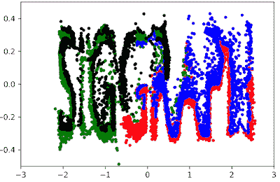
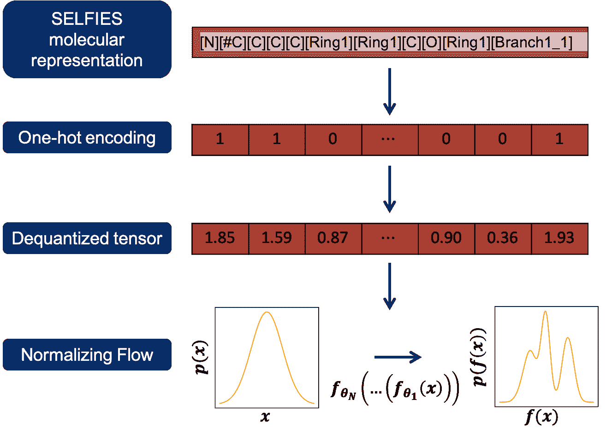
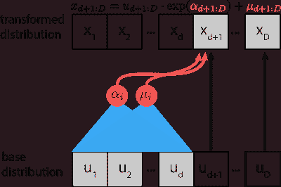
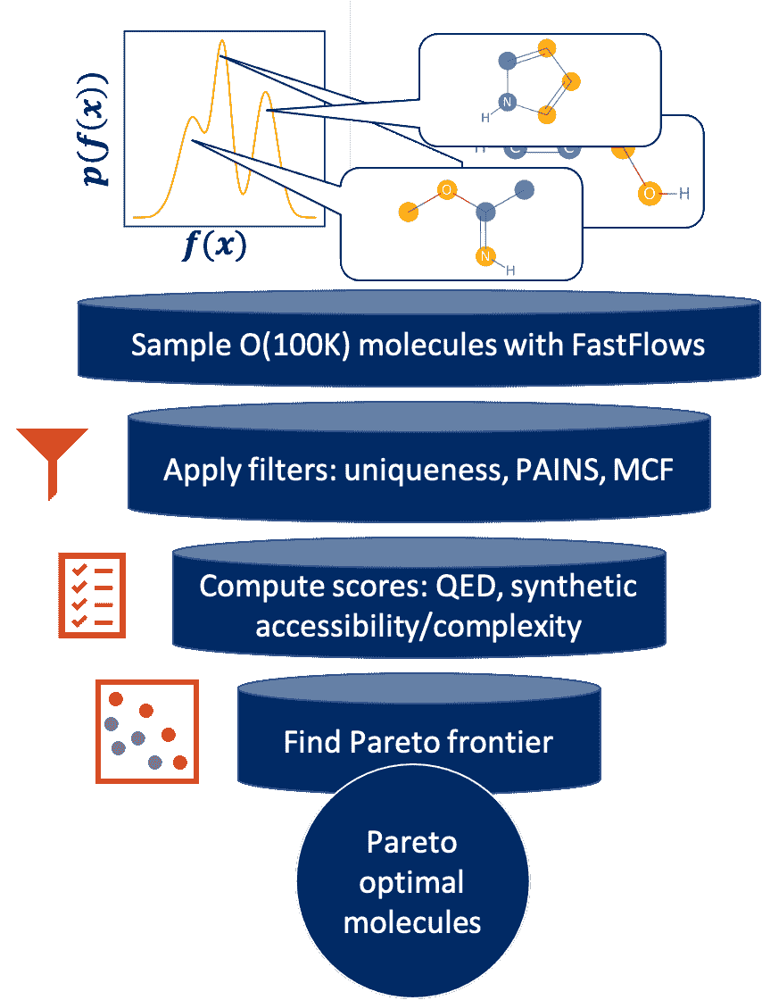

# FastFlows:基于流的分子图生成模型

> 原文：<https://towardsdatascience.com/fastflows-flow-based-models-for-molecular-graph-generation-a8327bb9bee1>

## 高效生成建模的深度学习可逆变换


从 [Unsplash](https://unsplash.com/photos/cCthPLHmrzI) 开始。

*内森·c·弗雷*

*这篇文章是由深海森林科学的 Bharath Ramsundar 合著的。*

*规范化基于流程的深度生成模型学习简单基础分布和目标分布之间的转换。在这篇文章中，我们展示了如何使用*[*【fast flows】*](https://arxiv.org/abs/2201.12419)*对小分子数据集进行建模并生成新的分子。FastFlows 使我们能够在几秒钟内生成数以千计的有效分子，并展示了基于流的分子生成模型的优势和挑战。*

*一个* [*互动教程*](https://github.com/deepchem/deepchem/blob/master/examples/tutorials/Training_a_Normalizing_Flow_on_QM9.ipynb) *伴随着这篇文章，可以通过 Google Colab 运行。*

为什么我们要在化学和生物学中使用标准化流程？

使用变分自动编码器( [VAEs](https://pubs.acs.org/doi/10.1021/acscentsci.7b00572) )、递归神经网络( [RNNs](https://pubs.acs.org/doi/full/10.1021/acscentsci.7b00512) )、图形神经网络( [GNNs](https://iopscience.iop.org/article/10.1088/2632-2153/abcf91/meta) )和生成对抗网络( [GANs](https://arxiv.org/pdf/1805.11973.pdf) )来生成分子已经有了很多很好的工作。规范化流(NFs)可用于生成分子图，如 [MoFlow](https://arxiv.org/pdf/2006.10137.pdf) 和 [GraphNVP](https://arxiv.org/pdf/1905.11600.pdf) 论文中所述。它们还可以用来加速计算[小分子和蛋白质](https://arxiv.org/pdf/2002.04913.pdf)之间的结合亲和力。

在本文中，我们的目标[不是取代这些方法，而是提供一个易于使用的框架，任何人都可以将其应用到兴趣分布中，并快速开始进行生成和概率建模。](https://arxiv.org/abs/2201.12419)

**什么是正常化流程？**

NFs 有两个关键功能:密度计算和采样。在学习了概率分布之间的映射之后，NFs 可以精确地计算任何给定样本从目标分布中抽取的可能性。他们还可以从目标分布中生成新的样本。这使得 NFs 不同于其他生成模型，如 VAEs 和 GANs，它们只能估计可能性或根本不能计算它们。



一个[示例](https://blog.evjang.com/2018/01/nf2.html)展示了一个正态化流程如何将二维正态分布转换为目标分布。在这种情况下，点云看起来像单词“SIGRAPH”图片由[埃里克·张](https://blog.evjang.com/2018/01/nf2.html)提供。

另一个关键区别是，NF 中的层是*双射变换*——它们提供输入和输出之间的一对一映射，而不是将输入压缩到潜在空间中。因此，NFs 对于任何需要概率模型的应用程序都是有用的，这种概率模型需要密度计算和采样中的一种或两种。我推荐这些由 Eric Jang 和 Brad Saund 撰写的优秀博客文章，以获得关于 NFs 的更多细节和一些不错的例子。

**准备自拍字符串数据集**

为了展示 NFs 是如何工作的，我们将尝试从 [QM9](https://www.nature.com/articles/sdata201422) 和 [ChEMBL](https://www.ebi.ac.uk/chembl/) 数据集对分布进行建模。为了表示分子，我们将使用自引用嵌入字符串([Self ies](https://arxiv.org/abs/1905.13741))【1】。自拍是分子的 100%鲁棒的字符串表示——这意味着即使完全随机的自拍字符串也是化学上有效的分子。这对于设计应用来说非常棒，在这些应用中，深度学习模型(如 NFs)正在生成新的分子，而不知道决定分子是否有效的化学基本规则。借助自拍照 [repo](https://github.com/aspuru-guzik-group/selfies) 中的函数和示例，很容易翻译为化学数据集提供的简化分子输入行输入系统(SMILES)字符串。


(A)具有微笑和自拍图像的代表性分子。(b)将输入样本从基本分布转换为目标分布的归一化流程示意图。图片作者。

我们将自拍字符串转换为独热编码向量，然后通过添加来自区间[0，0.95]的随机噪声来反量化这些向量。这为我们提供了我们的模型能够读取的连续的数字输入，我们可以通过应用简单的 floor 函数来恢复原始的自拍一键式编码。



将分子编码为 SELFIES 字符串和去量化张量，用于训练归一化流。图片作者。

**训练归一化流程**

NF 只是一系列的双射变换，我们可以构建深度神经网络，其中的层是双射的。这样，我们可以根据数据训练模型，并学习基本分布和目标之间的转换参数。幸运的是， [TensorFlow Probability](https://www.tensorflow.org/probability) 和[n flow](https://doi.org/10.5281/zenodo.4296287)库有许多内置的概率分布和双投影器，包括一些最流行的学习分布的架构。

基本分布的选择很简单——我们选择一个多维正态分布，它的维数与我们的一次性编码相同。这是最简单不过的了。然后我们必须建立我们的 NF。对于 fast flow[2]，我们使用[真实 NVP](http://arxiv.org/abs/1605.08803) 层。

你可能想知道神经网络中的层是如何可逆的；一般来说，他们不是。真实 NVP 的工作方式是将转换分布中的每个元素 *x_d+1* 限制为仅依赖于基本分布中的前 *d* 个元素，对于某个整数 *d* 。 *Alpha_i* 和 *mu_i* 是标量，通过神经网络传递基本分布的元素来计算。这给出了一个简单的缩放和移位(仿射)变换，然而它可以通过敏感地依赖于来自基本分布的先前变量来捕获复杂的目标分布。



真正的 NVP 中的向前传球。图片来自[标准化流程教程](https://blog.evjang.com/2018/01/nf2.html)。

这里的关键是缩放和移位操作可以在一次通过中计算，因此 Real NVP 可以执行快速、并行的采样和密度估计。采样速度比基于因果序列的模型和[屏蔽自回归流](https://arxiv.org/abs/1705.07057)等自回归模型快几个数量级，但代价是表达能力降低。

我们交替排列 NVP 层，以便这些层可以对输入的不同部分进行操作。通过这种设置，我们可以通过反转平移和缩放操作来“撤消”变换，因此即使我们使用的是具有可学习参数的神经网络，我们也有一个可逆的变换。

对于真正的 NVP，我们必须指定层数和每个 NVP 层中隐藏单元的数量。在这个例子中，我们将使用 8 层和[512，512]个隐藏单元。我们可以增加这些数字，使更多的表达流捕捉更复杂的目标分布。

**生成新分子**

有了训练好的模型，很容易生成新的分子并评估它们的对数可能性。我们必须做一些后处理:应用 floor 函数并按值裁剪，以将有噪声的连续样本转换回独热编码向量。我们还必须向所有全零生成的向量添加填充字符。在那之后，

```
 selfies.multiple_hot_to_selfies() 
```

会给我们传回自拍的图像，我们可以将其解码成微笑，并用开源化学信息学软件 [RDKit](https://www.rdkit.org/) 进行分析。

RDKit 将查看我们生成的 SMILES 字符串，并检查它们是否是有效的分子。通过 FastFlows，我们可以在单个 GPU 上在 4.2 秒内生成 100K 个有效分子！如果您有任何尝试使用自回归模型生成有效微笑字符串的经验，这个数字是相当可观的！这就是真正的 NVP 的速度和自拍表现的鲁棒性。现在是时候实际看看我们的 NF 提出的分子了。

**高通量虚拟筛选**

对于 FastFlows，我们的目标不是想出将进入临床试验的确切分子，也不是确保生成的分子被精确设计以满足我们关心的所有限制。FastFlows 旨在使任何人都能够在低数据限制下进行深度生成建模，并利用计算成本低廉的采样功能。这是用 NFs 进行化学实验的一种方式，无论如何都不是一个生产就绪的系统。

我们从对生成分子的[可合成性的研究中得知](https://pubs.acs.org/doi/abs/10.1021/acs.jcim.0c00174)面向目标的深度生成模型倾向于提出在实验室中不容易制造的分子。为了确保在实验室环境中的相关性，你要么需要用[合成规划](https://arxiv.org/abs/2110.06389)直接生成分子，要么有快速的方法生成大量候选分子，并评估它们的[合成可及性和复杂性](https://pubs.acs.org/doi/10.1021/acs.jcim.7b00622)以过滤掉不合理的候选分子。

在这里，为了对化学空间进行探索性的、好奇心驱动的研究，我们选择将我们的快速分子生成方法与同样快速的多目标优化相结合，以识别类似药物的可合成分子(至少通过一些简单的代理指标进行测量)。



FastFlows 工作流程图。图片作者。

FastFlows 非常擅长以比其他深度生成模型更快的速度生成化学上有效的、独特的和新颖的分子。这可能很有趣，或者这可能意味着即使这些分子在化学上是有效和独特的，它们也不是很现实。FastFlows 在像[鳄梨酱](https://arxiv.org/pdf/1811.09621.pdf)和[摩西](https://github.com/molecularsets/moses)这样的分布学习指标上做得不好，因为它不是为这个目的而设计的。

我们可以使用快速生成的 FastFlows，并将其耦合到特设过滤器，以灵活地剔除我们的药物化学家不喜欢的分子。之后，我们计算分数，如药物相似性的定量估计、合成可及性和[习得的合成复杂性](https://pubs.acs.org/doi/10.1021/acs.jcim.7b00622)——所有这些简单的代理都不会增加生成的大量时间成本，但确实给出了一些关于哪些生成的分子可能值得进一步研究的意义。

有了这些计算出来的分数，我们就找到了生成的样本的帕累托边界，这些样本最大程度地类似于药物，可以通过合成获得，并且是复杂的。通过考虑这些指标之间的权衡，我们避免挑选出对特定分数过度优化的分子，这可能导致生成的样品与现有药物过于相似(最大化 QED)，过于简单和容易制造(最大化合成可及性)，或者过于复杂和不现实(最大化合成复杂性)。通过平衡这些因素，我们可以探索我们喜欢的化学空间的任何领域，并找到感兴趣的分子，而不用在我们的深层神经网络架构中烘焙大量的复杂性，这使其难以训练和采样。

**限制和后续步骤**

FastFlows 在 QM9 上进行训练后，每秒可快速训练和采样 20，000 多个化学有效分子，在 ChEMBL 上进行更复杂分布的训练后，每秒可快速训练和采样近 500 个分子，因此深度生成建模可与同样省时的特设过滤器和多目标优化相结合，以实现高效的分子生成。但由于 FastFlows 依赖于完全双射变换，随着目标分布表示的维度增加(ChEMBL 的一个热门编码自拍的维度约为 18，000)，归一化流的表达能力较低，需要增加深度来捕捉目标分布。

FastFlows 说明了稳定的深度神经网络训练(没有模式崩溃或其他深度生成模型中通常遇到的其他困难)和高通量虚拟筛选活动的快速、计算成本低廉的采样的优势。然而，低表达性和对许多双射变换的需求为架构改进和更灵活的基础分布提供了机会，以改进生成。

**关键要点**

*   标准化流是一个灵活而有趣的深度学习框架，用于生成新分子。
*   使用自拍、简单的标准化流程架构和多目标优化，可以在高通量虚拟筛选中识别新的化学有效分子。

**取得联系**

*如果您喜欢本教程或有任何问题，请随时通过* [*电子邮件*](mailto:ncfrey@mit.edu) *联系内森，或连接上*[*LinkedIn*](https://www.linkedin.com/in/ncfrey)*和*[*Twitter*](https://twitter.com/nc_frey)*。*

*这项工作在 2021 年埃利斯分子发现机器学习研讨会上提出，并可在* [*arXiv*](https://arxiv.org/abs/2201.12419) *上获得。*

*你可以在他的* [*网站*](https://ncfrey.github.io/) *上了解更多关于 Nathan 的项目和出版物。*

**参考文献**

[1] Krenn，Mario 等人，“自参照嵌入字符串(自拍):100%鲁棒的分子字符串表示。”*机器学习:科学与技术* 1.4 (2020): 045024。

[2]弗雷、内森·c、维贾伊·加德帕利和巴拉思·拉姆松达。"快速流:基于流的分子图形生成模型."arXiv 预印本:2201.12419 (2022)。