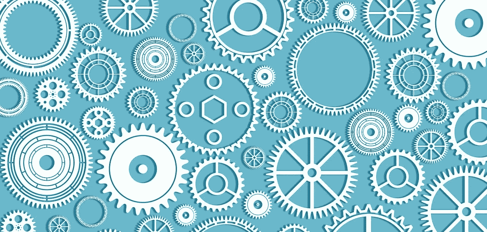

# 机器学习的特征工程(1/3)

> 原文：<https://towardsdatascience.com/feature-engineering-for-machine-learning-a80d3cdfede6>

## 第 1 部分:数据预处理

图片由来自[皮克斯拜](https://pixabay.com/)的[皮特·林福思](https://pixabay.com/users/thedigitalartist-202249/)拍摄

深度学习的时代已经普及了端到端的机器学习方法，其中原始数据进入管道的一端，预测从另一端出来。这无疑加速了某些领域中的模型推理，尤其是在计算机视觉管道中，例如，单次检测器的帧速率高于依赖区域建议然后进行对象检测的模型。复杂模型自动提取特征的能力使得牺牲计算资源以节省人力资源成为可能。

这种方法意味着机器学习实践者越来越多地通过模型而不是磨练他们的数据。但是，当轻松的收益被收获时，模型大小加倍只能勉强维持一点点的性能改进。这是手工制作功能可以获得更好回报的时候。

> “应用机器学习基本上是特征工程”
> 
> —吴恩达

在某种程度上，视觉数据的丰富性、高维性和丰富性使得自动化和手工制作的特征之间的权衡成为可能。当处理缺乏数据或特征不丰富的数据时，这种情况对于数据科学家来说太常见了，他们的任务是根据十几个特征做出预测，*特征工程*对于补充和梳理有限数据中存在的所有可用“信号”至关重要；以及克服流行的机器学习算法的限制，例如，基于乘法或除法特征交互来分离数据的困难。

在 Kaggle 竞赛中，最优秀的团队赢得比赛不仅仅是因为模型选择、集成和超参数调整，而是因为他们设计新功能的能力，有时看似无中生有，但更多时候是源于对数据的真正理解(带来领域知识)、辅助数据的补充，以及顽强、创造性(更像艺术而不是科学)但乏味的构建和测试新功能的试错工作。

在这个由多个部分组成的系列中，我们将讨论完整特征工程管道的三个部分:

1.  数据预处理
2.  特征生成
3.  特征选择

这三个步骤是按顺序执行的，但有时对于某项技术是构成数据预处理、特征提取还是生成会有歧义。但我们在这里并不拘泥于语义…相反，我们将专注于调查任何优秀的机器学习实践者和数据科学家可以在项目中运用的所有技术。

这一系列文章的目的是提高对这些有时被遗忘的问题的认识，特别是在深度学习和十亿参数模型的时代，这些技术要永远留在脑海中，并知道一些可以极大地方便其使用的库函数。描述每种技术的内部工作原理都需要一篇文章，其中很多可以在*走向数据科学*上找到。

# 1.数据预处理

## 1.1 数据清理

> “垃圾进，垃圾出。”

在 EDA 过程中，首先要做的一件事就是检查并移除**常量特性**。但模型肯定能自己发现这一点吗？是，也不是。考虑一个线性回归模型，其中非零权重已被初始化为常数特征。然后，这一项作为次要的“偏差”项，看起来没有什么害处…但是如果“常数”项只在我们的训练数据中是常数，并且(我们不知道)后来在我们的生产/测试数据中呈现不同的值，那么*就不是*了。

另一件需要注意的事情是**重复的特性**。当涉及分类数据时，这可能并不明显，因为它可能表现为不同的标签*名称*被分配给不同列中的相同属性，例如，一个特征使用“XYZ”来表示分类类，而另一个特征表示为“ABC”，这可能是由于列是从不同的数据库或部门中挑选出来的。`[pd.factorize()](https://pandas.pydata.org/docs/reference/api/pandas.factorize.html)`可以帮助识别两个特征是否同义。

接下来，**冗余的**和**高度相关的**特征。多重共线性会导致模型系数不稳定，并且对噪声高度敏感。除了对存储和计算成本的负面影响之外，当考虑权重正则化时，冗余特征削弱了其他特征的有效性，使得模型更容易受到噪声的影响。`[pd.DataFrame.corr()](https://pandas.pydata.org/docs/reference/api/pandas.DataFrame.corr.html)`可用于识别相关特征。

复制可能不仅发生在列之间，也可能发生在*行*之间。此类**样本复制**会导致训练期间的数据失衡和/或过度拟合。`[pd.DataFrame.duplicated()](https://pandas.pydata.org/docs/reference/api/pandas.DataFrame.duplicated.html)`将在第一次出现之后的每个重复行中返回一个具有真值的序列。

## 1.2 数据洗牌

区分预处理过程中的**洗牌和训练过程中的**很重要。

在预处理过程中，在将数据集分成训练/验证/测试子集之前，对其进行洗牌是非常重要的。对于小型或高度不平衡的数据集(例如，在异常、欺诈或疾病检测中)，利用`[sklearn.model_selection.train_test_split()](https://scikit-learn.org/stable/modules/generated/sklearn.model_selection.train_test_split.html)`的`stratify` on 功能确保您的少数目标在所有子集中的分布一致。`[pd.DataFrame.sample(frac=1.0)](https://pandas.pydata.org/docs/reference/api/pandas.DataFrame.sample.html)`可用于轻松洗牌。

对于训练，大多数 ML 框架将为您洗牌，但重要的是要了解它是在进行一次性洗牌，即仅在加载数据集时，还是在逐批的基础上继续这样做。后者对于获得最低的训练损失是优选的，但是会导致较慢的训练，因为小批量的数据不能被缓存并在下一个时期重新使用。

## 1.3 数据插补

这是个大话题！**缺失的特征**应仔细处理。

缺失的特征可能不会立即显现出来，所以仅仅使用`[pd.DataFrame.isna.sum(axis=0)](https://pandas.pydata.org/docs/reference/api/pandas.DataFrame.isna.html)`可能无法将它们全部显现出来。可以使用特殊(非空)字符串或数值(例如，“-”、0 或-999)来表示缺失字段。您正在使用的数据集可能已经由某人进行了预处理和预估算。幸运的是，**检测缺失特征**可以通过绘制每个特征的直方图来完成——异常的异常峰值表明使用了特殊值，而分布中间的峰值则表明已经进行了均值/中值插补。

**下一个问题是**如何估算缺失字段。最常见和最直接的方法是用*模式*(针对分类特征)、*均值*(针对没有大量异常值的数字特征)或*中值*(其中异常值明显扭曲均值)来替代缺失值。

即便如此，尤其是如果你认为这个特征很重要，不要盲目替换*整个*数据集的**均值/中值/众数**。举例来说，在*泰坦尼克号*的数据集中，几名乘客漏掉了他们的年龄。不要用船上所有乘客的平均年龄来估算所有这些乘客，我们可以通过认识到船上乘客等级之间的平均(和中值)年龄非常不同来得到更精确的估计。

表 1:按乘客等级和性别划分的乘客年龄中位数

事实上，由于该数据集中没有乘客性别的缺失值，因此您可以在输入时更进一步，根据 I .票价等级和 ii 替换年龄中位数。缺少年龄值的每个样本的性别。

对于一个时间序列，我们不应该使用均值/中位数替代来估算缺失样本，因为这总是会导致序列发生不切实际的突变。相反，使用**值重复**或插值进行估算。像中值滤波或低通零相位滤波这样的信号处理去噪方法也可以用来填充训练数据中的小间隙；但是请记住，*非因果*方法不能在生产过程中使用，除非模型的延迟输出是可接受的。

一种替代方案是根本不估算，而是添加二进制**标志**，以允许下游学习算法自行学习如何处理这种情况。这样做的缺点是，如果丢失的值分布在许多特征上，您可能必须添加更多这样的低信号特征。注意，XGBoost 开箱即用地处理`NaN` [，所以在使用它时不需要添加缺失数据列。一般来说，决策树可以通过将缺失值设置为决策节点可以轻松拆分的下/上限值，来处理缺失值的特殊值标签编码。](https://xgboost.readthedocs.io/en/stable/faq.html)

另一种流行的方法是运行 **k-NN** 来估算缺失值。使用**神经网络**进行插补是另一种流行的方法。例如，可以对自动编码器进行训练，以在输入丢失的情况下再现训练数据，一旦训练完成，其输出就可以用于预测丢失的特征值。然而，使用最大似然法学习插补可能很棘手，因为很难评估插补模型的超参数(例如 *k* 的值)如何影响最终模型的性能。

无论采用何种插补方法，只要有可能，在数据*插补*之前，始终在之前执行*特征生成*(在本系列的第二部分中讨论)**，因为这将允许更精确地计算生成的特征值，特别是在特殊值编码用于插补时。当生成新要素时，知道相关的要素值缺失就为特殊处理敞开了大门。**

## 1.4 特征编码

**序数特征**可能有整数值，但与数值特征不同的是，虽然序数服从传递比较关系，但不遵守减法或除法的算术规则。

有序特征，如星级，通常具有高度非线性的“真实”映射，对应于强双极分布。也就是说，4 星与 5 星评级之间的定量“差异”通常很小，远远小于 4 星与 2 星评级之间差异的一半，这会混淆线性模型。

因此，线性模型可能受益于序数值赋值的更线性的**重映射**，但是另一方面，基于树的模型能够本质上处理这种非线性。最好将序号编码保留为一个*单一*量化特征(即“列”)，而不是*虚拟化*，因为虚拟化*会降低*其他预测特征的信噪比(例如，当应用参数正则化时)。

对**分类特征**的处理取决于你的模型是否是基于树的。基于树的模型可以使用**标签编码**(即表示类成员的固定字符串或整数)，不需要进一步的预处理。非树方法要求分类特征是**一键编码**，这可以使用`[pd.get_dummies()](https://pandas.pydata.org/docs/reference/api/pandas.get_dummies.html)`或`[sklearn.preprocessing.OneHotEncoder()](http://sklearn.preprocessing.onehotencoder)`来执行。避免删除第一列(即不要指定`drop=’first’`)，除非你正在处理一个二进制类别(即使用`drop=’if_binary’`)，因为删除[产生的问题](https://inmachineswetrust.com/posts/drop-first-columns/)比它解决的问题还要多。

一键编码的替代方法是使用或补充**频率编码**。这包括计算对应于每个类别的目标变量的标准化频率。例如，如果该类别中 40%的样本导致目标值为 1，则将值 0.4 分配给二进制分类特征。当分类特征与目标值相关时，这样做是有帮助的。

编码分类特征的另一种方式是使用**分类嵌入**。这尤其适用于高基数分类要素，如邮政编码或产品。如同单词嵌入一样，这些嵌入使用密集的神经网络来学习。[结果分析](https://github.com/entron/entity-embedding-rossmann)表明这些连续嵌入对于聚类和可视化也是有意义的，同时减少过拟合。

处理分类特征的最后一点是，如果在验证/测试子集中遇到一个*看不见的*类别，该怎么办。在这种情况下，就像对待缺失特征一样对待它，或者将其指定为“未知”保留类别。

## 1.5 数字特征

**缩放**或**归一化**对于基于树的方法来说不是必需的，但是对于实现低训练损失、快速收敛以及为了使权重正则化正常工作来说是必不可少的。选择其中之一。

缩放`[sklearn.preprocessing.MinMaxScaler()](https://scikit-learn.org/stable/modules/generated/sklearn.preprocessing.MinMaxScaler.html)`速度很快，通常是图像数据所需的全部。然而，最小-最大缩放会受到异常值的显著影响(即使只有一个异常值！)或编码为正常特征范围之外的值的缺失值。

只要异常值的比例很小(即，如果异常值没有显著扭曲平均值和标准偏差)，归一化`[sklearn.preprocessing.StandardScaler()](https://scikit-learn.org/stable/modules/generated/sklearn.preprocessing.StandardScaler.html)`对异常值更稳健。

数字特征通常可以受益于**变换**。*对数*变换，`np.log(1 + x)`，是一种非常强的变换，当一个特征遵循*幂律*关系时，或者当离群值分布中存在长尾时，这种变换特别有用。*平方根*变换，`np.sqrt(x)`不太强，可以作为有用的中间变换来尝试。由于使用了 lambda 超参数， *Box-Cox* `[scipy.stats.boxcox()](https://docs.scipy.org/doc/scipy/reference/generated/scipy.stats.boxcox.html)`变换允许从线性传递函数平滑过渡到高度非线性传递函数，并且通常用于将*偏斜*分布(例如，作为年龄函数的 COVID 测试阳性率)转变为更加*正态的*分布，这是许多传统 ML 算法(如 NB、LogR 和 LinR)做出的基本假设。[注意:x > = 0 被假定用于所有上述变换]。

## 1.6 地理定位功能

基于树的方法有时可以受益于地理位置坐标上的**旋转变换**。例如，South-of-Market (SoMa)是旧金山的一个街区，与市场街接壤。然而，市场街不是南北走向或东西走向，而是西南-东北走向。因此，决策树将很难清晰地分割出这个邻域(当树的深度受限时，这是经常需要的)，因为树只能绘制与*轴平行的*分割线(即与经度轴或纬度轴平行)。执行旋转变换的困难在于选择旋转坐标的轴点，因为可能没有全局最优的轴点。

一种解决方案是执行笛卡尔坐标到极坐标 T2 的转换。例如，巴黎市被划分为几个区，这些区围绕市中心大致呈环形分布。或者，可以执行*聚类*，并创建新的分类特征来指示点属于哪个聚类，之后可以使用极坐标来编码每个点相对于其聚类质心/核的位置。

## 1.7 时间特征

数据集中的时间可能显示为 UTC/GMT 时间，而不是本地时间，即使所有事件都属于同一个(不同的)时区。即使时间戳以本地时间给出，对时间特征执行**时移**也可能是有益的。

例如，由于较高的需求和较低的供应，拼车费用往往在一天中“较晚”时(特别是 Fri/星期六/星期日)较高。然而，任何深夜狂欢者都知道，派对不会在午夜停止。由于时间的推移，模型很难辨别 00:30 是否“晚于”，甚至“接近”23:30。然而，如果执行时间转换，并且在一天中活动量最少的时间内发生棘手的 23:59H → 00:00H 回绕，那么线性模型将回归得更好，而基于树的模型将需要更少的分支级别。

## 1.8 文本

图片来自 [Pixabay](https://pixabay.com/) 的 [Gerd Altmann](https://pixabay.com/users/geralt-9301/)

可以说，文本是需要最多预处理的特性。我们从变换开始，变换有很多。

**小写**对于简单模型来说是必要的，它是文本标准化的最基本形式，有利于产生更强、更稳健的信号(由于出现的词频更高),同时减少词汇量。对于自带分词器的更高级的经过预训练的*语言模型* (LM)，最好让 LM 对*原始*文本进行分词，因为大写(例如用`[bert-base-cased](https://huggingface.co/bert-base-cased)`)可能有助于模型在*句子解析、命名实体识别(NER)* 和*词性*(词性)标注方面表现更好。

**词干**和**词汇化**提供了与小写相同的好处，但是更复杂，运行时间也更长。*词干*使用固定的规则来删减单词，这些规则不考虑单词在句子中的上下文和用法，例如`university`被删减为`univers`，但`universal`也是如此。*词汇化*考虑了*上下文*并需要使用大的 LMs，因此比词干化慢。然而，这要准确得多，例如，`university`和`universal`仍然是独立的词根。考虑到当今可用的计算资源, [Spacy](https://spacy.io/) 的作者认为准确性在生产中最重要，因此该库只支持词汇化。

**收缩扩展**是具有相同动机的另一种形式的文本规范化。这里`can’t`和`you’ll`扩展为`can not`和`you will`。简单的基于计数/频率的模型受益于这种标准化，但是像 Spacy 中的那些 LMs 通过使用*子词标记化* ( `can’t`被标记化为`ca`然后是`n’t`)来处理缩写。

**文本规范化**旨在将文本和符号转换为规范形式，以便模型可以更好地学习。他们转换缩写(如 BTW)、拼写错误(如' definately ')、音调符号(如 café/naive→café/naive)、表情符号(如<grin>|:-)|；) | 🙂→ `<SMILE>`，ROFL | LOL | LMAO |😆→ `<LAUGH>`)等。如果没有文本规范化，许多 NLP 模型将很难理解 Twitter 和社交媒体上的帖子！

接下来是**过滤**——停用词、标点符号、数字、多余的空格、表情符号(不执行情感分析时)、HTML 标签(例如< br >)、HTML 转义字符(例如'&amp；'，'&nbsp；')、网址、标签(例如#黑色星期五)和提及次数(例如@xyz)

最后的预处理步骤是**标记化**。简单的标记化可以使用 python 正则表达式来执行，但是 NLP 框架提供了用 C/C++或 Rust 编写的专用标记化器，性能更高。当使用预训练的 LM 时，例如来自拥抱脸的那些，使用与 LM 训练时使用的完全相同的记号赋予器(和权重)是至关重要的。

## 1.9 图像

随着 CNN 的流行，预处理图像现在不太常见。然而，在没有 GPU 的资源受限的硬件中，或者当需要高帧速率时，这些技术形成了传统计算机视觉处理流水线的基本功能。

**色彩空间转换**可以用简单的 CNN 提供轻微的性能提升。[例如，这项研究](https://arxiv.org/pdf/1902.00267.pdf)发现，将 CIFAR-10 数据集转换到 L*a*b 颜色空间可以提高大约 2%的分类精度，但同时使用多个颜色空间可以获得最佳结果。已经发现，具有分离的色度和亮度通道的色彩空间(例如 YUV)有助于图片彩色化和风格转换。我个人发现，为特定领域定制的专门颜色转换(例如，用于组织病理学的苏木精-伊红-DAB)对提高模型性能特别有帮助。

**直方图均衡**，尤其是自适应直方图均衡(如 CLAHE)，经常在医学成像上进行，以提高视觉对比度。当图像中的光照不均匀且区别特征相对于整个图像帧较小时，例如检测乳房 x 线照相图像中的癌组织时，这种方法特别有用。在视网膜眼底成像中，图像采集过程中图像质量的可变性很高，执行非均匀照明校正已被证明[可提高](https://www.ncbi.nlm.nih.gov/pmc/articles/PMC6113146/)分级精度。

传统的 CV 特征提取技术包括局部二元模式( **LBP** )、方向梯度直方图( **HOG** )和 **Gabor 滤波器**bank。在非 CNN 模型上成功使用这些特征提取器已经有很长的历史了。将这些较老的技术(例如[可学习的 Gabor 滤波器](https://arxiv.org/pdf/1904.13204.pdf))与标准卷积层相结合，可以在某些数据集(例如 D *ogs-vs-Cats* )上实现更快的收敛和更高的精度。

本系列关于特征工程的第一部分到此结束。在[第二部分](https://medium.com/@wpoon/feature-engineering-for-machine-learning-434c9b4912c6)中，我们将注意力转向*特征生成*，在这里我们将着眼于提取和合成全新的特征。这是艺术与科学真正相遇的地方，也是将卡格尔大师与新手区分开来的地方！