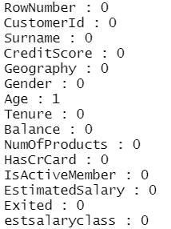

# R 语言中机器学习的特征工程

> 原文：<https://towardsdatascience.com/feature-engineering-for-machine-learning-in-r-2ed684727566>

## 从数据集中提取有价值信息的重要过程


[杆长](https://unsplash.com/@rodlong)在 [Unsplash](https://unsplash.com/photos/ldsCiYoExvk) 上拍照

> 本文是故事[掌握 R 编程基础](https://www.analyticsvidhya.com/blog/2021/10/master-the-basics-of-r-programming/)的续篇。在第一篇文章中，我介绍了 R 的构建模块，它将帮助你了解这门语言。理解和学习真的很直观。在这篇文章中，我将重点关注特征处理，它代表了任何数据科学项目的相关部分。如果没有干净的数据，任何机器学习模型的努力都将是徒劳的。让我们开始这段旅程吧！

## 目录:

1.  [**转换为因子**](#5d92)
2.  [**添加和删除列**](#91e1)
3.  [**从连续特征到分类特征**](#name="282d")
4.  [**查找缺失值**](#bec0)
5.  [**处理缺失值**](#0250)

# 要求

在之前的帖子里，我建议你同时安装 **R** 和 **R studio** 。R 是一门语言，而 R studio 是一个 IDE，允许以一种更简单的方式使用 R。

# 介绍

让我们从从 Kaggle 导入数据集[银行流失模型](https://www.kaggle.com/sanjanavoona1043/bank-churn/version/1)开始，并可视化前六行[1]。

```
df <- read.csv('Bank_churn_modelling.csv',header = T)
head(df)
```


作者插图

你能注意到的第一件事(如果你以前使用过 Python)是我们不需要导入任何库，很漂亮，不是吗？让我们尝试查看有关数据集的其他统计数据和信息:

```
 summary(df)
```


作者插图

`summary`是用于打印所有特性的描述性统计的功能。从输出来看，值得注意的是:

*   大多数变量被认为是数字。但是像 Excited 和 HasCrCard 这样的变量，范围在 0 到 1 之间。然后，要把这些特征转化为因子。
*   姓氏、地域、性别是性格变量。因此，输出会显示其他信息，包括样本数量(长度)、类的类型和模式。我们也应该把地理和性别转换成因素变量。

```
str(df)
```


作者插图

`str`提供了一个更紧凑的输出，总结了数据集的结构。它告诉我们有 1000 行和 14 列。大多数变量包含数值/整数值，而其余的特征是字符变量。

# 1.转换为因子

正如我们在上一段中看到的，我们必须进行更改，将一些变量转换为因子。你可能想知道是什么因素。在 R 语言中，因子是专门用于将元素分类的向量类型。换句话说，因素是分类变量，可以有两个或更多的层次。这些级别可以包含字符串和整数。

```
df$Geography <- as.factor(Geography)
df$Gender <- as.factor(Gender)
df$HasCrCard <- as.factor(HasCrCard)
df$IsActiveMember <- as.factor(IsActiveMember)
df$Exited <- as.factor(Exited)
str(df)
```


作者插图

如果我们再次使用`str`函数很好地转换了变量，我们可以很容易地检查。为了可视化因子的级别，我们可以使用 levels 函数:

```
levels(Geography)
# "France"  "Germany" "Spain"
```

该数据集仅包含法国、德国和西班牙的客户。

# 2.添加和删除列

添加新列的更简单的方法是给整个新变量分配一个值。例如，让我们创建一个用 NA 填充的新列，NA 是一个逻辑常数，表示 r 中缺少的值。

```
df$newcol <- NA
df[1:5,8:15]
```


作者插图

为了更容易可视化，我选择了数据集的一个子集，前 5 行和后 8 列。添加列的另一种方法是使用以下语法:

```
df['newcol'] <- NA
```

因此，我们可以在方括号中指定变量，而不是使用$运算符。要删除一个列，我们可以将其设置为 NULL，这表示 R:

```
df$newcol <- NULL
# alternative df['newcol'] <- NULL
head(df)
```


作者插图

我们打印了前五行以检查是否删除了该列。真的消失了！

# **3。将连续变量重新编码为分类变量**

假设我想基于 EstimatedSalary 的值创建一个新变量。目标是将估计工资的范围可视化为区间。这可以通过使用`cut`功能来实现:

```
df$estsalaryclass<-cut(df$EstimatedSalary,breaks = seq(0,max(df$EstimatedSalary)+1,len=4))
levels(df$estsalaryclass)
# [1] "(11.6,6.67e+04]"     "(6.67e+04,1.33e+05]" "(1.33e+05,2e+05]" 
```


作者插图

为了创建间隔，应用 seq 函数来创建三个不同的级别。它接受序列的起始值、结束值和长度作为输入。

我们还可以向指定参数标签的箱添加标签:

```
df$estsalaryclass<-cut(df$EstimatedSalary,breaks = seq(0,max(df$EstimatedSalary)+1,len=4),
                       labels = c('poor','middle','rich'))
levels(df$estsalaryclass)
# [1] "poor"   "middle" "rich"
df[1:5,c('EstimatedSalary','estsalaryclass')]
```


作者插图

从图中，您可以推断出因子级别的名称是在指定界限后创建的。

我们还可以注意到，默认情况下，*间隔在左边打开，在右边*关闭。这意味着只有较高的值包含在界限中，而最低的值被排除。

如果我们希望区间在左边关闭，在右边打开，我们需要将参数 right 设置为 FALSE:

```
df$estsalaryclass<-cut(df$EstimatedSalary,breaks = seq(0,max(df$EstimatedSalary)+1,len=4),right = FALSE)
levels(df$estsalaryclass)
[1] "[11.6,6.67e+04)"     "[6.67e+04,1.33e+05)" "[1.33e+05,2e+05)"
```


作者插图

# 4.查找缺少的值

r 语言提供了`is.na`函数来检查数据集中是否有缺失值。要计算数据集的缺失值，我们可以对它们求和:

```
sum(is.na(df))
# [1] 0
```

由于数据框不包含缺失值，我们可以手动添加它作为练习:

```
df[5,'Age'] = NA
sum(is.na(df))
# [1] 1
```

你大概在想`is.na`功能到底在做什么？让我们打印这个函数的输出:

```
head(is.na(df))
```


作者插图

它返回一个包含表示缺失值的布尔值的数据框，其中 TRUE 表示我们有一个 NA 值。要返回每列缺失值的数量，我们可以使用`for`和`cat`函数:

```
for (i in 1:length(df))
{cat(c(colnames(df[i]),':',sum(is.na(df[,i])),"\n"))}
```



作者插图

`for`用于迭代列，而`cat`用于打印输出。在这种情况下，cat 函数更适合打印，因为它允许在同一行显示多个值。从输出中，我们可以很容易地看到，只有年龄列中缺少一个值。

为了显示包含 NA 值的列的行索引，我们可以使用`which`函数:

```
which(is.na(df[,'Age']))
#[1] 5
```

该函数给出逻辑向量中真实元素的**位置。出于这个原因，我们只指定列向量作为输入，而不是整个数据帧。**

# 5.处理缺失值

处理缺失值的更简单的方法是删除包含 NA 值的行:

```
df_notna<-na.omit(df)
sum(is.na(df_notna))
# [1] 0
```

`na.omit`轻松删除有 NA 的行，返回一个没有丢失值的数据帧。

但是删除丢失的值并不总是最好的解决方案。另一种方法是用列的平均值代替 NA 值:

```
avg_age <- round(mean(df$Age,na.rm=TRUE))
df$Age<-ifelse(is.na(df$Age),avg_age,df$Age)
```


作者插图

`ifelse(test,yes,no)`返回一个与年龄变量形状相同的向量。如果测试的条件为真，则该列的值将被年龄的平均值替换。否则，返回值将与作为输入的列中的值相同。

# 摘要

*   `str`和`summary`用于可视化关于数据帧的信息
*   `print`和`cat`都有助于显示输出。
*   `as.factor`用于将变量转换成因子
*   `cut`通过将特征范围划分为区间，将连续变量转换为分类变量
*   `is.na`返回包含布尔值的数据帧，其中 TRUE 表示单元格中存在 NA
*   `which`显示矢量中包含的真实元素的位置
*   `na.omit`删除数据帧中带有 NA 的行
*   `ifelse(test,yes,no)`是一种更简洁、更快速的 if-else 语句。

# 最终想法:

我希望这篇教程对你有用。我发现有必要写这篇文章，因为没有很多资源讨论 r 的特性工程。我没有涵盖所有的方面，因为我将在接下来的文章中涵盖其余的方面。感谢阅读！祝你有愉快的一天。

**参考文献:**

[1][https://www . ka ggle . com/sanjanavoona 1043/bank-churn/version/1](https://www.kaggle.com/sanjanavoona1043/bank-churn/version/1)

你喜欢我的文章吗？ [*成为会员*](https://eugenia-anello.medium.com/membership) *每天无限获取数据科学新帖！这是一种间接的支持我的方式，不会给你带来任何额外的费用。如果您已经是会员，* [*订阅*](https://eugenia-anello.medium.com/subscribe) *每当我发布新的数据科学和 python 指南时，您都会收到电子邮件！*