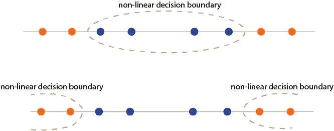
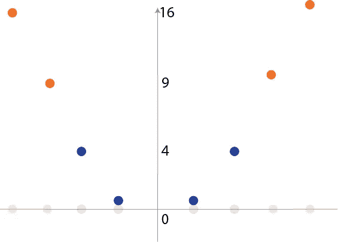
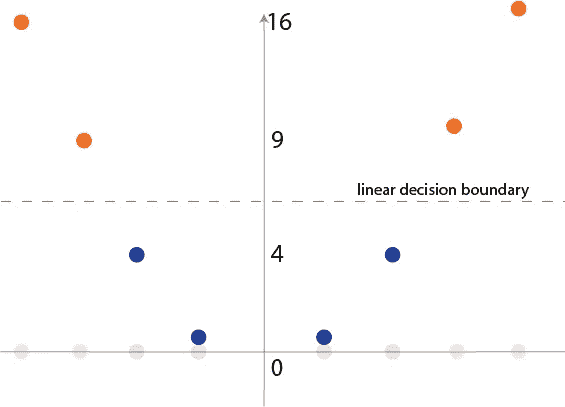

# 特征工程——揭开神秘面纱

> 原文：<https://towardsdatascience.com/feature-engineering-unraveling-the-mystery-768e15e72dac>

## 数据科学|机器学习|特征工程

## 什么是特征工程，它解决的问题，为什么它真的很重要

理论上或实际上，我们都在机器学习和人工智能领域遇到过“特征工程”这个术语。特征工程被认为是应用机器学习成功的关键。"*想出新功能既困难又耗时，而且需要专业知识。* ***应用机器学习*** *基本上就是特色工程*"--(吴恩达)。在本文中，您将发现什么是特性工程，它解决什么问题，以及为什么它真的很重要。

你有一些数据，有了这些数据，你就训练了一个模型。您看到了结果，并意识到需要做更多的工作来提高模型性能。您可以尝试收集更多数据，也可以花时间调整模型。然而，您并不总是有收集更多数据的奢侈，因此第三种方法是修改可用的特征以更好地捕捉隐藏的模式。特征工程帮助您从数据中获取最大价值，并从算法中获得最佳结果。您获得的结果可能是数据集中的要素和您选择的算法的直接结果。您选择的功能也会影响算法的选择。

**更好的特性意味着更简单的算法和更好的结果。**

为了理解这种说法，我们来看一个简单的例子。假设你有一个变量 x1，在 x 轴上有两个类，蓝色和橙色。

作者创造的形象

你能使用逻辑回归来区分类别吗？一条线或一个平面无法将这两个类别分开，因此这里不能使用逻辑回归。您可能需要创建一个非线性决策边界来分隔这两个类。可能的选项如下所示。

作者创造的形象

现在，使用特征工程，如果您创建一个只是原始值的平方的新特征，您的新特征空间将如下所示:

作者创造的形象

给定 X1 中的一个值，其在 X2 的变换值就是该数的平方。-4 变成 16，-3 变成 9，2 的平方是 4，等等。穿过转换后的数据点绘制的线现在是一个超平面，，它可以将两个类分开。最后，我们可以对这些新数据进行逻辑回归。

作者创造的形象

因此，在更高的维度中，特征工程可以帮助你从使用深度神经网络到仅使用逻辑回归模型。这样做的好处不仅是改善了结果，而且产出可以解释和说明。

特征工程是一门艺术。数据是非线性的，每次都不同，对特征工程的掌握来自实践。不能简单地通过基本算术运算生成新要素。例如，如果您有像“重量”这样的特征，您不能简单地平方这些值来生成新的特征“重量平方”。新功能“重量平方”必须有一些商业意义。然而，如果你有体重和身高等特征，你可以创建一个新的特征身体质量指数，如果这有助于你的研究。

感谢您的阅读。如果您还有其他问题，请通过 LinkedIn 联系

<https://swapnilin.github.io/> 