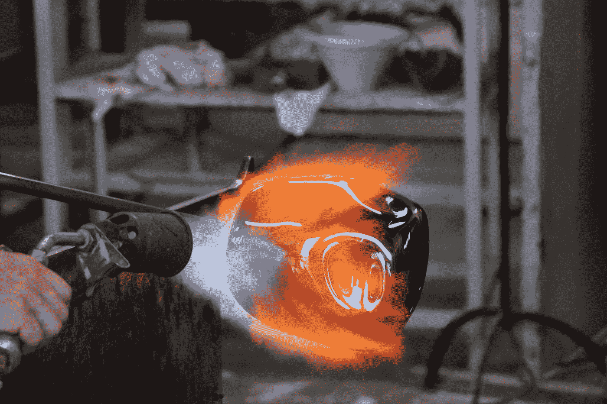
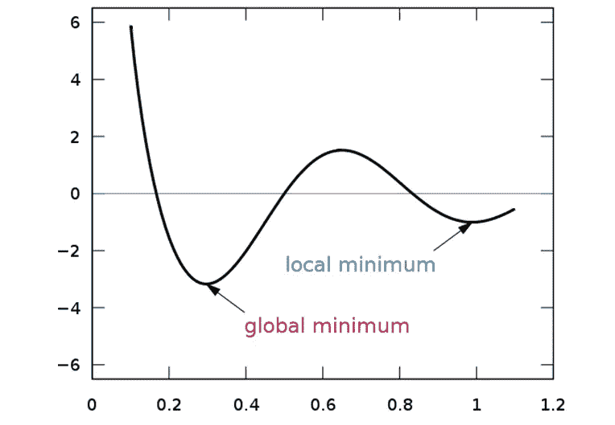
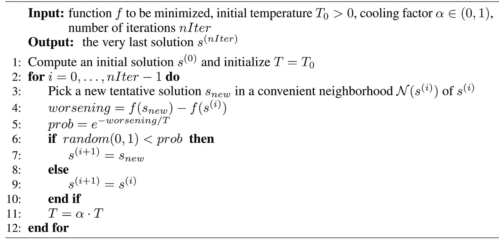
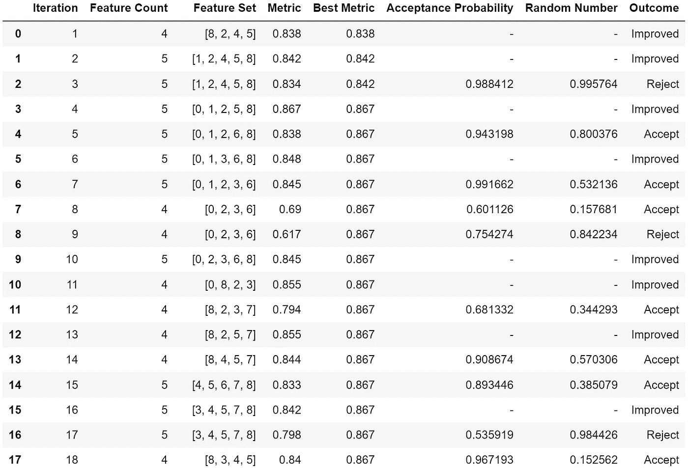

# Python 中模拟退火的特征选择，解释清楚

> 原文：<https://towardsdatascience.com/feature-selection-with-simulated-annealing-in-python-clearly-explained-1808db14f8fa>

## 为机器学习选择最佳特征的全局搜索算法的概念和实现

约翰尼斯 W 在 [Unsplash](https://unsplash.com/s/photos/hot-glass?utm_source=unsplash&utm_medium=referral&utm_content=creditCopyText) 上的照片

特征选择在机器学习中至关重要，因为它通过只保留最相关的预测器来提高计算效率和预测性能。

除了过滤器和包装器方法等流行的特征选择类之外，模拟退火等全局搜索方法是我们可以使用的强大技术。

这个简单的一步一步的指南深入研究了模拟退火特性选择的理论和应用。

## 内容

> ***1)*** [*什么是退火？*](#357f)***2)***[*门外汉对模拟退火的解释*](#216d)***3)****[*利弊***对模拟退火进行特征选择**](#1120)*

**你可以在这里 找到这个项目 [**的 GitHub 回购。**](https://github.com/kennethleungty/Simulated-Annealing-Feature-Selection)**

# **(1)什么是退火？**

**术语“退火”来自材料科学领域。这是一个过程，其中金属或玻璃等材料被加热并保持在高温，然后以受控方式缓慢冷却。**

**退火的目的是将有利的**物理特性**(例如延展性)引入材料，以便更顺利地进行下游制造。**

**热量导致材料中原子的随机重排，这消除了内部的弱连接和残余应力。**

**随后的冷却使材料凝固，并确保所需的物理性能。**

****

**克莱门特·菲利普在 [Unsplash](https://unsplash.com?utm_source=medium&utm_medium=referral) 上拍摄的照片**

# **(2)模拟退火的外行解释**

**那么这个看似不相关的物理退火是如何与特征选择联系起来的呢？你会惊奇地发现模拟退火是一种模仿退火工作方式的全局搜索方法。**

**在特征选择的上下文中，模拟退火在许多可能的子集组合中找到给出最佳预测模型性能**的** **特征**的**子集**。**

**这种想法就像物理退火旨在为材料产生高性能的物理特性。**

**为了想象模拟退火与物理退火的关系，我们可以想象以下比较:**

*   **一个物质粒子→一个特征**
*   **材料本身→全套功能**
*   **粒子排列的当前状态→选定的特征子集**
*   **材料物理特性的变化→模型性能的变化**

**模拟退火中重复的“加热”和“冷却”阶段有助于我们找到最佳的全局特征子集。**

**以下是加热和冷却阶段在算法中的含义:**

*   ****加热**:随机改变特征子集，评估模型性能的变化，并设置接受较差性能子集而非较好子集的高概率。这个阶段被认为是'**勘探**'。**
*   ****降温**:逐渐降低保留不良子集的概率，使高性能子集保留的可能性越来越大。这个阶段被认为是'**开采**'。**

**基本原理是初始加热让算法自由地**探索**搜索空间。随着冷却开始，算法被激励去利用 T21，并聚焦于全局最佳特征子集。**

# ***(3)用于特征选择的模拟退火的利弊***

## **赞成的意见**

**在三种常见的特征选择类(即内在、过滤器、包装器)中，包装器方法非常流行，因为它们比其他两种方法搜索更广泛的特征子集。然而，缺点是这些包装器方法是**贪婪的**方法。**

**贪婪的方法选择搜索路径，以可能的长期收益为代价，追求每一步的**最佳**即时收益。结果是搜索可能陷入局部最优。**

****

**在[维基共享许可](https://commons.wikimedia.org/wiki/File:Extrema_example.svg)下使用的全球和本地最小|图像插图**

**相反，模拟退火是一种概率全局优化方法，采用由算法中赋予的随机性驱动的**非贪婪**方法。**

**非贪婪方法可以重新评估以前的子集，如果从长远来看似乎有潜在的好处，则朝着最初不利的方向前进。**

**因此，模拟退火具有更强的能力来摆脱局部最优并找到特征的全局最佳子集。**

**此外，它的非贪婪本质创造了捕获关键特征交互的更高概率，特别是如果这些交互只有在特征在子集中同时出现时才是重要的。**

## **骗局**

**一个缺点是模拟退火是计算密集型的，你将在后面的算法细节中看到。**

**因此，最好首先利用领域知识来缩小整个特性集的范围。对于较小的特征集，使用模拟退火进行进一步的特征选择变得更加有效。**

**另一个缺点是有许多算法参数需要调整，这可能是一个挑战。**

# ****(4)算法细节****

***注:您可以参考本*[***GitHub repo***](https://github.com/kennethleungty/Simulated-Annealing-Feature-Selection)*中该演示的代码和数据。***

## **(一)概述**

**为了让算法更容易理解，我们把它一步步分解，并配以实例。**

**为了将算法情境化，我们将在 [**【泰坦尼克】**](https://www.kaggle.com/competitions/titanic) 数据集上使用[随机森林](https://scikit-learn.org/stable/modules/generated/sklearn.ensemble.RandomForestClassifier.html)模型构建一个**二元分类器**(以预测乘客存活率)并将 [ROC-AUC 分数](https://scikit-learn.org/stable/modules/generated/sklearn.metrics.roc_auc_score.html)作为性能度量。**

**预处理后的训练数据共有**九个**预测器特征和一个二元目标变量(`**Survived**`)。**

****

**预处理过的泰坦尼克号数据集样本|作者提供的图片**

****步骤 1 —** 生成特征的随机初始子集，以形成当前状态。这个步骤可以通过随机选择 50%的原始特征来任意完成。**

**例如，假设我们最初的四个特征的**随机**子集是`**Pclass**`、`**Age**`、`**Parch**`和`**Title**`。**

****

**绿框所示的初始特征子集|作者图片**

****步骤 2 —** 指定要运行的**迭代**的最大次数。这个数字是一个可调参数，但是为了简单起见，我们可以从一个整数(例如 50)开始。**

****步骤 3 —** 评估当前子集的模型性能，以获得初始性能指标。对于这种情况，我们在过滤到当前 4 特征子集(`**Pclass**`、`**Age**`、`**Parch**`、`**Title**`)的数据上训练随机森林分类器，并检索交叉验证的 AUC 分数。**

***以下步骤(* ***步骤 4 至 7*** *)代表* ***单次迭代*** *。要运行的最大迭代次数已经在步骤 2 中定义了。***

****

**模拟退火中的单次迭代流程图(**步骤 4 至步骤 7** )**

****步骤 4 —** 随机改变**当前子集**中的特征列表，通过添加、替换或删除一个特征来生成一个新的**子集** **。****

**例如，一个随机的改变产生了一个新的 5 特征子集，现在包括了`**FamilySize**`。**

****

**下一次迭代的新特征子集。添加的新功能由蓝框表示|图片由作者提供**

***注意:如果一个子集之前已经被访问过，我们重复此步骤，直到生成一个新的未被访问的子集。***

****步骤 5 —** 在**新子集**上运行模型，并且**将**性能指标(即 AUC 分数)与**当前子集进行比较。****

****步骤 6 —** 如果**新子集性能****更好，接受并更新新子集为当前状态，结束迭代。如果性能**比**差，继续步骤 7。****

******步骤 7 —** 通过首先计算一个**接受概率**来评估是否接受表现最差的新子集(更多细节在后面)。接下来，在范围[0，1]内统一生成一个**随机数****。******

******如果**随机数大于接受概率**，则**拒绝新子集**并保留当前子集。否则，接受并更新新的子集作为当前状态。******

************

******一个迭代的例子，其中新子集具有更差的性能，但仍然被接受并更新为当前状态，因为随机数比接受概率小******

******在每次迭代结束时，接受概率被调整以建立一个“冷却”计划。让我们看看这是如何工作的。******

## ******㈡接受概率******

******我们之前(在步骤 7 中)看到了如何使用**接受概率**来决定是否接受一个性能更差的新子集(从而做出**非改进移动**)。******

******接受概率计算如下:******

************

******接受概率公式|作者图片******

*   *********E*** 术语指的是性能指标，即 AUC 分数。 **E** *new* 是来自在新子集上训练的模型的交叉验证的 AUC 分数，而 **E** *current* 基于当前子集。这两项之间的差异给出了模型性能的变化。******
*   *********T* ᵢ** 代表迭代 ***i*** 时的**温度**。虽然初始温度( **Tₒ** )是可调的，但我们可以先将其设置为默认的高(最大)值 **1** 来启动加热阶段。******
*   ******随着算法的进行，温度应该冷却并从初始的 **Tₒ** 降低。一个流行的策略是**几何缩减，**在每次迭代后，温度由冷却因子 **alpha (α)** 缩放。由于 **α** 的典型范围在 0.95 和 0.99 之间，因此 **α** 值可以默认设置为 **0.95** 。******

************

******几何缩减计划的温度更新公式，其中 alpha 是介于 0 和 1 之间的因子值|图片由作者提供******

******以下是参数如何影响接受概率:******

*   ********随着温度降低，接受概率降低**。这意味着随机数大于接受概率的可能性更大。这意味着我们更有可能拒绝表现不佳的新子集。******

************

******随着温度降低，接受概率降低|图片由作者提供******

*   ********随着新子集模型性能恶化**到更大程度(即**E**当前与**E**新之间的差异更大)，则**接受概率降低**。同样，这意味着我们更有可能**拒绝**表现不佳的新子集。******

************

******随着(**E**当前 — **E** 新)的增加，接受概率降低|图片由作者提供******

******从高温到低温的受控降低使得差的解决方案在搜索的早期具有更高的被接受的概率，但是稍后更有可能被拒绝。******

## ******(三)终止条件******

******包含**终止条件**(又名**停止标准** ) 也是有帮助的，这样算法就不会不必要地迭代。******

******终止条件的一些例子包括:******

*   ******达到可接受的性能阈值******
*   ******达到特定的最终温度(例如 **T=0.01** )******
*   ******达到预定数量的连续迭代而性能没有提高******

## ******(四)算法伪代码******

******在线搜索模拟退火将会产生许多代表该算法的令人生畏的伪代码。这里有一个例子:******

************

******模拟退火算法的伪代码示例******

******有了前面几节的解释，不管使用什么符号和缩写，你现在都可以很好地欣赏和理解这些代码。******

# ******(5) Python 的实现******

******理论概念建立后，让我们看看如何将模拟退火付诸实践。******

******下面是用 Python 实现该算法的代码。你也可以在这里查看完整的 Python 脚本。******

******上面的函数`**train_model**`使用三重交叉验证运行随机森林分类器，以获得 AUC 分数。******

*******随意查看* [*本笔记本*](https://github.com/kennethleungty/Simulated-Annealing-Feature-Selection/blob/main/notebooks/02_Simulated_Annealing_Actual_Run.ipynb) *查看完整输出。*******

******在 Titanic 数据集上运行模拟退火函数后，我们获得了如下结果:******

************

******我们可以观察到最好的 AUC 得分是 **0.867** ，对应**迭代 4** ，特征集为【0，1，2，5，8】。当索引被映射到列名时，五个特征是`**Pclass**`、`**Sex**`、`**Age**`、`**Fare**`和`**Title**`。******

******需要注意的是，这种实现假设较高的度量分数与较好的性能相关(例如，AUC、准确性)。然而，如果我们使用像 RMSE 这样的指标，分数越低越好，那么不等式符号需要相应地反转，例如，`metric **<** prev_metric`而不是`metric **>** prev_metric`。******

# ******(6)包装******

******到目前为止，我们已经介绍了 Python 中用于特征选择的模拟退火的概念和基本实现。******

******你会很高兴地知道，先进的实现是可用的，使算法更健壮。******

******一个例子是**重启**的概念，其中如果在 *n 次*迭代后没有找到新的最优解，则搜索重置为最后已知的最优解。它的目的是提供一个额外的保护层，防止搜索停留在性能不佳的局部最优解。******

******这个项目的 GitHub repo 可以在 这里找到 [**，还有**](https://github.com/kennethleungty/Simulated-Annealing-Feature-Selection)**[的引用](https://github.com/kennethleungty/Simulated-Annealing-Feature-Selection#References)。一如既往，期待您对这个话题的反馈！********

# ******在你走之前******

******欢迎您来到**加入我的数据科学学习之旅！**点击此 [Medium](https://kennethleungty.medium.com/) 页面，查看我的 [GitHub](https://github.com/kennethleungty) ，了解更多精彩的数据科学内容。与此同时，运行模拟退火进行特征选择也很有趣！******

******   ******