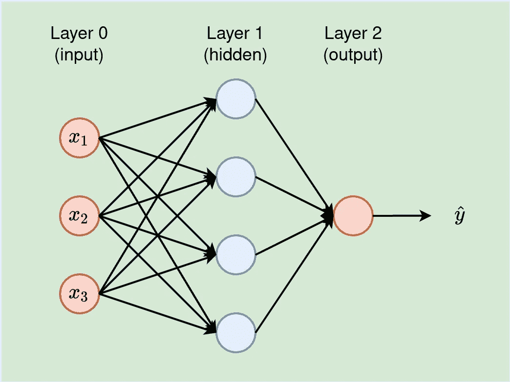
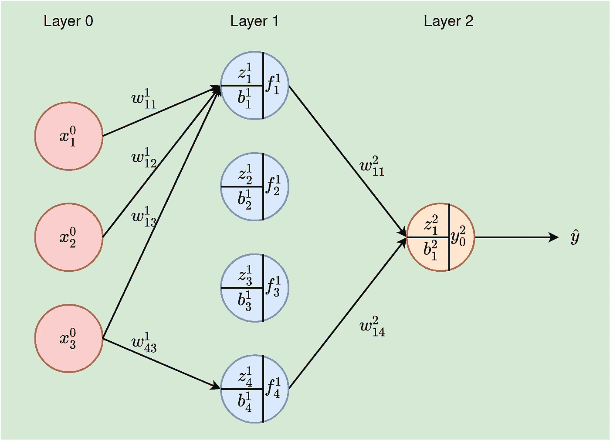
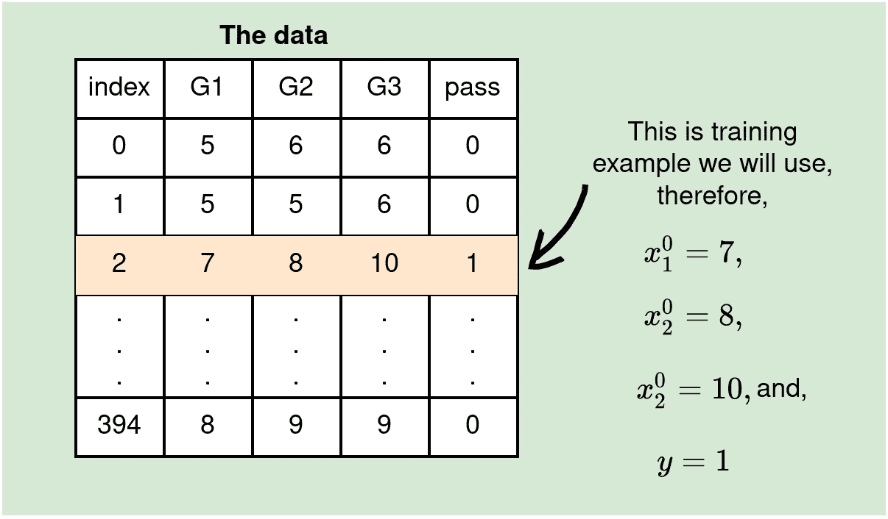
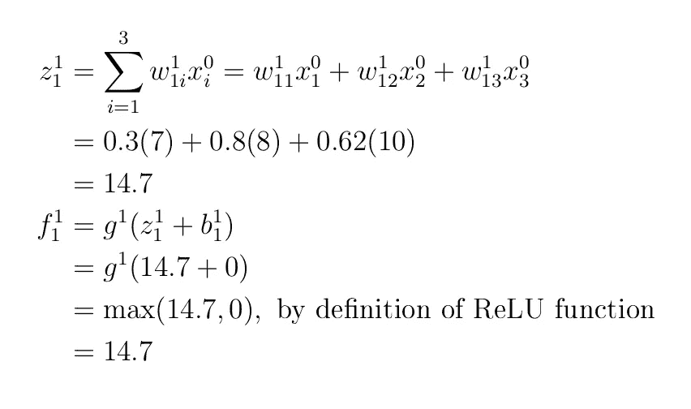

# 神经网络如何工作—实例(神经网络系列)—第 2 部分

> 原文：<https://towardsdatascience.com/feed-forward-neural-network-with-example-neural-network-series-part-2-eeca7a081ef5>

本文将构建到本系列的前一部分。我们将涵盖前馈神经网络(FF-NN)，集中讨论神经网络所做的计算。

本系列的前一部分:[神经网络的基础知识(神经网络系列)——第一部分](/the-basics-of-neural-networks-neural-network-series-part-1-4419e343b2b)

 [## 神经网络基础(神经网络系列)——第一部分

### 神经网络

(神经网络系列)——第一部分神经 Networkstowardsdatascience.com](/the-basics-of-neural-networks-neural-network-series-part-1-4419e343b2b) 

# 神经网络设计(概述)

神经网络是由许多层叠的神经元组成的系统。第一层，输入层(我们称之为第 0 层)除了传递输入值之外不执行任何计算。因此，在计算神经网络的层数时，我们忽略输入层。因此，下面的图 1 是一个两层网络。

输出层计算网络的最终输出。输入层和输出层之间的层称为隐藏层。下面图 1 中的神经网络被描述为 3–4–1 网络，输入层有 3 个单元，输入层有 4 个单元，输出值为 1。

神经网络的层数决定了网络的深度。基于此，具有多个隐含层的神经网络被称为深度神经网络。

通过层数和每层中神经元的数量来解释神经网络的设计，通常被称为神经网络的**架构。我们在本系列中交替使用这些术语(神经网络设计和神经网络架构)。**

图 1:一个有 3 个输入特征的神经网络，一个有 4 个节点的隐藏层，一个单值输出。节点是密集连接的——每个节点都连接到上一层的所有神经元。每个连接都有权重，表示任意两个节点之间的连接强度(来源:作者)。

# 前馈神经网络

前馈网络，也称为前向传递，逼近某个函数
y=f( **x** |θ)的输入值 **x** 和已知输出 y。网络学习θ中最逼近函数 f 的参数，以建立良好的映射ŷ=f( **x** |θ)。ŷ是一个预测的模型。在 NN 中， **w** ，**b**∈θ——也就是我们在模型训练时优化的参数是 2 个权重( **w** )和偏差( **b** )。

**前馈神经网络的关键特征** —前馈网络只允许信息单向流动(无反馈回路或连接)。

**定义:多层感知器(MLP)** MLP 是前馈 NN 的特例。在 MLP 中，所有节点都是密集连接的，也就是说，每个神经元/节点都连接到上一层的所有节点。事实上，图 1 中的神经网络是一个多层感知器。

# 前馈神经网络(FF-NN)-示例

本节将展示如何执行由 FF-NN 完成的计算。本节要掌握的基本概念是描述不同参数和变量的符号，以及实际计算是如何进行的。我们将使用图 1 所示的神经网络结构。

## 1.建筑和符号

让我们重新绘制图 1，以显示神经网络的基本变量和参数。注意，在这个图中(下面的图 2)，节点之间的其他连接被删除了，只是为了使图不那么混乱；否则，这个神经网络是一个多层感知器(任何两个相邻层中的所有节点都是互连的)。

图 2:带有变量和参数的 3–4–1 神经网络我们需要在给定输入值的情况下计算输出ŷ(来源:作者)。

其中:

*   x⁰ᵢ-iᵗʰ输入值。输入层(层 0)的特征 I 的值，
*   wˡⱼᵢ —权重来自第 l-1 层的神经元 I 到当前第 l 层的神经元 j，
*   fˡⱼ —层 l 中单元 j 的输出。这成为下一层(层 l+1)中单元的输入，
*   第一层中 jᵗʰ神经元的 zˡⱼ加权输入，
*   bˡⱼ**——l 层 jᵗʰ神经元上的偏置，**
*   **nˡ——第一层神经元的数量，**
*   **f **ˡ** ⱼ**
*   ****l —给定的层。对于，l =0，1，…，L。在我们的例子中，神经网络为 2 层，因此 L=2(记得我们说过不计算输入层)****

****以下是一些解释参数和变量的示例:****

*   ****x⁰₂ —第二个输入值，****
*   ****w₄₃——从第 0 层中的神经元 3 到第 1 层中的神经元 4 的连接的权重，****
*   ****z ₃ —第 1 层中单元 3 的加权输入，****
*   ****g(z₃)-在 z ₃.上应用激活函数 g****
*   ****每层中的单元数-输入层为 3 个单元(n⁰=3)，隐藏层有 4 个单元(n =4)，最后一层为一个神经元(n =1)，以及****
*   ****b .₁——第 2 层(本例中为输出层)中神经元 1 的偏置。****

## ****2.数据****

****我们将在本例中使用的数据包含 **3 个特征 G1、G2 和 G2** (顺便说一下，这就是我们在架构的输入层选择 3 个神经元的原因)**目标为通过**(我们称之为`y`)，分别为 0 或 1，表示失败和通过。这意味着我们正在处理一个二元分类问题。****

****[原始数据](https://github.com/kipronokoech/MediumDotCom/blob/main/data/student-mat-pass-or-fail.csv)包含 30 个特征和 395 行(数据点)，但是我们将只使用 3 个特征来有效地显示必要的计算。我们将在本系列的后面处理整个数据集。****

****同样，为了使概念易于理解，我们将展示如何在单次正向传递中通过网络传递单个数据点(训练示例)。****

********

****在我们的示例中，我们将考虑索引 2 处的训练示例(来源:作者)。****

## ****3.参数初始化****

****我们将用 0 到 1 之间的值随机初始化权重，而 bias 将总是用 0 初始化。我们将在后面的系列文章中对此进行更多的讨论，请记住，权重最好初始化为 0–1，而不是零，偏差最好在开始时保持为 0。****

## ****4.隐含层神经元的计算****

****对于隐藏层中的第一个神经元，我们需要计算 f ₁，这意味着我们需要三个权重 w ₁₁、w ₁₂和 w ₁₃.的初始值****

****让我们初始化他们如下 w ₁₁=0.3，w ₁₂=0.8 和 w ₁₃=0.62.如前所述，我们将设置偏差，b ₁=0.让我们引入一个称为整流线性单位(ReLU)的激活函数，我们将使用它作为函数 g(这只是一个任意的选择)。如前所述，我们将在后面讨论更多关于激活函数的内容，但是现在，我们可以定义 ReLU 并使用它。****

********

****ReLU 激活功能。****

****因此，****

********

****对层=1 的第一个神经元的计算。****

****你可以用同样的方法计算 f ₂，f ₃和 f ₄，假设****

*   ****w·₂₁=0.9，w·₂₂=0.1，w·₂₃=0.1 和 b·₂=0，计算 f·₂，****
*   ****w·₃₁=0.7、w·₃₂=0.2、w·₃₃=0.4 和 b·₃=0，用于 f·₃的计算，****
*   ****w·₄₁=0.01，w·₄₂=0.5，w·₄₃=0.2 和 b·₄=0，计算 f·₄.****

****确认₂=8.1，₃=10.5 和₄=6.07.****

## ****5.最后一层的计算****

****在最后一层，让我们初始化参数(权重)和偏差:w ₁₁=0.58，w ₁₂=0.1，w ₁₃=0.1，w ₁₄=0.42，和 b ₁=0.****

****关于该层中的激活函数-由于我们正在处理二元分类，我们可以使用 sigmoid/logistic 函数，因为该函数输出 0 到 1 之间的值，因此可以解释为类的预测概率。Sigmoid 函数定义为:****

********

****Sigmoid 函数****

****因此，****

********

****网络最后一层的计算。****

****由于最后一层的输出是由 Sigmoid 生成的(范围从 0 到 1)，所以结果可以解释为一个概率。y ₀=0.999997502 意味着通过的可能性几乎是 1。从数据来看，真值为 1，意味着正向传递使预测正确。然而，这不仅仅是一个巧合，因为没有训练。权重是随机生成的，所有偏差值都设置为 0。****

****我希望这篇文章为理解神经网络中发生的计算打下良好的基础。这是对系列文章上一篇文章[的补充。本系列的下一篇文章](/the-basics-of-neural-networks-neural-network-series-part-1-4419e343b2b)[在这里](/how-neural-networks-actually-work-python-implementation-simplified-a1167b4f54fe) **。******

****请[以每月 5 美元的价格注册 medium 会员资格](https://medium.com/@kiprono_65591/membership)，以便能够阅读我和其他作者在 medium 上的所有文章。****

****你也可以[订阅，以便在我发表文章时将我的文章发送到你的邮箱](https://medium.com/subscribe/@kiprono_65591)。****

****感谢您的阅读，欢迎下次光临！！！****