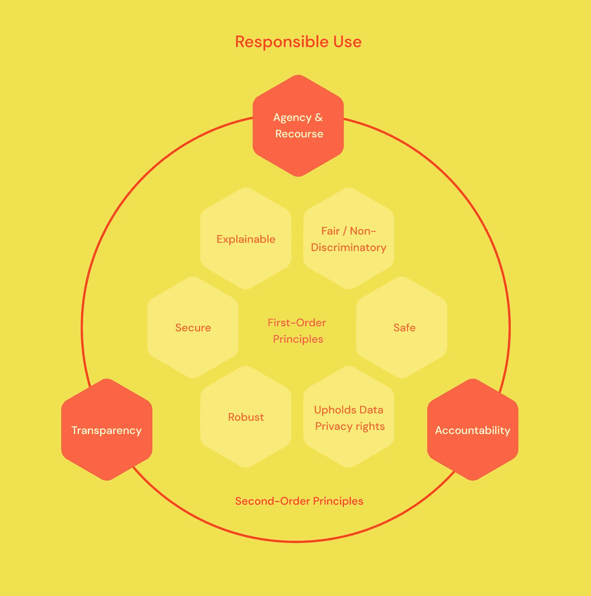
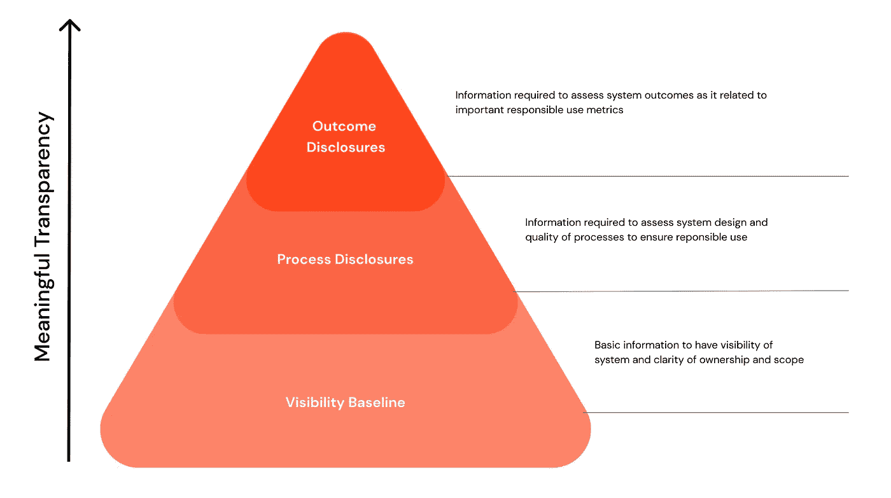

# 反击算法不透明

> 原文：<https://towardsdatascience.com/fighting-back-on-algorithmic-opacity-30a0c13f0224>

## 责任人工智能系列

## 对提高算法决策系统透明度的现有工具和政策的回顾

来源:作者图片

算法系统被不透明性所困扰，并且通常只有在它们的危害出现后才会被公众看到。

让我们举两个不透明的高风险算法系统的突出例子。

在荷兰，一个名为 [SyRI](https://www.rechtspraak.nl/Organisatie-en-contact/Organisatie/Rechtbanken/Rechtbank-Den-Haag/Nieuws/Paginas/SyRI-legislation-in-breach-of-European-Convention-on-Human-Rights.aspx) 的黑箱算法系统被用来检测福利欺诈。该系统被发现有[严重的种族偏见](https://www.amnesty.org/en/latest/news/2021/10/xenophobic-machines-dutch-child-benefit-scandal/)，并且[在检测欺诈](https://algorithmwatch.org/en/syri-netherlands-algorithm/)方面无效。该系统的部署[给被错误标记为](https://www.vice.com/en/article/jgq35d/how-a-discriminatory-algorithm-wrongly-accused-thousands-of-families-of-fraud)欺诈的家庭造成了严重伤害。低收入家庭被迫偿还他们不欠的钱，导致驱逐和负债。活动家和记者多年来游说让叙利亚退休，这最终被发现是非法的，因为它不符合欧洲人权公约规定的隐私权。

在美国，一种名为 [COMPAS](https://en.wikipedia.org/wiki/COMPAS_(software)) 的累犯预测算法被法院用来评估被告成为累犯的可能性，从而影响监禁判决和保释金额。一篇[里程碑式的调查文章](https://www.propublica.org/article/machine-bias-risk-assessments-in-criminal-sentencing)利用外部审计发现了 COMPAS 存在偏见的证据，因为黑人被告比白人被告更有可能被错误地标记为具有更高的累犯风险。研究还显示， [COMPAS 在预测个人再犯风险方面并不比从网上随机招募的志愿者更好。](https://www.theatlantic.com/technology/archive/2018/01/equivant-compas-algorithm/550646/)

在这两个案例中，活动家、调查记者和学者(*一个我称之为* ***公共利益团体*** )为实现这些系统性能的某种程度的透明做出了重大努力。

算法的不透明可以在多个层面上体验。在最基本的层面上，**该系统是不可见的**，意味着受影响的个人不知道它的存在。接下来是**与流程相关的不透明**，系统的设计和操作它的流程不为公众所知。最后是**与结果相关的不透明**。这些算法系统的性能、有效性和准确性通常不会公开共享，受影响的个人也不会获得明确的补救途径。

## 为什么关注透明度？

透明度是保证负责任地使用算法系统的重要前提。透明度提供了关于系统设计和性能的关键信息，有助于实现问责制、机构和追索权。

管理负责任使用广告的一级和二级原则。来源:作者图片

透明度也可能是一个难以衡量的模糊术语。

如何确定一个算法系统是否足够透明？将大型数据文件、源代码和文档公开会使系统变得透明吗？

也许吧，但是这种类型的透明度对一般公众来说没有意义，因为文档可能不直接相关或不可理解。数据转储还会导致信息过载，因为人们可能不知道从哪里开始理解它们是如何受到系统影响的。

相反，我们应该提倡有意义的透明度。

> 有意义的透明度是由利益相关者的信息需求驱动的。这意味着以最适合他们理解的方式交付与每个涉众群体相关的信息。

例如，监督机构或外部审计员可能需要访问源代码、数据和深入信息，以验证算法系统的负责任的使用；而受影响的个人会关心系统会如何影响他们，以及有什么渠道可以获得反馈和补救。

从社会的角度来看，有三个层次的有意义的算法透明性:

*   **0 级:能见度基线。**这可能包括系统存在、范围和所有者的基本信息。
*   **第一级:流程可见性**。这包括披露系统的设计和管理它的过程。这些信息有助于评估系统对负责任使用保障措施的执行情况。
*   **第 2 级:结果可见性。**这包括与系统产生的结果相关的披露。应对这些信息进行评估，以了解系统是否符合[负责任的使用原则](https://medium.com/@mayamurad/back-to-basics-revisiting-the-responsible-ai-framework-847fd3ec860b):公平性、可解释性、安全性、健壮性和隐私性。

在社会层面实现有意义的算法透明的途径。来源:作者图片

## 实现透明度的现有努力

实现透明度意味着:

1.  定义透明度要求及其适用时间；
2.  创造和采用有助于遵守透明度要求的工具；和
3.  验证是否符合透明度要求。

政府对于实现算法透明至关重要，因为从理论上讲，它们必须有办法监管算法系统的使用，并实施制衡。

事实上，算法监管仍处于初级阶段。大多数寻求规范算法的政府都致力于制定标准，并对公共部门使用的算法系统进行编目。其他[由于缺乏能力和技术专长而难以监管算法系统](https://www.adalovelaceinstitute.org/report/regulate-innovate/)。

迄今为止提出的最全面的算法法规是 2021 年 4 月共享的[欧盟委员会的人工智能法案](https://digital-strategy.ec.europa.eu/en/policies/european-approach-artificial-intelligence)。从许多方面来看，这都是一项具有里程碑意义的提案:它要求建立一个高风险系统的公共数据库，并披露合规性评估。欧盟人工智能法案有望促进公共和私营部门在算法透明度方面的不断变化，并有可能产生全球影响，类似于 [GDPR 如何影响全球隐私监管](https://iapp.org/media/pdf/resource_center/GDPR-at-Three-Infographic_v3.pdf)。

《欧盟人工免疫法》也受到了几个著名的公共利益团体的批评，主要是因为它在风险水平的定义以及如何实施这些定义方面含糊不清。其他批评包括[没有为民间社会参与进程创造有意义的空间](https://www.adalovelaceinstitute.org/blog/three-proposals-strengthen-eu-artificial-intelligence-act/)，以及[没有包括补救和问责条款](http://accessnow.org/eu-artificial-intelligence-act-fundamental-rights/)。

在监管范围之外，私营和公共机构提出并采用了一些实现透明度的工具。这些包括自我管理的影响评估、外部审计和记录机制。

算法透明度工具和政策的详尽列表可以在下表中找到。

学分:[开放政府伙伴关系](https://www.opengovpartnership.org/documents/algorithmic-accountability-public-sector/)。要添加缺失条目，请填写此表格:[https://airtable.com/shr7mxNbn7xus2pEy](https://airtable.com/shr7mxNbn7xus2pEy)

## 持续的挑战

除了讨论的监管挑战之外，还有几个问题需要解决:

*   **固有模型不透明度**。随着黑箱模型的使用激增，我们如何确保结果的可解释性？
*   **商业秘密**当涉及透明度披露时，算法解决方案提供商经常引用“知识产权问题”。一个新出现的问题是，通过公开决策系统的内部运作，可能会产生外部性，不诚实的代理人可以利用该系统为自己谋利。
*   **合规成本。**大多数开发算法系统的组织需要投入资源来记录、评估和遵守提议的需求。这造成了采纳摩擦。

## 走向有意义的透明

基于这一回顾，显然需要一种全面的方法来创建有意义的算法透明性。

首先，我们需要一个健壮的算法系统风险评估框架。

接下来，我们需要定义整个系统生命周期中每种风险类型所需的披露。考虑创建一个披露范围，仅通过特许访问渠道与审计人员共享最敏感的数据，可能会有所帮助。

最后，我们需要正确的激励机制来确保公民社会的遵守和追索权。

## 更深入:算法寄存器

我的论文主要关注算法寄存器在实现透明性方面的潜在作用。最简单的形式是，算法登记册是一个实体使用的算法决策系统的日志，包括对相关利益相关者的相关披露。

在过去几年里，已经部署了一些登记册。这些包括由当地政府机构发布的登记册，如在[阿姆斯特丹](https://algoritmeregister.amsterdam.nl/en/ai-register/)、[赫尔辛基](https://ai.hel.fi/en/ai-register/)和[南特](https://data.nantesmetropole.fr/pages/algorithmes_nantes_metropole/)的登记册，以及由公共利益团体创建的登记册，如意大利[隐私网络](https://www.privacy-network.it/osservatorio/)创建的登记册。

基于对第一代算法寄存器的回顾，我发现算法寄存器是一个多功能的工具，如果仔细设计的话:

*   通过满足不同利益相关方群体的信息需求，实现有意义的透明度；
*   可以激励系统所有者实施更好的内部“负责任的使用”控制；
*   能够形成公民反馈回路，扩大公共利益团体的作用，同时减少透明度负担；
*   可以补充现有的问责机制，让组织为不断变化的监管环境做好准备。

算法寄存器在负责任地使用算法决策系统中的潜在作用。来源:作者图片

  

*基于我的研究生论文“* [*超越黑盒*](https://dspace.mit.edu/handle/1721.1/139092)*”(MIT 2021)的一系列关于负责任的 AI 的一部分。提出的想法是基于几个在管理、部署和评估人工智能系统方面有直接经验的从业者的反馈和支持而发展起来的。我正在分享和开源我的发现，以使其他人能够轻松地研究并为这个领域做出贡献。*