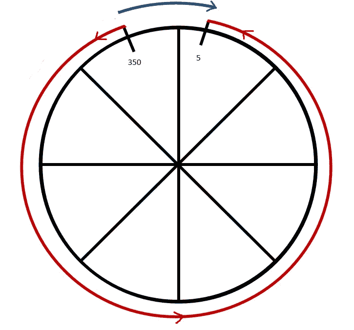

# 使用 Python 找到两个角度之间的差异

> 原文：<https://towardsdatascience.com/find-the-difference-between-two-angles-using-python-ac553a1ef5c0>

## 因为在角度从 355 度变为 5 度之前，这都是一种乐趣和游戏


照片由 [Sunil Ray](https://unsplash.com/@ray027?utm_source=medium&utm_medium=referral) 在 [Unsplash](https://unsplash.com?utm_source=medium&utm_medium=referral) 拍摄

在我的业务领域(海上风力)，我花了很多时间分析风力数据，但直到最近我才尝试使用 python 来分析风向随时间的变化。所以直到最近我才意识到我不知道该怎么做。

看起来很简单，如果方向从 350 度变到 320 度，从另一个中减去一个，得到绝对值，这就是 30 度的变化。但是等一下，等一下…

从 350 度到 5 度的变化是 15 度或 345 度的变化，这取决于变化发生的方向。同样，从 250 度到 200 度的变化可以是 50 度，也可以是 450 度。如果您正在处理大型数据集(或者只是通常重视您的时间)，打开巨大的文件，手动检查每个文件并编辑正确的结果是不可行的。你和你的电脑都可能会认输，所以需要一个自动化的解决方案。

在整篇文章中，我将使用风向作为例子，但这适用于任何使用角度或弧度的东西，并寻求随时间的变化。

## 目录

## [1。必要的假设](#cd3a)

## [2。代码](#cc4d)

## [3。解释](#9ac4)

# 必要的假设

如前所述，当方向通过北方，或零度时，我们的简单方法就失败了。将度数转换成弧度也不能解决问题(相信我，我试过了)。相反，我们需要对方向行为进行假设。

如果方向从 350 度变为 5 度，那就是 15 度的变化，只有如果，**是顺时针方向。**即如果风向从 350 度变化到 351 度、352 度…..359，0，1 … 5 度。也有可能风向已经从 350 度变成了 349 度，348 度…6、5 度或逆时针方向。这两个选项如下所示。



角度方向可以逆时针(红色)或顺时针(蓝色)改变。作者提供的图片-未按比例绘制。

这两种情况实际上是否可能取决于数据类型和数据粒度。例如，一艘船的航向有可能在三秒钟内改变 190 度吗？极端天气会导致极端风向改变吗？

为了使建议的解决方案起作用，我们必须假设**不可能在给定的周期内方向改变超过 180 度**。即，如果数据是一分钟粒度的时间序列，从分钟 1 到分钟 2，超过 180 度的真正方向改变是不可能的。

如果这对您的数据集不起作用，请格外小心！考虑你拥有的可以证明或反驳这一理论的任何其他数据点，如果可能的话，获取更高频率的数据，以便这一假设可以成立。

# 代码

这不是一个完美的 pythonic 解决方案，但是对于我的用例来说，它完成了工作。下面的片段使用了熊猫图书馆，关于它的文档可以在[这里找到。](https://pandas.pydata.org/docs/)

```
**# find diff between min and max wind direction**df['delta'] = df.max_winddirection - df.min_winddirection

**# check for if difference minimun < max - 180, if so, use different equation to get degree change
**  
df.loc[df.min_winddirection < df.max_winddirection - 180, 'delta'] = 360 - df.max_winddirection + df.min_winddirection
```

# 解释

以 350 度到 5 度为例。

1.  上面的代码首先为所有行分配基本的 delta 方程“最大角度-最小角度”。这将应用 350 作为该行的增量。
2.  代码检查是否满足这些“穿过北方”情况的标准。这将检查是否:*最小角度<最大角度—180”*。在这种情况下，5 小于(350–180 ),因此为真。
3.  该代码应用了一个新的公式，当δ为真时为*“360-最大角度+最小角度”。*导致 15 度。

如果不满足“穿过北方”标准，将毫无问题地应用基本最大值减去最小值公式。

希望这对你有所帮助。如果你有一个更干净的替代解决方案，我很乐意从中学习，请随时在评论中提出来。