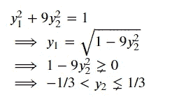
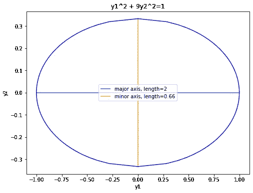
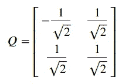

# 求正定矩阵的最小拉伸方向

> 原文：<https://towardsdatascience.com/find-the-minimum-stretching-direction-of-positive-definite-matrices-79c2a3b397fc>

## Python 中图像形成和相机校准综合教程系列的第 4 部分


在进入摄像机校准之前，让我们讨论一下正定矩阵和一般矩阵的一些性质。我们将在校准摄像机时使用这些属性。

## 特征值和特征向量

设𝐴是形状为𝑚×𝑛矩阵，𝑥⃗是大小为𝑛.的向量那么𝑥⃗就是𝐴的*特征向量*如果𝐴𝑥⃗ = 𝜆𝑥⃗，其中𝜆是一个标量叫做𝑥⃗.的*特征值*特征值和特征向量的性质取决于矩阵𝐴.

假设矩阵𝐴有𝑛独立特征向量，那么𝐴可以因式分解为:


其中，𝑆是以特征向量为列的特征向量矩阵，λ是特征值矩阵，它是沿对角线具有特征值的对角矩阵。注意，𝑆在这里是可逆的，这只有在列是独立的情况下才有可能，这意味着特征向量应该是独立的。


这里𝑥⃗1，𝑥⃗2，…，𝑥⃗𝑛是𝐴的特征向量；而𝜆1，𝜆2，…，𝜆𝑛是它们对应的特征值。

## 对称矩阵

𝐴是一个*对称矩阵*如果𝐴=𝐴⊺，其中𝐴⊺是𝐴.的转置我们将使用符号⊺来表示转置。对称矩阵将总是具有*实*特征值，并且特征向量可以被选择为正交的。

我们看到:


由于对称矩阵的特征向量可以选择正交，我们可以将特征向量矩阵 s 表示为𝑄，其中𝑄的列彼此正交。同样，𝑄的逆也是它的转置，因为它是正交的。因此，我们可以将𝐴分解为:


## 正定矩阵

如果在一个对称矩阵中所有的特征值都是正的，那么这个矩阵叫做*正定矩阵*。如果𝐴是正定矩阵，𝜆1，𝜆2，𝜆3…是𝐴的特征值，那么𝜆𝑖 > 0 和𝜆𝑖 ∈ 𝐑对于 i = 1，2，3，…

## 椭圆体

正定矩阵有一个有趣的性质:如果𝐴是正定矩阵，那么𝑥⃗⊺𝐴𝑥⃗ = 1 代表𝐑𝐧中以零为中心的椭球。𝐑𝐧是 n 维实空间，𝑥⃗ ∈ 𝐑𝐧.

这个椭球的主轴由矩阵𝐴.的特征值和特征向量决定

让我们看一个例子。

## 例子

设矩阵𝐴 = [[5，4]，[4，5]]。𝐴的特征值是 1 和 9，它们都是正的。因此 A 是正定矩阵。接下来，让我们计算𝑥⃗⊺𝐴𝑥⃗.这里是𝑥2].的𝑥⃗=[𝑥1


所以我们得到了𝑥⃗⊺𝐴𝑥⃗ = 5𝑥1 +8𝑥1𝑥2+5𝑥2。等等，那看起来不像椭圆。椭圆的方程具有以下形式:


那么是哪里出了问题呢？让我们用𝐴.的特征向量基来表示向量𝑥⃗本质上，我们需要在𝑥⃗上执行基变换的改变，并且我们在系列的第 2 部分[中讨论了基变换的改变。基矩阵的变化是特征向量矩阵𝑄.的逆由于𝑄是一个标准正交矩阵，𝑄的逆是𝑄⊺，这是我们的基变换矩阵。](/camera-extrinsic-matrix-with-example-in-python-cfe80acab8dd)

让𝑦⃗ = 𝑄⊺𝑥⃗.𝑦⃗是向量𝑥⃗ wrt 的特征向量基。现在让我们看看能否得到一个椭球体:

```
consider 𝑥⊺𝐴𝑥
=        𝑥⊺(𝑄Λ𝑄⊺)𝑥    (𝐴 = 𝑄Λ𝑄⊺)
=       (𝑥⊺𝑄)Λ(𝑄⊺𝑥)  (Matrix Multiplication is associative)
but,     𝑦 = 𝑄⊺𝑥 and 𝑦⊺ = 𝑥⊺𝑄
substituting y in the equation, we get:
         𝑥⊺𝐴𝑥 = 𝑦⊺Λ𝑦
```

让我们看看𝑦⊺λ𝑦是什么样子的:


这里𝑦1，𝑦2，…，𝑦𝑛是矢量𝑦⃗.的分量或系数我们可以看到，𝑦⊺λ𝑦= 1 看起来像一个椭球的方程。我们可以将这个等式改写为:


这个方程明确地表示了一个椭球体，其中 1/√𝜆1，1/√𝜆2，… 1/√𝜆𝑛是主轴长度的一半。

回到我们的例子，𝐴 = [[5，4]，[4，5]]，𝐴的特征值是 1 和 9。将它们代入上述方程，我们得到 y1 + 9y2 = 1，这就是我们的椭圆方程。让我们画出这个:



+= 1

我们可以看到主轴的长度是 0.66 和 2，也就是 2 * 1/√𝜆1 和 2 * 1/√𝜆2.

接下来，让我们从特征向量基转换回标准的欧几里德基。转换到我们乘以𝑄⊺的特征向量基。为了从特征向量基转换回来，我们乘以𝑄⊺的逆，也就是𝑄.

```
𝑦⃗ = 𝑄⊺𝑥⃗ ⟹ 𝑥⃗ = 𝑄𝑦⃗
```

𝐴的特征向量的归一化形式为[-1/√2，1/√2]和[1/√2，1/√2]。所以𝑄的特征向量矩阵是:



请注意，这些列是正交的。我们将上面椭圆上的每一点乘以𝑄，然后像这样绘制变换后的点:


注意特征向量是如何沿着椭圆的主轴的。我们可以说拉伸的方向是沿着矩阵的特征向量，这些特征向量是椭圆的主轴。如果一个点沿着具有最大特征值的特征向量，它将被拉伸到最大，如果它沿着具有最小特征值的特征向量，它将被拉伸到最小。

正定矩阵的这个性质有一个重要的应用，我们将在相机校准中使用。

在此之前，有一个重要的定理你需要知道:如果𝐴是任意一个矩形矩阵，那么𝐴⊺𝐴就是一个正定矩阵。

设𝐴是一个形状为𝑚 x 𝑛的矩形矩阵，我们想找出|𝐴𝑥⃗|的最小值，其中𝑥⃗是任何大小为𝑛的向量，|𝐴𝑥⃗|代表𝐴𝑥⃗.的大小让我们看看如何计算:

```
We want to find the minimum value of |𝐴𝑥⃗|,
which is the same as finding the minimum value of |𝐴𝑥⃗|².
Now, |𝐴𝑥⃗|² can be written as (𝐴𝑥⃗)⊺(𝐴𝑥⃗),
which in turn can be written as 𝑥⃗⊺𝐴⊺𝐴𝑥⃗.
Now, 𝑥⃗⊺𝐴⊺𝐴𝑥⃗ = 𝑥⃗⊺(𝐴⊺𝐴)𝑥⃗  (associative property of Matrices),
But remember, 𝐴⊺𝐴 is a positive definite matrix.
⟹ 𝑥⃗⊺(𝐴⊺𝐴)𝑥⃗ = 1 represents an ellipsoid with the 
eigenvectors of 𝐴⊺𝐴 along the principal axes.
So the direction of minimum stretching will be along 
the eigenvector of 𝐴⊺𝐴 with the smallest eigenvalue.
```

因此，如果𝑥⃗沿着𝐴⊺𝐴的具有最小特征值的特征向量，那么|𝐴𝑥⃗|将是最小的。

# 结论

我希望你喜欢这篇文章。这篇文章的代码可以在这里找到。在[的下一篇文章](/camera-calibration-with-example-in-python-5147e945cdeb)中，我们将执行摄像机校准。如果你有任何疑问或问题，请在下面的评论中告诉我。

# 参考

1.  [吉尔伯特·斯特朗的线性代数讲座](https://www.youtube.com/playlist?list=PL49CF3715CB9EF31D)

# 图像制作者名单

本文中的所有图片和数字，除非在标题中明确提及其来源，否则均由作者提供。