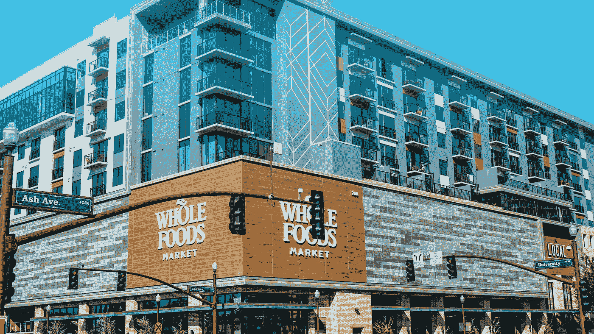
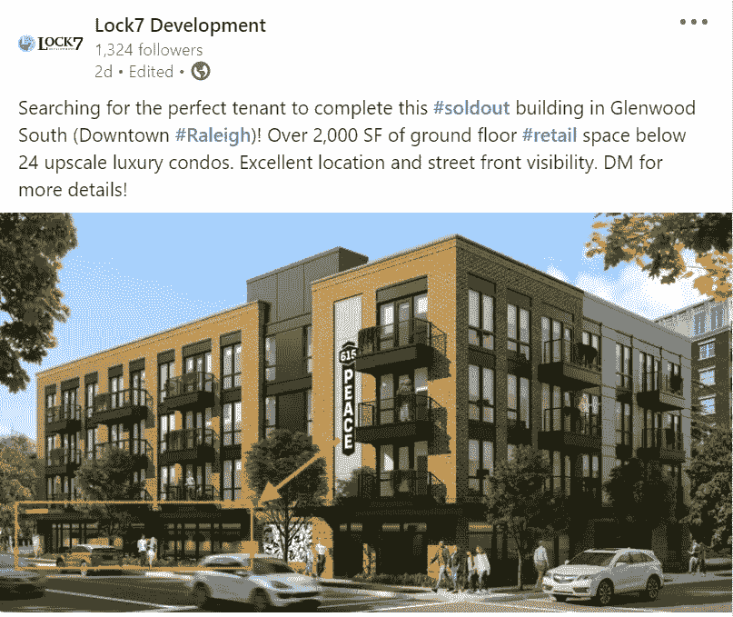
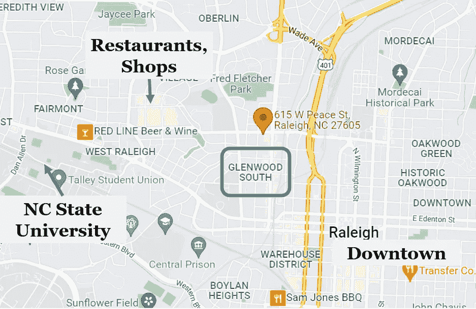
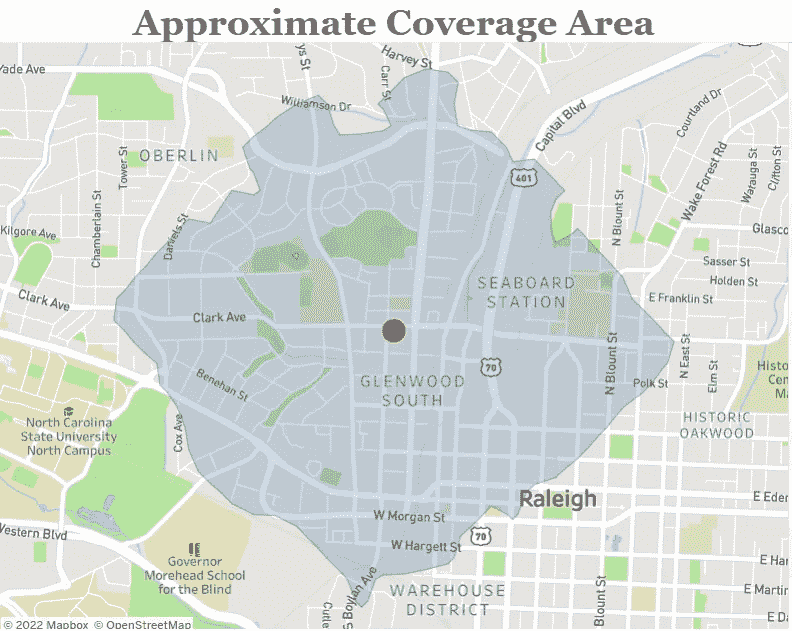
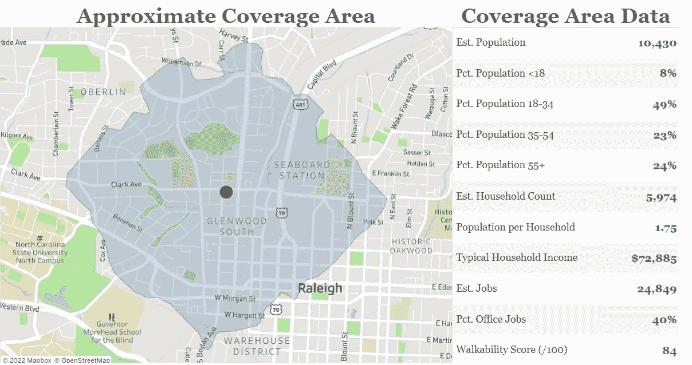

# 通过分析寻找适合商业地产的产品市场

> 原文：<https://towardsdatascience.com/finding-product-market-fit-for-commercial-space-with-analytics-5930434a9494>

## 为房地产营销和分析的直觉增加数据

照片由 [Unsplash](https://unsplash.com?utm_source=medium&utm_medium=referral) 上的[伊斯特弗莱、马库斯](https://unsplash.com/@istrfry?utm_source=medium&utm_medium=referral)拍摄

*本文代表我个人的想法、观点和分析，与任何其他组织无关。*

为租户匹配商业空间对双方来说都是一项具有挑战性的工作。房东通常会对企业做出不确定的长期承诺，反过来，企业也会承担在租赁期内支付租金的风险。

一个空间的价值通常取决于它的位置。在许多地区，你可以开车或步行去感受一个地区。你还看到其他什么企业在运营？谁倾向于走在街上？虽然作为一个开始很有帮助，但这是一个有限的时间点样本，并且错过了更大的画面——该领域与其他选项相比如何？

历史上，数据被汇总到共同认可的地理位置进行分析，作为展示位置的一种手段。我们直观地了解一个城市或邮政编码。不过，这些地区很大，对于决定长期租赁的租户来说，对周围地区更有信心有助于做出更好的决定。

今天，我们可以超越传统的邮政编码或城市界限，但仍然可以开发直观的数据工具来帮助企业做出这些关键决策。我们可以问类似*这样的问题:“有多少人住在离一处房产 15 分钟步行路程的范围内？他们的人口构成是怎样的？”*或“*附近还有哪些其他类型的企业？”*。

[在阅读之后(或之前)尝试一个交互式仪表盘。](https://www.bean.consulting/real-estate-data)

具有多种方法和时间选项的仪表板示例

我很幸运生活在一个快速发展和成长的地区。每天，我都会路过处于不同发展阶段的建筑。我注意到一栋建筑的开发商在 LinkedIn 上发布了一个帖子，寻找商业租户，以占据一个混合用途开发项目的底层。

北卡罗来纳州罗利市中心附近新开发项目的物业营销

我想知道——谁最适合这份工作？我大致了解这个领域，但是我可以引入哪些数据来揭示新的机会或见解呢？

*免责声明:这不考虑许可限制、空间成本、建筑限制或其他相关信息。这只是一个分析框架，用于确定一处房产对潜在租户的价值。*

# **邻里**

以下是一些关于格伦伍德南区的基本信息:

*   它位于罗利市中心附近，大型豪华公寓建筑发展迅速
*   它最近的名声是作为一个聚会社区，俱乐部和酒吧散布在这个小区域
*   考虑到最近的发展、许可申请和价格上涨，未来 3-5 年可能会转向更高档的区域

除了高端办公空间和众多的酒吧和餐厅之外，它非常适合步行，步行即可到达多所大学。

# 房产

新开发项目位于 Glenwood South 的北端，交通繁忙。它位于住宅和商业混合区的正中央，附近步行即可到达大学、高中和小学，此外还有高速公路入口(在下图中用黄色标出；不完全是高速公路，但也不是普通的街道)。

来自谷歌地图的带有注释的酒店位置图片

鉴于该物业的位置和周边地区，我的观点是，它将从步行交通中受益最多，其次(尽管仍然很有价值)是位于高能见度街道上。我怀疑——像许多城市地区一样——将会有有限的停车位，限制了在特定时间可以停靠的汽车数量。

所以，知道了以上内容，这让我们不禁要问…有多少人住在离该地点步行的距离内，他们的人口构成是什么？该位置周围还有哪些企业可能会让某类租户受益或受到抑制？

# 分析

这就是有趣的地方——至少如果你是像我一样的分析呆子。

让我们假设在一个城市地区，某人将步行 20 分钟到达一个位置。这是地图上 20 分钟步行半径的样子。给定这个半径，我们对该区域发生的活动了解多少？

距离该位置约 20 分钟的步行半径；作者图片

数据显示，在这段步行时间内，大约有 10，500 人和 25，000 个工作岗位。考虑到数据报告和今天之间的时间差，我估计这两个数字今天会更高。这些数字明显高于县基准，表明这是一个密集的混合使用区(“生活-工作-娱乐”，俗话说)。

在那些生活在 20 分钟步行范围内的人中，大约 50%在 18 岁至 34 岁之间(相比之下，该县为 24%)，40%的工作是办公室工作(相比之下，该县为 30%)，这意味着“年轻专业人士”可能是人口的一个适当特征。

> 在人口和办公室工作之间，每天有足够多的人在 20 分钟的步行距离内填满当地的 NHL 竞技场

该地区非常适合步行，满分为 100 分，得分约为 85 分，典型家庭收入约为 73，000 美元。家庭收入低于县平均水平，然而，典型的家庭规模也更小，这表明人均可支配资金更高。

估计的覆盖区域数据，距离酒店大约 20 分钟的步行时间

在步行范围内大约有 100 家有执照的餐馆，其中大部分在南边，因为北边是住宅区。

步行半径范围内获得许可的餐饮机构的大致位置；作者图片

步行区内约有 16 个被视为“豪华”的公寓区——更不用说额外的公寓大楼了——还有同一个街区的多块土地，作为奖励，它们可能在租约有效期内开发。

最后，[来自北卡罗来纳州的汽车交通数据](https://ncdot.maps.arcgis.com/apps/webappviewer/index.html?id=964881960f0549de8c3583bf46ef5ed4)表明，在给定的一天，大约有 11，500 辆汽车经过这个地方。这是 2020 年的数据，受到 COVID 的影响，因此，我的观点是，今天这一数据已经大幅增加。

# 这意味着什么

因此，综上所述，我们可以说这个地区非常适合步行和城市化，周边人口年轻、富裕且不断增长。在汽车交通、当地人口和附近的工作岗位之间，它可能有一个每天至少 40，000 人的可寻址市场(或者，用当地人可以欣赏的术语来说，足以填满附近 UNC 教堂山的篮球体育场两倍)。

最高价值的解决方案是一个企业将受益于(1)周围地区的人口和工人；(2)在(非常)邻近的小学接送孩子的家长，以及(3)在附近步行距离内上高中的 2000 多名学生。

哪些类型的企业可以从这一目标受众和市场规模中受益？

银行在寻找市场份额的过程中一直在这个三角地带进行着激烈的竞争，因此资本相对较低的租户(相比之下，比如说，必须建造一个商业厨房)可能是一家寻找高知名度分支机构的银行。他们可以通过步行，加上路过的道路交通带来的隐性品牌效应，接触到年轻、高收入的客户群。

高端健身精品店可能会有机会，但另一个需要考虑的问题是，所有的豪华公寓楼都将有健身房，一些写字楼也将有健身房，因此潜在市场可能会比步行距离内的人口/员工的预期要小。

酒吧或餐厅/快速服务餐厅(QSR)是一种可能性，尽管如地图所示，许多已经存在，更多的正在计划中，作为新开发的一部分，在附近步行即可到达，因此它需要是一个独特的概念，尚未在更广泛的区域内捕获。

像 CVS 或 Walgreens 这样的药店可能会根据空间的大小而发挥作用，因为它们都有大约一英里远的位置，这在城市环境中可能会错过希望立即方便的人的市场机会。

我要提到的最后一个想法是类似于 Amazon Go 商店的东西，这无疑是一个很长的机会/非常低的可能性，但我认为具有很高的价值。它的价值跨越年龄组，它将受益于混合使用驱动交通通过。该位置位于步行交通的中心，可用于取包裹或用作微型配送中心。除了所讨论的步行可达性之外，一个企业还可以通过 10 分钟的车程到达约 120，000 人，释放出更多的价值。它的快速进出模式将有利于(可能的)低可用停车位。

这只是现代数据工具和资源可用能力的一个示例。我们选择步行时间，因为它与位置相关，但任何驾驶时间或径向距离(即 2 英里的圆圈)也是选项。餐厅被引用是因为它们是空间的常见用途，但如果医疗保健客户是目标受众，它也可以很容易地被牙科诊所或医生取代。

如今，数据可以为商业房地产代理商带来的本地市场知识和专业知识增加一层，从而为决策带来更多的说服力。找到正确的位置从来都不容易，但是增加相关的、有针对性的信息的数据访问可以显著增加决策的价值。

[试试附带的仪表盘](https://www.bean.consulting/real-estate-data)。

*对这类材料和分析感兴趣？* [*在 LinkedIn*](http://www.linkedin.com/in/jordanbean) *上联系我，或者在 jordan@jordanbean.com 给我发邮件。*