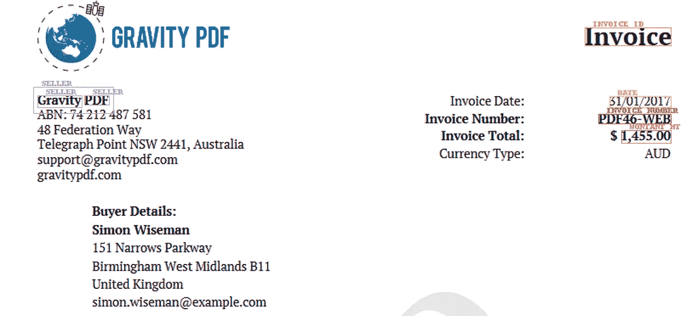
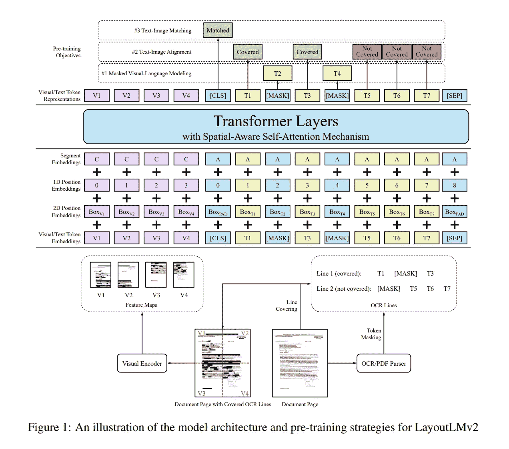
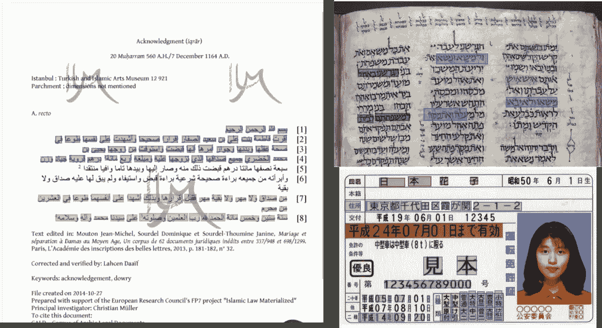
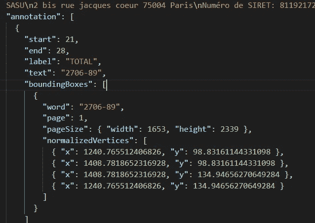
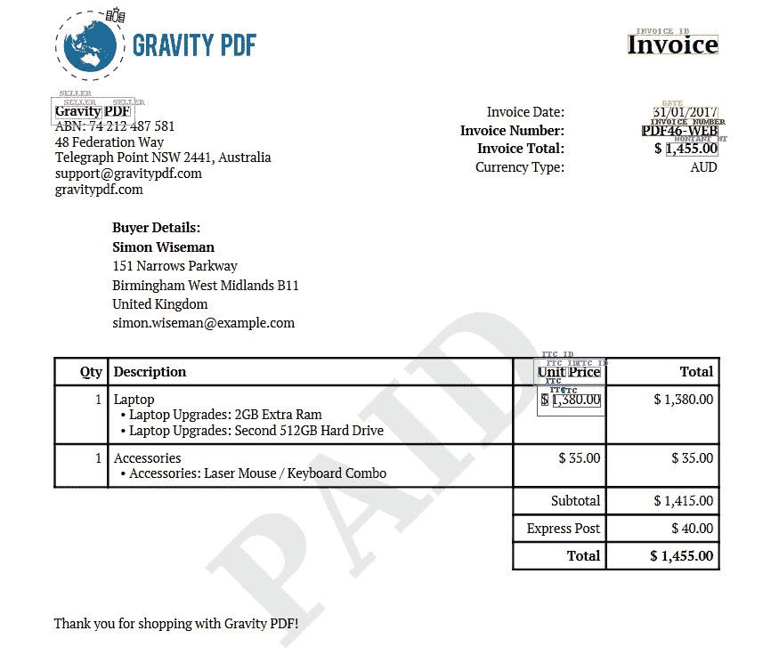
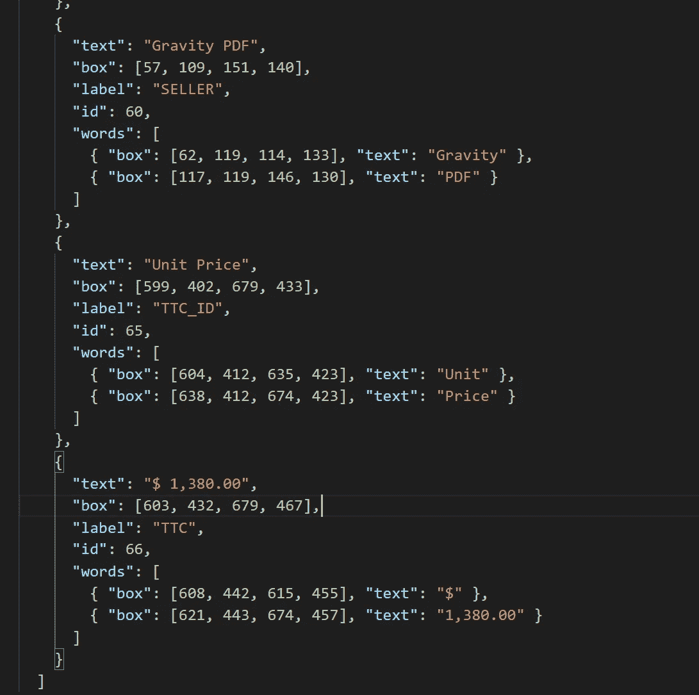

# 微调用于发票识别的 LayoutLM v2

> 原文：<https://towardsdatascience.com/fine-tuning-layoutlm-v2-for-invoice-recognition-91bf2546b19e>

## 从注释到训练和推理



作者图片:用于发票识别的 LayoutLMV2

# 介绍

自从我写了上一篇关于利用 layoutLM transformer 模型进行发票识别的文章"[微调 Transformer 模型](/fine-tuning-transformer-model-for-invoice-recognition-1e55869336d4)"之后，微软发布了一个新的 layoutLM v2 transformer 模型，与第一个 layoutLM 模型相比，在性能上有了显著的提高。在本教程中，我将一步一步地演示如何从数据注释到模型训练和推理来微调发票上的 layoutLM V2。

Google Colab 上提供了训练和推理脚本。

培训脚本:

[](https://colab.research.google.com/drive/18gi-OUCv8S_1ttD6AoHD9hCUO_0j35-4?usp=sharing) [## 谷歌联合实验室

### 编辑描述

colab.research.google.com](https://colab.research.google.com/drive/18gi-OUCv8S_1ttD6AoHD9hCUO_0j35-4?usp=sharing) 

推理脚本:

[](https://colab.research.google.com/drive/1G6fBdP6xHhuT1GdJA1Ntjomx_Um8XMhO?usp=sharing) [## 谷歌联合实验室

### 编辑描述

colab.research.google.com](https://colab.research.google.com/drive/1G6fBdP6xHhuT1GdJA1Ntjomx_Um8XMhO?usp=sharing) 

# 布局 V2 模型

与第一个 layoutLM 版本不同，layoutLM v2 在 Transformer 体系结构的第一个输入层中集成了可视功能、文本和位置嵌入，如下所示。这使得模型能够学习视觉和文本信息之间的跨模态交互，在单个多模态框架中文本、布局和图像之间的交互。下面是摘要中的一个片段:“*实验结果表明，LayoutLMv2 大幅优于 LayoutLM，并在多种下游视觉丰富的文档理解任务上取得了新的最新成果，包括 FUNSD (0.7895 → 0.8420)、CORD (0.9493 → 0.9601)、SROIE (0.9524 → 0.9781)、Kleister-NDA (0.8340 → 0.8520)、RVL*

更多信息请参考[原文](https://arxiv.org/pdf/2012.14740.pdf)。



布局 LMV2 架构(图片来自[徐等人，2022](https://arxiv.org/pdf/2012.14740.pdf) )

# 注释

对于本教程，我们已经使用[ubai 文本注释工具](https://ubiai.tools)注释了总共 220 张发票。 [UBIAI OCR 注释](https://ubiai.tools/live-demo?from=OCR)允许以常规或手写形式直接在原生 pdf、扫描文档或图像 PNG 和 JPG 上进行注释。我们最近增加了对 20 多种语言的支持，包括阿拉伯语和希伯来语等。



作者图片:UBIAI 多语言 OCR 注释

以下是关于如何使用该工具注释 pdf 和图像的精彩概述:

UBIAI 教程由 [Karndeep Singh](https://www.youtube.com/@karndeepsingh)

除了带标签的文本偏移量和边界框，我们还需要导出每个带注释的文档的图像。使用 [UBIAI](https://ubiai.tools) 可以很容易地做到这一点，因为它将所有注释和每个文档的图像一起导出到一个 ZIP 文件中。



作者图片:注释数据 JSON 输出

# 数据预处理:

从 [UBIAI](https://ubiai.tools) 导出 ZIP 文件后，我们将文件上传到 google drive 文件夹。我们将使用 google colab 进行模型训练和推理。

*   第一步是打开一个 google colab，连接你的 google drive 并安装 transfromers 和 detectron2 软件包:

```
from google.colab import drivedrive.mount('/content/drive')!pip install -q git+https://github.com/huggingface/transformers.git!pip install -q datasets seqeval!python -m pip install -q 'git+https://github.com/facebookresearch/detectron2.git'
```

*   为了简化数据预处理和模型训练步骤，我们创建了 preprocess.py 和 train.py 文件，其中包含启动训练所需的所有代码。从 github 克隆文件:

```
! rm -r layoutlmv2_fine_tuning! git clone -b main [https://github.com/walidamamou/layoutlmV2.git](https://github.com/walidamamou/layoutlmV2.git)
```

*   接下来，我们需要解压缩导出的数据集，并将所有文件放在一个文件夹中:

```
IOB_DATA_PATH = "/content/drive/MyDrive/LayoutLM_data/Invoice_Project_XhDtcXH.zip"! cd /content/! rm -r data! mkdir data! cp "$IOB_DATA_PATH" data/dataset.zip! cd data && unzip -q dataset && rm dataset.zip! cd ..
```

# 微调 LayoutLM v2 模型:

我们几乎准备好启动培训，我们只需要指定几个超参数来配置我们的模型和模型输出的路径。你当然可以改变这些变量来得到最好的结果。对于本教程，我们使用 33%的测试规模，批量= 4，学习率= 5e-5 和 50 个时期。

```
#!/bin/bash#preprocessing argsTEST_SIZE = 0.333DATA_OUTPUT_PATH = "/content/"#training argsPROCESSED_DATA_PATH = DATA_OUTPUT_PATHMODEL_OUTPUT_PATH = "/content/layoutlmv2-finetuned"TRAIN_BATCH_SIZE = 4VALID_BATCH_SIZE = 2LEARNING_RATE = 5e-5EPOCHS = 50
```

我们现在准备启动模型，只需运行:

```
! python3 layoutlmv2_fine_tuning/train.py --epochs $EPOCHS \--train_batch_size $TRAIN_BATCH_SIZE \--eval_batch_size $VALID_BATCH_SIZE \--learning_rate $LEARNING_RATE \--output_dir $MODEL_OUTPUT_PATH \--data_dir $PROCESSED_DATA_PATH
```

训练完成后，精确度、召回率和 F1 分数将显示如下。我们获得了 0.75 的 F1 分数和 0.96 的准确度，这对于注释 220 张发票来说是不错的分数。


作者图片:LayoutLMV2 分数

# 与 layoutLM V2 的推论:

我们现在准备在一张新的看不见的发票上测试我们新训练的模型。对于这一步，我们将使用 Google 的 Tesseract 对文档进行 OCR，并使用 layoutLM V2 从发票中提取实体。

让我们安装 pytesseract 库:

```
## install tesseract OCR Engine! sudo apt install tesseract-ocr! sudo apt install libtesseract-dev## install pytesseract , please click restart runtime button in the cell output and move forward in the notebook! pip install pytesseract## install model requirements!pip install -q git+https://github.com/huggingface/transformers.git!pip install -q torch==1.8.0+cu101 torchvision==0.9.0+cu101 -f https://download.pytorch.org/whl/torch_stable.html!python -m pip install -q 'git+https://github.com/facebookresearch/detectron2.git'
```

接下来，我们将使用文件 layoutlmv2Inference.py(先前克隆的),它将处理 OCRd 发票并应用模型来获得预测。

最后，指定您的模型路径、图像路径、输出路径，并运行如下所示的推理脚本:

```
model_path = "/content/drive/MyDrive/LayoutLM v2 Model/layoutlmv2-finetuned.pth"imag_path = "/content/invoice_eng.PNG"output_path = "/content/Inference_output2"! python3 layoutlmv2Inference.py "$model_path" "$imag_path" "$output_path"
```

一旦推断完成，您将在图像上找到覆盖的预测，以及一个包含所有标签、文本和推断中的偏移的 JSON 文件)output2 文件夹。让我们看看模型预测:



图片作者:LayoutLMV2 预测

以下是 JSON 文件的一个示例:



作者图片:JSON 输出

该模型能够预测大多数实体，如卖方，日期，发票号码和总额，但错误地预测“单价”为 TTC_ID。这表明我们需要注释更多类型的发票，这样我们的模型就可以学习一般化。

# 结论

总之，我们已经展示了如何从注释开始到训练和推理来微调发票上的 layoutLM V2 的逐步教程。该模型可以在任何其他半结构化文档上进行微调，如驾照、合同、政府文档、财务文档等。

如果你想尝试 UBIAI 的 OCR 注释功能，只需免费注册即可开始注释。

在推特上关注我们 [@UBIAI5](https://twitter.com/UBIAI5) 或[订阅这里](https://walidamamou.medium.com/subscribe)！

页（page 的缩写）s:写完这篇文章后，一个关于培训 layoutlmV3 的新教程已经发布，如果你想了解更多，请点击这个[链接](/fine-tuning-layoutlm-v3-for-invoice-processing-e64f8d2c87cf)。