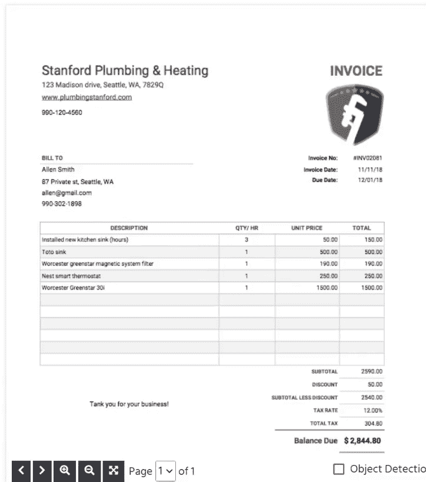
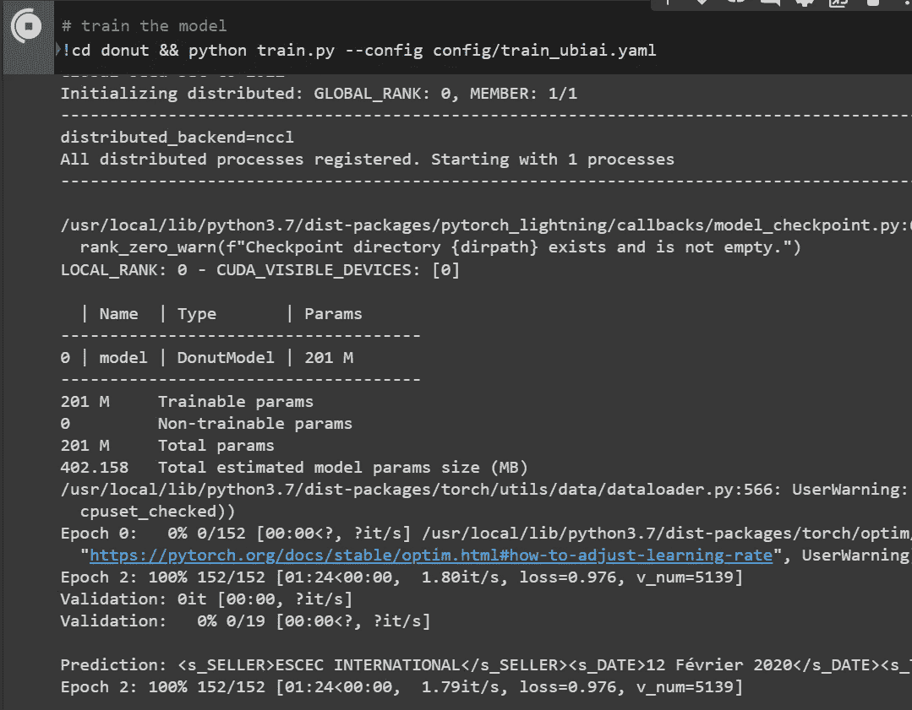
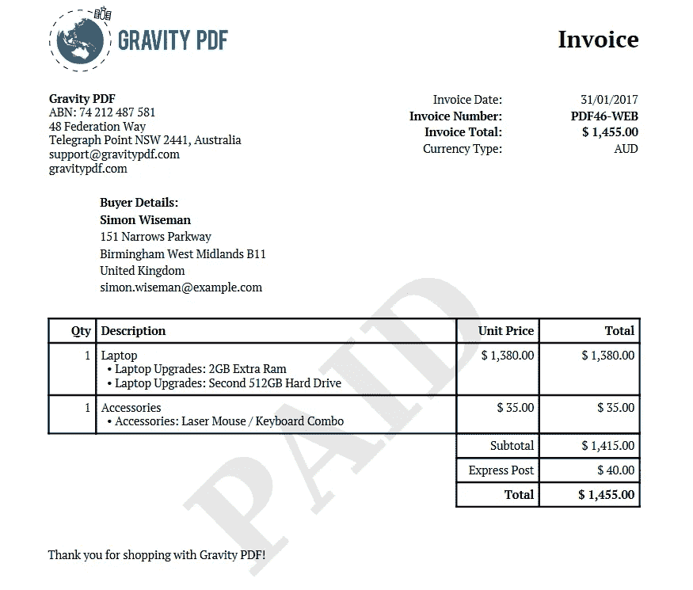

# 用于发票识别的微调无 OCR 甜甜圈模型

> 原文：<https://towardsdatascience.com/fine-tuning-ocr-free-donut-model-for-invoice-recognition-46e22dc5cff1>

## 并将它的性能与 layoutLM 进行比较


图片来自 [Envanto](https://elements.envato.com/home-office-desk-workspace-laptop-invoice-and-eyeg-3NKTRFG)

# 介绍

智能文档处理(IDP)是自动理解文档内容和结构的能力。对于任何需要处理大量文档的组织来说，这都是一项至关重要的功能，例如客户服务、索赔处理或法规遵从性。然而，国内流离失所者不是一项微不足道的任务。即使对于最常见的文档类型，如发票或简历，现有的各种格式和布局也会使 IDP 软件很难准确解释内容。

当前的文档理解模型(如 layoutLM)通常需要进行 OCR 处理，以便在处理文档之前从文档中提取文本。虽然 OCR 是一种从文档中提取文本的有效方法，但它也不是没有挑战。OCR 准确性会受到一些因素的影响，如原始文档的质量、使用的字体和文本的清晰度。此外，OCR 速度慢且计算量大，这又增加了一层复杂性。这使得很难实现 IDP 所需的高精度。为了克服这些挑战，需要新的 IDP 方法来准确地解释文档，而不需要 OCR。

进入 Donut，它代表**Do**cume**n**T**U**understanding**T**transformer，这是一款无 OCR 的变压器模型，根据[原始论文](https://arxiv.org/pdf/2111.15664.pdf)的说法，它在精度方面甚至击败了 layoutLM 模型。

在本教程中，我们将微调新的发票提取 Donut 模型，并将其性能与最新的 layoutLM v3 进行比较。我们开始吧！

作为参考，下面是用于微调甜甜圈模型的 google colab 脚本:

[](https://colab.research.google.com/drive/16iPnVD68oMnCqxHcLaq9qn9zkRaIGeab?usp=sharing#scrollTo=h072rVoFMNYb) [## 谷歌联合实验室

### 编辑描述

colab.research.google.com](https://colab.research.google.com/drive/16iPnVD68oMnCqxHcLaq9qn9zkRaIGeab?usp=sharing#scrollTo=h072rVoFMNYb) 

# 环形建筑

那么，该模型如何能够提取文本并理解图像，而不需要任何 OCR 处理呢？甜甜圈架构是基于一个视觉编码器和一个文本解码器。视觉编码器将视觉特征 x∈R H×W×C 作为输入输入到一组嵌入{zi |zi∈R d，1≤i≤n}中，其中 n 是特征图大小或图像块的数量，d 是编码器的潜在向量的维数。作者使用 Swin 变压器作为编码器，因为根据他们的初步研究，它显示出最佳性能。文本解码器是一个 BART transformer 模型，它将输入特征映射到一系列子词标记中。

Donut 使用[教师强制策略](/what-is-teacher-forcing-3da6217fed1c)模型，该模型在输入中使用基本事实，而不是输出。该模型基于提示生成一系列令牌，提示取决于我们希望实现的任务类型，如分类、问答和解析。例如，如果我们希望提取文档的类别，我们将把图像嵌入和任务类型一起提供给解码器，模型将输出对应于文档类型的文本序列。如果我们对问答感兴趣，我们将输入问题“choco mochi 的价格是多少”，模型将输出答案。输出序列然后被转换成一个 JSON 文件。更多信息，请参考[原文](https://arxiv.org/pdf/2111.15664.pdf)。


甜甜圈建筑。[来源](https://arxiv.org/pdf/2111.15664.pdf)

# 发票标签

在本教程中，我们将对使用 UBIAI 文本注释工具标记的 220 张发票的模型进行微调，类似于我以前关于微调 [layoutLM 模型](/fine-tuning-layoutlm-v3-for-invoice-processing-e64f8d2c87cf)的文章。下面是一个[示例](https://github.com/walidamamou/example_labelled_invoices.git)，展示了从 UBIAI 导出的带标签数据集的格式。



作者图片:UBIAI OCR 注释功能

UBIAI 支持 OCR 解析、原生 PDF/图像注释和以正确格式导出。您可以[在 UBIAI 平台中对 layouLM 模型](https://ubiai.tools/Docs#modelcreation)进行微调，并使用它自动标记您的数据，这可以节省大量手动注释时间。

# 微调甜甜圈

第一步是导入所需的包，并从 Github 克隆 Donut repo。

```
from PIL import Imageimport torch!git clone https://github.com/clovaai/donut.git!cd donut && pip install .from donut import DonutModelimport jsonimport shutil
```

接下来，我们需要从 UBIAI 导出的 JSON 文件中提取标签并解析图像名称。我们将标注数据集的路径和处理过的文件夹(替换为您自己的路径)。

```
ubiai_data_folder = "/content/drive/MyDrive/Colab Notebooks/UBIAI_dataset"ubiai_ocr_results = "/content/drive/MyDrive/Colab Notebooks/UBIAI_dataset/ocr.json"processed_dataset_folder = "/content/drive/MyDrive/Colab Notebooks/UBIAI_dataset/processed_dataset"with open(ubiai_ocr_results) as f: data = json.load(f)#Extract labels from the JSON file
all_labels = list()
for j in data:
  all_labels += list(j['annotation'][cc]['label'] for cc in range(len(j['annotation'])))all_labels = set(all_labels)
all_labels#Setup image path
images_metadata = list()
images_path = list()for obs in data:ground_truth = dict()
  for ann in obs['annotation']:
    if ann['label'].strip() in ['SELLER', 'DATE', 'TTC', 'INVOICE_NUMBERS', 'TVA']:
      ground_truth[ann['label'].strip()] = ann['text'].strip()try:
    ground_truth = {key : ground_truth[key] for key in ['SELLER', 'DATE', 'TTC', 'INVOICE_NUMBERS', 'TVA']}
  except:
    continue

  images_metadata.append({"gt_parse": ground_truth})
  images_path.append(obs['images'][0]['name'].replace(':',''))dataset_len = len(images_metadata)
```

我们将数据分为训练集、测试集和验证集。为此，只需创建三个文件夹:培训、测试和验证。在每个文件夹中创建一个空的 metadata.jsonl 文件，并运行下面的脚本:

```
for i, gt_parse in enumerate(images_metadata):
  # train
  if i < round(dataset_len*0.8) :
    with open(processed_dataset_folder+"/train/metadata.jsonl", 'a') as f:
      line = {"file_name": images_path[i], "ground_truth": json.dumps(gt_parse, ensure_ascii=False)}
      f.write(json.dumps(line, ensure_ascii=False) + "\n")
      shutil.copyfile(ubiai_data_folder + '/' + images_path[i], processed_dataset_folder + "/train/" + images_path[i])
      if images_path[i] == "050320sasdoodahfev20_2021-09-24_0722.txt_image_0.jpg":
        print('train')

  # test
  if round(dataset_len*0.8) <= i < round(dataset_len*0.8) + round(dataset_len*0.1):
    with open(processed_dataset_folder+"/test/metadata.jsonl", 'a') as f:
        line = {"file_name": images_path[i], "ground_truth": json.dumps(gt_parse, ensure_ascii=False)}
        f.write(json.dumps(line, ensure_ascii=False) + "\n")
        shutil.copyfile(ubiai_data_folder + '/' + images_path[i], processed_dataset_folder + "/test/" + images_path[i])
        if images_path[i] == "050320sasdoodahfev20_2021-09-24_0722.txt_image_0.jpg":
          print('test')# validation
  if round(dataset_len*0.8) + round(dataset_len*0.1) <= i < dataset_len:
    with open(processed_dataset_folder+"/validation/metadata.jsonl", 'a') as f:
        line = {"file_name": images_path[i], "ground_truth": json.dumps(gt_parse, ensure_ascii=False)}
        f.write(json.dumps(line, ensure_ascii=False) + "\n")
        shutil.copyfile(ubiai_data_folder + '/' + images_path[i], processed_dataset_folder + "/validation/" + images_path[i])
```

该脚本会将我们的原始注释转换成包含图像路径和基本事实的 JSON 格式:

```
{"file_name": "156260522812_2021-10-26_195802.2.txt_image_0.jpg", "ground_truth": "{\"gt_parse\": {\"SELLER\": \"TJF\", \"DATE\": \"création-09/05/2019\", \"TTC\": \"73,50 €\", \"INVOICE_NUMBERS\": \"N° 2019/068\", \"TVA\": \"12,25 €\"}}"}{"file_name": "156275474651_2021-10-26_195807.3.txt_image_0.jpg", "ground_truth": "{\"gt_parse\": {\"SELLER\": \"SAS CALIFRAIS\", \"DATE\": \"20/05/2019\", \"TTC\": \"108.62\", \"INVOICE_NUMBERS\": \"7133\", \"TVA\": \"5.66\"}}"}
```

接下来，转到“/content/donut/config”文件夹，创建一个名为“train.yaml”的新文件，并复制以下配置内容(确保用您自己的路径替换数据集路径):

```
result_path: "/content/drive/MyDrive/Colab Notebooks/UBIAI_dataset/processed_dataset/result"
pretrained_model_name_or_path: "naver-clova-ix/donut-base" # loading a pre-trained model (from moldehub or path)
dataset_name_or_paths: ["/content/drive/MyDrive/Colab Notebooks/UBIAI_dataset/processed_dataset"] # loading datasets (from moldehub or path)
sort_json_key: False # cord dataset is preprocessed, and publicly available at [https://huggingface.co/datasets/naver-clova-ix/cord-v2](https://huggingface.co/datasets/naver-clova-ix/cord-v2)
train_batch_sizes: [1]
val_batch_sizes: [1]
input_size: [1280, 960] # when the input resolution differs from the pre-training setting, some weights will be newly initialized (but the model training would be okay)
max_length: 768
align_long_axis: False
num_nodes: 1
seed: 2022
lr: 3e-5
warmup_steps: 300 # 800/8*30/10, 10%
num_training_samples_per_epoch: 800
max_epochs: 50
max_steps: -1
num_workers: 8
val_check_interval: 1.0
check_val_every_n_epoch: 3
gradient_clip_val: 1.0
verbose: True
```

请注意，您可以根据自己的用例更新超参数。

我们终于准备好训练模型了，只需运行下面的命令:

```
!cd donut && python train.py --config config/train.yaml
```



图片作者:甜甜圈模型训练

使用启用了 GPU 的 google colab 进行模型培训大约需要 1.5 小时。

为了获得模型性能，我们在测试数据集上测试模型，并将其预测与实际情况进行比较:

```
import glob
with open('/content/drive/MyDrive/Invoice dataset/UBIAI_dataset/processed_dataset/test/metadata.jsonl') as f:
  result = [json.loads(jline) for jline in f.read().splitlines()]
test_images = glob.glob(processed_dataset_folder+'/test/*.jpg')acc_dict = {'SELLER' : 0, 'DATE' : 0, 'TTC' : 0, 'INVOICE_NUMBERS' : 0, 'TVA' : 0}for path in test_images:
  image = Image.open(path).convert("RGB")

  donut_result = my_model.inference(image=image, prompt="<s_ubiai-donut>")
  returned_labels = donut_result['predictions'][0].keys()for i in result:
    if i['file_name'] == path[path.index('/test/')+6:]:
      truth = json.loads(i['ground_truth'])['gt_parse']
      breakfor l in [x for x in returned_labels if x in ['SELLER', 'DATE', 'TTC', 'INVOICE_NUMBERS', 'TVA']]:
    if donut_result['predictions'][0][l] == truth[l]:
      acc_dict[l] +=1
```

以下是每个实体的得分:

卖家:0%，日期:47%，TTC: 74%，发票号码:53%，电视广告:63%

尽管有足够多的例子(274)，卖方实体的得分为 0。其余实体得分较高，但仍在较低范围内。现在，让我们尝试对不属于训练数据集的新发票运行该模型。



作者图片:测试发票

模型预测是:

日期:“2017 年 1 月 31 日”，

TTC ':' 1455.00 美元'，

INVOICE_NUMBERS ':'发票'，

TVA ':' 35.00 美元'

该模型在提取卖家名称和发票号码时遇到了问题，但它正确地识别出了总价(TTC)、日期，并错误地标注了税款(TVA)。虽然模型的性能相对较低，但我们可以尝试一些超参数调整来增强它和/或标记更多的数据。

# 甜甜圈 vs 布局 LM

圆环模型相对于其对应部分布局有几个优点，例如较低的计算成本、较低的处理时间和较少的由 OCR 引起的错误。但是性能对比如何？根据原始论文，Donut 模型在 CORD 数据集上的性能优于 layoutLM。


模型性能得分比较

然而，当使用我们自己的标记数据集时，我们没有注意到性能的提高。如果说有什么不同的话，LayoutLM 已经能够[捕获更多的实体](/fine-tuning-layoutlm-v3-for-invoice-processing-e64f8d2c87cf)，比如卖家姓名和发票号码。这种差异可能是因为我们没有进行任何超参数调整。或者，Donut 可能需要更多的标记数据来实现良好的性能。

# 结论

在本教程中，我们关注的是数据提取，但是 Donut 模型能够进行文档分类、文档问题回答和综合数据生成，所以我们只是触及了表面。无 OCR 模型具有许多优点，例如更高的处理速度、更低的复杂性、更少的由低质量 OCR 引起的错误传播。

下一步，我们可以通过执行超参数调整和标注更多数据来提高模型性能。

如果您有兴趣标记自己的训练数据集，请不要犹豫，免费尝试 UBIAI OCR 注释功能[这里](https://ubiai.tools/Signup)。

在推特上关注我们 [@UBIAI5](https://twitter.com/UBIAI5) 或[订阅这里](https://walidamamou.medium.com/subscribe)！