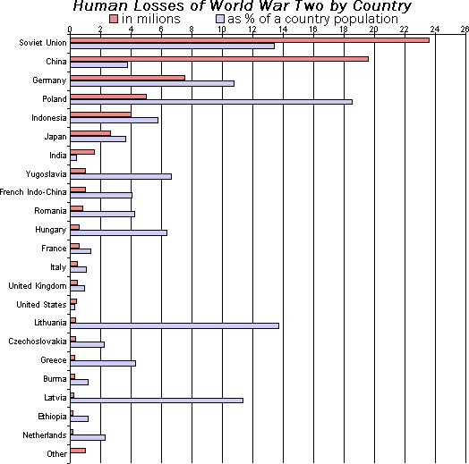

# 数据专业人员的五个基本演示技巧

> 原文：<https://towardsdatascience.com/five-essential-presenting-tips-for-data-professionals-c31708ec52f5>

## 学会如何根据情况调整你的措辞

克里斯蒂娜@ wocintechchat.com 在 [Unsplash](https://unsplash.com?utm_source=medium&utm_medium=referral) 上的照片

# 您的旅程概述

1.  [为什么好的演示很重要](#ea40)
2.  [技巧 1——了解你的受众](#4ee2)
3.  [技巧 2——虔诚地使用视觉效果](#2ae1)
4.  [提示 3——避免行话，简单明了](#baef)
5.  [提示 4——将你的工作与大局联系起来](#ef79)
6.  [提示 5——有一个令人难忘的底线](#cfe1)
7.  [包装](#e17c)

# 为什么好的演示很重要

担任数据角色的人员(数据科学家、数据工程师、数据分析人员等。)经常需要向不同的观众展示他们的作品:

*   你可能在一家咨询公司工作，被要求向客户简要介绍你对一个项目的发现。您的客户拥有丰富的领域知识，但可能缺乏基本的数据素养。
*   你可能正在为一家传统公司工作，在那里你最近实施了一个机器学习解决方案，以帮助公司的一个中心流程实现自动化。干得好！上级要求你就你的工作召开一次内部研讨会。观众将包括高度技术化的软件开发人员，但也包括来自完全不同部门的人，他们可能不理解你工作的技术细节。
*   你可能在一个数据和分析团队工作，最近做出了很酷的贡献。你被要求就你的发现向你的其他团队成员做一个非正式的陈述。你可以期待你演讲的所有与会者都有很高的数据素养。

在所有这些情况下，创建一个好的、精心制作的、吸引人的、信息丰富的演示文稿是至关重要的。为什么？这里有三个原因:

外表:这一个很简单。你的陈述变成了你所做的事情的外在表现。如果你的陈述很糟糕，那么这反映了你的不佳。你不希望客户、同事或上级认为你在沟通简单的想法上有困难。

好的演示会建立你的声誉:说实话。你必须非常糟糕才能获得糟糕演讲者的名声。相反，你根本不需要成为一个令人惊叹的天生演讲者，就能获得一个优秀演讲者的名声。你所需要的就是花时间提高你的表达技巧。当人们注意到你的演讲引人入胜、见解深刻时，你就会建立起良好的声誉。这可以带来更多的机会，对于数据专业人员来说，这被视为一种非常积极的特质。

**创建数据驱动的文化:**通过创建高质量的数据展示，您正在提高数据素养。在听完一次关于物联网设备的精彩演示后，我对时间序列有了更多的了解。通过将演示与观众已经知道的内容联系起来，你可以加深他们对一般主题的了解。这种对演讲质量的关注通常是有感染力的！

在本文中，我将向您提供向他人展示您的数据见解的五个基本技巧。还有很多其他的[通用演示技巧](https://www.indeed.com/career-advice/career-development/tips-for-giving-a-great-presentation)，所以我将把重点放在为数据专业人士量身定制的技巧上。这里没有“站直了”或“准备好了”这样的泛泛之谈😅

# 技巧 1——了解你的受众

第一个提示可能是最令人反感的提示。你可能已经听过这个提示很多次了。问题是小费是正确的😒

> 如果你的演示不符合听众的知识，那么即使是世界上最好的演示也会失败。

举个例子，当我还是一名博士生的时候，我已经做过几次关于研究级数学的演讲。这非常适合职业数学家的听众。然而，我只能想象如果我向客户展示我的数学研究的细节，事情会如何发展。这对我们俩来说都是噩梦。

在开始起草演示文稿之前，我建议您先找到以下问题的答案:

*   谁会参加我的介绍会？试着了解一下观众的大致情况。如果你的听众的领域知识很高，那么你可以避免过度解释每个人都已经知道的东西。如果领域知识很少，那么跳过核心术语会毁了你的演示。
*   **受众的数据素养水平如何？**如果可能的话，试着接触一些有代表性的听众，询问他们的数据素养。这个超级重要！如果你的听众没有什么数据素养，那么就不要谈论高级统计分布或来自 MLOps 的技术术语。
*   听众对哪方面感兴趣？努力了解观众感兴趣的是什么。即使你是在向一位数据素养很高的高层领导做演示，她也可能对结果更感兴趣。相反，如果你正在给数据分析团队的成员做演示，那么他们会对技术细节感兴趣。他们可能想自己实现类似的东西。
*   **演示设置的正式程度如何？**演示是在团队成员之间的非正式会议上进行吗？那么使用内部笑话，营造一种轻松的氛围可能是合适的。假设你正在向客户汇报一个为期六个月的项目的最终结果。那么你或许应该把你精心制作的关于神经网络的迷因留到下次再说。
*   **观众的心理状态是怎样的？**你的演讲是在一整天的会议演讲后进行的吗？那么你的观众会彻底精疲力尽。那么，如果可能的话，让你的演讲稍微少一些技术性，多一些概念性，这可能是个好主意。如果你的演讲真的很长，那么你的听众的精神状态也会受到影响。确保包括休息，并不时总结要点。

照片由 [RU 恢复部](https://unsplash.com/@rurecoveryministries?utm_source=medium&utm_medium=referral)在 [Unsplash](https://unsplash.com?utm_source=medium&utm_medium=referral) 上拍摄

# 技巧 2——虔诚地使用视觉效果

为了避免大量的数字和术语，你需要讲述一个有说服力的故事。任何好的演讲的关键是尽可能让你的听众沉浸其中。这说起来容易。但是怎么做呢？一般来说，你应该使用大量的视觉效果。

失去观众注意力的最可靠方法之一是在没有视觉效果的情况下展示技术细节。视觉是表达复杂观点的好方法。它们看起来也很漂亮。这里有三种使用视觉效果来改善你的演讲的情况:

*   **始终用图表来代表趋势**。与其说 2019 年第三季度 vs. 2020 年发生了什么，不如说明一下区别？条形图是表现这一点的好方法。对于更连续的数据(如每天的销售额)，您可以使用直方图。
*   **使用图表对数量进行分组。**如果你有几个组(比如一个公司的几个部门)，那么你可以用一个垂直条形图来表示数量(比如每个部门的销售额)。作为一个例子，看看垂直条形图是如何有效的，考虑下面的图表显示在二战中的人员损失:

公共领域:[https://commons . wikimedia . org/wiki/File:Human _ losses _ of _ world _ war _ two _ by _ country . png](https://commons.wikimedia.org/wiki/File:Human_losses_of_world_war_two_by_country.png)

你能想象我要写多少句子才能捕捉到上面的画面吗？

*   **用流程图说明零件是如何连接在一起的。没有什么比听别人谈论 15 个软件工具如何在没有流程图的情况下组合在一起更好的了。甚至演讲者看起来也很困惑。请帮大家一个忙，用一个流程图。流程图非常适合描述任何类型的过程。对于数据专业人员来说，最明显的例子是描绘管道或云基础设施🤓**

# 技巧 3——避免行话，简单明了

数据专业人士倾向于喜欢技术术语。和同行讨论的时候，有一个技术词汇超级有用。它能让你快速交流复杂的想法。那个 [*REST API*](https://restfulapi.net/) 怎么样了？机器学习模型的 [*漂移分析*](/model-drift-in-machine-learning-models-8f7e7413b563) 做完了吗？看到了吗？超级有用！

然而，当我们做演示时，这又回来咬我们。使用技术术语是如此诱人，因为它是熟悉的。然而，作为一般建议，您应该尽可能避免这种情况。

其他职业很清楚他们的技术术语令人困惑。你的牙医有没有告诉过你他们需要做*根尖切除术*？也许上周来你家的水管工说你的*饰框*有问题？每个职业都有专业术语。职业知道什么时候用，什么时候**简化**。

当你的演示面对的是不太懂技术或数据的观众时，试着减少行话。对于代码质量，有众所周知的格言 [*保持简单傻*](https://www.codingzeal.com/posts/keep-it-simple-silly-software-engineers) (KISS)。这鼓励软件开发人员尽可能保持他们的代码简单明了。在演示文稿中尝试同样的方法。尽可能保持简单(行话)，听众会因此感谢你。

# 提示 4——将你的工作与大局联系起来

你有没有发现自己在别人的演示中被教导:“这一切都很好，但我为什么要在乎？”。这是完全正常的。当我们看不到所说的和我们所关心的之间有任何联系时，就很容易忽视。

所以，当你在陈述时，试着把你的工作与更大的图景联系起来。这部作品会对观众产生什么影响？这里有两个例子:

*   如果你是作为咨询公司的代表向客户介绍，那么把你的工作和整个公司联系起来。你所做的事情对组织有什么帮助？你的工作会对组织中的其他部门产生影响吗？你展示的每一份数据都应该讲述一个关于客户组织的故事。*因此，你应该做好准备，熟悉客户的组织*。
*   如果你正在做一个内部团队演示，那么你的工作和其他团队成员有什么关系呢？他们可能在做类似的事情吗？你应该事先问他们一直在做什么。通过这样做，你可以把你的工作和他们的工作联系起来，使演示更加有趣。

将你的工作与大局联系起来的主要障碍是**而不是**了解大局。努力去理解观众的需求。通过这种方式，你会自然而然地做出更吸引人的演讲🔥

# 提示 5——有一个令人难忘的底线

最后一个技巧是数据专业人员做演示时经常缺少的。有一种试图解释一个项目的每一个细节的倾向。这可能会引发一个非常严重的问题:你的演示可能没有一个令人难忘的底线。

大多数伟大的演讲都有一个底线，在演讲中会被强调几次，通常是含蓄地强调。底线比演讲的任何具体细节都更能吸引观众。这方面的例子包括:

*   **向咨询客户演示:** *您的会员费率今年下降了 11%。主要原因是缺乏参与。别担心！你可以用最具成本效益的方式来解决这个问题，那就是建立一份简明的月度时事通讯。*
*   **向贵公司高层的陈述:** *我已经实现了一个跟踪我们物联网温度设备的模型。我估计它可以为我们所有的建筑减少 8%的供暖能源成本。仅今年就节省了 50.000 美元！我们应该进一步调查此事。*
*   **向数据素养团队成员演示:** *当数据存在季节性变化时，时间序列的异常检测非常困难。尝试解决这个问题的一些工具是……*

想象一下，在上面的第二个例子中，我花了整个演示来谈论物联网设备和 MLOps 架构的时序分析。这不是高层关心的。然后，很有可能他们会走出房间，完全不知道这是什么意思。一场精彩的演讲会让人痛苦地明白底线是什么。

你不确定你是否对你正在准备的演示有一个令人难忘的底线？试试**电梯间距测试。**你能否解释一下，在乘坐电梯的时间跨度内(比如 30 秒)，底线是什么？如果没有，那么对你的演讲进行一点精炼可能是个好主意，这样它可以围绕一个令人难忘的底线。

# 包扎

照片由[斯潘塞·伯根](https://unsplash.com/@spencerbergen?utm_source=medium&utm_medium=referral)在 [Unsplash](https://unsplash.com/?utm_source=medium&utm_medium=referral) 拍摄

现在，您应该能够更好地向广泛的受众展示数据见解。如果你有自己的建议，请告诉我！

**喜欢我写的？查看我的其他帖子，了解更多 Python 内容:**

*   [用漂亮的类型提示使你罪恶的 Python 代码现代化](/modernize-your-sinful-python-code-with-beautiful-type-hints-4e72e98f6bf1)
*   [用 Python 可视化缺失值非常简单](/visualizing-missing-values-in-python-is-shockingly-easy-56ed5bc2e7ea)
*   [使用 PyOD 在 Python 中引入异常/离群点检测🔥](/introducing-anomaly-outlier-detection-in-python-with-pyod-40afcccee9ff)
*   [5 个超赞的数字功能，能在紧要关头救你一命](/5-awesome-numpy-functions-that-can-save-you-in-a-pinch-ba349af5ac47)
*   [5 个专家提示，让你的 Python 字典技能一飞冲天🚀](/5-expert-tips-to-skyrocket-your-dictionary-skills-in-python-1cf54b7d920d)

如果你对数据科学、编程或任何介于两者之间的东西感兴趣，那么请随意在 LinkedIn 上加我，并向✋问好