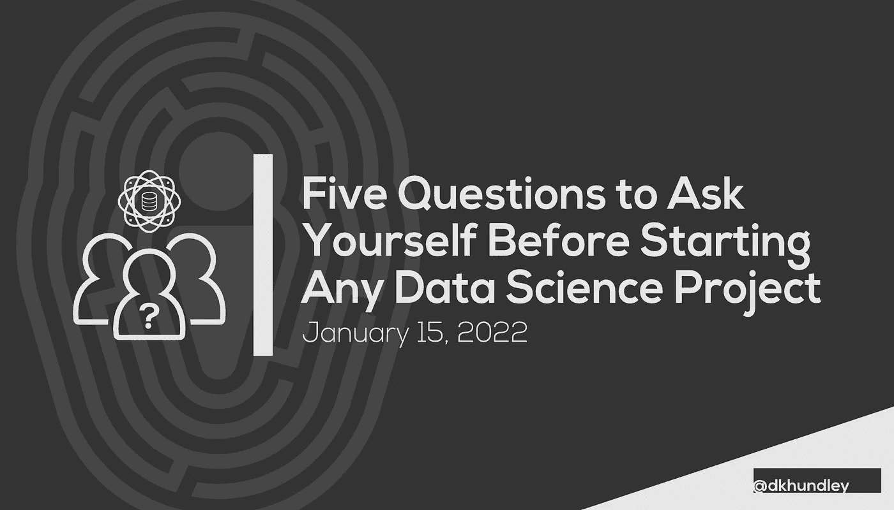

# 在开始任何数据科学项目之前，问自己五个问题

> 原文：<https://towardsdatascience.com/five-questions-to-ask-yourself-before-starting-any-data-science-project-f2025c9ea37>

# 在开始任何数据科学项目之前，问自己五个问题

## 开始下一项伟大的数据科学工作时的考虑事项

虽然技术技能在处理任何数据科学工作时都是不可否认的重要，但数据科学和机器学习有一种艺术，似乎不像纯技术技能那样经常被讨论。这些更软的技能可以帮助经验丰富的数据科学家尽可能无缝、高效地把握众多机会。事实是，几乎每一项数据科学工作都有自己的天赋，带来了独特的挑战，这些挑战可能(或者坦率地说，可能不)值得追求。

因为应用数据科学总是以寻找现实世界问题的解决方案为基础，所以拥有关于现实世界问题的专业知识是绝对必要的。当然，期望数据科学家自己拥有该领域的专业知识是不合理的。例如，如果您要创建一个预测天气的机器学习模型，那么期望数据科学家了解像时间序列建模这样的一般知识是合理的，但是期望数据科学家拥有气象学方面的专业知识是不合理的。在这种情况下，数据科学家需要与气象学家等专家合作，以更好地理解问题，制定解决问题的潜在解决方案。

也就是说，下面要考虑的这些问题旨在帮助数据科学家知道如何最好地“浏览”任何新的或潜在的项目。虽然我绝对不想低估拥有这些技术硬技能的价值，但我想说，这些更注重“软技能”的问题将有助于你最佳地优化你和你的公司持续生产有价值的预测模型的时间。

让我们开始提问吧！

## 对于您希望解决的问题，该解决方案的潜在成本效益分析是什么？

这一点看起来似乎很容易，但却经常被忽视。让我把话说清楚:即使你可以创建一个预测模型来解决一个问题，考虑到**机会成本**，也不值得这么做。例如，如果你为一家收入数万亿美元的公司工作，该公司批量购买廉价的书写笔，那么数据科学家可能不值得花费时间来创建一个预测模型，该模型可能会在从不同供应商购买相同的笔时每年节省几分钱。

“节省一分钱的笔模型”的例子显然是一个极端的例子，但有更多的“灰色区域”的情况下，潜在的数据科学努力在值得和不值得之间徘徊。显然，我不能在这里给出一个“一刀切”的答案，但在推导自己的成本效益分析时，您可以考虑以下几点:

*   数据科学家和合作主题专家构建预测模型所需的时间和成本(如工资)
*   运行预测模型可能需要的硬件(例如，GPU 可能非常昂贵)
*   将模型实施到生产环境中所需要的严格性(例如，创建一个新的模型来取代传统的基于纸张的系统可能非常具有挑战性，因为您还必须实施一系列新的硬件来支持系统，这也可能会受到反对变革的人的反对)
*   预测模型在推进公司目标方面可能具有的潜在优势(例如，更低的成本、更快的上市时间、更快的处理等。)

## 我能合理地确定在我试图解决的问题中有一个预测模式/信号吗？

当数据科学家第一次开始一项新的、潜在的工作时，我实际上要说的是，查看数据不应该是数据科学家做的第一件事。请记住，数据科学家通常不具备解决现实世界问题的专业知识，因此立即查看数据可能不会有任何好处。此时，数据科学家将无法确定从数据中提取的任何“信号”。

此外，非数据科学从业者对数据科学家的期望可能不可靠，不可靠是指许多人倾向于将数据科学/人工智能/机器学习视为“灵丹妙药”的解决方案。尽管意图良好，但这些人可能会抛出“左领域”的想法，这些想法由于完全缺乏模式/信号而永远不会在数据科学中体现出来。或者更微妙的是，可能看起来有某种模式，但对问题更仔细的分析可能会证明事实并非如此。

鉴于这些信息，我建议在开始新的数据科学工作时，首先要做的是**与主题专家**进行某种正式或非正式的面谈。这不仅有助于你更好地理解你要解决的问题，也有助于剔除那些“左领域”的想法。此外，它还提供了一个很好的机会，既可以教育对数据科学一无所知的主题专家，又可以与这些人建立融洽的关系。

(好消息是，随着时间的推移，我发现即使数据科学领域的非从业者最终也能够通过对该领域的工作方式有所了解来过滤出自己的想法，但你可能会在开始与其他方互动时遇到这种情况，特别是如果你是其他公司的数据科学顾问。)

## 我需要什么样的数据来支持我的项目，我有能力获得这些数据吗？

好的，在与你的主题专家同事会面后，你已经确定他们想要追求的解决方案似乎是可行的。作为前一个问题的一部分，我们讨论了这个想法，即在探索数据之前，举行一次访谈，看看这个项目是否有一个总体的机会。**在同一次或随后的访谈中，与主题专家一起确定在考虑建模解决方案时什么样的因素(如数据特征)可能会有影响是有益的**。

当然，知道自己需要什么数据是一回事；实际获得这些数据是另一回事。你工作的公司并不总是拥有这些数据，即使他们有，也可能如此“混乱”，以至于——回到成本效益分析——可能不值得清理。虽然可能存在公共 API 来获取您需要的数据，但您可能需要检查该数据的“合理使用”。使用未经授权的数据可能会导致法律后果。

## 围绕项目本身或基础数据是否有任何伦理考虑？

坦率地说，这可能是最难接近的主题之一。一家公司会为了自己的利益而滥用数据吗？绝对的。网飞纪录片《T2:社会困境》非常清楚地说明了这一点。这部纪录片的范围更广，几乎包括了数据的每个方面，但鉴于数据科学是数据相关活动的子集，数据科学工作中存在大量的伦理困境。

我肯定会认为自己是一个有道德的人，亲爱的读者，我会假设你也是。也就是说，我非常鼓励你在钻研项目时注意道德挑战。而某些数据特征可能更容易避免(如种族、性取向、年龄等)。)，更微妙的要谨慎的是**余弦相似度**。当我说余弦相似性时，我指的是这种想法，你可以使用其他间接特征，基本上意味着与直接特征相同的想法。

例如，假设您没有一个人的性别数据，但是有一个人服用的药物种类的信息。如果一个人服用避孕药，这个人很有可能会被识别为女性，所以从技术上讲，你可以使用“处方”特征来代替直接的“性别”特征。在我看来，从伦理的角度来看，这是没有区别的，所以这些“余弦相似”的特征应该像你对待更直接的特征一样，得到同等水平的伦理判断。(我知道这有点疯狂，因为使用处方数据也是非常不道德的，但我想不出更好的例子了。😅)

## 如果当前项目失败，我什么时候应该放弃并开始新的努力？

显然，我们希望所有的数据科学工作进展顺利，但现实是，并非所有东西都能变成金子。即使对于开始时看起来非常有希望的努力，也有许多原因可能会破坏数据科学项目。我亲眼目睹的最微妙的情况是，虽然数据中似乎确实存在信号，但数据本身并不能产生那个信号。**在那些看似有信号的情况下，实际上可能是一些未知的数据特征影响了信号，但如果你没有办法合理地捕捉到这些特征，那么很不幸项目无法向前推进**。

这几乎是不可避免的情况。并不是每一个数据科学项目都会发展成对你的公司有用的东西，所以我认为在一开始就知道何时“放弃”并转向下一个机会是很重要的。同样，这里没有一个“放之四海而皆准”的答案，所以当你建立这些“不要去”的指导方针时，你可以考虑以下一些事情:

*   基于时间的阶段限制执行特定活动需要多长时间(例如，如果一个月内无法获得数据，我们将继续进行)
*   成功度量的阈值(例如，如果我们在第一次建模尝试中不能达到 80%的准确性，我们就继续前进)
*   确定其他数据科学项目的优先级(例如，如果我们需要为优先级更高的工作腾出时间，我们会搁置或永久搁置当前优先级较低的工作)

这篇文章到此结束！我希望这些问题对您考虑下一个数据科学项目有所帮助。你会给这个列表添加什么？我总是渴望听到其他人如何优化他们对这类项目的考虑，所以请在评论区分享你的想法。感谢阅读，下一篇帖子再见！