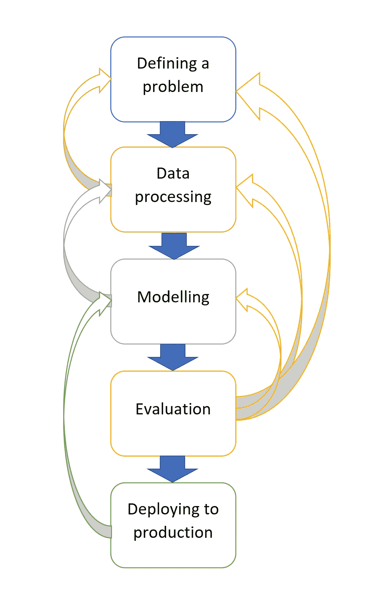

# 每个数据科学项目的五个阶段

> 原文：<https://towardsdatascience.com/five-stages-of-every-data-science-project-8a62885e46de>

## 为什么它们对成功发布如此重要

SpaceX 在 [Unsplash](https://unsplash.com?utm_source=medium&utm_medium=referral) 上拍摄的

数据科学工作流往往发生在广泛的领域和专业领域，如生物学、地理学、金融或商业等。这意味着数据科学项目可能面临非常不同的挑战和关注点，导致使用非常不同的方法和数据集。然而，这并不意味着这些项目没有一个共同的工作流程。在大多数情况下，数据科学项目必须经历五个关键阶段:定义问题、数据处理、建模、评估和部署。在这里，我将介绍每个阶段通常包含的内容，以及为什么它们对于成功的数据科学项目非常重要。

## 定义问题

任何数据科学项目的第一阶段都是识别和定义要解决的问题。没有一个明确定义的要解决的问题，就很难知道如何解决这个问题。对于数据科学项目，这可以包括使用什么方法，例如分类、回归或聚类。此外，如果没有一个明确定义的问题，就很难确定你衡量成功的标准是什么。没有一个成功的定义，你永远不知道你的项目什么时候完成或者好到可以用于生产。这可能导致资源和时间的浪费，例如当简单的逻辑回归而不是复杂的分类神经网络达到目标时。

这方面的一个挑战是能够定义一个足够小的问题，使其能够单独解决/处理。在许多情况下，一个问题或任务可以被分解成许多更小的问题，这些问题一旦被定义，就更容易解决和度量。这方面的一个例子是一家不盈利的制造企业。试图将此作为一个数据科学项目整体来解决可能非常困难。实际上，这可以分解为一些更小的问题，比如传送带太慢，意味着产品组装不够快，关键部件的延迟会减缓某些建设阶段的速度，或者工人调度效率低下，导致工厂工人太少。这些问题中的每一个都可以在他们自己的数据科学项目中得到解决，因为他们可以被清楚地定义、衡量，并对成功有一个清晰的定义。如果你没有正确地定义一个小问题，那么你就不能正确地解决它。

一旦你有一个需要解决的业务问题，你就可以确定你将如何着手解决它，以及如何定义成功。这一点很重要，如果你没有规划出一个潜在的路线图或衡量成功的标准就直接投入到一个问题中，你经常会得到一个解决方案，这个解决方案不能解决你原来的问题，甚至会产生一个更大的问题。这可能是因为在过度设计的解决方案上浪费了时间和资源，或者对成功的不正确衡量导致了更多的问题。在上述制造工厂的情况下，这只会导致成本增加，甚至利润下降！一个不成功的数据科学项目。

## 数据处理

一旦你有了自己的问题，你将如何衡量成功，以及你将使用的方法的想法，你就可以着手执行所有重要的数据处理任务。这通常是任何数据科学项目中耗时最长的阶段，通常也是最重要的阶段。这是因为，不管你的最终解决方案有多复杂或多花哨，如果你把垃圾放进去了，你就会把垃圾弄出来。这意味着你必须确保你有所有你需要的数据，数据是准确的，并且你有正确的格式，无论你建议使用什么方法。

根据你要解决的问题，在这个阶段需要完成各种各样的任务。首先是经常寻找创建或捕获尚不存在的数据的方法。这可以包括找到测量传送带通过制造工厂的速度的方法，以及它在哪个阶段停止和多长时间来识别堵塞，或者基于腕部的健康设备的速度和/或方向来识别何时有人跌倒。许多数据科学项目将不得不应对这一挑战，因为尽管有许多、许多、许多数据源，有时您需要找到一种创新的解决方案来创建和收集更多的数据。

一旦创建了这些数据，您就需要在某个地方以对您的模型有用的格式收集这些数据。这将取决于你将在建模阶段使用什么方法，但这将涉及到你如何将数据输入到你的模型中。这将决定您是使用流式处理还是批处理，以及将采用何种格式。在图像分类的情况下，通常需要将图像以某种形式的数组输入到模型中，而在回归中，您将需要 Y 列和 X 列。

最后一部分是执行任何预处理步骤，以确保数据足够干净，建模方法可以工作。这可能涉及删除异常值或选择保留异常值、处理空值、空值是否是一个度量值或是否应该归入平均值，或者标准化度量值。在这个阶段，可视化数据通常是关键，这样你就能很好地理解你正在处理的数据，并能初步暗示你的模型的结果可能是什么。这样你就可以检查你的最终结果，看看是否有什么地方出错了。然后，您可以创建一个从数据到模型的管道！

照片由 [Helio Dilolwa](https://unsplash.com/@dilolwa?utm_source=medium&utm_medium=referral) 在 [Unsplash](https://unsplash.com?utm_source=medium&utm_medium=referral) 拍摄

## 系统模型化

下一个部分，通常也是最有趣和最激动人心的部分，是数据科学项目的建模阶段。这将采取的形式将主要取决于问题是什么以及你在第一步中如何定义成功，其次取决于你如何处理数据。不幸的是，这通常是任何数据科学项目中花费时间最少的部分，尤其是当有许多框架或库存在时，如 sklearn、statsmodels、tensorflow，并且可以随时使用。

在“定义问题”阶段，您应该已经选择了将用于数据建模的方法，这可能包括简单的图形探索、回归、分类或聚类。在任何情况下，这里的大部分工作只是挑选最相关的方法，确保数据是该方法的正确格式，然后训练模型。在聚类的情况下，这可能涉及 K-均值、d b-扫描或分层聚类的使用，而在回归的情况下，这可能涉及线性回归、随机森林和神经网络。

在这个阶段使用多个模型通常更好，以便在进行评估时能够对它们进行比较和对比。这是因为虽然你可能认为你知道最佳解决方案，但当涉及到数据科学项目时，最佳方法可能会让你感到惊讶，你需要理解为什么。在这一点上，您需要具备选择应该应用的正确模型的技能和知识，尤其是在资源有限的情况下，但是除非您正在使用最前沿的模型或创建自己的模型，否则您通常不会冒险远离现有的框架。

## 估价

一旦你创建并实现了你的模型，你就需要知道如何评估它。同样，这又回到了问题形成阶段，在这个阶段你已经定义了成功的衡量标准，但这通常是最重要的阶段之一。如果您没有正确地评估您的模型，那么您可能最终得到一个实际上无用的模型，您不知道它是否如预期的那样执行。

根据您处理数据和设置模型的方式，您可能拥有可用于评估模型的维持数据集或测试数据集。在该数据集上，您的目标是查看模型在准确性和可靠性方面的表现。第一个是你的模型在你设定的目标方面表现如何，而第二个是你的模型能实现或不能实现这个目标的一致性。在这种情况下，过度训练的模型可能在训练中表现良好，但在测试和评估中表现不佳，而训练不足的模型可能在这两方面都表现不佳。你的目标是拥有一个既准确又可靠的模型。

您用来评估模型的度量标准将取决于它的用途。在某些情况下，您可能希望纯粹关注模型的准确性，这可以通过 R、准确性、AUC 或 F1 得分等指标来衡量。在其他情况下，您可能希望用准确性来换取其他一些功能，例如降低 1 类或 2 类错误的概率。例如，在假阳性的成本很高的情况下，比如在医学中，你会愿意有高水平的 2 型错误，而不是 1 型错误。在其他部门，假阴性的成本很高，那么你会愿意接受一些 1 型错误，如果它能减少你的 2 型错误。在某些情况下，评估指标甚至不一定是数字，而是您是否能够提取您想要的结果或看到您想要的模式。如果这个模型不符合你的成功标准，你可能需要回到第一阶段，重新开始。

## 部署

最后，一旦您对您的模型进行了可靠的评估，并且对结果感到满意，那么您就可以将它部署到生产中了。这可能意味着各种事情，例如您是否使用来自模型的洞察力来对您的业务进行更改，您是否使用您的模型来检查所做的更改是否成功，或者模型是否部署在某个地方以持续接收和评估实时数据。

然而，部署通常不是项目旅程的终点，因为您需要持续关注您的模型是如何执行的。这是因为您输入到模型中的实时数据可能与您使用的训练或评估数据不同，或者如果模型在不断学习，那么它的行为可能会发生变化。这可能是由于随着时间的推移行为的微妙变化，比如对你的模型的反应，或者突然发生的行为的戏剧性转变。前者可能发生在当人们看到你项目的成果，从而如你所愿改变他们的行为时，或者是因为你正在看的主题变老了，发生了变化。后者可能发生在重大事件发生时，如疫情和戴面具。在这些情况下，您需要持续监控结果是否有任何偏差或变化，并且您可能需要根据新数据重新训练您的模型，或者甚至完全更改模型，以确保它仍然能够解决最初的业务问题。

## 结论

虽然每个数据科学项目在其关注点或主题方面可能有所不同，但有一些阶段与大多数数据科学项目是一致的。这包括:定义问题、数据处理、建模、评估和部署到生产中。如果一个项目缺少这些步骤中的一个，这通常意味着你可能会得出错误的结论，或者它可能设计得不好。但情况并非总是如此，因为这一规则也有例外。这也不意味着这些阶段必然以线性方式进行。事实上，每个阶段都可以相互补充，你可以在各个阶段之间来回移动，尤其是当项目并不总是按预期进行的时候。下图通常可以表示这些不同阶段有时是如何相互作用的

作者图片

虽然这不是显示所有交互的详尽图表，但它通常是一些最常见的交互。

记住这一点，在处理数据科学问题时保持灵活性并了解不同阶段如何相互作用是非常重要的。一个数据科学项目永远不会与另一个完全相同，但所有项目都应该有某种形式的可识别元素。祝你好运！

如果你喜欢你所读的，并且还不是 medium 会员，请使用下面我的推荐链接注册 Medium，来支持我和这个平台上其他了不起的作家！提前感谢。

<https://philip-wilkinson.medium.com/membership>  

或者随意查看我在 Medium 上的其他文章:

</how-i-landed-an-amazon-sde-internship-without-a-computer-science-degree-85596c480d4d>  </eight-data-structures-every-data-scientist-should-know-d178159df252>  </a-complete-data-science-curriculum-for-beginners-825a39915b54> 